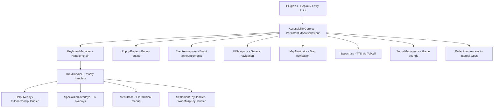

# The Book of Accessibility: Modding Unity for Blind Players

Welcome to the definitive guide on creating accessibility mods for Unity games. This book will take you from the basic principles of modding to building a sophisticated, modular **Shadow Client**—a parallel, logical reality that empowers blind players to experience gaming on an equal footing with sighted players.

## Table of Contents

### Part I: The Foundation
* **[Chapter 1: The Modding Ecosystem](#chapter-1-the-modding-ecosystem)**
* **[Chapter 2: Setting Up Your Laboratory](#chapter-2-setting-up-your-laboratory)**

### Part II: The Architecture (The Modular Framework)
* **[Chapter 3: Designing the Nervous System](#chapter-3-designing-the-nervous-system)**
* **[Chapter 4: The Brain (Input Virtualization)](#chapter-4-the-brain-input-virtualization)**
* **[Chapter 5: The Senses (Extraction & Reflection)](#chapter-5-the-senses-extraction--reflection)**

### Part III: The Art of Discovery (Reverse Engineering)
* **[Chapter 6: Reading the Matrix](#chapter-6-reading-the-matrix)**
* **[Chapter 7: Identifying Game Logic](#chapter-7-identifying-game-logic)**

### Part IV: Implementation & Patterns
* **[Chapter 8: Mastering Menus](#chapter-8-mastering-menus)**
* **[Chapter 9: Living in the World](#chapter-9-living-in-the-world)**
* **[Chapter 10: Advanced Interception](#chapter-10-advanced-interception)**

### Part V: Going Global
* **[Chapter 11: The Polyglot Mod](#chapter-11-the-polyglot-mod)**
* **[Chapter 12: Hooking Native Localization](#chapter-12-hooking-native-localization)**

### Part VI: Deployment & Beyond
* **[Chapter 13: The Finishing Touches](#chapter-13-the-finishing-touches)**
* **[Chapter 14: Distribution & Community](#chapter-14-distribution--community)**
* **[Chapter 15: Beyond Gameplay (Social & Meta)](#chapter-15-beyond-gameplay-social--meta)**

### Part VII: The Masterclass
* **[Chapter 16: Case Study - Against the Storm](#chapter-16-case-study---against-the-storm)**

---

## Chapter 1: The Modding Ecosystem
Understanding Unity, Loaders, and the "Shadow Client" philosophy.

## Chapter 2: Setting Up Your Laboratory
Environment configuration, CLI tools, and native binaries.

## Chapter 3: Designing the Nervous System
Optimized speech delivery, pruning, and the interruptible queue.

## Chapter 4: The Brain (Input Virtualization)
Severing the mouse, semantic keys, and managing the focus stack.

## Chapter 5: The Senses (Extraction & Reflection)
Reaching into memory to extract the "Source of Truth."

## Chapter 6: Reading the Matrix
Non-visual code navigation and exploration.

## Chapter 7: Identifying Game Logic
Finding the core variables that drive the game's mathematical state.

## Chapter 8: Mastering Menus
Virtual zones, sweep keys, and translating spatial layouts to linear lists.

## Chapter 9: Living in the World
Spatial audio, raycasting, and building a mental geometry of 3D space.

## Chapter 10: Advanced Interception
Hooking the event loop, state snapshots, and summarizing complex event chains.

## Chapter 11: The Polyglot Mod
Building the Loc localization system.

## Chapter 12: Hooking Native Localization
Syncing with the game's internal languages.

## Chapter 13: The Finishing Touches
Performance optimization and robust error handling.

## Chapter 14: Distribution & Community
Packaging, publishing, and building a community.

## Chapter 15: Beyond Gameplay (Social & Meta)
History logs, visual suspense, social connectivity, and porting to other engines.

## Chapter 16: Case Study - Against the Storm
Advanced simulation modding, spatial triangulation, and complex grid navigation.

---

*Created by the Accessibility Modding Community.*
# Chapter 1: The Modding Ecosystem

## The Shadow Client

Before we write a single line of code, we need to agree on what we're actually trying to build — and, more fundamentally, why the most obvious approach is the wrong one.

The instinct for most people, when they hear "accessibility mod," is to imagine something that reads the screen: a layer of software that watches the game's visuals and describes what it sees. Point a camera at the pixels, run some image recognition, read the text labels. It's a reasonable first idea. It's also deeply flawed.

Screen-reading through visual analysis inherits every weakness of the visual interface it's observing. It breaks when the resolution changes, when a font gets updated, when an animation overlaps a label at exactly the wrong moment, when the game engine decides to render UI elements out of order for performance reasons. You're building on sand — your foundation shifts every time the game patches, every time the player changes their display settings, every time they run the game on a different monitor.

There's also a more fundamental problem. The visual interface of a game isn't the truth of the game. It's a translation of the truth. A glowing card in the bottom-left corner of the screen is the engine's way of representing the fact that `Entity[42].IsTargetable == true`. A red health bar is a visual metaphor for a number stored in memory. Icons, animations, particle effects, screen shake — all of these are interpretations. They're the engine's language for communicating with sighted players.

We don't need that language. We need the truth it's translating.

This is the core insight behind the **Shadow Client** — sometimes called the Parallel Semantic Client. Instead of reading the visual representation, we bypass the rendering pipeline entirely. We hook directly into the game's internal state: its memory structures, its event queues, its network messages. We build a parallel interface that operates at the same logical level as the game itself — not describing what things look like, but exposing what things *mean*.

The result is an interface that's not just functional but genuinely competitive. A blind player using a well-built Shadow Client doesn't get a degraded experience; they get a different interface to the same underlying game. The same information, through a different channel. That's the goal. That's the standard we're building toward.

One more thing to be clear about: we are not building bots. We are not automating gameplay. The Shadow Client does not make decisions or execute actions on the player's behalf. It translates information and accepts input. The strategy, the judgment, the play — that stays with the player, exactly as it should.

---

## The Unity Engine: Why It's a Good Target

Unity is one of the dominant game engines in the world. It powers an enormous range of titles — from small independent games to large commercial releases across PC, console, and mobile platforms. For our purposes, it's also a remarkably approachable target, once you understand its architecture.

The central reason Unity games are accessible to modders is that they use C# as their primary scripting language. C# compiles to Intermediate Language — a platform-independent bytecode format that's closer to source code than machine code, and that can be decompiled back into readable C# using freely available tools. The game ships with compiled IL packed into `.dll` files, and the most important of these — the one containing the game's unique logic — is almost always called `Assembly-CSharp.dll`. Open it in a decompiler, and you get something that reads very much like the original source.

This is significant. It means we can read the game's code, understand its data structures, identify the variables we care about, and then write code that interacts with those variables directly. We're not guessing from the outside; we're reading the blueprint.

### Mono Versus IL2CPP

There's a complication. Unity games can be built against one of two backends, and they behave differently for our purposes.

**Mono** is the traditional approach. Games compiled with Mono produce clean, readable IL. Decompilation works well, and the modding process is relatively straightforward. BepInEx, the primary mod loader for Mono games, hooks into the engine in a well-understood way.

**IL2CPP** — Intermediate Language to C++ — is a newer backend designed for better runtime performance and stronger protection against reverse engineering. Instead of shipping IL, IL2CPP games compile C# down to C++ and then to native machine code before shipping. The result is significantly harder to decompile: instead of clean C# approximations, you get auto-generated C++ that's mechanically derived from the original, with names mangled and structure obscured.

The reason IL2CPP isn't a dealbreaker is that modern mod loaders — particularly MelonLoader — perform what's called "unhollowing" when the game first launches. They analyze the compiled binaries, reconstruct the type hierarchy, and generate a set of proxy DLL files that allow your mod to interact with the game as if it were a Mono build. You lose some clarity in the decompiled view, but the modding workflow is largely the same.

### The Entity-Component Architecture

Unity's runtime model is built on a pattern called Entity-Component architecture. Understanding it is essential, because it shapes how you find the data you're looking for.

Every object in a Unity game — a character, a button, an invisible trigger zone, a sound emitter — is a `GameObject`. On its own, a `GameObject` is just a container. It holds nothing and does nothing. What gives it properties and behavior are the `Components` attached to it.

A `MeshRenderer` component makes the object visible. A `Collider` gives it physical presence. A `Text` or `TextMeshProUGUI` component displays a string label. A custom script called something like `PlayerState` might hold the player's health, gold count, and experience points.

For a Shadow Client, the vast majority of the Unity component tree is irrelevant. We don't care about `MeshRenderer`. We don't care about `Animator`. We don't care about `ParticleSystem`. We're looking for the custom script components — the `PlayerState`, the `GameStateManager`, the `BattleController`, the `InventorySystem` — that hold the variables driving the logic. Those are our targets.

### The Singleton Pattern

Unity games of any complexity almost universally use the Singleton pattern for their primary systems. A Singleton is a class that has exactly one instance, accessible from anywhere in the codebase via a static `Instance` or `Current` property. The combat system is a Singleton. The save system is a Singleton. The UI manager is a Singleton.

For a mod, Singletons are doors. They're how you get from "I know what class I'm looking for" to "I have a reference to the live object I can read from." When you find a Singleton — and you will find many — document it in your research notes immediately. It will come up repeatedly.

---

## Mod Loaders: Getting Inside the Engine

A mod loader is the infrastructure that gets your code into the game's process. Without one, your mod is just a DLL sitting on disk; the game has no reason to load it.

**BepInEx** is the standard for Mono games and has become one of the most well-established modding frameworks in the Unity ecosystem. It works by injecting itself into the game's startup sequence, then loading any plugins it finds in the `BepInEx/plugins/` folder. Your mod lives in that folder as a compiled `.dll`. BepInEx gives you a base class — `BaseUnityPlugin` — that you inherit from, and from that point on your code runs inside Unity's own `Update()` loop, the method that executes every frame.

**MelonLoader** is the equivalent for IL2CPP games. It takes a different technical approach — it injects at a lower level to handle the C++ bridging — but from the perspective of a mod developer, the experience is similar. You inherit from `MelonMod`, implement a handful of lifecycle methods, and your code runs alongside the engine.

Choosing between them is usually not a choice: BepInEx for Mono, MelonLoader for IL2CPP. Some games have active modding communities that have standardized on one or the other even for less obvious reasons; check the community for whichever game you're targeting.

One important point about configuration: both loaders have their own plugin folders, logging systems, and configuration conventions. Learn these early. Many confusing "my mod doesn't load" problems are solved by putting the DLL in the wrong folder.

---

## Harmony: The Surgical Tool

If the mod loader is how we get inside the engine, Harmony is how we modify what we find there. It's a patching library for .NET code that allows you to alter the behavior of any method at runtime — without touching the original compiled files.

The mechanism is called monkey-patching. Harmony intercepts a method's execution and can insert your code before it runs (a Prefix patch), after it runs (a Postfix patch), or in place of specific byte sequences (an Transpiler patch, which we won't need for most accessibility work). Here's what that looks like in practice:

```csharp
[HarmonyPatch(typeof(PlayerController), nameof(PlayerController.TakeDamage))]
public class TakeDamagePatch {
    static void Postfix(PlayerController __instance, int amount) {
        ScreenReader.Say($"Took {amount} damage. Health now {__instance.CurrentHealth}.");
    }
}
```

That's it. Three lines of working code that intercept the game's damage method and generate an announcement every time the player takes a hit. The `__instance` parameter gives us the specific `PlayerController` that was affected. The `amount` parameter is exactly what was passed to the original method.

Harmony is what makes the Shadow Client viable at the level of precision it requires. We don't poll variables constantly, we don't guess at timing, we don't wait for the UI to update. We attach to the exact method that changes a value, and we announce that change at the exact moment it occurs.

### Prefix Patches and Input Interception

Postfix patches — which run after the original method — are appropriate for announcements. Prefix patches run before, and they have an additional power: they can prevent the original method from executing at all. If the Prefix returns `false`, Harmony skips the original.

This is how we sever the mouse. We put a Prefix on the game's mouse coordinate accessor, return the safe coordinates we want, and return `false` to prevent the original from being called. As far as the game's UI is concerned, the mouse is exactly where we said it was.

```csharp
[HarmonyPatch(typeof(Input), "mousePosition", MethodType.Getter)]
public class MouseBlockPatch {
    static bool Prefix(ref Vector3 __result) {
        if (!AccessStateManager.IsActive) return true; // Let normal mouse through
        __result = Vector3.zero;
        return false; // Skip original getter
    }
}
```

### Managing Your Patches

In a mature mod, you may have dozens or hundreds of Harmony patches. Some should be active when the mod loads and stay active forever. Others — patches specific to a combat scene, or to a particular UI panel — should only be active when relevant. Harmony supports both manual patching (you call `PatchAll()` once at startup and it finds all your attributes) and dynamic patching (you apply and remove individual patches as the game state changes). We'll use both throughout the framework.

---

## Tolk: Giving the Mod a Voice

We have our logic. We have our hooks. The last piece is making the mod speak.

Tolk is a small, focused library that provides a unified interface to the major Windows screen readers — NVDA, JAWS, Narrator, and others — without the mod needing to know which one the player has installed. You call `Tolk.Output("text here")` and the currently active screen reader speaks the text. You don't manage different APIs for different readers; Tolk handles it.

It is worth pausing to appreciate what this abstraction provides. NVDA and JAWS have completely different underlying APIs. Without Tolk, you'd need to integrate with both — detecting which is active, branching on it, and maintaining two separate speech pipelines. Tolk collapses all of that into three functions: `Load()` to initialize, `Output()` to speak, and `Unload()` to clean up.

There are two binary files you need: `Tolk.dll` itself, and a NVDA controller client (`nvdaControllerClient64.dll` on 64-bit systems). Both must be in the game's root folder — not in a subfolder, not in the mods directory, in the root next to the game's `.exe`. This is a frequent installation mistake and worth double-checking whenever Tolk seems silent.

Our framework wraps Tolk in a `ScreenReader.cs` template that adds three things on top of the bare API: interrupt handling (stopping the previous announcement when a new one is more urgent), a speech queue for secondary information, and a text sanitization pipeline. We'll go deep on all of these in Chapter 3.

---

## The Cognitive Framework: How to Think About This Work

Technical knowledge is necessary but not sufficient. To build good accessibility software, you need to think differently than you do when building a regular application.

### The Player as the Expert

The most important shift is this: blind players are not your users in the typical product sense, where you design for an imagined average person. They are experts. They have spent years developing strategies for extracting information from software through non-visual channels. They know things about screen reader behavior, cognitive load under audio-only conditions, and spatial reasoning through sound that you will not discover on your own.

Every design decision you make — the wording of an announcement, the choice of a sweep key, the decision about what information to include versus omit — should be tested with real blind players as early in development as possible. An accessibility mod that was designed entirely by a sighted developer and never tested by a blind one is almost certainly wrong in important ways.

This isn't a criticism; it's just the nature of designing for an experience you don't share. The solution is collaboration, not avoidance.

### The Game-Api.md Discipline

Reverse engineering is a journey, and like all journeys, you need to take notes. A discovery that isn't documented might as well not have happened — you'll need to find it again next week, or next month, or after a game update forces you to verify that your assumptions still hold.

Every meaningful discovery goes into `game-api.md`. The name of the class where player health lives. The exact field name you use to read it. The Singleton path to the combat manager. The method you patched to detect item pickups. The keys the game already uses that you need to avoid.

This file is your map. The more thorough it is, the less you need to hold in your head at any given moment — and the faster you'll move as the project grows in complexity.

### The Tiered Plan

Large accessibility projects benefit from a structured progression. Our framework organizes work into tiers:

**Tier 1: Core Analysis.** Identify the game's primary data sources. Map the Singleton hierarchy. Find the class that drives each major game system (combat, inventory, dialogue, social). This is research work; you're not writing final mod code yet, you're building the map.

**Tier 2: Basic Navigation.** Virtualize the main menu and all major sub-menus. Get the player to the point where they can start and navigate a game session using only the keyboard. This is the foundation; everything else depends on it.

**Tier 3: The World.** Implement the gameplay-specific features — combat announcements, inventory navigation, quest tracking, spatial audio for 3D environments. Each feature builds on the menu navigation established in Tier 2.

**Tier 4: Polish and Meta.** Performance optimization, configuration, localization, the history log, pack opening, social features. The work that turns a functional prototype into a polished release.

Most projects never finish Tier 4. That's acceptable. Get Tier 2 solid, build Tier 3 incrementally, and release early so players can give you feedback that shapes what you prioritize in Tier 4.

---

## What Comes Next

You now understand the philosophical and technical architecture that undergirds the entire project. You know what a Shadow Client is and why it's superior to screen-reading pixel data. You understand how Unity games are structured, how mod loaders inject our code, how Harmony lets us patch any method we choose, and how Tolk translates our logic into speech.

In the next chapter, we get practical. We'll set up the development environment: installing the tools, running the scaffolding script, configuring the IDE, and verifying that the complete pipeline works before we write any game-specific logic.
# Chapter 2: Setting Up Your Laboratory

## The Environment Is Not Optional

Experienced developers sometimes try to rush past the setup phase. They install one or two of the required tools, improvise around what's missing, and then spend three days debugging errors that had nothing to do with their code. Don't do this.

Building an accessibility mod sits at the intersection of several technical domains simultaneously: .NET compilation, native binary reverse engineering, Unity's component system, Windows audio APIs, and screen reader internals. Each domain has its own tools and its own failure modes. If any piece of the chain is misconfigured — if the wrong version of a library is in the wrong folder, if a path separator is incorrect in your project file, if Tolk can't find its companion DLL — the result is silence. Your mod doesn't speak, and you don't know why.

The framework's scripts exist to prevent exactly this. This chapter walks through every tool you need, explains why it matters, and shows you how to use those scripts to automate the tedious parts and verify the parts that remain manual.

---

## The .NET SDK

The game is C#. Your mod is C#. Everything compiles with the .NET SDK, so this is the first install.

Open PowerShell as an Administrator and run:

```powershell
winget install Microsoft.DotNet.SDK.8
```

We target .NET 8 because it gives access to modern language features like raw string literals, pattern matching improvements, and better performance primitives. Your mod itself will be compiled to target whatever specific .NET version the game uses — this is declared in your `.csproj` file — but the SDK version you develop with should be at least as new as your target.

After installation, verify it worked:

```powershell
dotnet --version
```

You should see something like `8.0.xxx`. If the command isn't found, you may need to restart PowerShell to pick up the updated `PATH`.

### Understanding the .csproj File

The `.csproj` file is worth understanding deeply, because it controls several things that can go subtly wrong. Our scaffolding script generates one from a template, but you'll need to edit it.

The file has two sections that matter most for modding. The first is `<ItemGroup>` references:

```xml
<ItemGroup>
  <Reference Include="UnityEngine">
    <HintPath>$(GameFolder)\GameName_Data\Managed\UnityEngine.dll</HintPath>
    <Private>false</Private>
  </Reference>
  <Reference Include="Assembly-CSharp">
    <HintPath>$(GameFolder)\GameName_Data\Managed\Assembly-CSharp.dll</HintPath>
    <Private>false</Private>
  </Reference>
</ItemGroup>
```

`<Private>false</Private>` is important: it tells the compiler to reference these DLLs when compiling but not to include them in the output. The game already has them; if your mod's DLL tried to bundle copies, you'd get version conflicts.

The second critical section is the post-build event:

```xml
<Target Name="PostBuild" AfterTargets="PostBuildEvent">
  <Exec Command="xcopy /Y &quot;$(TargetPath)&quot; &quot;$(GameFolder)\BepInEx\plugins\&quot;" />
</Target>
```

This copies your compiled DLL into the game's plugin folder every time you build. Without this, you'd have to copy it manually every iteration — and you'd inevitably forget, burn an hour debugging a change you never deployed, and feel foolish. Let the build system handle it.

### The GameFolder Property

At the top of the `.csproj`, there's a property group defining `GameFolder`:

```xml
<PropertyGroup>
  <GameFolder>C:\Games\MyAwesomeGame</GameFolder>
</PropertyGroup>
```

Change this to the actual path where the game is installed. This single property controls both where the compiler looks for game DLLs and where the post-build event copies your output. Every mysterious "reference not found" compile error can usually be traced back to this being wrong.

---

## The Decompiler: Reading the Closed Book

You don't have access to the game's source code. What you have is a compiled `.dll` — machine-readable but not human-readable in its raw form. A decompiler takes that compiled file and reconstructs an approximation of the original C# source code.

The approximation is imperfect. Variable names are sometimes lost or replaced with mangled auto-generated identifiers. Some compiler optimizations produce patterns that look strange when decompiled. Lambdas and LINQ expressions may be expanded into their underlying implementations. Despite these imperfections, decompiled code is navigable and readable enough to do everything we need.

### Installing the Command-Line Tool

```powershell
dotnet tool install ilspycmd -g
```

Verify the install:

```powershell
ilspycmd --version
```

For a graphical interface — which is often more useful during the research phase — download ILSpy or dnSpy (a fork with debugging capabilities). Both are free and open source. During active development, a graphical decompiler lets you navigate the type hierarchy, search for string literals, and jump to definitions with a click. For automation and one-off decompilation commands, `ilspycmd` is faster.

### Finding the Right DLLs

For **Mono** games, the primary decompilation target is:
```
[Game installation folder]\[GameName]_Data\Managed\Assembly-CSharp.dll
```

There may be additional game-specific DLLs alongside it. Decompile all of them that seem to contain game logic; some games split their code across multiple assemblies.

For **IL2CPP** games, you need to run the mod loader first. MelonLoader and BepInEx both perform the unhollowing step on first launch and write the resulting proxy DLLs to known locations:

- MelonLoader: `[Game folder]\MelonLoader\Managed\`
- BepInEx: `[Game folder]\BepInEx\interop\`

These proxy DLLs have the correct types and method signatures, but their method bodies are empty — they're stubs. This is enough to compile your mod against them and enough to decompile for research purposes.

### Decompiling a Specific Class

During research, you'll often find yourself decompiling a specific class rather than a whole assembly:

```powershell
ilspycmd Assembly-CSharp.dll -t PlayerController -o ./decompiled/
```

This writes the decompiled C# for `PlayerController` and all its nested types to a file in `./decompiled/`. Keep these files; they're your reference material for writing patches.

---

## Installing the Mod Loader

### BepInEx (Mono Games)

Download the appropriate BepInEx release from GitHub — make sure you get the right architecture (x64 for 64-bit games, x86 for 32-bit, though this is increasingly rare). Extract the zip into the game's root folder. The folder structure should look like this afterward:

```
[GameFolder]/
├── BepInEx/
│   ├── core/
│   ├── plugins/      ← your mod goes here
│   └── config/
├── doorstop_config.ini
├── winhttp.dll        ← BepInEx's injection point
└── GameName.exe
```

Launch the game once. BepInEx will initialize, create log files, and exit gracefully. Check `BepInEx/LogOutput.log` to confirm it loaded correctly. You should see lines indicating that BepInEx initialized and that it's monitoring the plugins folder.

### MelonLoader (IL2CPP Games)

MelonLoader provides an installer executable rather than a simple zip. Run it, point it at the game's `.exe`, and let it download and configure the correct version. This step matters: MelonLoader versions are tied to specific Unity engine versions, and using the wrong version produces failures that are genuinely hard to diagnose.

If you're unsure which version to use, the `scripts/Get-MelonLoaderInfo.ps1` script reads the game's log files and extracts the Unity version, recommended MelonLoader version, and architecture. Run it before installing and save yourself the trouble.

### Verifying Mod Loader Installation

Both loaders write detailed logs. After installing and launching the game once without any mods, check the log:

- BepInEx: `[GameFolder]\BepInEx\LogOutput.log`
- MelonLoader: `[GameFolder]\MelonLoader\Latest.log`

If the log file exists and contains initialization messages, the loader is working. If no log file was created, the injection failed — usually because of a wrong architecture or a game that actively resists modding.

---

## Installing Tolk

Go to the Tolk GitHub repository and navigate to the Releases page. Download the binary release — not the source code.

Inside the archive, you'll find:
- `Tolk.dll` — the main library
- `nvdaControllerClient64.dll` — the NVDA interface (64-bit)
- `nvdaControllerClient32.dll` — the NVDA interface (32-bit)
- Similar DLLs for SAPI and other backends

Copy `Tolk.dll` and the appropriate NVDA controller client (almost certainly the 64-bit version) directly into the game's root folder. This is the folder containing the game's `.exe` — not the `BepInEx` folder, not the `plugins` folder, not a `mods` subfolder.

This placement matters because .NET's DLL loader resolves unmanaged dependencies by searching the process's executable directory first. Tolk.dll needs to be findable from there, and the NVDA controller client needs to be findable from wherever Tolk looks for it — which is also the executable directory.

---

## Decompiling the Game

Before writing a single line of mod code you need to read the game's code. This is the foundational research step: every class name, method signature, field name, and access modifier you use in your Harmony patches and reflection calls has to come from here. Guessing produces code that compiles but silently fails at runtime.

How you decompile depends on one critical question: is the game **Mono** or **IL2CPP**?

### Mono vs IL2CPP: Why It Matters

Unity ships with two scripting backends:

- **Mono**: The game's C# code is compiled to standard .NET IL bytecode and shipped as readable DLL files inside `[GameName]_Data/Managed/`. Standard .NET decompilers work directly on these files and produce near-perfect C# output.

- **IL2CPP**: The game's C# is compiled to native C++ and then compiled again to machine code. The DLL files inside `Managed/` are **stub files** — they contain only type metadata, not real IL code. The actual logic is in a native binary (`GameAssembly.dll` on Windows). You cannot decompile this binary back to C# directly; instead, you recover the type metadata and use it alongside source-level exploration tools.

**How to tell which backend a game uses:**
- Open `MelonLoader/Latest.log` or `BepInEx/LogOutput.log` — both print "Il2Cpp" or "Mono" during initialization.
- Check for `GameAssembly.dll` in the game root — this file only exists in IL2CPP builds.
- Open `[GameName]_Data/Managed/Assembly-CSharp.dll` in any hex editor — if the file is small (under 1 MB) and contains mostly metadata strings with no IL code, it's an IL2CPP stub.

---

## Decompiling Mono Games

### Tool 1: ilspycmd (Recommended — Command Line)

`ilspycmd` is the CLI version of ILSpy, the definitive open-source .NET decompiler. Because it's command-line driven, it can be automated — the scaffolding script can run it for you, and you can re-run it when the game updates without opening any GUI.

**Install:**
```powershell
dotnet tool install -g ilspycmd
```

After installation, restart your terminal so the tool is on the `PATH`.

**Basic usage — decompile to files:**
```powershell
ilspycmd -p -o ./decompiled `
    "[GameFolder]\[GameName]_Data\Managed\Assembly-CSharp.dll"
```

The `-p` flag means "project mode": it creates a separate `.cs` file for each namespace, mirroring the original source structure. The `-o` flag specifies the output directory. This gives you tens of thousands of `.cs` files in a folder tree you can search with `grep`, `ripgrep`, or any code editor.

**Decompile multiple DLLs at once:**
Games split code across several DLLs. Decompile the important ones together:
```powershell
$managedDir = "[GameFolder]\[GameName]_Data\Managed"
ilspycmd -p -o ./decompiled `
    "$managedDir\Assembly-CSharp.dll" `
    "$managedDir\Assembly-CSharp-firstpass.dll" `
    "$managedDir\DOTween.dll"
```

**Search the output immediately after decompilation:**
```powershell
# Find all Singleton patterns
Get-ChildItem ./decompiled -Recurse -Filter *.cs | `
    Select-String "public static.*Instance" | `
    Select-Object Filename, LineNumber, Line

# Find all classes with "Inventory" in their name
Get-ChildItem ./decompiled -Recurse -Filter *.cs | `
    Select-String "class.*Inventory" | `
    Select-Object Filename, Line
```

Or with `ripgrep` (much faster on large outputs):
```powershell
rg "public static.*Instance" ./decompiled --type cs -n
rg "class.*Inventory" ./decompiled --type cs -l  # -l = filenames only
```

**Decompile a specific type only (faster for targeted research):**
```powershell
ilspycmd -t "PlayerController" `
    "[GameFolder]\[GameName]_Data\Managed\Assembly-CSharp.dll"
```

This prints the decompiled class directly to the terminal — useful when you already know the class name and just need to check its API.

---

### Tool 2: dnSpyEx (GUI Alternative)

dnSpyEx is a maintained fork of the original dnSpy. It's a graphical decompiler with an assembly browser, a built-in search, and — critically — a runtime debugger that lets you set breakpoints in decompiled code while the game is running.

**Install:**
Download from `https://github.com/dnSpyEx/dnSpy/releases`. Extract the zip. No installation required.

**Screen reader usage:**
1. Launch dnSpy. Press `Ctrl+O` to open an assembly.
2. Navigate to `[GameName]_Data\Managed\Assembly-CSharp.dll` and open it.
3. The left pane shows the assembly tree. Use arrow keys to expand namespaces and classes.
4. Press `Ctrl+F` to search. Type a class or method name. Results appear in a list below.
5. Press Enter on a result to jump to its decompiled code in the right pane.
6. To export the full decompiled project: `File → Export to Project`. Point it at a `decompiled/` folder. This takes 30–90 seconds for large assemblies.

**When to prefer dnSpyEx over ilspycmd:**
- You want to set a breakpoint and inspect live values (the debugger is dnSpyEx's main advantage)
- You're quickly checking one class and don't need the full project export
- You want to browse the inheritance hierarchy graphically

**When to prefer ilspycmd:**
- You want the full project decompiled to files for searching
- You want automation (CI, post-build, re-decompile on game update)
- You prefer working entirely from the command line

---

## Decompiling IL2CPP Games

IL2CPP games require a two-phase workflow. Phase 1 recovers the type metadata (class names, method names, field names, function addresses). Phase 2 uses those names to make the native binary navigable for research.

### Phase 1: Recovering Metadata

#### Tool 3: Il2CppDumper

Il2CppDumper reads the game's IL2CPP binary and its global metadata file, then outputs a set of C# "dummy" files — class skeletons with correct names and signatures but no method bodies.

**Files needed:**
- `GameAssembly.dll` — the native binary (in the game root)
- `[GameName]_Data\il2cpp_data\Metadata\global-metadata.dat` — the metadata file

**Download:**
```
https://github.com/Perfare/Il2CppDumper/releases
```
Extract the zip. Run `Il2CppDumper.exe`. It will ask for the two file paths, then generate output in a folder you specify.

**Output:**
```
dump/
├── DummyDll/           ← Stub DLLs (add as references for IntelliSense)
│   ├── Assembly-CSharp.dll
│   └── (all other dumped DLLs)
├── script.py           ← IDA/Ghidra import script (not needed for us)
├── stringliteral.json  ← All string literals found in the binary
└── il2cpp.h            ← C struct definitions (not needed for us)
```

The `DummyDll` folder is what you add to your `.csproj` as references — they give you IntelliSense completion for the game's types even though the actual logic is in native code.

The `stringliteral.json` file is useful for finding hidden method targets: search it for strings you see in the game UI, then trace which methods reference those strings.

**Adding DummyDll stubs to your project:**
```xml
<!-- In .csproj, replace the Assembly-CSharp reference -->
<Reference Include="Assembly-CSharp">
    <HintPath>$(ProjectDir)dump\DummyDll\Assembly-CSharp.dll</HintPath>
    <Private>false</Private>
</Reference>
```

---

#### Tool 4: Il2CppInspector

Il2CppInspector is the more powerful alternative. It offers more output formats, better handling of obfuscated games, and a dedicated C# scaffold generator for accessibility mods and other Harmony-based tools.

**Download:**
```
https://github.com/djkaty/Il2CppInspector/releases
```

**Command-line usage:**
```powershell
# Generate C# scaffold with all types and method stubs
Il2CppInspector.exe -i GameAssembly.dll `
    -m "[GameName]_Data\il2cpp_data\Metadata\global-metadata.dat" `
    -t cs `
    -o ./il2cpp-output
```

**Key output formats:**

| Format flag | Output | Use case |
|---|---|---|
| `-t cs` | C# class stubs | Harmony patching, IntelliSense |
| `-t json` | Full type tree as JSON | Scripted analysis, searching by type relationships |
| `-t py` | Python struct definitions | IDA/Ghidra scripting (advanced) |
| `-t dll` | Stub DLLs | Identical to Il2CppDumper's DummyDll |

The C# stub output is particularly useful because it preserves:
- Method offset addresses (as comments) — lets you cross-reference with the binary in IDA or x64dbg
- Field offsets — useful for Il2Cpp-specific reflection quirks
- Generic type instantiations — which Harmony needs to patch generic methods correctly

**Choosing between Il2CppDumper and Il2CppInspector:**

| Factor | Il2CppDumper | Il2CppInspector |
|---|---|---|
| Speed | Faster | Slower (more processing) |
| Output formats | Limited (DummyDll + script) | Many (CS, JSON, DLL, Python) |
| Obfuscated games | Basic support | Better support |
| Recommended for | Quick stub generation | Deep research or obfuscated targets |

For most accessibility mod projects, Il2CppDumper is sufficient. Use Il2CppInspector when the game is heavily obfuscated or you need the method offset data.

---

## IL2CPP Research Workflow

After Phase 1 gives you the type metadata, your research workflow for IL2CPP is different from Mono. You cannot read method bodies from the dump — they're compiled native code. Instead, you work by inference:

1. **Find the type and method** from the C# stubs (class name, method name, parameter types).
2. **Check the string literal dump** (`stringliteral.json`) for UI strings that appear near the behavior you're investigating.
3. **Use MelonLoader's IL2CPP interop** or **Il2CppAssemblyUnhollower** to patch the method with Harmony — the patching syntax is the same, but the reference assemblies come from the DummyDll folder.
4. **Verify with log output**: add a Postfix that announces the parameters and observe whether the announcement fires at the right time.

The Golden Rule for IL2CPP is the same as for Mono: **never guess a class or method name**. Every name comes from the dump. Anything not in the dump doesn't exist from your mod's perspective.

---

## Organizing Your Decompiled Output

Regardless of the tool and the game's backend, organize your decompiled output consistently:

```
[YourMod]/
├── decompiled/           ← Full decompiled project (Mono) or stubs (IL2CPP)
│   ├── Assembly-CSharp/
│   └── ...
├── docs/
│   └── game-api.md       ← Your research notes — built from what you find here
├── src/
│   └── (your mod code)
└── scripts/
```

The `decompiled/` folder is read-only reference material. Never edit it — it will be regenerated when the game updates. Your actual knowledge of the game lives in `docs/game-api.md`, which you populate as you research.

When the game updates, the workflow is: re-run your decompile command → diff the output against your `game-api.md` → update any patches that reference renamed or changed APIs → bump the mod version.

---

## Scaffolding the Project

With all dependencies in place, it's time to create the actual mod project. Doing this by hand involves creating six or seven files, configuring XML namespaces, setting up references, and writing boilerplate that's identical in every project. The scaffolding script automates all of it.

```powershell
pwsh scripts/New-AccessibilityMod.ps1 `
  -ModName "GameAccess" `
  -Namespace "GameAccess" `
  -Loader "BepInEx" `
  -GameName "My Awesome Game"
```

The script creates a complete, compilable project. Here's what each generated file does:

**`Main.cs`** is the entry point. For BepInEx, this is a class inheriting from `BaseUnityPlugin`; for MelonLoader, from `MelonMod`. It contains `OnInitializeMelon()` or `Awake()` where Harmony patches are applied and the mod is initialized. It also contains a startup announcement through Tolk confirming the mod loaded.

**`ScreenReader.cs`** wraps Tolk. It tracks the last speech, implements the interrupt queue, and exposes `Say()` and `SayQueued()`. You will call methods from this file hundreds of times throughout the project.

**`AccessStateManager.cs`** is the focus and input manager. It maintains the context stack, maps keys to semantic actions, and ensures only one handler owns keyboard input at any given moment.

**`UITextExtractor.cs`** contains the text cleaning pipeline: regex patterns, the sprite map, and the `CleanString()` method that turns raw game text into TTS-ready strings.

**`ReflectionHelper.cs`** provides cached access to private fields and methods. Every call goes through a dictionary keyed on the target type and field name.

**`Loc.cs`** is the localization system. It loads language files from a `lang/` folder and provides the `Get(key)` lookup with fallback chain.

**`DebugLogger.cs`** provides categorized logging. Categories include `State`, `Handler`, `Logic`, `Error`, and `Patch`.

**`docs/book/`** is a local copy of this guide, generated by the script for offline reference.

---

## IDE Configuration

Visual Studio 2022 Community is free and provides the best C# language server for Unity modding. VS Code with the C# Dev Kit extension is a lighter-weight alternative that works well if you already have it.

After opening the generated `.csproj` file, your first task is to configure the `GameFolder` property discussed earlier. Open the `.csproj` in a text editor (you can also edit it from VS by right-clicking the project and selecting "Edit Project File") and change the path.

Once the path is correct, try to build: press `Ctrl+Shift+B` in Visual Studio. If the build succeeds with zero errors, the references are configured correctly. If you see "The referenced component 'UnityEngine' could not be found," the game folder path is wrong or the mod loader hasn't been installed yet.

### IntelliSense and Navigation

A properly configured IDE will give you IntelliSense completion for the game's types. When you type `PlayerC`, you should see `PlayerController` in the suggestions. When you hover over `TakeDamage`, you should see its parameter list. This is the decompiled type information coming through the proxy DLLs.

IntelliSense doesn't guarantee that a method exists at runtime — proxy DLLs are stubs — but it dramatically speeds up research by letting you navigate the type hierarchy without opening the decompiler for every query.

---

## Understanding DebugLogger

Developing without visual feedback makes logging more important than in typical development. Every state change, every handler invocation, every failed patch should produce a log entry detailed enough to diagnose the problem from the log file alone.

The `DebugLogger.cs` template provides categorized logging:

```csharp
DebugLogger.Log(LogCategory.State, "Pushed context: Inventory");
DebugLogger.Log(LogCategory.Handler, "InventoryHandler processing key: Down");
DebugLogger.Log(LogCategory.Logic, $"PlayerHealth = {health}");
DebugLogger.Log(LogCategory.Error, $"Failed to read m_currentHealth: {ex.Message}");
```

During development, enable all categories. Before release, turn off `Logic` and `Handler` at minimum — they generate enormous volumes of output per frame and will slow the game noticeably if left on.

The `ModConfig.cs` (described in Chapter 13) exposes a boolean toggle for each category that the player can set in the config file. A player who encounters odd behavior can turn on `State` logging themselves and give you the output, rather than requiring you to provide debug builds on demand.

---

## The First Build: Verifying the Pipeline

Before writing any game-specific logic, verify the basic pipeline from end to end. This catches most configuration problems before they interact with actual mod code.

Open a terminal in the project folder and run:

```powershell
dotnet build --configuration Release
```

If it succeeds, the post-build event will copy the DLL into the game's plugin folder automatically. Launch the game. If everything is working, you should hear: "[GameName] Accessibility Mod Loaded."

If you hear nothing:

1. Check the mod loader's log for errors during DLL loading. Look for your mod's assembly name near the bottom of the log.
2. Verify that `Tolk.dll` is in the game's root folder, not a subfolder.
3. Check that `nvdaControllerClient64.dll` is also in the root folder.
4. Confirm that a screen reader (NVDA, JAWS, or Narrator) is running. Tolk silently outputs nothing if no reader is active.
5. Run `scripts/Test-ModSetup.ps1` and read its output carefully.

Don't proceed to game-specific development until you've heard that startup announcement. The startup confirmation is your end-to-end smoking test. If it passes, your build pipeline, deployment, injection, and Tolk integration are all working. If it fails, nothing you build on top of it will work either.

---

## A Note on Version Hygiene

Games update frequently — sometimes weekly for live-service titles. Each update may rename classes, change method signatures, or restructure DLLs in ways that break your patches. Treat game DLLs as a versioned dependency.

Keep a record of which game version your mod was built against. When the game updates, re-decompile the relevant files and diff them against your research notes. Methods that renamed or moved have to be found and re-patched. New UI elements that appeared need handlers.

Some modders automate this with a CI pipeline: install the game in a controlled environment, run a test suite that checks whether each expected class and method still exists, and flag failures as breaking changes. This is worth the investment for a long-lived project.

---

## Unity Version Compatibility

Not every Unity game works the same way with modding tools. The table below maps Unity version ranges to the tools that are known to function reliably. Consult it before installing anything.

| Unity Version | MelonLoader | BepInEx 5 | BepInEx 6 | Notes |
|---|---|---|---|---|
| 2.x / 3.x / 4.x | ❌ | ❌ | ❌ | Not supported by any injector. Only Assembly-Patching (offline IL rewrite) is possible. Extremely rare. |
| 5.x | ❌ | ✅ (5.4.x) | ❌ | MelonLoader does not support Unity 5. Use BepInEx 5.4.x. Check `docs/legacy-unity-modding.md`. |
| 2017 – 2018 | ⚠️ Needs older build | ✅ | ❌ | Generally works; may require an older MelonLoader build. Test before proceeding. |
| 2019 – 2021 | ✅ | ✅ | ✅ | Full support. Either loader works. Use whichever the game's community uses. |
| 2022+ | ✅ | ✅ | ✅ | Full support. IL2CPP games increasingly common; check whether the game uses Mono or IL2CPP. |

**How to detect the Unity version:** Read `MelonLoader/Latest.log` or `BepInEx/LogOutput.log` after the first game launch — both loaders print the Unity version at startup. Alternatively, open `[GameName]_Data/globalgamemanagers` in a hex editor and search for "Unity " — the version string is usually near the beginning of the file.

**If the version is 5.x or older**, read `docs/legacy-unity-modding.md` before proceeding. The setup steps differ in important ways.

---

## The PowerShell Helper Scripts

The framework ships with three PowerShell scripts in the `scripts/` directory. These are not optional convenience tools — they exist because the steps they automate are tedious to do correctly by hand and easy to get wrong.

### `New-AccessibilityMod.ps1` — Project Scaffolding

Run this once when starting a new project. It asks for the game name, your mod name, your mod loader choice, and the game directory, then generates:

- A configured `.csproj` file with all the right references
- `Main.cs` wired to the correct mod loader lifecycle
- `ScreenReader.cs`, `Loc.cs`, `AccessStateManager.cs`, `ReflectionHelper.cs`, and `UITextExtractor.cs` from the shared templates
- `game-api.md` and `project_status.md` from their templates
- `Build-Mod.ps1` and `Deploy-Mod.ps1` scripts customized for your game directory

```powershell
cd "C:\path\to\your\mod-project"
.\scripts\New-AccessibilityMod.ps1
```

Never start a project by copying files manually. The script ensures the `.csproj` paths, namespace names, and mod loader references are all consistent from the very first build.

### `Test-ModSetup.ps1` — Environment Verification

Run this any time the mod doesn't produce speech or doesn't load at all. It checks:

- That the `.NET SDK` is installed at an appropriate version
- That `Tolk.dll` and the correct `nvdaControllerClient*.dll` are in the game directory
- That the built DLL exists in the correct output folder (`Mods/` for MelonLoader, `BepInEx/plugins/` for BepInEx)
- That the mod loader's log shows a successful load (parses the log automatically)
- That the game directory is correct and the game EXE is present

```powershell
.\scripts\Test-ModSetup.ps1 -GameDir "C:\Games\GameName"
```

The output is a pass/fail summary with specific error messages for each check. "Tolk.dll found: PASS. nvdaControllerClient64.dll: FAIL — copy from Tolk release x64 folder." No guessing about what's missing.

### `Get-MelonLoaderInfo.ps1` — Log Parser

When MelonLoader loads, it writes a detailed log including the game's internal name, developer name, Unity version, and runtime type (Mono or IL2CPP). This script reads that log and extracts those values into a neat summary.

```powershell
.\scripts\Get-MelonLoaderInfo.ps1 -GameDir "C:\Games\GameName"
```

This is particularly useful when you're starting work on a new game and need to fill in the `[assembly: MelonGame("Developer", "GameName")]` attribute in `Main.cs`. Rather than guessing the exact strings, run the script and copy them exactly from the log.

---

## Special Case: When the Game Is Open Source

Some games — usually smaller indie titles — are open source. Their entire codebase is available on GitHub or GitLab. If a web search for "[Game Name] source code github" turns up an actual code repository, you have a major advantage.

With open source, you don't need a decompiler. The real, commented source code is right there. You don't need to guess at method names or field visibility — you can read the implementation directly and understand the design intent alongside the code.

The workflow differs from the standard mod approach:

1. **License check first.** Read the repository's LICENSE file before touching anything. MIT and Apache-licensed projects allow you to fork freely. GPL requires your mod to also be GPL — fine for open-source accessibility mods. Some "source-available" licenses restrict modification or redistribution. If the license is ambiguous, don't assume — ask the developers.

2. **Clone instead of decompile.** `git clone <repo-url>` replaces Steps 5–7 of the standard setup.

3. **Create an accessibility branch.** `git checkout -b feature/screen-reader-accessibility`. Make all your changes there so you can easily generate a pull request later.

4. **Consider contributing directly.** If the developers are receptive, your accessibility mod could become part of the game itself. This is the best possible outcome — accessibility that needs no mod, no mod loader, and no runtime injection. It works on every platform, every update, for every player.

When approaching developers about integration, lead with the working mod as a demonstration. Developers are much more receptive to "Here is a working implementation, would you like to include it?" than "Would you be willing to add accessibility features?" Link to your GitHub repository where they can review the code, and offer to help adapt it to their code style.

---

## Moving Forward

Your foundation is complete. You have a working build pipeline, a deployed mod that speaks at startup, a decompiler for reading the game's code, and a suite of utility scripts to maintain the project over time.

In the next chapter, we go deep into the nervous system of the Shadow Client: the `ScreenReader.cs` template. We'll work through the detailed mechanics of speech interruption, queue management, text curation, and earcon design — the full architecture of how data becomes sound.
# Chapter 3: Designing the Nervous System

## The Problem That Doesn't Announce Itself

There's a failure mode in accessibility modding that's easy to miss because it doesn't produce errors. The mod loads, the mod speaks, the mod responds to key presses. But the player is frustrated. The speech overlaps itself constantly. Announcements are late. The timing feels wrong in ways that are hard to articulate.

This is not a bug in the traditional sense. It's a design failure — a consequence of not thinking carefully enough about how speech behaves as a real-time medium for conveying game state.

Speech is fundamentally different from visual display. A label on screen can update instantly and be read at any time; if the player missed it, they can look again. Speech occupies time. It cannot be taken back once started, cannot be replayed without special infrastructure, and cannot be processed faster than the listener's cognition allows. A mod that announces too much, announces too late, or announces in the wrong order is worse than one that announces nothing at all — because the flood of sound doesn't help and actively prevents the player from thinking.

The `ScreenReader.cs` template is the framework's answer to this problem. This chapter covers everything it does: the two speech paths and when to use each, the interrupt queue, the speech optimizer, the text cleaning pipeline, and the earcon system.

---

## The Two Speech Paths

At the core of the `ScreenReader` are two methods. Every component of the mod that produces sound goes through one of these two, and choosing the right one for each situation is the first and most important design decision you'll make over and over throughout a project.

### `Say(string text, bool interrupt = true)`

This is the high-priority path. When `interrupt` is `true` — and it should be `true` by default — calling `Say()` immediately halts whatever is currently being spoken and begins reading the new text from the first character.

The critical rule for this method is timing: use it the instant the player takes an action that changes their focus. Not after you've computed some analysis of the new state. Not after a brief confirmation check. The very millisecond the key goes down, the new announcement should begin.

This matters because of how human spatial cognition works under audio-only conditions. When a sighted player moves their cursor across a list of items, they see the new item immediately. Their sense of "where they are" is continuously updated. A blind player builds the same spatial sense through audio, but the update signal is the speech. If that speech lags behind input by even 100 milliseconds in a perceptible way, the player's mental model of where they are in the list starts to degrade. At 300 milliseconds of lag, navigation feels wrong even if the mod is technically working. At 500 milliseconds, it leads to errors.

Speed is correctness when it comes to navigation announcements.

### `SayQueued(string text)`

This is the secondary path. Text added via `SayQueued()` waits in a buffer until the current announcement finishes, then plays automatically in order. Multiple queued items play sequentially.

The right use for this is supplementary context — information that enriches the primary announcement but isn't essential to immediate action. When the player navigates to a Health Potion, `Say("Health Potion")` fires immediately on key press. Then you might queue `SayQueued("Restores 50 health")` and `SayQueued("Press Enter to use")`. The player hears the item name instantly, and the details follow naturally without interrupting the name.

A common mistake is queuing things that should be said immediately. If the player is in combat and the engine fires a "Level Up" event, that's a `Say()` call — it's important enough to interrupt whatever is currently playing. If the same event also generates "You learned a new ability," that can be queued. Context and priority, not formula.

---

## The Interrupt Queue Architecture

The underlying implementation of the `ScreenReader` is more involved than a simple pair of methods. Here's the structure:

```csharp
public class ScreenReader {
    private static Queue<string> _speechQueue = new Queue<string>();
    private static string _currentSpeech = "";
    private static bool _isSpeaking = false;

    public static void Say(string text, bool interrupt = true) {
        if (interrupt) {
            _speechQueue.Clear();
            Tolk.Silence(); // Stops current OS-level speech immediately
        }
        _speechQueue.Enqueue(text);
        ProcessQueue();
    }

    public static void SayQueued(string text) {
        _speechQueue.Enqueue(text);
        if (!_isSpeaking) ProcessQueue();
    }

    private static void ProcessQueue() {
        if (_speechQueue.Count == 0) { _isSpeaking = false; return; }
        _isSpeaking = true;
        _currentSpeech = _speechQueue.Dequeue();
        Tolk.Output(_currentSpeech);
        // Schedule ProcessQueue() to fire when speech completes
        // (implementation depends on TTS callback support)
    }

    public static void InterruptAll() {
        _speechQueue.Clear();
        Tolk.Silence();
        _isSpeaking = false;
    }
}
```

The key to the interrupt path is `Tolk.Silence()`. This is not just clearing the queue; it sends a command to the OS-level screen reader to stop speaking *immediately*. Without this call, the screen reader might finish its current word, paragraph, or sentence before stopping — which can produce several hundred milliseconds of residual speech that confuses the player.

The `InterruptAll()` method, distinct from the `interrupt` parameter on `Say()`, is the emergency stop. It's used when a major context change happens — a new scene loads, the game pauses, the mod is disabled. Everything stops, the queue clears, and the mod is quiet.

---

## Handling Complex Event Chains

In many games — particularly card games and RPGs — a single player action can trigger a cascade of effects. A spell resolves, which damages an enemy, which triggers a death effect, which draws a card, which meets a quest condition. Six events in rapid succession, each one worth announcing.

A naive implementation queues all six. The player finishes their action and then has to sit through six sequential announcements covering ground that resolved in a fraction of a second.

The right architecture for this is called **event batching**. You don't queue announcements the moment each event fires; you collect them during the event chain and then release them together with editorial judgment applied.

```csharp
public class EventBatch {
    private List<string> _events = new List<string>();
    private bool _collecting = false;

    public void StartBatch() { _collecting = true; _events.Clear(); }
    
    public void Add(string announcement) {
        if (_collecting) _events.Add(announcement);
        else ScreenReader.SayQueued(announcement);
    }

    public void CommitBatch() {
        _collecting = false;
        if (_events.Count == 0) return;
        if (_events.Count == 1) {
            ScreenReader.Say(_events[0]);
        } else {
            // Announce the most important events first, then summarize
            ScreenReader.Say(_events[0], interrupt: true);
            for (int i = 1; i < Math.Min(_events.Count, 4); i++)
                ScreenReader.SayQueued(_events[i]);
            if (_events.Count > 4)
                ScreenReader.SayQueued($"And {_events.Count - 4} more events.");
        }
    }
}
```

This gives the player the most important information first, provides some detail, and truncates gracefully when the chain is very long. Four events is approximately the limit of what a player can productively process during a single pause in action; beyond that, a summary count is more useful than the individual items.

---

## Audio Ghosting and How to Prevent It

Audio Ghosting is the phenomenon where the player hears announcements from a previous game state after the state has already moved on. It's one of the most disorienting things that can happen in a Screen Reader mod.

The most common cause is an overfull speech queue. Suppose fifteen events are queued and each takes half a second to speak. The player navigates to a new screen before the queue finishes. The screen reader is now seven seconds into speaking about things that happened before the screen change. The player is confused about whether the speech is describing the current screen or the previous one.

The fix is rigorous queue clearing at context boundaries. Every time the `AccessStateManager` (described in the next chapter) pushes a new context — indicating the player has moved to a different menu or screen — `ScreenReader.InterruptAll()` should be called. Every time a navigation action fires, `Say()` is called with `interrupt: true`. The player's most recent action always takes priority over the backlog.

---

## The Speech Optimizer

Before text enters the queue, it should pass through an optimizer. This is a pipeline of transformations that compress redundant information and standardize phrasing.

### Pattern Consolidation

The optimizer maintains a sliding window of the last few items in the queue. If it detects a pattern — the same type of event, repeated for multiple entities — it consolidates them:

Without optimizer:
- "Goblin took 3 damage."
- "Goblin took 3 damage."
- "Goblin took 3 damage."

With optimizer:
- "Three Goblins took 3 damage each."

The regex patterns for consolidation will vary by game, but the logic is always the same: detect a repetition, count it, and replace the list with a single summary statement.

### Priority Injection

Not all events are equally important. The optimizer should score each incoming announcement and promote high-priority items to the front of the queue. A "You are about to die" event should jump the queue; a "Passive ability triggered" can wait.

A simple priority scoring system:

```csharp
public enum SpeechPriority {
    Critical = 0,    // Player health critical, game-ending events
    High = 1,        // Direct player actions, navigation
    Normal = 2,      // Enemy events, game state changes
    Low = 3,         // Passive effects, background information
    Background = 4   // Hints, optional context
}
```

When an event with `Critical` priority is queued, it jumps to the front and interrupts. When a `Background` event is queued and the queue already has five items, it's dropped entirely.

---

## Text Curation: The CleanString Pipeline

Game text comes with formatting that makes visual sense but breaks spoken output. The `UITextExtractor.CleanString()` method is the sanitization layer that handles this.

### HTML and Rich Text Tags

Screen readers handle HTML tags differently. Some skip them; others vocalize them. NVDA might silently ignore `<b>`, while JAWS might say "less than b greater than." Don't rely on the screen reader being lenient; strip tags explicitly:

```csharp
private static readonly Regex HtmlTagRegex = new Regex(@"<[^>]+>", RegexOptions.Compiled);

private static string StripHtml(string text) {
    return HtmlTagRegex.Replace(text, "");
}
```

The `RegexOptions.Compiled` flag is important here. If you're calling this method multiple times per second, compiled regexes offer a significant performance advantage over interpreted ones.

### Mechanical Format Translation

Games use visual shorthand that becomes meaningless without context: `(4/5)` means "4 attack, 5 health" in a card game. `[✓]` means "completed." `→` means "leads to." Define transformations for each:

```csharp
private static string TranslateFormats(string text) {
    // Card stats: "(4/5)" -> "4 attack, 5 health"
    text = Regex.Replace(text, @"\((\d+)/(\d+)\)", m =>
        $"{m.Groups[1].Value} attack, {m.Groups[2].Value} health");
    // Arrows
    text = text.Replace("→", " leads to ");
    text = text.Replace("✓", "completed");
    return text;
}
```

### Sentence Completion

Ensure every announcement ends with a period. This causes virtually all TTS engines to apply a natural downward inflection at the end, giving speech a finished, human quality rather than the flat, questioning tone of an incomplete sentence. The difference is subtle but persistent — players notice it subconsciously after hundreds of announcements.

```csharp
private static string EnsurePeriod(string text) {
    text = text.Trim();
    if (!string.IsNullOrEmpty(text) && !".!?".Contains(text[^1]))
        return text + ".";
    return text;
}
```

---

## Earcons: A Second Language

Speech is rich and flexible, but it's slow. At normal reading pace, a screen reader might output 150 words per minute. A player navigating a list doesn't need 150 words per minute of information; they need a signal within 50 milliseconds that confirms their key press landed.

Earcons fill this gap. They are short, distinct, non-verbal audio cues — custom sound files specifically designed to carry semantic meaning through their timbre, pitch, and rhythm rather than through words.

### Designing an Earcon Vocabulary

A good earcon vocabulary is:

**Distinct**: Each sound should be immediately differentiable from every other. Avoid sounds that differ only in subtle frequency ranges; some players may have hearing differences that make those indistinguishable.

**Semantic**: The sound should reinforce its meaning, even to a first-time listener. A "confirmed, ready" earcon should feel conclusive. A "blocked, not available" earcon should feel like a wall.

**Brief**: Earcons are supplementary to speech, not a replacement for it. They should complete within 100–200 milliseconds.

A starting vocabulary for a card or strategy game:

| Earcon Name | Sound Character | Meaning |
|---|---|---|
| `nav_hover` | Soft tick | Navigated to a new item |
| `nav_hover_enemy` | Sharp metallic click | Navigated to an enemy entity |
| `nav_hover_empty` | Low hollow thud | Navigated to an empty slot |
| `action_confirm` | Clear upward chime | Action confirmed |
| `action_cancel` | Downward softer tone | Action cancelled |
| `action_locked` | Flat buzz | Action not available |
| `alert_critical` | Double sharp beep | Critical situation requires attention |
| `zone_enter` | Soft whoosh | Entered a new navigation zone |

### Implementation

```csharp
public class EarconManager {
    private static Dictionary<string, AudioClip> _clips = new Dictionary<string, AudioClip>();
    private static AudioSource _source;

    public static void Initialize(AudioSource source) {
        _source = source;
        LoadClip("nav_hover", "hover_tick");
        LoadClip("action_confirm", "confirm_chime");
        // ... etc
    }

    public static void Play(string earconName) {
        if (_clips.TryGetValue(earconName, out var clip)) {
            _source.PlayOneShot(clip);
        }
    }

    private static void LoadClip(string key, string resourceName) {
        var clip = Resources.Load<AudioClip>($"Earcons/{resourceName}");
        if (clip != null) _clips[key] = clip;
    }
}
```

The `PlayOneShot()` method is important here rather than `_source.Play()`. `PlayOneShot` allows overlapping — pressing navigation keys quickly will produce rapid overlapping ticks, which is correct behavior. `Play()` would restart the same clip, cutting off the previous one in a way that sounds wrong at speed.

---

## Putting It All Together: An Annotated Flow

Here's a complete annotated flow of what happens when a player presses the Down arrow to navigate to a new item in an inventory list:

1. **Key Down**: `AccessStateManager` detects the down keypress and routes it to `InventoryHandler`.
2. **Index Update**: `InventoryHandler` increments `_selectedIndex` and retrieves the new item.
3. **Earcon**: `EarconManager.Play("nav_hover")` fires immediately. The player hears a tick within milliseconds.
4. **Text Prep**: The item's name and stats are passed through `UITextExtractor.CleanString()`.
5. **Primary Announcement**: `ScreenReader.Say(cleanedName, interrupt: true)` fires. This cancels any leftover speech from the previous item.
6. **Secondary Context**: `ScreenReader.SayQueued(statsString)` queues the item stats.
7. **Tertiary Hint**: If the item is equippable in the current slots, `ScreenReader.SayQueued("Press Enter to equip.")` is queued.

The player hears: *tick* (immediate), then "Iron Sword" (within 50ms), then "10 attack, 5 weight" (after name finishes), then "Press Enter to equip" (after stats finish). They can interrupt this entire sequence at any point by pressing another arrow key, which restarts at step 1.

The nervous system is working.

---

## Preventing Redundant Announcements

There's a subtle problem that emerges when multiple systems observe the same game state. Suppose health is displayed in both the main HUD and a separate tooltip. If both systems use `SayQueued()` to announce health changes, the player hears "Health 45" twice in a row. Twice is annoying. If there are three observers, it gets worse.

The `_lastAnnounced` guard is the simplest and most effective fix:

```csharp
public static class ScreenReader {
    private static string _lastAnnounced = "";
    
    public static void Say(string text, bool interrupt = true) {
        if (string.IsNullOrWhiteSpace(text)) return;
        
        // Suppress exact repeats (different callers, same content)
        // Only suppress on interrupt=false (queued) path — interrupt always fires
        if (!interrupt && text == _lastAnnounced) return;
        
        if (interrupt) {
            _speechQueue.Clear();
            Tolk.Silence();
            _lastAnnounced = ""; // Reset on interrupt — new context
        }
        
        _lastAnnounced = text;
        _speechQueue.Enqueue(text);
        ProcessQueue();
    }
}
```

The guard is applied only to the queued path. Interrupting announcements reset the guard — a context change means the new announcement is never redundant by definition.

For handlers that update frequently (health bars, timers), a more granular version compares the *semantic content* rather than the exact string:

```csharp
private int _lastAnnouncedHealth = -1;

private void AnnounceHealth(int current, int max) {
    if (current == _lastAnnouncedHealth) return;
    _lastAnnouncedHealth = current;
    ScreenReader.SayQueued($"Health: {current} of {max}.");
}
```

This pattern — track the last announced *value* rather than the last announced *text* — is appropriate for numeric fields where the same number should never be announced twice even if the text formatting differs slightly.

---

## Cross-Platform Screen Reader Output

Tolk is Windows-only. It uses `nvdaControllerClient.dll` to speak through NVDA, the JAWS COM interface for JAWS, and SAPI as a fallback. None of these mechanisms exist on Linux or macOS.

If the game you're modding runs on other platforms, or if you want to future-proof the mod, the right architecture is a backend abstraction: a common interface that the rest of the code calls, with a platform-specific implementation behind it.

```csharp
public interface IScreenReaderBackend {
    bool IsAvailable();
    void Say(string text, bool interrupt);
    void Silence();
    void Shutdown();
}
```

The `ScreenReader` class selects the backend at initialization:

```csharp
public static class ScreenReader {
    private static IScreenReaderBackend _backend;

    public static void Initialize() {
        if (RuntimeInformation.IsOSPlatform(OSPlatform.Windows))
            _backend = new TolkBackend();
        else if (RuntimeInformation.IsOSPlatform(OSPlatform.Linux))
            _backend = new SpeechDBackend();
        else if (RuntimeInformation.IsOSPlatform(OSPlatform.OSX))
            _backend = new MacSayBackend();
        else
            _backend = new NullBackend(); // Silent fallback
        
        if (!_backend.IsAvailable())
            DebugLogger.Log(LogCategory.Error, "Screen reader backend unavailable.");
    }
    
    public static void Say(string text, bool interrupt = true) {
        _backend?.Say(text, interrupt);
    }
}
```

### The Linux Backend

Linux screen readers typically use `speech-dispatcher`, accessible via the `spd-say` command-line tool:

```csharp
public class SpeechDBackend : IScreenReaderBackend {
    public bool IsAvailable() {
        try {
            var p = Process.Start(new ProcessStartInfo("which", "spd-say") {
                RedirectStandardOutput = true, UseShellExecute = false });
            p.WaitForExit();
            return p.ExitCode == 0;
        } catch { return false; }
    }

    public void Say(string text, bool interrupt) {
        if (interrupt) Silence();
        // Escape quotes to prevent shell injection
        var safe = text.Replace("\"", "\\\"");
        Process.Start("spd-say", $"\"{safe}\"");
    }

    public void Silence() {
        try { Process.Start("spd-say", "--cancel"); } catch { }
    }

    public void Shutdown() { Silence(); }
}
```

The process-launch approach has about 50–100 ms latency compared to Tolk's direct DLL call. For most mods this is acceptable. If you need lower latency, P/Invoke directly into `libspeechd.so` eliminates the process overhead.

### The macOS Backend

macOS ships with the `say` command, which feeds text to the system's speech synthesis (but not VoiceOver's speech queue — they're separate):

```csharp
public class MacSayBackend : IScreenReaderBackend {
    private Process _currentProcess;

    public bool IsAvailable() => true; // 'say' is always present on macOS

    public void Say(string text, bool interrupt) {
        if (interrupt) Silence();
        var safe = text.Replace("\"", "\\\"");
        _currentProcess = Process.Start("say", $"-v \"{GetVoice()}\" \"{safe}\"");
    }

    public void Silence() {
        try { _currentProcess?.Kill(); } catch { }
        try { Process.Start("killall", "say"); } catch { }
    }

    public void Shutdown() { Silence(); }

    private string GetVoice() => "Alex"; // Or detect system default voice
}
```

`-v` sets the voice. Without it, macOS uses the system default, which is correct behavior. Specifying "Alex" (or another voice) is useful if the system voice is set to something very slow.

**Important distinction:** `say` uses the macOS TTS engine, but VoiceOver users are already using VoiceOver's voice for everything else on their screen. They may hear double output — VoiceOver narrating the game's UI if it's accessible, and `say` speaking your announcements. If this is a problem, look into `NSAccessibility` APIs via a native helper app; that feeds text directly into VoiceOver's announcement queue.

---

## Conclusion

The `ScreenReader.cs` template is not just a wrapper around Tolk. It's an architecture for managing speech as a time-sensitive, interruptible medium for conveying information. It batches events, prioritizes urgency, consolidates redundancy, sanitizes text, and supplements speech with instant non-verbal signals.

When it's designed well, players stop thinking about the speech system at all. They just know what's happening.

In the next chapter, we build the brain that decides what this nervous system announces — the `AccessStateManager`, which manages focus, virtualizes input, and ensures the mod always knows exactly where the player's attention is directed.
# Chapter 4: The Brain (Input Virtualization)

## The Invisible War for the Keyboard

Every piece of input-handling code you write is a claim on the keyboard. The mod's inventory handler wants the Down arrow. The mod's quest handler wants the Down arrow. The game's native UI might also want the Down arrow. Without a central authority, these claims conflict — and conflicts in input handling produce the most confusing bugs in accessibility modding, because they cause the mod to do something, just not the right thing.

The `AccessStateManager` is that central authority. It owns the keyboard. Everything else asks it for permission.

This chapter covers the full implementation of input virtualization: severing the mouse, building the semantic key abstraction, implementing the focus stack, and handling all the edge cases that come up when a blind player is navigating a game that was designed around a mouse.

---

## Severing the Mouse

The first act of the `AccessStateManager` on initialization is to remove the mouse from play.

This sounds drastic, and it is. The justification is equally direct: for a blind player, the mouse is not a navigation tool — it's a landmine. Every pixel of the screen contains potential UI elements that the player can't see. An accidental mouse movement can hover over a button the player hasn't learned about yet, triggering a tooltip. An accidental click can confirm a dialog or purchase an item. Even if the player never intends to use the mouse, its presence in a game designed around it creates constant risk.

The Harmony patches that sever the mouse are applied at startup and remain active as long as the mod is running. They operate at the lowest level available — the Unity `Input` class getters — to ensure no native UI code ever sees mouse movement or clicks.

```csharp
[HarmonyPatch(typeof(Input), "mousePosition", MethodType.Getter)]
public class MousePositionPatch {
    static bool Prefix(ref Vector3 __result) {
        if (!AccessStateManager.IsActive) return true;
        __result = new Vector3(-1, -1, 0); // Off-screen position
        return false;
    }
}

[HarmonyPatch(typeof(Input), "GetMouseButton")]
public class MouseButtonPatch {
    static bool Prefix(ref bool __result, int button) {
        if (!AccessStateManager.IsActive) return true;
        __result = false;
        return false;
    }
}

[HarmonyPatch(typeof(Input), "GetMouseButtonDown")]
public class MouseButtonDownPatch {
    static bool Prefix(ref bool __result, int button) {
        if (!AccessStateManager.IsActive) return true;
        __result = false;
        return false;
    }
}
```

The `AccessStateManager.IsActive` check is important. During the rare cases where we actually need to synthesize a click — using the virtual mouse to interact with a button — we temporarily deactivate the block, execute the action, and reactivate. This is far safer than trying to pass through specific coordinates selectively.

For games that use Unity's newer `EventSystem` infrastructure rather than direct `Input` lookups, you'll need additional patches on `EventSystem.RaycastAll` and cursor-related methods. Check your `game-api.md` research to determine which input APIs the game uses.

---

## The Semantic Key Layer

Hardcoding physical key codes throughout your mod logic is a source of fragility and repetition. Every time you write `if (Input.GetKeyDown(KeyCode.DownArrow))`, you're:

1. Bypassing the central input authority.
2. Preventing easy remapping.
3. Making the code harder to read (what does Down do in *this* context?).

Instead, the `AccessStateManager` provides a semantic abstraction: keys have names that describe their *intent*, not their physical identity.

```csharp
public static class AccessKeys {
    // Navigation
    public static readonly AccessibleKey NAV_NEXT     = new AccessibleKey(KeyCode.DownArrow,  "Navigate Next");
    public static readonly AccessibleKey NAV_PREV     = new AccessibleKey(KeyCode.UpArrow,    "Navigate Previous");
    public static readonly AccessibleKey NAV_RIGHT    = new AccessibleKey(KeyCode.RightArrow, "Navigate Right");
    public static readonly AccessibleKey NAV_LEFT     = new AccessibleKey(KeyCode.LeftArrow,  "Navigate Left");
    
    // Actions
    public static readonly AccessibleKey CONFIRM      = new AccessibleKey(KeyCode.Return,     "Confirm");
    public static readonly AccessibleKey CANCEL       = new AccessibleKey(KeyCode.Escape,     "Cancel");
    public static readonly AccessibleKey CONTEXT_MENU = new AccessibleKey(KeyCode.C,          "Context Menu");
    
    // Information
    public static readonly AccessibleKey READ_STATUS  = new AccessibleKey(KeyCode.F2,         "Read Status");
    public static readonly AccessibleKey READ_HELP    = new AccessibleKey(KeyCode.F1,         "Read Help");
    public static readonly AccessibleKey REPEAT_LAST  = new AccessibleKey(KeyCode.R,          "Repeat Last");
    
    // Spatial
    public static readonly AccessibleKey COMPASS      = new AccessibleKey(KeyCode.F4,         "Compass");
    public static readonly AccessibleKey SCAN_AREA    = new AccessibleKey(KeyCode.S,          "Scan Area");
    
    // System
    public static readonly AccessibleKey TIME_FASTER  = new AccessibleKey(KeyCode.F12,        "Speed Up");
    public static readonly AccessibleKey TIME_SLOWER  = new AccessibleKey(KeyCode.F11,        "Slow Down");
    public static readonly AccessibleKey FORCE_RESET  = new AccessibleKey(KeyCode.Escape,     "Force Reset",
                                                          modifiers: new[] {KeyCode.LeftControl, KeyCode.LeftShift});
}
```

The `AccessibleKey` struct holds the keycode, optional modifier keys (for combinations like `Ctrl+Shift+Escape`), and a human-readable name used when generating help text.

### How the AccessStateManager Polls Input

Rather than checking input in each handler separately, the `AccessStateManager` polls in its `Update()` method and dispatches to the active context:

```csharp
private void Update() {
    if (!IsActive) return;

    // Poll all registered keys
    foreach (var (key, action) in _activeContext.KeyBindings) {
        if (IsKeyDown(key)) {
            action.Invoke();
            return; // Only one action per frame
        }
    }
}

private bool IsKeyDown(AccessibleKey key) {
    // Check all required modifiers are held
    foreach (var mod in key.Modifiers) {
        if (!Input.GetKey(mod)) return false;
    }
    return Input.GetKeyDown(key.KeyCode);
}
```

The `return` after invoking an action ensures that key combinations can't accidentally trigger multiple handlers in the same frame if keys overlap.

---

## The Context and Focus Stack

The `AccessStateManager` maintains a stack of `Context` objects. Each context represents a distinct mode of user interaction — the world, a menu, a targeting state, a dialog, a popup. At any moment, the stack's top element owns the keyboard.

```csharp
public class Context {
    public string Name { get; }
    public Action OnEnter { get; }
    public Action OnExit { get; }
    public Action CloseAction { get; }
    public Dictionary<AccessibleKey, Action> KeyBindings { get; }

    public Context(string name, Action onEnter = null, Action onExit = null, Action closeAction = null) {
        Name = name;
        OnEnter = onEnter;
        OnExit = onExit;
        CloseAction = closeAction;
        KeyBindings = new Dictionary<AccessibleKey, Action>();
    }

    public Context Bind(AccessibleKey key, Action handler) {
        KeyBindings[key] = handler;
        return this; // Fluent API
    }
}
```

The fluent API allows readable context construction:

```csharp
var inventoryContext = new Context("Inventory",
    onEnter: () => ScreenReader.Say("Inventory opened."),
    onExit:  () => ScreenReader.Say("Inventory closed."),
    closeAction: CloseInventory)
    .Bind(AccessKeys.NAV_NEXT, () => inventoryHandler.NavigateNext())
    .Bind(AccessKeys.NAV_PREV, () => inventoryHandler.NavigatePrev())
    .Bind(AccessKeys.CONFIRM,  () => inventoryHandler.UseSelectedItem())
    .Bind(AccessKeys.READ_STATUS, () => inventoryHandler.AnnounceStatus())
    .Bind(AccessKeys.READ_HELP,   AnnounceInventoryHelp);
```

Pushing a context:

```csharp
public static void PushContext(Context ctx) {
    _contextStack.Push(ctx);
    ctx.OnEnter?.Invoke();
    DebugLogger.Log(LogCategory.State, $"Context pushed: {ctx.Name} (stack depth: {_contextStack.Count})");
}
```

Popping:

```csharp
public static void PopContext() {
    if (_contextStack.Count <= 1) return; // Don't pop the World context
    var exiting = _contextStack.Pop();
    exiting.OnExit?.Invoke();
    DebugLogger.Log(LogCategory.State, $"Context popped: {exiting.Name}. Now: {CurrentContext.Name}");
}
```

The `OnEnter` and `OnExit` callbacks are the hooks that tell the `ScreenReader` what the player just entered or left. They run automatically as part of the push/pop — no handler needs to explicitly announce context changes.

### Escape Handling

When the player presses `Cancel` (`Escape`), the `AccessStateManager` doesn't just pop a context. It executes the top context's `CloseAction` — the actual game-level close logic — and *then* pops the context:

```csharp
private void HandleCancel() {
    var current = CurrentContext;
    current.CloseAction?.Invoke(); // Trigger the game's close logic
    PopContext();                   // Update the mod's state
}
```

The `CloseAction` might be a synthesized click on the "Back" button, a direct call to the game's `ClosePanel()` method, or simply clearing some state. This two-step approach ensures the game's visual state and the mod's logical state stay synchronized.

---

## The Targeter Pattern in Detail

The Targeter is a specific context that activates when the player needs to select a target for an action — attacking with a unit, casting a spell, selecting an NPC to talk to.

What makes the Targeter special is how it populates its navigation list. Rather than navigating a fixed set of items, it queries the game for "what targets are currently valid?" and builds the list dynamically. This is typically accessed through the game's own targeting validation logic, which already knows which entities are in range, which are immune, and which are the wrong type.

```csharp
public class TargeterContext {
    private List<Entity> _validTargets = new List<Entity>();
    private int _targetIndex = 0;

    public void Activate(Action<Entity> onConfirm) {
        _validTargets = GameState.GetValidTargets();
        _targetIndex = 0;

        if (_validTargets.Count == 0) {
            ScreenReader.Say("No valid targets.");
            return;
        }

        var ctx = new Context("Targeting",
            onEnter: AnnounceFirstTarget)
            .Bind(AccessKeys.NAV_NEXT, NavigateForward)
            .Bind(AccessKeys.NAV_PREV, NavigateBack)
            .Bind(AccessKeys.CONFIRM, () => {
                onConfirm(_validTargets[_targetIndex]);
                AccessStateManager.PopContext();
            });

        AccessStateManager.PushContext(ctx);
    }

    private void AnnounceFirstTarget() {
        var entity = _validTargets[_targetIndex];
        ScreenReader.Say($"Targeting. {entity.Name}. 1 of {_validTargets.Count}.");
    }

    private void NavigateForward() {
        _targetIndex = (_targetIndex + 1) % _validTargets.Count;
        AnnounceCurrentTarget();
    }

    private void AnnounceCurrentTarget() {
        var entity = _validTargets[_targetIndex];
        ScreenReader.Say($"{entity.Name}. {_targetIndex + 1} of {_validTargets.Count}.");
    }
}
```

The "X of Y" announcement pattern is critical here. Without it, the player doesn't know whether they've reached the end of the list or whether there are more targets beyond what they've heard. "Dragon, 3 of 5" tells the player they've passed two targets, and there are two more ahead.

---

## Time Scaling for APM Equalization

Actions Per Minute (APM) is the standard measure of how quickly a player can execute decisions in a game. Sighted players enjoy a structural APM advantage because visual processing is parallel — they absorb the board state in a single glance and immediately begin executing. Audio processing is serial — a blind player must listen to each piece of information in sequence and can only begin executing after everything relevant has been announced.

The time scaling feature addresses this directly. By manipulating `Time.timeScale`, we can run the game's logic and animations faster during phases where the blind player doesn't need to be watching carefully:

```csharp
public class TimeScaleController {
    private static float _baseSpeed = 1.0f;
    private static float _currentSpeed = 1.0f;

    public static void SpeedUp() {
        _currentSpeed = Mathf.Min(_currentSpeed + 0.5f, 4.0f);
        ApplyScale();
        ScreenReader.Say($"Speed {_currentSpeed:0.0}x.");
    }

    public static void SlowDown() {
        _currentSpeed = Mathf.Max(_currentSpeed - 0.5f, 0.5f);
        ApplyScale();
        ScreenReader.Say($"Speed {_currentSpeed:0.0}x.");
    }

    public static void Reset() {
        _currentSpeed = _baseSpeed;
        ApplyScale();
    }

    private static void ApplyScale() {
        Time.timeScale = _currentSpeed;
    }
}
```

The range of 0.5x to 4.0x covers most practical needs. At 0.5x, the game runs in slow motion — useful during complex sequences where the player wants more time to process announcements before the state changes again. At 4x, long animations resolve quickly. These extremes are available if needed, but most blind players find a range of 1x to 2x sufficient for most situations.

One important consideration: pausing the game (setting `Time.timeScale = 0`) is different from slowing it down. Standard pause — which many games provide as a normal feature — is compatible with this system; resume sets the scale back to `_currentSpeed`, preserving whatever speed the player had set.

---

## The Force Reset

No matter how carefully you design the focus stack, edge cases will occur. An unexpected popup will appear and steal focus. A Harmony patch will fail to fire on a menu close, leaving an orphaned context on the stack. The game will enter a state the mod didn't anticipate, and the player will become confused about what their arrow keys are doing.

The Force Reset is the solution to all of these. Binding `Ctrl+Shift+Escape` to a "clear everything and return to World" function gives the player an escape hatch from any situation:

```csharp
public static void ForceReset() {
    while (_contextStack.Count > 1) {
        _contextStack.Pop();
    }
    ScreenReader.InterruptAll();
    ScreenReader.Say("Mod reset. World context active.");
    DebugLogger.Log(LogCategory.State, "Force reset triggered.");
}
```

This is the panic button. Design it to always work, even if the rest of the mod is in an inconsistent state. Make the announcement reassuring — the player should hear it and know the mod is working rather than broken.

---

## Help Announcement

Every context should have a help function that announces the current keybindings. This is especially important for new players learning the mod, but also for experienced players who've entered an unfamiliar sub-context.

```csharp
private static void AnnounceHelp(Context ctx) {
    var sb = new System.Text.StringBuilder();
    sb.Append($"Help for {ctx.Name}. ");
    foreach (var (key, _) in ctx.KeyBindings) {
        sb.Append($"{key.DisplayName}: {key.Description}. ");
    }
    ScreenReader.Say(sb.ToString());
}
```

Binding `F1` to this function in every context ensures the player always has a way to orient themselves. A good rule of thumb: if you can navigate the entire mod confidently using only `F1` and `F2` (help and status), the mod is well-designed.

---

## The Debouncer: Taming Rapid Key Presses

There's a subtle but important distinction between two kinds of unwanted key repetition. The first — the *same-frame* kind — is solved by `InputHelper.ConsumeKey()`. The second — the *held-key* kind — requires a `Debouncer`.

When a player holds down an arrow key, Unity's input system reports `Input.GetKeyDown()` as `true` on the *first* frame only. That's fine for single-press actions. But most handlers also check `Input.GetKey()` (held) for things like "scroll through a list quickly." If you use `GetKey()`, the game loop fires the action every frame — at 60 frames per second, that's 60 navigation steps per second, far faster than any player intended.

A `Debouncer` enforces a minimum time between repeated executions:

```csharp
public class Debouncer {
    private float _lastTime = 0f;
    private readonly float _interval;

    /// <param name="interval">Minimum seconds between executions (0.15f is natural)</param>
    public Debouncer(float interval = 0.15f) {
        _interval = interval;
    }

    public bool CanExecute() {
        // Time.unscaledTime ignores game pause state — always correct for UI
        if (Time.unscaledTime - _lastTime < _interval) return false;
        _lastTime = Time.unscaledTime;
        return true;
    }

    public void Reset() {
        _lastTime = 0f; // Force-allow next call immediately
    }
}
```

Usage in a navigation handler:

```csharp
public class InventoryHandler {
    private Debouncer _navDebounce = new Debouncer(0.15f);  // 6-7 steps/sec max

    private void HandleInput() {
        // GetKeyDown — instant, no debounce needed
        if (Input.GetKeyDown(KeyCode.Return)) {
            ActivateCurrentItem();
            InputHelper.ConsumeKey(KeyCode.Return);
        }
        
        // GetKey — held navigation, debounced
        if (Input.GetKey(KeyCode.DownArrow) && _navDebounce.CanExecute()) {
            Navigate(1);
        }
        if (Input.GetKey(KeyCode.UpArrow) && _navDebounce.CanExecute()) {
            Navigate(-1);
        }
    }
}
```

A 0.15-second interval (about 6–7 steps per second when held) feels natural for list navigation. Reduce to 0.1 for grid navigation where the player expects slightly faster scanning. Never go below 0.08 — below that threshold the speed outstrips the screen reader's ability to announce each item, producing garbled speech.

Each handler owns its own `Debouncer`. Debouncers are not shared — two handlers navigating simultaneously should not share a cooldown timer.

---

## The Handler Update Order

When your main update loop calls each handler's `Update()` every frame, the order matters. Call handlers in the wrong sequence and you'll get double processing: a popup handler captures Enter in frame N, the popup closes, and then a background handler *also* sees Enter still pressed in the same frame.

The correct order is: **most-specific** (highest priority) first, **least-specific** (fallback) last.

```csharp
// In Main.cs — OnUpdate() / Update()
private void UpdateHandlers() {
    // Tier 1: Blocking overlays — dialogs, popups, confirmations
    // These take total priority. If active, nothing below runs.
    if (_confirmDialogHandler.IsActive) {
        _confirmDialogHandler.Update();
        return;  // Hard return — no other handler runs this frame
    }
    if (_errorPopupHandler.IsActive) {
        _errorPopupHandler.Update();
        return;
    }
    
    // Tier 2: Context-specific handlers — feature panels
    // Only the active one processes input; others may poll state.
    _inventoryHandler.Update();
    _buildMenuHandler.Update();
    _shopHandler.Update();
    
    // Tier 3: Global fallback handler
    // Runs last; checks whether input was already consumed by Tier 2.
    _worldNavigationHandler.Update();
}
```

The hard `return` from Tier 1 is deliberate. A confirmation dialog saying "Are you sure you want to quit?" must have exclusive ownership of Enter and Escape. If you let Tier 2 and Tier 3 also run while the dialog is open, pressing Escape might both dismiss the dialog and trigger the game's pause menu — exactly the kind of double-action that erodes trust in the accessibility layer.

Tier 2 handlers don't return early from the master loop — they call `InputHelper.ConsumeKey()` internally when they process something. Tier 3 checks `InputHelper.IsKeyConsumed()` before acting. The chain flows top-to-bottom, with each tier consuming what it processed and passing the rest down.

**A note on the ordering within Tier 2:** If two Tier 2 handlers can theoretically be open at the same time (a shop overlay while a notification popup is visible), handle that within those handlers using the `AccessStateManager` priority system, not by reordering Tier 2.

---

## Conclusion: Control, Clarity, Calm

The `AccessStateManager` does three things that are essential to a good blind gaming experience. It removes uncertainty about what the keyboard does (one context owns it at a time). It removes risk from mouse proximity (the mouse is gone). And it provides recovery paths (Escape cascades cleanly through the stack, Force Reset handles the rest).

A player who trusts their input system can focus on the game. A player who is constantly second-guessing "did my key press go to the right handler?" is playing two games at once — the game itself, and the meta-game of diagnosing the mod. The `AccessStateManager` eliminates the second game.

In the next chapter, we look at the senses that feed all of this decision-making — the introspection tools that let the mod read private game state and track changes over time.
# Chapter 5: The Senses (Extraction & Reflection)

## Building Software That Perceives

One of the more counterintuitive truths about accessibility modding is this: most of the information you want to announce isn't displayed anywhere on screen. The health bar shows health, but the underlying number has more precision. Buffs are shown as small icons, but the actual buff data is in a list attached to the entity. The "Level Up" text appears for a moment, but the actual new stats are in a struct that was updated milliseconds ago.

A visual mod that reads the screen can only work with what's visible. A Shadow Client reads what's true. This distinction is the foundation of good accessibility engineering, and the tools in this chapter — `UITextExtractor`, `ReflectionHelper`, entity cloning, and the sprite map — are the implementation of that principle.

---

## Data Model Scraping: Beyond the Text Label

Modern Unity games frequently separate the visual representation of data from the data itself. This design pattern — common in games using MVVM (Model-View-ViewModel) or custom data-binding architectures — means that reading a `Text` or `TextMeshProUGUI` component gives you the *rendered* version of the data, not the raw value.

The rendered version has been formatted for the screen. It may include color tags, icon sprites, scaling markup, and abbreviated values. "HP: <color=red>23</color>/100" is meaningless to a screen reader and less informative than the raw integers 23 and 100.

```csharp
public static class WidgetUtils {
    // Attempt to read the underlying data model from a Unity UI widget
    public static T GetDataModel<T>(GameObject widget) where T : class {
        // First, look for direct data model component
        var model = widget.GetComponent<T>();
        if (model != null) return model;

        // Check the widget's parent hierarchy (data models often sit on parent objects)
        var parent = widget.transform.parent;
        while (parent != null) {
            model = parent.GetComponent<T>();
            if (model != null) return model;
            parent = parent.parent;
        }

        return null;
    }

    // Read a named property from any object using reflection
    public static TValue ReadProperty<TValue>(object instance, string propertyName) {
        try {
            var prop = instance.GetType().GetProperty(propertyName,
                BindingFlags.Public | BindingFlags.NonPublic | BindingFlags.Instance);
            if (prop != null)
                return (TValue)prop.GetValue(instance);
        } catch (Exception ex) {
            DebugLogger.Log(LogCategory.Error, $"ReadProperty failed: {propertyName} on {instance.GetType().Name}: {ex.Message}");
        }
        return default;
    }
}
```

The strategy is to always prefer the raw data model over the rendered text. If you can find a field called `m_currentHealth` that holds the integer 23, use that. Reading the label "HP: <color=red>23</color>/100" and parsing out the number is a fallback, not a first choice.

---

## The ReflectionHelper: Safe, Fast, Cached

C# reflection — the ability to access private fields and methods by name at runtime — is the most powerful tool in the accessibility modder's kit. It's also the slowest if used naively. Finding a field by name requires the runtime to search the type's metadata, which involves string comparisons across potentially hundreds of fields. Done once, this cost is negligible. Done thousands of times per second, it causes visible frame drops.

The `ReflectionHelper.cs` template eliminates this cost through a two-level cache: one cache keyed on `(Type, FieldName)` tuples for field lookups, and another for method lookups.

```csharp
public static class ReflectionHelper {
    private static readonly Dictionary<(Type, string), FieldInfo> _fieldCache 
        = new Dictionary<(Type, string), FieldInfo>();
    private static readonly Dictionary<(Type, string, Type[]), MethodInfo> _methodCache 
        = new Dictionary<(Type, string, Type[]), MethodInfo>();

    public static T GetField<T>(object instance, string fieldName) {
        var key = (instance.GetType(), fieldName);
        
        if (!_fieldCache.TryGetValue(key, out var field)) {
            field = instance.GetType().GetField(fieldName,
                BindingFlags.NonPublic | BindingFlags.Public | BindingFlags.Instance | BindingFlags.Static);
            
            if (field == null) {
                // Search base classes
                var baseType = instance.GetType().BaseType;
                while (field == null && baseType != null) {
                    field = baseType.GetField(fieldName,
                        BindingFlags.NonPublic | BindingFlags.Public | BindingFlags.Instance);
                    baseType = baseType.BaseType;
                }
            }
            
            _fieldCache[key] = field; // Cache even null results to avoid repeated searches
        }
        
        if (field == null) return default;
        
        try {
            return (T)field.GetValue(instance);
        } catch (InvalidCastException) {
            DebugLogger.Log(LogCategory.Error, $"Type mismatch reading {fieldName}: expected {typeof(T)}, got {field.FieldType}");
            return default;
        }
    }

    public static void SetField(object instance, string fieldName, object value) {
        var key = (instance.GetType(), fieldName);
        if (!_fieldCache.TryGetValue(key, out var field))
            field = instance.GetType().GetField(fieldName,
                BindingFlags.NonPublic | BindingFlags.Public | BindingFlags.Instance);
        field?.SetValue(instance, value);
    }

    public static object InvokeMethod(object instance, string methodName, params object[] args) {
        var argTypes = args.Select(a => a?.GetType() ?? typeof(object)).ToArray();
        var key = (instance.GetType(), methodName, argTypes);
        
        if (!_methodCache.TryGetValue(key, out var method)) {
            method = instance.GetType().GetMethod(methodName,
                BindingFlags.NonPublic | BindingFlags.Public | BindingFlags.Instance);
            _methodCache[key] = method;
        }
        
        return method?.Invoke(instance, args);
    }
}
```

The base class search in `GetField` is important. Many game classes inherit from framework base classes, and private fields defined in a base class are not visible from the derived class's type when searching. The upward traversal through `BaseType` catches these.

### The ProbeType Diagnostic

During research, you'll often be unsure whether a given type is the right one. The `ProbeType` method dumps all visible fields and their current values to the log:

```csharp
public static void ProbeType(object instance, int maxDepth = 1) {
    var type = instance.GetType();
    DebugLogger.Log(LogCategory.Logic, $"=== ProbeType: {type.FullName} ===");
    
    foreach (var field in type.GetFields(
        BindingFlags.Public | BindingFlags.NonPublic | BindingFlags.Instance)) {
        try {
            var value = field.GetValue(instance);
            DebugLogger.Log(LogCategory.Logic, $"  {field.FieldType.Name} {field.Name} = {value}");
        } catch {
            DebugLogger.Log(LogCategory.Logic, $"  {field.Name} = [unreadable]");
        }
    }
}
```

Call this once from your `Update()` loop, observe the output, document what you found, then remove the call. It's a surgical diagnostic tool, not something to leave in production code.

---

## Entity Cloning: The Memory of What Was

A game's live objects exist in a state of constant mutation. The `PlayerController` instance that holds 25 health this frame will hold 20 health after an enemy attacks. If you read health from the live object to announce the change, you get the new value — but not the old one. You can say "Health is 20" but not "You took 5 damage."

Players process relative changes, not absolute values. "You took 5 damage" is meaningful; "Health is 20" is information without context. The solution is to maintain a snapshot — a deep clone of the relevant game objects captured before each change — and compare the snapshot to the live state to compute the delta.

```csharp
public class PlayerSnapshot {
    public int Health { get; }
    public int MaxHealth { get; }
    public int Gold { get; }
    public List<string> BuffNames { get; }

    public PlayerSnapshot(PlayerController controller) {
        Health = ReflectionHelper.GetField<int>(controller, "m_currentHealth");
        MaxHealth = ReflectionHelper.GetField<int>(controller, "m_maxHealth");
        Gold = ReflectionHelper.GetField<int>(controller, "m_gold");
        BuffNames = controller.ActiveBuffs?.Select(b => b.Name).ToList() ?? new List<string>();
    }
}

public class PlayerStateTracker {
    private PlayerSnapshot _lastSnapshot;

    public void Capture(PlayerController controller) {
        _lastSnapshot = new PlayerSnapshot(controller);
    }

    public void AnnounceChanges(PlayerController controller) {
        if (_lastSnapshot == null) return;
        var current = new PlayerSnapshot(controller);

        int healthDelta = current.Health - _lastSnapshot.Health;
        if (healthDelta < 0)
            ScreenReader.SayQueued($"Took {-healthDelta} damage. Health now {current.Health} of {current.MaxHealth}.");
        else if (healthDelta > 0)
            ScreenReader.SayQueued($"Healed {healthDelta}. Health now {current.Health} of {current.MaxHealth}.");

        int goldDelta = current.Gold - _lastSnapshot.Gold;
        if (goldDelta != 0)
            ScreenReader.SayQueued(goldDelta > 0 ? $"Gained {goldDelta} gold." : $"Spent {-goldDelta} gold.");

        // Announce new buffs
        var newBuffs = current.BuffNames.Except(_lastSnapshot.BuffNames).ToList();
        if (newBuffs.Any())
            ScreenReader.SayQueued($"New effect: {string.Join(", ", newBuffs)}.");

        var removedBuffs = _lastSnapshot.BuffNames.Except(current.BuffNames).ToList();
        if (removedBuffs.Any())
            ScreenReader.SayQueued($"Effect ended: {string.Join(", ", removedBuffs)}.");

        _lastSnapshot = current;
    }
}
```

The snapshot is typically captured at the beginning of each game round or action phase, and `AnnounceChanges` is called at the end. This gives you precise delta reporting without needing to intercept every individual modification to the underlying variables.

---

## Bitmasks: Decoding Keyword Systems

Many games encode keywords, status effects, and abilities as bitmasks — a single integer where each bit position represents a different boolean property. One integer can encode 32 separate boolean properties, and reading it is extremely fast. For a screen reader mod, the challenge is that "bitmask value 12" is meaningless; you need to translate it into "Taunt, Poisoned."

```csharp
[Flags]
public enum CreatureKeywords {
    None           = 0,
    Taunt          = 1 << 0,  // 1
    Charge         = 1 << 1,  // 2
    DivineShield   = 1 << 2,  // 4
    Poisonous      = 1 << 3,  // 8
    Lifesteal      = 1 << 4,  // 16
    WindFury       = 1 << 5,  // 32
    Stealth        = 1 << 6,  // 64
    Invulnerable   = 1 << 7   // 128
}

public static string DecodeKeywords(int bitmask) {
    var keywords = (CreatureKeywords)bitmask;
    if (keywords == CreatureKeywords.None) return "";
    
    var active = Enum.GetValues(typeof(CreatureKeywords))
        .Cast<CreatureKeywords>()
        .Where(k => k != CreatureKeywords.None && keywords.HasFlag(k))
        .Select(k => k.ToString())
        .ToList();
    
    return string.Join(", ", active);
}
```

The `[Flags]` attribute on the enum enables bitwise operations and makes `Enum.GetValues` work correctly for composite values. The keyword string then gets incorporated into entity announcements:

*"Stone Golem. 5 attack, 8 health. Taunt, Poisonous."*

Discovering the actual bitmask values for a specific game requires probing — run `ProbeType` on an entity you know has specific keywords (visually verify this from the game's UI on another machine or through a screenshot), then decode the bitmask value you see in the log.

---

## The Sprite Map

Icons embedded in text are one of the most annoying recurring problems in accessibility modding. A game might display "Costs ⚔️5 and 💎2" using inline sprite references that look like `<sprite=gold_coin_1>3 and <sprite=action_points>2` in the raw string.

The sprite map translates these references into words:

```csharp
public static class SpriteMap {
    private static readonly Dictionary<string, string> _map = new Dictionary<string, string>(
        StringComparer.OrdinalIgnoreCase) {
        // Currency
        { "gold_coin_1",         "gold" },
        { "gold_coin_small",     "gold" },
        { "silver_coin",         "silver" },
        { "diamond_gem",         "diamonds" },
        { "action_points",       "action points" },
        { "energy",              "energy" },
        
        // Combat
        { "icon_attack",         "attack" },
        { "icon_defense",        "defense" },
        { "icon_health",         "health" },
        { "icon_skull",          "death" },
        { "icon_poison",         "poison" },
        
        // Keywords
        { "keyword_taunt",       "Taunt" },
        { "keyword_stealth",     "Stealth" },
        { "keyword_charge",      "Charge" },
    };

    private static readonly Regex SpriteTagRegex = 
        new Regex(@"<sprite[^>]*name=""([^""]+)""[^>]*>", RegexOptions.Compiled | RegexOptions.IgnoreCase);

    public static string ReplaceSpriteReferences(string text) {
        return SpriteTagRegex.Replace(text, match => {
            var spriteName = match.Groups[1].Value;
            return _map.TryGetValue(spriteName, out var word) ? word : $"[{spriteName}]";
        });
    }
}
```

The fallback `[{spriteName}]` is deliberate. When you encounter a sprite reference you haven't mapped yet, you want to see it in the form `[unknown_icon_xyz]` rather than nothing — which would silently drop information. The bracketed form won't sound natural, but at least the player and the developer know something is there.

---

## Putting the Senses Together: A Processing Pipeline

When a piece of game text arrives — from any source, at any stage of the mod — it should flow through a consistent processing pipeline before reaching the `ScreenReader`. Here's what that pipeline looks like assembled:

```csharp
public static string PrepareForSpeech(string rawText) {
    if (string.IsNullOrWhiteSpace(rawText)) return "";

    // 1. Replace sprite references with words
    string text = SpriteMap.ReplaceSpriteReferences(rawText);

    // 2. Strip remaining HTML/rich text tags
    text = Regex.Replace(text, @"<[^>]+>", "");

    // 3. Translate mechanical formats
    text = Regex.Replace(text, @"\((\d+)/(\d+)\)", m =>
        $"{m.Groups[1].Value} attack, {m.Groups[2].Value} health");

    // 4. Normalize whitespace
    text = Regex.Replace(text, @"\s+", " ").Trim();

    // 5. Expand abbreviations
    text = text.Replace(" ATK", " attack").Replace(" DEF", " defense").Replace(" HP", " health");

    // 6. Ensure ends with a period
    if (!string.IsNullOrEmpty(text) && !".!?".Contains(text[^1]))
        text += ".";

    return text;
}
```

Every piece of text that ends up spoken by the mod passes through this function. The consistency this provides is quietly enormous — the player hears a uniform voice throughout the session, without sudden grammatical anomalies or raw technical strings breaking through.

---

## Conclusion

The senses give the Shadow Client its perception. Through the `ReflectionHelper`, it can read any private variable in the game. Through entity cloning and diffing, it knows what changed. Through the sprite map and processing pipeline, it transforms raw game data into natural, meaningful speech. Through bitmask decoding, it understands the status effects and keywords that define entities.

This is the layer closest to the game's truth. Everything above it — the announcements, the navigation, the input handling — is built on what this layer provides.

In the next chapter, we use these tools to conduct the research phase of a real project: exploring a decompiled codebase, finding the right classes, and documenting everything in the `game-api.md` that will guide the rest of development.
# Chapter 6: Reading the Matrix

## The Research Phase

If you've followed the previous chapters, your environment is configured, your build pipeline works, and you have a basic mod that speaks "Loaded" when the game starts. Now comes the phase that most determines whether the rest of the project is easy or hard: systematic reverse engineering.

This chapter is about how to conduct that research efficiently, what to document, and how to build the `game-api.md` that will serve as the foundation for everything that follows. It's not glamorous work. It's detective work — methodical, sometimes tedious, and indispensable.

---

## The Research Journal

Your `game-api.md` is the most important document in the repository. Not the code — the document. Code that works without documentation will be opaque in two months. A complete `game-api.md` lets you regenerate the code from first principles if you have to, lets another developer join the project productively, and lets you recover from a game update that breaks your patches by finding the renamed methods quickly.

The template structures the journal into sections that align with the phases of research:

### Singleton Entry Points

This section lists every globally accessible object you've found. These are your doors into the game's data:

```markdown
## Singleton Entry Points

| Display Name | Class Name | Access Path | Notes |
|---|---|---|---|
| Player Controller | `PlayerController` | `PlayerController.Instance` | Persists across scenes |
| Game State | `GameStateManager` | `GameStateManager.s_instance` | Use `private` field, not property |
| UI Root | `UIManager` | `UIManager.Get()` | Returns null before main menu loads |
| Sound System | `AudioManager` | `AudioManager.Instance` | Use for native sound triggers |
| Save Data | `SaveDataManager` | `SaveDataManager.Current` | Contains persistent player profile |
```

For each entry, documenting the access path precisely matters. `PlayerController.Instance` (public static property), `GameStateManager.s_instance` (must use reflection), and `UIManager.Get()` (factory method) all require different code to access.

### Original Keybindings

This section is critical and often overlooked:

```markdown
## Game's Original Keybindings

| Key | Action | Notes |
|---|---|---|
| Space | End turn / Confirm dialog | **BLOCKED** — never bind mod to Space |
| Tab | Cycle targets | **BLOCKED** — use only if mod completely replaces |
| Escape | Open pause menu | **PARTIAL** — mod intercepts first, game gets remainder |
| F | Attack | Functional during combat only |
| H | Hover card info | Not safe to reuse |
| 1-5 | Hand card shortcuts | **BLOCKED** |
```

Every key the game uses for something meaningful should be highlighted. The `**BLOCKED**` notation means the mod should never bind anything to that key. The `**PARTIAL**` notation means you need to be careful — the key might work for the mod when a specific context is active and pass through to the game otherwise.

### UI Base Classes

```markdown
## UI Architecture

- **Panel base class**: `UIPanel` — all game panels inherit this
  - `Show()` and `Hide()` are virtual — patch the base class
  - `IsVisible` property — check this before reading panel content
- **Screen base class**: `UIScreen` — used for full-screen views
- **Input handling**: `UIEventHandler.OnPointerClick` — primary click target
- **TextMesh type**: Game uses `TextMeshProUGUI` exclusively, not `Text`
```

### Feature Catalog

The feature catalog grows throughout the project. As you research each system, add a section:

```markdown
## Feature Catalog

### Combat System

**Manager**: `CombatManager.Instance`
**Round trigger**: `CombatManager.StartNewRound()` — Postfix here for round announcements
**Turn order list**: `private List<CombatActor> m_turnOrder` — Updated each round
**Player turn check**: `CombatManager.Instance.ActiveActor.IsPlayerControlled`

**Relevant events**:
- `CombatManager.OnRoundStart` — Unity Event, subscribe via reflection
- `CombatActor.TakeDamage(int amount, DamageType type)` — Postfix patch here
- `CombatActor.Heal(int amount)` — Postfix patch here  
- `CombatActor.Die()` — Postfix patch here

**Fields of interest on CombatActor**:
- `private int m_currentHP` — Current HP
- `private int m_maxHP` — Max HP  
- `List<StatusEffect> m_activeEffects` — Status effects (see StatusEffect class)
- `int m_attackValue` — Base attack
- `string m_displayName` — Name to announce
```

The more detail you put here during research, the less mental load you carry during implementation.

---

## Search Strategies for a Blind Navigator

You cannot browse a decompiled game codebase the way a sighted developer scans a file tree. You need search strategies that produce useful results quickly, regardless of how the code is organized.

### Strategy 1: String Anchoring

If something appears as text in the game — a button label, a menu title, an error message — it was hardcoded as a string somewhere in the code (or looked up by a key that leads back to a string). Search for that string literal.

If the main menu has a button labeled "Ranked Mode," search the decompiled code for `"Ranked Mode"` (with quotes). You'll likely find the method that creates or initializes that button, which will be adjacent to the button's click handler, which will be adjacent to the game logic that triggers when the button is pressed. You've just found your way from the UI to the game logic in one search.

This works remarkably consistently because localization is often incomplete in games — many strings that "should" be looked up from a localization table are hardcoded in the original source.

### Strategy 2: Method Name Inference

Game developers are usually consistent with method names. If you find `OpenInventory()`, you can reasonably assume `CloseInventory()` exists nearby. If you find `OnCardPlayed()`, `OnCardDrawn()` is probably in the same class. Use autocomplete-style inference to narrow your search space.

Similarly, if a field is named `m_selectedCard`, look for methods called `SelectCard`, `ClearSelection`, or `GetSelectedCard` — these naming conventions appear across most codebases.

### Strategy 3: Input Tracing

Search for `Input.GetKeyDown` in the decompiled assembly. Every match is a place where the original developers bound a key to an action. Following these leads you directly to the game's existing logic, which is what you'll be patching or supplementing.

For Unity's newer Input System (as opposed to the legacy `Input` class), search for `InputAction.triggered` or `InputAction.ReadValue`.

### Strategy 4: Singleton Discovery

Search for `static * Instance` or `static * instance` (with lowercase i, as some developers use it). Each match is a Singleton — and Singletons are the doors into the game's major systems. Catalog every one you find.

For IL2CPP games where field names may be obfuscated, look for static fields of complex types (not primitives) in manager-sounding classes. They'll often be the Singleton instances even if the field names aren't obvious.

### Strategy 5: Unity Event and Action Discovery

Search for `UnityEvent` and `Action<` (the generic Action delegate). These are where the game publishes events that trigger logic. Finding a `UnityEvent OnTurnStart` or `Action<CombatActor> OnActorDied` gives you a subscription point that's often cleaner than patching the method directly.

---

## Building the Bridge: From Static to Live

Decompiled code is static — it shows you types and methods, but not which instances exist at runtime or what they contain. Building the bridge between that static view and live runtime data is the central challenge of the research phase.

The `ProbeType()` method from Chapter 5 is your primary instrument. But using it effectively requires knowing when to run it. Here's a systematic workflow:

### Step 1: Hypothesis Formation

Looking at the decompiled code, identify 2-3 classes that might hold the data you're looking for. For player health, your candidates might be `PlayerController`, `PlayerStats`, and `CombatManager`.

### Step 2: Conditional Probing

Add probe calls that fire only in specific conditions to avoid drowning in log output:

```csharp
private float _probeTimer = 0;
private void Update() {
    _probeTimer += Time.deltaTime;
    if (_probeTimer > 5.0f) { // Every 5 seconds
        _probeTimer = 0;
        if (PlayerController.Instance != null)
            ReflectionHelper.ProbeType(PlayerController.Instance);
    }
}
```

### Step 3: Contextual Triggering  

For combat-specific data, trigger the probe only during combat:

```csharp
// In a Postfix on CombatManager.StartNewRound
static void Postfix(CombatManager __instance) {
    ReflectionHelper.ProbeType(__instance);
    if (__instance.ActiveActor != null)
        ReflectionHelper.ProbeType(__instance.ActiveActor);
}
```

### Step 4: Value Verification

Check the log. If the values match what you expect based on the game's visual state — the "m_currentHP" field shows 25 when the health bar shows 25 — you've found the right field. Document it immediately.

If the values don't match, try the next candidate. Game developers sometimes use redundant representations: a "dirty" cached value used for UI rendering and a "clean" authoritative value used for game logic. You want the authoritative one.

---

## Documenting Patch Targets

Once you've identified the right classes and fields, the final step is documenting the exact patch targets. This section of `game-api.md` becomes your implementation checklist:

```markdown
## Patch Targets

### Priority 1 (Core Navigation)

| Patch Class/Method | Type | Purpose | Notes |
|---|---|---|---|
| `UIPanel.Show()` | Postfix | Detect panel opens | Base class — catches all panels |
| `UIPanel.Hide()` | Postfix | Detect panel closes | |
| `MainMenuController.Awake()` | Postfix | Initialize main menu handler | |

### Priority 2 (Combat Announcements)

| Patch Class/Method | Type | Purpose | Notes |
|---|---|---|---|
| `CombatActor.TakeDamage(int, DamageType)` | Postfix | Announce damage | Read `m_currentHP` in postfix |
| `CombatActor.Heal(int)` | Postfix | Announce healing | |
| `CombatActor.Die()` | Postfix | Announce death | Occurs before object is destroyed |
| `CombatManager.StartNewRound()` | Postfix | Announce new round | Read turn order list |

### Priority 3 (Inventory)

| Patch Class/Method | Type | Purpose | Notes |
|---|---|---|---|
| `InventoryUI.Show()` | Postfix | Open inventory context | |
| `InventorySlot.Select(InventoryItem)` | Postfix | Announce selected item | |
| `InventoryUI.UseItem(InventoryItem)` | Postfix | Confirm use action | |
```

This table format is invaluable during implementation. You can work through it top to bottom, check off each row as you implement and test the patch, and always know exactly where you are in the project.

---

## When the Code Is Obfuscated

Some games — particularly those from larger publishers or anti-cheat-conscious developers — apply obfuscation to their compiled code. Method names become `a()`, `b()`, `ab()`. Field names become single letters. Class names become `Class_0001`.

Obfuscation is an obstacle, not a wall. It increases research time significantly, but the data you need is still there — the runtime behavior is identical. Your strategies change:

Instead of searching for method names, you search for **string literals** (less likely to be obfuscated) and **field types** (always present). If you know the combat manager has a `List<CombatActor>` field, you search for that type rather than a meaningful name.

Use `ProbeType()` aggressively. The actual field values at runtime are exactly what they were in the unobfuscated version; only the names have changed. If you observe a field called `a_7` that contains 25 when you have 25 health, that's your health field regardless of its name.

Document obfuscated names in `game-api.md` immediately — they can change between game updates, and the sooner you find a stable alternative (like a property that wraps the obfuscated field), the better.

---

## Conclusion: The Map Is the Destination

By the time your `game-api.md` is complete, you should be able to answer these questions without opening the decompiler:

- Where does the player's health live?
- Which method fires when the player takes damage?
- What's the Singleton path to the inventory system?
- Which keys does the game already use that the mod must avoid?
- What Unity Events does the combat manager publish?

When you can answer all of these from memory supplemented by the document, the implementation phase becomes much closer to typing than thinking. The research was the hard part.

In the next chapter, we use this map to make one of the most important judgments in accessibility modding: the difference between code that *shows* information and code that *generates* it.
# Chapter 7: Identifying Game Logic

## The Central Distinction

Here is the rule that separates amateur accessibility mods from professional ones: **read the data that drives the display, not the data that is displayed**.

The health bar shows health. The health bar is not the health. The health is an integer somewhere in the component hierarchy — an integer that was written back to `2.4` milliseconds before the health bar began its tween animation. If you're reading the health bar's current visual fill amount to determine the player's health, you're reading an interpolated rendering artifact that may be anywhere from 0 to 500 milliseconds out of date and is subject to animation easing curves.

This chapter is about finding that integer, categorizing it, and building the interception architecture that keeps the Shadow Client perfectly synchronized with it.

---

## Tracing Data Backward: A Detailed Walkthrough

Let's work through a real example. Suppose you're modding a game and you want to announce the player's health.

**Step 1: Find the visual element.** In the decompiler, search for the string `"HP"` or `"Health"`. You'll find the UI code that displays health labels. Let's say you find this:

```csharp
private void RefreshHealthDisplay() {
    this.hpLabel.text = $"HP: {this.m_trackedActor.CurrentHP}/{this.m_trackedActor.MaxHP}";
    this.hpBar.fillAmount = (float)this.m_trackedActor.CurrentHP / this.m_trackedActor.MaxHP;
}
```

The display code just called out its data source: `this.m_trackedActor.CurrentHP`. This is a property on something called `CombatActor`.

**Step 2: Find the property.** Navigate to `CombatActor` in the decompiler. Find `CurrentHP`:

```csharp
public int CurrentHP {
    get => this.m_currentHP;
    private set {
        this.m_currentHP = Mathf.Clamp(value, 0, this.m_maxHP);
        this.RefreshHealthDisplay();
        if (this.m_currentHP == 0) this.OnDeath();
    }
}
```

The property setter calls `RefreshHealthDisplay()` (the UI code) and `OnDeath()` if health reaches zero. The backing field is `m_currentHP`. This is your Source of Truth.

**Step 3: Document it.**

```markdown
### CombatActor — Player Health
- **Source of Truth**: `private int m_currentHP` on `CombatActor`
- **Accessor**: `CurrentHP` property (public getter)
- **Update trigger**: `CurrentHP` setter is called whenever HP changes
- **Hookable methods**: `TakeDamage(int amount, DamageType type)` — Postfix
- **Hookable methods**: `Heal(int amount)` — Postfix
```

From now on, every health announcement in the mod reads from `CombatActor.CurrentHP` via direct property access (since it's public) or `ReflectionHelper.GetField<int>(actor, "m_currentHP")`. Never from the UI.

---

## Semantic Analysis: Building a Knowledge Base

Not all game information is stored as structured data. In many games — RPGs, card games, strategy titles — the *meaning* of an entity's abilities is embedded in flavor text rather than discrete typed fields.

A card might say "Restore 5 Health to a friendly character." The game engine might not have a field called `isHealingCard`. The healer classification is in the text. For a screen reader mod to provide intelligent assistance — like warning the player when they're about to target a healing card at an enemy — we need to extract that semantic meaning from the text.

This is the role of the `CardEffectInterpreter` (or its equivalent for your game's domain).

```csharp
public enum EffectCategory {
    Unknown,
    DamageEnemy,
    DamageFriendly,
    HealFriendly,
    DrawCard,
    BuffFriendly,
    DebuffEnemy,
    BoardControl,
    ResourceGeneration
}

public class EffectInterpreter {
    private static readonly List<(Regex pattern, EffectCategory category)> _rules = new List<(Regex, EffectCategory)> {
        (new Regex(@"deal \d+ damage",         RegexOptions.IgnoreCase | RegexOptions.Compiled), EffectCategory.DamageEnemy),
        (new Regex(@"restore \d+ health",      RegexOptions.IgnoreCase | RegexOptions.Compiled), EffectCategory.HealFriendly),
        (new Regex(@"heal .+ for \d+",         RegexOptions.IgnoreCase | RegexOptions.Compiled), EffectCategory.HealFriendly),
        (new Regex(@"draw \d+ cards?",         RegexOptions.IgnoreCase | RegexOptions.Compiled), EffectCategory.DrawCard),
        (new Regex(@"gain \+\d+ attack",       RegexOptions.IgnoreCase | RegexOptions.Compiled), EffectCategory.BuffFriendly),
        (new Regex(@"destroy a? ?creature",    RegexOptions.IgnoreCase | RegexOptions.Compiled), EffectCategory.BoardControl),
        (new Regex(@"take \d+ damage",         RegexOptions.IgnoreCase | RegexOptions.Compiled), EffectCategory.DamageFriendly),
    };

    public static EffectCategory Categorize(string effectText) {
        foreach (var (pattern, category) in _rules) {
            if (pattern.IsMatch(effectText)) return category;
        }
        return EffectCategory.Unknown;
    }

    public static bool IsHarmfulToFriendlies(string effectText) {
        var cat = Categorize(effectText);
        return cat == EffectCategory.DamageFriendly;
    }

    public static bool IsUselessOnEnemy(string effectText) {
        var cat = Categorize(effectText);
        return cat == EffectCategory.HealFriendly || cat == EffectCategory.BuffFriendly;
    }
}
```

With this interpreter in place, the targeting system can add warnings:

```csharp
private void AnnounceCurrentTarget() {
    var entity = _validTargets[_targetIndex];
    var effectText = _selectedCard.EffectDescription;
    
    string warning = "";
    if (entity.IsEnemy && EffectInterpreter.IsUselessOnEnemy(effectText))
        warning = "Warning: this effect may not work on enemies. ";
    if (entity.IsFriendly && EffectInterpreter.IsHarmfulToFriendlies(effectText))
        warning = "Warning: this effect damages friendlies. ";
    
    ScreenReader.Say($"{warning}{entity.Name}. {_targetIndex + 1} of {_validTargets.Count}.");
}
```

The player receives the same misplay protection a sighted player gets from visual cues — the glowing "invalid target" border, the color-coded effect text — through audio warnings instead.

---

## Finding the Perfect Harmony Hook

Not every method is an equally good Harmony target. The ideal target has four properties: it fires at exactly the right moment (not too early, not too late), it carries the data you need in its parameters or in the available instance, it's called consistently (not skipped in edge cases), and it has a stable name that won't change frivolously between updates.

### Postfix vs Prefix: The Decision Tree

**Use a Postfix when**: You want to announce that something *has happened*. The event is complete, all side effects are resolved, and the data you need to read is now in its final state. This is the correct choice approximately 90% of the time.

```csharp
[HarmonyPatch(typeof(CombatActor), nameof(CombatActor.TakeDamage))]
public class TakeDamagePatch {
    static void Postfix(CombatActor __instance, int amount, DamageType type) {
        // HP has already been updated; read the new value
        string who = __instance.IsPlayerControlled ? "You" : __instance.DisplayName;
        ScreenReader.SayQueued($"{who} took {amount} {type} damage. {__instance.CurrentHP} health remaining.");
    }
}
```

**Use a Prefix when**: You need to read a value that will be *destroyed or changed by the method*. If you're announcing what a player sold before it was removed from inventory, you need the item data before `RemoveItem()` deletes it.

```csharp
[HarmonyPatch(typeof(Inventory), "SellItem")]
public class SellItemPatch {
    static void Prefix(Inventory __instance, InventoryItem item, out string __state) {
        // Capture the item's name BEFORE the method removes it
        __state = item?.DisplayName ?? "Unknown item";
    }
    
    static void Postfix(string __state, int goldReceived) {
        ScreenReader.SayQueued($"Sold {__state} for {goldReceived} gold.");
    }
}
```

The `__state` mechanism passes data from the Prefix to the Postfix — the only way to carry information across the original method's execution.

**Use a Transpiler only when**: You need to inject behavior into the *middle* of a method — changing a specific calculation, modifying a local variable — and neither Prefix nor Postfix can reach the right moment. Transpilers rewrite the method's IL directly and are significantly more fragile across game updates. Use them only when there's no other way.

---

## Coroutines: The Animation Trap

Unity coroutines are IEnumerator-returning methods that execute over multiple frames, yielding control between steps. They look like this in the game's code:

```csharp
private IEnumerator AnimateAttack(CombatActor attacker, CombatActor target) {
    yield return StartCoroutine(attacker.MoveToAttackPosition(target));
    yield return new WaitForSeconds(0.2f);
    
    // This is where the damage actually resolves
    target.TakeDamage(attacker.AttackValue, DamageType.Physical);
    
    yield return new WaitForSeconds(0.5f);
    yield return StartCoroutine(attacker.ReturnToPosition());
}
```

Harmony cannot patch the `yield return` points or the method as a whole without transpiler surgery. But notice what's happening here: the damage logic (`TakeDamage`) is called *inside* the coroutine. If you've already patched `TakeDamage` with a Postfix, you'll catch the event at the right moment regardless of the coroutine wrapping it.

This is the general principle: patch the *operation*, not the *orchestration*. The coroutine is orchestration — it decides when things happen and sequences animations. The operation (`TakeDamage`) is what actually changes state. Operations are patchable even when their orchestrators aren't.

When there's no clean operation to patch — when the damage logic is inlined into the coroutine itself using local variables — look for a callback:

```csharp
private void OnAttackAnimationComplete() {
    // Called from coroutine after animation
    this.m_pendingDamageTarget.TakeDamage(this.m_pendingDamageAmount);
}
```

If that doesn't exist, hook the end of the `ActionQueue` (see Chapter 10) and use state diffing to detect what changed.

---

## Reading Status Effects in Real Time

Status effects — buffs, debuffs, conditions — are one of the most informationally dense parts of any RPG or strategy game. They change constantly during combat and often have immediate tactical implications. "Your character is Stunned" is information the player needs to know the moment it happens.

The typical implementation stores effects in a list on the entity:

```csharp
// Common patterns for status effect storage
private List<StatusEffect> m_activeEffects;
private Dictionary<StatusEffectType, float> m_effectDurations;
private int m_statusBitmask; // Compact version for simple games
```

For list-based storage, patch the `AddEffect` and `RemoveEffect` methods:

```csharp
[HarmonyPatch(typeof(CombatActor), "AddStatusEffect")]
public class AddStatusEffectPatch {
    static void Postfix(CombatActor __instance, StatusEffect effect) {
        string who = __instance.IsPlayerControlled ? "You are" : $"{__instance.DisplayName} is";
        ScreenReader.SayQueued($"{who} now {effect.Description}.");
    }
}

[HarmonyPatch(typeof(CombatActor), "RemoveStatusEffect")]
public class RemoveStatusEffectPatch {
    static void Postfix(CombatActor __instance, StatusEffect effect) {
        if (!__instance.IsPlayerControlled) return; // Only announce player-relevant removals
        ScreenReader.SayQueued($"{effect.Description} has ended.");
    }
}
```

For bitmask storage, patch the assignment to the bitmask field and use the `DecodeKeywords` method from Chapter 5 to translate changes.

---

## The Status Sweep

Because status effects change frequently and the player might miss individual announcements during heavy action, the Shadow Client should implement a Status Sweep on demand.

When the player presses `F2` (the Status key), the mod reads all currently active effects and health values for all relevant entities:

```csharp
public void AnnounceFullStatus() {
    var player = PlayerController.Instance;
    var playerActor = player.CombatActor;
    
    var sb = new System.Text.StringBuilder();
    sb.Append($"Your health: {playerActor.CurrentHP} of {playerActor.MaxHP}. ");
    
    var effects = ReflectionHelper.GetField<List<StatusEffect>>(playerActor, "m_activeEffects");
    if (effects?.Any() == true)
        sb.Append($"Effects: {string.Join(", ", effects.Select(e => e.Description))}. ");
    else
        sb.Append("No active effects. ");
    
    // For turn-based: announce position in turn order
    var order = CombatManager.Instance.GetTurnOrder();
    int position = order.IndexOf(playerActor) + 1;
    sb.Append($"Turn order: {position} of {order.Count}. ");
    
    ScreenReader.Say(sb.ToString());
}
```

This function gives the player a complete tactical picture on demand, correcting any announcements they may have missed during a complex sequence.

---

## Conclusion: Precision Over Coverage

The goal of this chapter is precision. Not announcing everything — announcing the right things, from the right sources, at the right moments.

Reading the right source (the backing field, not the UI label) eliminates a whole class of timing bugs. Patching the right method (TakeDamage, not AnimateAttack) ensures the announcement fires when the logic resolves, not when the animation finishes. Using semantic analysis adds a layer of intelligence that transforms raw game data into actionable player guidance.

In the next chapter, we operationalize all of this into the handler pattern — the standardized architecture for turning any game screen into a navigable, keyboard-driven interface.
# Chapter 8: Mastering Menus

## Virtualizing the Interface

A game menu, looked at with fresh eyes, is a set of labeled interactive elements arranged spatially for sighted navigation. Buttons in corners, panels that slide in from the edge, tabs along the top, grids of icons in the center. None of that spatial arrangement is meaningful to a blind player — what matters is what each element does and how the elements are logically related.

Menu virtualization is the process of taking that spatial arrangement and replacing it with a logical structure. Not a description of where things are on screen, but a representation of what they are and what they do, organized in a way that makes sense to navigate linearly.

This is the work that the `Handler` pattern standardizes.

---

## The Handler Pattern

Every distinct navigable screen in the mod is represented by a Handler class. A Handler is responsible for three things: maintaining an internal list of the things the player can interact with, announcing those things clearly when the player navigates to them, and executing the right action when the player activates something.

Here's the base structure:

```csharp
public abstract class AccessibilityHandler {
    protected List<string> _items = new List<string>();
    protected int _selectedIndex = 0;

    public abstract void Initialize();
    
    public virtual void NavigateNext() {
        if (_items.Count == 0) { ScreenReader.Say("Empty."); return; }
        _selectedIndex = (_selectedIndex + 1) % _items.Count;
        AnnounceCurrentItem();
    }

    public virtual void NavigatePrev() {
        if (_items.Count == 0) { ScreenReader.Say("Empty."); return; }
        _selectedIndex = (_selectedIndex - 1 + _items.Count) % _items.Count;
        AnnounceCurrentItem();
    }

    public virtual void AnnounceCurrentItem() {
        if (_items.Count == 0) { ScreenReader.Say("Empty."); return; }
        ScreenReader.Say($"{_items[_selectedIndex]}. {_selectedIndex + 1} of {_items.Count}.");
    }

    public virtual void AnnounceStatus() {
        ScreenReader.Say($"{GetType().Name}. {_items.Count} items. Currently on: {_items.ElementAtOrDefault(_selectedIndex) ?? "nothing"}.");
    }

    public virtual void AnnounceHelp() {
        ScreenReader.Say($"Arrows navigate. Enter confirms. Escape goes back. F2 for status.");
    }

    public abstract void Confirm();
}
```

The abstract base establishes the interface; concrete handlers implement `Initialize()` (which builds `_items` from the game's state) and `Confirm()` (which executes the currently selected action). Navigation, announcement, and help are handled by the base class and only overridden when a specific handler needs different behavior.

---

## The Inventory Handler: A Complete Example

Let's build a complete inventory handler as a worked example. The goal is to let the player navigate their inventory, hear item details, use or drop items, and be warned about any relevant interactions.

```csharp
public class InventoryHandler : AccessibilityHandler {
    private List<InventoryItem> _rawItems = new List<InventoryItem>();
    
    public override void Initialize() {
        var inventory = PlayerController.Instance.Inventory;
        _rawItems = ReflectionHelper.GetField<List<InventoryItem>>(inventory, "m_items");
        
        _items = _rawItems
            .Select(item => BuildItemDescription(item))
            .ToList();
        
        _selectedIndex = 0;
        
        if (_items.Count == 0)
            ScreenReader.Say("Inventory empty.");
        else
            AnnounceCurrentItem();
    }
    
    private string BuildItemDescription(InventoryItem item) {
        var sb = new System.Text.StringBuilder();
        sb.Append(item.DisplayName);
        
        // Type annotation
        sb.Append($", {item.Category}");
        
        // Stats if weapon or armor
        if (item.AttackBonus > 0) sb.Append($", {item.AttackBonus} attack");
        if (item.DefenseBonus > 0) sb.Append($", {item.DefenseBonus} defense");
        if (item.HealthBonus > 0) sb.Append($", {item.HealthBonus} health bonus");
        
        // Equipped status
        if (item.IsEquipped) sb.Append(", equipped");
        
        // Quantity for stackable items
        if (item.Quantity > 1) sb.Append($", quantity {item.Quantity}");
        
        // Value
        sb.Append($", worth {item.GoldValue} gold");
        
        return sb.ToString();
    }

    public override void Confirm() {
        if (_rawItems.Count == 0) return;
        var item = _rawItems[_selectedIndex];
        
        // Push a context menu for what to do with this item
        var contextCtx = new Context($"Item: {item.DisplayName}")
            .Bind(AccessKeys.NAV_NEXT, NavigateContextNext)
            .Bind(AccessKeys.NAV_PREV, NavigateContextPrev)
            .Bind(AccessKeys.CONFIRM, ExecuteContextAction)
            .Bind(AccessKeys.CANCEL, () => AccessStateManager.PopContext());
        
        _contextOptions = BuildContextOptions(item);
        _contextIndex = 0;
        ScreenReader.Say($"{item.DisplayName} options. {_contextOptions[0].Name}. 1 of {_contextOptions.Count}.");
        AccessStateManager.PushContext(contextCtx);
    }

    private List<ContextOption> BuildContextOptions(InventoryItem item) {
        var options = new List<ContextOption>();
        
        if (item.IsUsable) options.Add(new ContextOption("Use", () => UseItem(item)));
        if (item.IsEquippable) {
            if (item.IsEquipped)
                options.Add(new ContextOption("Unequip", () => UnequipItem(item)));
            else
                options.Add(new ContextOption("Equip", () => EquipItem(item)));
        }
        if (item.IsDroppable) options.Add(new ContextOption("Drop", () => DropItem(item)));
        options.Add(new ContextOption("Cancel", () => AccessStateManager.PopContext()));
        
        return options;
    }

    private void UseItem(InventoryItem item) {
        ReflectionHelper.InvokeMethod(
            PlayerController.Instance.Inventory, "UseItem", item);
        AccessStateManager.PopContext();
        Initialize(); // Refresh list (item may have been consumed)
    }

    public override void AnnounceStatus() {
        var equipped = _rawItems.Where(i => i.IsEquipped).ToList();
        ScreenReader.Say($"Inventory: {_items.Count} items. Equipped: {(equipped.Any() ? string.Join(", ", equipped.Select(e => e.DisplayName)) : "nothing")}.");
    }
    
    // ... context navigation methods omitted for brevity
}
```

Notice `BuildItemDescription` — it composes a rich, contextual description of each item by reading the underlying data model, not the UI labels. The player hears "Iron Sword, weapon, 10 attack, equipped, worth 85 gold" rather than just "Iron Sword," which gives them the information needed to make decisions without additional key presses.

---

## The Proxy Pattern in Detail

Some game menus don't have discrete UI elements you can read. They're procedurally generated from templates, or they use custom rendering that bypasses Unity's standard UI system. In these cases, trying to scrape the UI is a losing battle.

The Proxy Pattern sidesteps the issue entirely. Instead of reading the UI, you build your own parallel representation of what the menu *should* contain, based on the game's internal state.

```csharp
public class MainMenuHandler : AccessibilityHandler {
    private record MenuEntry(string Label, Action Action);
    private List<MenuEntry> _entries = new List<MenuEntry>();

    public override void Initialize() {
        _entries.Clear();

        // Always present
        _entries.Add(new MenuEntry("Play", StartSoloGame));
        
        // Conditional on unlock state
        var profile = SaveDataManager.Current.PlayerProfile;
        if (profile.RankedUnlocked)
            _entries.Add(new MenuEntry("Ranked Mode", StartRankedGame));
        if (profile.HasFriends)
            _entries.Add(new MenuEntry("Friends", OpenFriendsList));
        
        _entries.Add(new MenuEntry("Settings", OpenSettings));
        _entries.Add(new MenuEntry("Quit", QuitGame));

        _items = _entries.Select(e => e.Label).ToList();
        _selectedIndex = 0;
        
        ScreenReader.Say($"Main menu. {_items.Count} options. {_items[0]}. 1 of {_items.Count}.");
    }

    public override void Confirm() {
        _entries[_selectedIndex].Action.Invoke();
    }

    private void StartSoloGame() {
        // Synthetically invoke the button's action
        ReflectionHelper.InvokeMethod(
            MainMenuController.Instance, "OnPlayButtonClicked");
    }

    private void StartRankedGame() {
        ReflectionHelper.InvokeMethod(
            MainMenuController.Instance, "OnRankedButtonClicked");
    }
    
    // ... etc
}
```

The menu the player experiences is entirely defined in your code. The game's actual button layout, its animation, whether the buttons are visible or behind a trailer video — none of that affects navigation. The proxy is immune to visual changes.

---

## Grids: Two-Dimensional Navigation

When a menu is a grid — an inventory with rows and columns, a skill tree, a crafting table — pure linear navigation through the list is insufficient. The player loses the spatial context of where they are in the grid, which makes item placement and relative navigation impossible.

For grid interfaces, the Shadow Client maintains two-dimensional coordinates:

```csharp
public class GridHandler : AccessibilityHandler {
    protected int _rows;
    protected int _cols;
    protected int _row = 0;
    protected int _col = 0;

    protected int FlatIndex => _row * _cols + _col;

    public void NavigateDown() {
        if (_row < _rows - 1) { _row++; AnnounceGridPosition(); }
        else ScreenReader.Say("Bottom of grid.");
    }

    public void NavigateUp() {
        if (_row > 0) { _row--; AnnounceGridPosition(); }
        else ScreenReader.Say("Top of grid.");
    }

    public void NavigateGridRight() {
        if (_col < _cols - 1) { _col++; AnnounceGridPosition(); }
        else ScreenReader.Say("Right edge of grid.");
    }

    public void NavigateGridLeft() {
        if (_col > 0) { _col--; AnnounceGridPosition(); }
        else ScreenReader.Say("Left edge of grid.");
    }

    protected virtual void AnnounceGridPosition() {
        int flat = FlatIndex;
        string content = flat < _items.Count ? _items[flat] : "Empty slot";
        ScreenReader.Say($"Row {_row + 1}, Column {_col + 1}. {content}.");
    }
    
    // Jump to specific coordinates
    public void JumpToRow(int row) {
        _row = Mathf.Clamp(row, 0, _rows - 1);
        _col = 0;
        AnnounceGridPosition();
    }
}
```

The coordinate announcement — "Row 2, Column 3" — is the equivalent of a sighted player's visual memory. Over time, the player develops a spatial map of the grid. "Row 1, Column 5 is always potions" becomes a reliable mental shortcut that's just as efficient as a sighted player's visual recognition.

For very large grids, add jump commands: `Ctrl+number` jumps to a specific row, `Alt+number` to a specific column. This lets experienced players navigate directly to known positions without stepping through intervening cells.

---

## Sweep Keys: Tactical Summaries

Fast-paced games generate a lot of game state changes quickly. After an opponent's turn in a multiplayer game, multiple things may have happened simultaneously: enemy moved, trap triggered, resource gained, quest advanced. Reading each change as it occurs would create a chaotic audio stream during the opponent's turn.

Sweep Keys are the solution: a single hotkey that fires a curated summary function.

```csharp
public class OpponentSweepHandler {
    private List<SweepEntry> _changeLog = new List<SweepEntry>();

    // Called from various patches during opponent's turn
    public void LogChange(SweepEntry entry) {
        _changeLog.Add(entry);
    }

    // Called when player presses Shift+N
    public void ReadSweep() {
        if (!_changeLog.Any()) {
            ScreenReader.Say("No changes since last sweep.");
            return;
        }

        // Prioritize important changes
        var critical = _changeLog.Where(e => e.Priority >= SweepPriority.High).ToList();
        var normal   = _changeLog.Where(e => e.Priority == SweepPriority.Normal).ToList();
        var minor    = _changeLog.Where(e => e.Priority == SweepPriority.Low).ToList();

        var sb = new System.Text.StringBuilder($"Sweep: {_changeLog.Count} changes. ");
        
        foreach (var entry in critical) sb.Append(entry.Message + ". ");
        
        if (normal.Count > 0 && normal.Count <= 3)
            foreach (var entry in normal) sb.Append(entry.Message + ". ");
        else if (normal.Count > 3)
            sb.Append($"{normal.Count} other events. ");

        if (minor.Count > 0)
            sb.Append($"{minor.Count} minor changes.");

        ScreenReader.Say(sb.ToString());
        _changeLog.Clear();
    }
}
```

The `SweepPriority` ranking ensures that a "Enemy leveled up" event (High) is always announced even in a busy sweep, while "Passive triggered" events (Low) are counted but not individually listed when there are many of them.

---

## The Universal Navigation Checklist

Every handler you write should be tested against this checklist before it's considered complete. Each item represents a real failure mode discovered in production mods:

**Basic Navigation**
- [ ] Arrow keys navigate forward and backward through the list
- [ ] Wrapping behavior at list boundaries is announced ("End of list" or wraps to beginning)
- [ ] Empty lists produce a clear announcement ("Empty")
- [ ] Navigation fires an earcon immediately, before speech begins

**Announcement Quality**
- [ ] Item announcements include the position ("3 of 7")
- [ ] All text passes through `CleanString()` before being spoken
- [ ] Items with multiple relevant properties include them concisely
- [ ] The most important property is first in the announcement

**Actions**
- [ ] Enter confirms the current selection
- [ ] Escape exits the handler and returns to the previous context
- [ ] Double-Enter or a separate "Details" key provides extended information
- [ ] Destructive actions (delete, sell, drop) require confirmation

**Information Keys**
- [ ] F1 announces all current keybindings
- [ ] F2 announces a summary of the handler's current state
- [ ] A "Repeat" key (R) repeats the last announcement
- [ ] A "First" key (Home) navigates to the first item

**Resilience**
- [ ] Handler initializes correctly if the game list is null
- [ ] Handler re-initializes gracefully after a game state change
- [ ] Works when the game list is updated mid-navigation
- [ ] Correct behavior if Confirm is pressed on an empty list

---

## Handling Every Control Type

Most handler guides focus on buttons — the simple case where Enter triggers an action and Done. But real game menus contain a much richer vocabulary of controls: sliders, toggles, dropdowns, and tab containers. Each requires a different interaction model and a different announcement format.

### Buttons

The simple case. Navigation announces the label. Enter triggers the action and announces the result.

```
Navigation announcement: "New Game"
After activation:        "Loading..."
```

### Sliders

Players adjust sliders with Left/Right arrows. Announce the label, the type ("Slider"), the current value, and a hint on first focus.

```
Focus announcement: "Master Volume, Slider, 75 percent. Left right to adjust."
After Left arrow:   "70 percent."
After Right arrow:  "75 percent."
```

```csharp
private void HandleSlider(SliderElement slider, Direction dir) {
    float step = (slider.MaxValue - slider.MinValue) / 20f; // 5% of range
    float newValue = Mathf.Clamp(slider.Value + (dir == Direction.Right ? step : -step),
                                  slider.MinValue, slider.MaxValue);
    slider.Value = newValue;
    
    int percent = Mathf.RoundToInt((newValue - slider.MinValue) / (slider.MaxValue - slider.MinValue) * 100);
    ScreenReader.Say($"{percent} percent.");
}

private void AnnounceFocusedSlider(SliderElement slider) {
    int percent = GetPercent(slider);
    ScreenReader.Say($"{slider.Label}, Slider, {percent} percent.");
    ScreenReader.SayQueued("Left and Right to adjust.");
}
```

### Toggles and Checkboxes

Left/Right or Space/Enter flips the state. Announce the label, the type ("Checkbox"), and the current state. After toggling, announce only the new state.

```
Focus announcement: "Enable Tutorials, Checkbox, checked."
After toggle:       "Unchecked."
```

```csharp
private void HandleToggle(ToggleElement toggle) {
    toggle.IsChecked = !toggle.IsChecked;
    ScreenReader.Say(toggle.IsChecked ? "Checked." : "Unchecked.");
}
```

### Dropdowns / Selection Wheels

Cycle through options with Left/Right. Announce the label, the type ("Dropdown"), and the current selection. After changing, announce only the new selection.

```
Focus announcement: "Language, Dropdown, English."
After Right arrow:  "French."
After Right arrow:  "German."
```

```csharp
private void HandleDropdown(DropdownElement dd, Direction dir) {
    int count = dd.Options.Count;
    dd.SelectedIndex = (dd.SelectedIndex + (dir == Direction.Right ? 1 : -1) + count) % count;
    ScreenReader.Say(dd.Options[dd.SelectedIndex]);
}
```

### Tabs

A tab bar is a two-level structure: the tabs themselves form one navigation layer, and the content inside each tab forms another. The convention is:

- **Up/Down** navigates between tabs
- **Enter** enters the tab's content
- **Backspace** returns to the tab bar from the content

```
Tab focus:    "Audio, Tab."
After Enter:  "Audio settings. 3 options. Master Volume, Slider, 80 percent."
After Backspace: "Audio, Tab."
```

---

## Label Resolution: Finding Readable Text

Game UI objects don't always carry obvious, readable labels. A button's `GameObject.name` might be `Btn_ConfirmPurchase_v2` — not something you can announce. There's a canonical five-step fallback chain for resolving any element to a readable string:

```csharp
public string ResolveLabel(GameObject obj) {
    // 1. Game's localization component
    var locText = obj.GetComponent<LocalizedText>();
    if (locText != null && !string.IsNullOrEmpty(locText.Key))
        return GameLocalizer.Get(locText.Key);

    // 2. Parent's title/label property (wrapper often contains the label)
    var parentOption = obj.GetComponentInParent<OptionBase>();
    if (parentOption != null && !string.IsNullOrEmpty(parentOption.Title))
        return parentOption.Title;

    // 3. Tooltip text
    var tooltip = obj.GetComponent<TooltipTrigger>();
    if (tooltip != null && !string.IsNullOrEmpty(tooltip.Text))
        return ExtractTooltipLabel(tooltip.Text);

    // 4. Known-name mapping dictionary (maintained in game-api.md)
    if (_knownNames.TryGetValue(obj.name, out string label))
        return label;

    // 5. Cleaned GameObject name (last resort, may not be localized)
    return CleanGameObjectName(obj.name);
}

private string CleanGameObjectName(string name) {
    // Remove common prefixes/suffixes
    name = Regex.Replace(name, @"^(Btn|btn|Img|img|Ico|ico)_?", "");
    name = Regex.Replace(name, @"_?(Button|Toggle|Slider|v\d+)$", "");
    // Insert spaces before capitals: "NewGame" → "New Game"
    name = Regex.Replace(name, "([a-z])([A-Z])", "$1 $2");
    return name.Trim();
}
```

Populate `_knownNames` as you discover unlabeled elements during testing. Every entry you add there is one more element that will speak correctly — and the dictionary is a natural addition to `game-api.md` under a "Label Map" heading.

---

## Collecting and Sorting Menu Items

Not every GameObject inside a panel should be included in navigation. Collecting raw items and filtering them is a two-step process.

### What to Include

- Elements with active click, submit, or value-change handlers
- Elements whose `GameObject.activeInHierarchy` is `true`
- Elements whose parent panel is also active

### What to Exclude

```csharp
private bool ShouldSkip(GameObject obj) {
    // Inactive elements
    if (!obj.activeInHierarchy) return true;
    
    // Pure containers (no interaction)
    string n = obj.name.ToLower();
    if (n.Contains("area") || n.Contains("panel") || 
        n.Contains("container") || n.Contains("group") ||
        n.Contains("background") || n.Contains("separator"))
        return true;
    
    // No handlers attached
    if (obj.GetComponent<Button>() == null &&
        obj.GetComponent<Toggle>() == null &&
        obj.GetComponent<Slider>() == null &&
        obj.GetComponent<Dropdown>() == null)
        return true;
    
    return false;
}
```

### Sorting by Visual Position

Once filtered, sort by the elements' screen position so navigation follows the visual reading order — top to bottom, then left to right:

```csharp
private void SortByVisualPosition(List<GameObject> items) {
    items.Sort((a, b) => {
        var posA = a.GetComponent<RectTransform>().position;
        var posB = b.GetComponent<RectTransform>().position;
        
        // Group items that are on approximately the same row (within 20 pixels)
        if (Mathf.Abs(posA.y - posB.y) > 20f) {
            return posB.y.CompareTo(posA.y); // Higher Y = further up = earlier
        }
        return posA.x.CompareTo(posB.x); // Same row: left to right
    });
}
```

After sorting, the first element in the list corresponds to the top-left item the player would see, and the last corresponds to the bottom-right. Navigation with arrow keys feels immediately natural because it mirrors the visual reading order.

---

## Two-Level Tab Navigation

Settings, bestiary, and collection screens commonly organize content into tabs. Implementing tab navigation requires tracking two independent navigation levels.

```csharp
public class TabbedMenuHandler : AccessibilityHandler {
    private enum NavLevel { Tabs, Content }
    private NavLevel _level = NavLevel.Tabs;
    
    private List<TabElement> _tabs;
    private List<GameObject> _contentItems;
    private int _tabIndex = 0;
    private int _contentIndex = 0;

    protected override void HandleKeyDown(AccessibleKey key) {
        if (_level == NavLevel.Tabs) {
            HandleTabLevel(key);
        } else {
            HandleContentLevel(key);
        }
    }

    private void HandleTabLevel(AccessibleKey key) {
        switch (key.Code) {
            case KeyCode.DownArrow:
            case KeyCode.UpArrow:
                _tabIndex = NavigateList(key.Code, _tabs.Count, _tabIndex);
                ScreenReader.Say($"{_tabs[_tabIndex].Label}, Tab.");
                break;
            
            case KeyCode.Return:
                // Descend into tab content
                SelectTab(_tabIndex);
                _contentItems = CollectContentItems();
                _contentIndex = 0;
                _level = NavLevel.Content;
                AnnounceContentEntry();
                break;
        }
    }

    private void HandleContentLevel(AccessibleKey key) {
        switch (key.Code) {
            case KeyCode.DownArrow:
            case KeyCode.UpArrow:
                _contentIndex = NavigateList(key.Code, _contentItems.Count, _contentIndex);
                AnnounceCurrentContentItem();
                break;
            
            case KeyCode.Backspace: // Explicit "go back to tabs" key
                _level = NavLevel.Tabs;
                ScreenReader.Say($"{_tabs[_tabIndex].Label}, Tab. Left right for other tabs, down to enter content.");
                break;
            
            case KeyCode.Return:
                ActivateContentItem(_contentItems[_contentIndex]);
                break;
        }
    }

    private void AnnounceContentEntry() {
        string tabName = _tabs[_tabIndex].Label;
        int count = _contentItems.Count;
        ScreenReader.Say($"{tabName}. {count} items. {GetContentItemLabel(_contentItems[0])}.");
        ScreenReader.SayQueued("Backspace to return to tabs.");
    }
}
```

Always announce the transition between levels explicitly. When entering content, tell the player they're now inside — and how to get back. When returning to tabs, confirm they're back at the tab bar.

---

## Modifier Keys for Quantity Actions

Buy, sell, equip, and craft screens often involve selecting a quantity. Forcing the player to press a key 50 times to buy 50 items is not accessible — or fast for sighted players either. The modifier-key pattern solves this:

```csharp
private int GetQuantityMultiplier() {
    if (Input.GetKey(KeyCode.LeftAlt) || Input.GetKey(KeyCode.RightAlt))
        return 100;    // Bulk: buy/sell everything
    if (Input.GetKey(KeyCode.LeftControl) || Input.GetKey(KeyCode.RightControl))
        return 10;     // Batch
    if (Input.GetKey(KeyCode.LeftShift) || Input.GetKey(KeyCode.RightShift))
        return 5;      // Small batch
    return 1;          // Single
}

private void BuyCurrentItem() {
    int qty = GetQuantityMultiplier();
    int bought = shop.Buy(CurrentItem, qty);
    
    if (bought == qty)
        ScreenReader.Say($"Bought {bought}. {GetRemainingGold()} gold left.");
    else
        ScreenReader.Say($"Bought {bought} of {qty} requested. Not enough gold.");
}
```

Announce the modifier convention when the shop opens:

```csharp
private void OnShopOpen() {
    ScreenReader.Say($"Shop. {_items.Count} items.");
    ScreenReader.SayQueued("Hold Shift for 5, Ctrl for 10, Alt for 100.");
}
```

Don't announce the held modifier during navigation — only when the player actually activates an action. Announcing the modifier on every key press ("Shift held: would buy 5") produces verbal noise without useful information.

---

## Conclusion: The Organized Library

When every screen in the game is handled by a Handler that follows the pattern above — consistent navigation, rich announcements, clear actions, standardized help — the player stops having to learn the mod and starts just using it. The interface becomes transparent; what the player experiences is the game, not the accessibility layer.

That transparency is the goal. It's what you're building toward with every handler you write.

In the next chapter, we step outside the menus entirely — into the 3D world, where the challenges of spatial reasoning require a different toolkit.
# Chapter 9: Living in the World

## The Third Dimension Problem

Everything in the previous chapters has been operating in essentially one dimension. A list of items. A menu of options. A grid of cells. Even a 2D spatial arrangement becomes a 1D linear sequence once the Shadow Client virtualizes it.

Three-dimensional space is fundamentally different. Distance, direction, and orientation are continuous — there's no discrete list of "positions" to navigate through. An enemy could be anywhere. An exit could be behind you. Interactive objects could be scattered in any arrangement across the floor.

For a blind player in 3D space, the question isn't "which item am I on?" It's "where am I, where is everything else, and how do I get there?" These are harder questions, and answering them requires a different toolkit: virtual mice for interaction, spatial audio for distance, raycasting for obstacle detection, and scanner systems for situational awareness.

---

## The Virtual Mouse: Resolution-Agnostic Interaction

Many 3D game interactions still boil down to a click — selecting an NPC to talk to, activating a lever, picking up an item. The game expects a mouse click at specific screen coordinates. We've severed the actual mouse; now we need to synthesize clicks precisely.

The fundamental challenge is that screen coordinates are resolution-dependent. If you tell the game to click at (960, 540), that's the center of a 1080p display. On a 4K display, the center is at (1920, 1080). Hardcoded coordinates would require the player to calibrate the mod for their specific display — unacceptable.

The solution is to calculate screen coordinates from the 3D world position of the target object:

```csharp
public class VirtualMouse {
    private static Camera _mainCamera;
    
    public static void Initialize() {
        _mainCamera = Camera.main;
    }

    public static bool ClickOnObject(GameObject target) {
        if (target == null) return false;
        
        // Get the object's renderer bounds to find its visual center
        var renderer = target.GetComponentInChildren<Renderer>();
        Vector3 worldCenter = renderer != null 
            ? renderer.bounds.center 
            : target.transform.position;
        
        // Convert world position to screen space
        Vector3 screenPos = _mainCamera.WorldToScreenPoint(worldCenter);
        
        // If object is behind the camera, it's not visible
        if (screenPos.z < 0) return false;
        
        // Temporarily allow mouse to move and click
        AccessStateManager.SuspendMouseBlock();
        
        // Set the virtual mouse position
        var eventData = new PointerEventData(EventSystem.current) {
            position = new Vector2(screenPos.x, screenPos.y)
        };
        
        // Find what the raycast hits at this position
        var raycastResults = new List<RaycastResult>();
        EventSystem.current.RaycastAll(eventData, raycastResults);
        
        // Execute the click on the topmost eligible target
        foreach (var result in raycastResults) {
            ExecuteEvents.Execute(result.gameObject, eventData, ExecuteEvents.pointerClickHandler);
            break;
        }
        
        AccessStateManager.ResumeMouseBlock();
        return true;
    }

    // For games using 3D physics raycasts instead of EventSystem
    public static bool ClickOnObject3D(GameObject target) {
        var screenPos = _mainCamera.WorldToScreenPoint(target.transform.position);
        var ray = _mainCamera.ScreenPointToRay(screenPos);
        
        if (Physics.Raycast(ray, out RaycastHit hit, 100f)) {
            if (hit.collider.gameObject == target || hit.collider.transform.IsChildOf(target.transform)) {
                // Trigger the game's click handler
                var handler = target.GetComponent<IPointerClickHandler>();
                handler?.OnPointerClick(new PointerEventData(EventSystem.current));
                return true;
            }
        }
        return false;
    }
}
```

The `SuspendMouseBlock` / `ResumeMouseBlock` pair in `AccessStateManager` is a controlled temporary exception to the general mouse rule. The block is suspended for exactly one frame — long enough to execute the synthetic click — and immediately restored.

---

## The Targeter System in 3D Space

In 3D games, targeting typically works differently than in card games. Instead of a static list of valid targets, the valid targets depend on the player's current position, facing direction, and the action being performed.

The Targeter System adapts to this by querying the game's own spatial validation:

```csharp
public class SpatialTargeter {
    private List<TargetableObject> _targets = new List<TargetableObject>();
    private int _targetIndex = 0;
    private Action<TargetableObject> _onTargetConfirmed;

    public void Activate(Vector3 origin, float range, TargetType filter, Action<TargetableObject> onConfirm) {
        _onTargetConfirmed = onConfirm;
        
        // Find all targetable objects within range
        var colliders = Physics.OverlapSphere(origin, range, LayerMask.GetMask("Interactable", "Enemy", "NPC"));
        _targets = colliders
            .Select(c => c.GetComponent<TargetableObject>())
            .Where(t => t != null && MatchesFilter(t, filter))
            .OrderBy(t => Vector3.Distance(origin, t.transform.position))
            .ToList();

        if (_targets.Count == 0) {
            ScreenReader.Say("No targets in range.");
            return;
        }

        _targetIndex = 0;
        var ctx = new Context("Targeting",
            onEnter: AnnounceFirstTarget)
            .Bind(AccessKeys.NAV_NEXT,  NavigateForward)
            .Bind(AccessKeys.NAV_PREV,  NavigateBack)
            .Bind(AccessKeys.CONFIRM,   ConfirmTarget)
            .Bind(AccessKeys.READ_STATUS, () => AnnounceAllTargets());
        
        AccessStateManager.PushContext(ctx);
    }

    private void AnnounceFirstTarget() {
        var t = _targets[_targetIndex];
        float dist = Vector3.Distance(PlayerController.Instance.transform.position, t.transform.position);
        string direction = GetCompassDirection(t.transform.position);
        ScreenReader.Say($"Targeting. {_targets.Count} targets. {t.DisplayName}. {dist:F0} meters {direction}. 1 of {_targets.Count}.");
    }

    private void NavigateForward() {
        _targetIndex = (_targetIndex + 1) % _targets.Count;
        AnnounceTarget(_targets[_targetIndex]);
    }

    private void AnnounceTarget(TargetableObject t) {
        float dist = Vector3.Distance(PlayerController.Instance.transform.position, t.transform.position);
        string direction = GetCompassDirection(t.transform.position);
        ScreenReader.Say($"{t.DisplayName}. {dist:F0} meters {direction}. {_targetIndex + 1} of {_targets.Count}.");
    }

    private void AnnounceAllTargets() {
        var sb = new System.Text.StringBuilder($"All {_targets.Count} targets. ");
        foreach (var t in _targets) {
            float dist = Vector3.Distance(PlayerController.Instance.transform.position, t.transform.position);
            sb.Append($"{t.DisplayName} {dist:F0}m. ");
        }
        ScreenReader.Say(sb.ToString());
    }

    private string GetCompassDirection(Vector3 targetPos) {
        var playerPos = PlayerController.Instance.transform.position;
        var delta = targetPos - playerPos;
        var angle = Mathf.Atan2(delta.x, delta.z) * Mathf.Rad2Deg;
        // Normalize to 0-360
        angle = (angle + 360) % 360;
        
        if (angle < 22.5f || angle >= 337.5f) return "North";
        if (angle < 67.5f)  return "North-East";
        if (angle < 112.5f) return "East";
        if (angle < 157.5f) return "South-East";
        if (angle < 202.5f) return "South";
        if (angle < 247.5f) return "South-West";
        if (angle < 292.5f) return "West";
        return "North-West";
    }
}
```

The distance and compass direction in every target announcement give the player a spatial model of the battlefield — something equivalent to the visual layout sighted players process at a glance.

---

## Raycasting: The Virtual Cane

Physical navigation through 3D space needs feedback about obstacles. Without it, the player walks into walls, falls off ledges, and gets stuck in corners — and none of this is announced until after the collision.

Raycasting projects a geometric line from the player's position in a given direction and detects the first thing it hits. Used proactively — checking every frame whether obstacles are close — it gives the player a virtual cane.

```csharp
public class ObstacleDetector : MonoBehaviour {
    [SerializeField] private float _detectionRange = 1.5f;
    [SerializeField] private float _warningRange = 3.0f;
    private float _lastBumpTime = 0;

    private void Update() {
        if (!AccessStateManager.IsActive) return;

        var player = PlayerController.Instance.transform;
        CheckDirection(player.forward, "Ahead");
        CheckDirection(-player.forward, "Behind");
        CheckDirection(player.right, "Right");
        CheckDirection(-player.right, "Left");
    }

    private void CheckDirection(Vector3 direction, string label) {
        if (!Physics.Raycast(transform.position + Vector3.up * 0.5f, direction, out RaycastHit hit, _warningRange))
            return;

        float distance = hit.distance;
        
        if (distance < _detectionRange) {
            // Immediate obstacle
            if (Time.time - _lastBumpTime > 0.5f) {
                EarconManager.Play("obstacle_near");
                _lastBumpTime = Time.time;
            }
        } else {
            // Approaching obstacle — vary pitch by proximity
            float pitch = 1.0f - (distance / _warningRange) * 0.4f; // 0.6 to 1.0
            EarconManager.PlayWithPitch("obstacle_warning", pitch);
        }
    }

    // Ledge detection: downward raycast
    private void CheckLedge() {
        var groundCheck = Physics.Raycast(
            transform.position + PlayerController.Instance.transform.forward * 0.5f,
            Vector3.down, 2.0f);
        
        if (!groundCheck) {
            EarconManager.Play("ledge_ahead");
        }
    }
}
```

The pitch variation for approaching obstacles is important. A rising pitch as the player moves closer gives them a continuous, analog sense of proximity — not just a binary "obstacle there" signal. This is similar to how a bat or dolphin uses echolocation: frequency increase as distance decreases.

Ledge detection is a separate raycast aimed downward from a position slightly in front of the player. If it finds no ground, there's a drop ahead. This prevents falls in open-world games — one of the most disorienting and frustrating experiences in blind 3D navigation.

---

## Audio Beacons: Spatial Sound for Guidance

Unity's spatial audio system places sounds in 3D space. A `AudioSource` with `spatialBlend = 1.0f` creates a sound that gets louder as the player approaches it and shifts in the stereo field based on direction. This is the physical basis for audio beacons.

```csharp
public class AudioBeacon : MonoBehaviour {
    private AudioSource _source;
    private AudioClip _beaconClip;
    private float _pulseInterval = 1.0f;
    private float _lastPulse = 0;
    private float _minInterval = 0.1f; // Fastest pulse when very close
    
    public void Initialize(Vector3 worldPosition, AudioClip clip) {
        transform.position = worldPosition;
        _beaconClip = clip;
        
        _source = gameObject.AddComponent<AudioSource>();
        _source.clip = clip;
        _source.spatialBlend = 1.0f;     // Full 3D spatial audio
        _source.rolloffMode = AudioRolloffMode.Linear;
        _source.minDistance = 1f;
        _source.maxDistance = 50f;
        _source.loop = false;
    }

    private void Update() {
        // Pulse frequency increases as player approaches
        float distance = Vector3.Distance(
            PlayerController.Instance.transform.position,
            transform.position);
        
        float normalizedDistance = Mathf.Clamp01(distance / 50f);
        _pulseInterval = Mathf.Lerp(_minInterval, 2.0f, normalizedDistance);

        if (Time.time - _lastPulse >= _pulseInterval) {
            _source.PlayOneShot(_beaconClip);
            _lastPulse = Time.time;
        }
    }

    public static AudioBeacon CreateAt(Vector3 position, string clipName) {
        var go = new GameObject($"Beacon_{clipName}");
        var beacon = go.AddComponent<AudioBeacon>();
        beacon.Initialize(position, Resources.Load<AudioClip>($"Beacons/{clipName}"));
        return beacon;
    }
}
```

### Use Cases for Audio Beacons

Quest objectives are the most natural application. When the player accepts a quest, instantiate a beacon at the quest marker's world position. As the player moves, the sound shifts direction and increases frequency. No compass, no coordinates needed — the player just follows the sound.

Save points, fast travel locations, merchants, and dungeon exits are all good beacon candidates. The key is selectivity: if everything has a beacon, they overlap and create confusion. Only active, relevant objectives should have beacons active at any given time.

---

## The Scanner: Situational Awareness on Demand

The scanner replaces the sighted player's "glance around the room" with a function that queries nearby objects and summarizes them by distance and type.

```csharp
public class AreaScanner {
    private const float SCAN_RANGE = 30f;
    
    public void Scan(Vector3 origin) {
        // Find all scannable objects in range
        var hits = Physics.OverlapSphere(origin, SCAN_RANGE, LayerMask.GetMask("Scannable"));
        
        var objects = hits
            .Select(h => h.GetComponent<ScannableObject>())
            .Where(s => s != null)
            .OrderBy(s => Vector3.Distance(origin, s.transform.position))
            .Take(10) // Limit to 10 closest
            .ToList();

        if (!objects.Any()) {
            ScreenReader.Say("Area scan: nothing detected nearby.");
            return;
        }

        var sb = new System.Text.StringBuilder("Area scan. ");
        foreach (var obj in objects) {
            float dist = Vector3.Distance(origin, obj.transform.position);
            string dir = GetCompassDirection(origin, obj.transform.position);
            sb.Append($"{obj.ObjectType}: {obj.DisplayName}, {dist:F0} meters {dir}. ");
        }
        
        ScreenReader.Say(sb.ToString());
    }

    private string GetCompassDirection(Vector3 from, Vector3 to) {
        // Same implementation as in SpatialTargeter
        var delta = to - from;
        var angle = (Mathf.Atan2(delta.x, delta.z) * Mathf.Rad2Deg + 360) % 360;
        string[] directions = { "North", "North-East", "East", "South-East", "South", "South-West", "West", "North-West" };
        return directions[Mathf.RoundToInt(angle / 45f) % 8];
    }
}
```

The output is a quick spatial briefing: "Area scan. Enemy: Orc Warrior, 15 meters North. Item: Health Potion, 22 meters East. Exit: Dungeon Door, 28 meters South-West." This is functionally equivalent to a sighted player scanning the room visually — same information, similar time cost if the player has practiced using it.

---

## The Compass

One of the most important orientation tools in 3D games is a simple compass readout. The player can press a hotkey at any time to hear their current facing direction, which enables them to build and maintain a mental map of the environment.

```csharp
public class Compass {
    public static void AnnounceHeading() {
        var playerTransform = PlayerController.Instance.transform;
        float yAngle = playerTransform.eulerAngles.y;
        
        string direction;
        if (yAngle < 22.5f || yAngle >= 337.5f)      direction = "North";
        else if (yAngle < 67.5f)  direction = "North-East";
        else if (yAngle < 112.5f) direction = "East";
        else if (yAngle < 157.5f) direction = "South-East";
        else if (yAngle < 202.5f) direction = "South";
        else if (yAngle < 247.5f) direction = "South-West";
        else if (yAngle < 292.5f) direction = "West";
        else                      direction = "North-West";

        var position = playerTransform.position;
        ScreenReader.Say($"Facing {direction}. Position: {position.x:F0}, {position.z:F0}.");
    }
}
```

Position coordinates supplement compass direction in open-world games where the player might want to record where they are ("I'll remember this is at 150, 200"). Binding this to `F4` gives the player an instant orientation check at any moment.

---

## Building a Mental Map

The combination of all these systems — the virtual cane's obstacle feedback, the audio beacon's directional guidance, the scanner's situational awareness, and the compass's orientation reporting — gives a blind player the ability to build a mental map of 3D space.

This is not a theoretical capacity. Blind person navigation in physical space relies on exactly these sensory channels — physical feedback (the cane), directional audio (traffic, voices, air movement), memory of scan results, and a strong sense of direction from consistent movement. The Shadow Client provides digital equivalents.

What the mod cannot provide is the visual richness of the 3D environment as an aesthetic experience — the architecture, the lighting, the character animations. But the *functional* content of the space — what's here, what it does, how to get to it — all of that is accessible.

In the next chapter, we go deeper into the engine's timing to learn how to announce events before the visuals have even begun, and how to compress complex event chains into concise, actionable summaries.
# Chapter 10: Advanced Interception

## The Latency Problem

When a player plays a card, attacks with a unit, or triggers an ability, the game engine resolves the logical effect — subtracting hit points, drawing cards, triggering conditions — and then begins playing visual and audio assets to *show* that resolution to the player. The logic runs in perhaps 2 milliseconds. The visual presentation might take 3 or 4 seconds of animation.

For a sighted player, this timing works fine. They watch the animation and experience the visual storytelling around the event. For a blind player using a naive mod that waits for the UI to update before announcing anything, those 3-4 seconds are spent in silence — and then the announcement arrives as the next event is already beginning.

Advanced interception eliminates this lag entirely. We don't wait for the animation; we hook the logic, announce the result the instant it resolves, and let the visual presentation play to the side of the player's attention.

---

## Hooking the Event Loop

Most modern games with complex turn resolution use some form of an event queue or task list. Rather than executing everything synchronously in a single method call, the game creates "task" objects — command objects that capture an action along with its parameters — and executes them in sequence from a queue.

This architecture is friendly to accessibility modding because the queue is a single point of interception for all events, regardless of their visual presentation.

```csharp
// Typical event queue architecture in games
// (actual class names vary; this is a representative pattern)
public class PowerTaskList {
    public List<PowerTask> Tasks;
    
    // Called once per task during sequence execution
    public void RunTask(PowerTask task, Action onComplete) {
        // ... execute task, run animation, then call onComplete
    }
}

public class PowerTask {
    public Entity Source;
    public Entity Target;
    public PowerTaskType Type; // DAMAGE, HEAL, DEATH, DRAW_CARD, etc.
    public int Amount;
}
```

Patching this execution loop gives us a single Postfix that handles every event in the game:

```csharp
[HarmonyPatch(typeof(PowerTaskList), "RunTask")]
public class EventLoopPatch {
    static void Postfix(PowerTask task) {
        // Route each task type to the appropriate announcement
        switch (task.Type) {
            case PowerTaskType.DAMAGE:
                AnnounceDamage(task);
                break;
            case PowerTaskType.HEAL:
                AnnounceHeal(task);
                break;
            case PowerTaskType.DEATH:
                AnnounceDeath(task);
                break;
            case PowerTaskType.DRAW_CARD:
                AnnounceCardDraw(task);
                break;
            case PowerTaskType.SET_GAMESTATE:
                AnnounceGameStateChange(task);
                break;
        }
    }

    private static void AnnounceDamage(PowerTask task) {
        bool isPlayer = task.Target?.IsPlayerControlled ?? false;
        string who = isPlayer ? "You" : task.Target?.DisplayName ?? "Something";
        ScreenReader.SayQueued($"{who} took {task.Amount} damage.");
    }
}
```

The single Postfix on `RunTask` catches every event regardless of which code path triggered it. This is more robust than patching dozens of individual methods, because new event types added in future game patches are automatically handled (they fall through the switch and are silently ignored, not crashed).

---

## The Clone-for-Accessibility Pattern

Accessibility patching has one critical safety requirement: **never mutate the live game state**. The mod is a passenger in the game's process, not a driver. Any change to game data — an entity stat, a list item, a flag — that wasn't intentional will produce unpredictable gameplay bugs.

The `CloneForAccessibility` pattern addresses this by establishing a clear discipline: when you need to read an entity for announcement purposes, clone it immediately and read from the clone. Never hold a reference to the live object longer than one method call.

```csharp
public static class AccessibilityCloner {
    public static EntitySnapshot Clone(Entity entity) {
        // Read all fields immediately into an immutable snapshot
        return new EntitySnapshot {
            EntityId   = entity.EntityId,
            Name       = entity.DisplayName,
            Health     = ReflectionHelper.GetField<int>(entity, "m_health"),
            MaxHealth  = ReflectionHelper.GetField<int>(entity, "m_maxHealth"),
            Attack     = ReflectionHelper.GetField<int>(entity, "m_attack"),
            Keywords   = ReflectionHelper.GetField<int>(entity, "m_keywords"),
            Zone       = ReflectionHelper.GetField<ZoneType>(entity, "m_zone"),
            BuffList   = CloneBuffList(entity),
            CapturedAt = Time.frameCount
        };
    }

    private static List<string> CloneBuffList(Entity entity) {
        var live = ReflectionHelper.GetField<List<Buff>>(entity, "m_activeBuffs");
        return live?.Select(b => b.DisplayName).ToList() ?? new List<string>();
    }
}

public sealed record EntitySnapshot {
    public int EntityId { get; init; }
    public string Name { get; init; }
    public int Health { get; init; }
    public int MaxHealth { get; init; }
    public int Attack { get; init; }
    public int Keywords { get; init; }
    public ZoneType Zone { get; init; }
    public List<string> BuffList { get; init; }
    public int CapturedAt { get; init; }
}
```

`EntitySnapshot` is a `sealed record` — immutable by design. Once created, it cannot be modified. It has no reference back to the live entity. It can be safely held across frames, compared to other snapshots, and logged without any risk of affecting game state.

---

## State Snapshots and Diffing

The snapshot-and-diff approach handles complex event chains where reading individual events would produce a flood of largely redundant announcements.

```csharp
public class GameStateWatcher {
    private Dictionary<int, EntitySnapshot> _preActionSnapshots = new Dictionary<int, EntitySnapshot>();
    
    public void BeginActionCapture() {
        _preActionSnapshots.Clear();
        // Snapshot all entities currently in play
        foreach (var entity in CombatManager.Instance.GetAllCombatants()) {
            var snapshot = AccessibilityCloner.Clone(entity);
            _preActionSnapshots[entity.EntityId] = snapshot;
        }
    }

    public GameStateDiff ComputeDiff() {
        var diff = new GameStateDiff();
        
        foreach (var entity in CombatManager.Instance.GetAllCombatants()) {
            if (!_preActionSnapshots.TryGetValue(entity.EntityId, out var pre)) continue;
            
            int currentHP = ReflectionHelper.GetField<int>(entity, "m_health");
            int healthDelta = currentHP - pre.Health;
            
            if (healthDelta < 0)
                diff.DamageEvents.Add(new DamageEvent(pre.Name, -healthDelta, entity.IsPlayerControlled));
            else if (healthDelta > 0)
                diff.HealEvents.Add(new HealEvent(pre.Name, healthDelta));
            
            // Check deaths
            if (!entity.IsAlive && pre.Health > 0)
                diff.DeathEvents.Add(new DeathEvent(pre.Name));
            
            // Check zone changes (hand <-> board <-> graveyard)
            var currentZone = ReflectionHelper.GetField<ZoneType>(entity, "m_zone");
            if (currentZone != pre.Zone)
                diff.ZoneChanges.Add(new ZoneChange(pre.Name, pre.Zone, currentZone));
        }
        
        return diff;
    }

    public void AnnounceDiff(GameStateDiff diff) {
        if (diff.IsEmpty) return;
        
        // Announce in priority order
        foreach (var death in diff.DeathEvents)
            ScreenReader.SayQueued($"{death.Name} died.");
        
        // Consolidate multiple damage events
        if (diff.DamageEvents.Count == 1) {
            var d = diff.DamageEvents[0];
            string who = d.IsPlayer ? "You" : d.Name;
            ScreenReader.SayQueued($"{who} took {d.Amount} damage.");
        } else if (diff.DamageEvents.Count > 1) {
            int totalDamage = diff.DamageEvents.Sum(d => d.Amount);
            ScreenReader.SayQueued($"{diff.DamageEvents.Count} creatures took damage. Total: {totalDamage}.");
        }
        
        foreach (var heal in diff.HealEvents)
            ScreenReader.SayQueued($"{heal.Name} healed for {heal.Amount}.");
    }
}
```

The single call to `AnnounceDiff` at the end of an action sequence produces a concise, prioritized summary rather than a machine-gun burst of individual event notifications. Deaths come first (highest tactical importance), then damage, then healing, then zone changes.

---

## The InaccessibleDialogBase: Handling the Unknown

Live-service games are in constant flux. New seasonal events introduce new UI. Promotional overlays appear without warning. A/B tests deploy new screens to a subset of players. If your mod has handlers for known screens but no fallback for unknown ones, a new screen means the player gets input blocked with no feedback.

The `InaccessibleDialogBase` is the fallback:

```csharp
public class UnknownUIHandler {
    private static UnknownUIHandler _instance;
    private Context _blockContext;

    public static void ActivateForUnknownUI(string screenName) {
        if (_instance == null) _instance = new UnknownUIHandler();
        _instance.Activate(screenName);
    }

    private void Activate(string screenName) {
        // Block all input (prevent accidental interactions with unseen UI)
        _blockContext = new Context($"Unknown: {screenName}")
            .Bind(AccessKeys.CANCEL, AttemptClose)
            .Bind(AccessKeys.READ_HELP, AnnounceStatus);

        AccessStateManager.PushContext(_blockContext);

        ScreenReader.Say(
            $"Unknown interface detected: {screenName}. " +
            "Input blocked to prevent accidental actions. " +
            "Press Escape to attempt to close. " +
            "This screen has been logged for review.");
        
        DebugLogger.Log(LogCategory.Error, 
            $"Unhandled UI: '{screenName}'. This needs a handler.");
    }

    private void AttemptClose() {
        // Try common close patterns
        ReflectionHelper.InvokeMethod(UIManager.Get(), "CloseTopPanel");
        AccessStateManager.PopContext();
    }

    private void AnnounceStatus() {
        ScreenReader.Say("Unknown interface active. Escape to close.");
    }
}
```

Two things make this effective: the input block prevents damage, and the log entry gives you the screen's name so you can build a proper handler for it. The player knows something unexpected happened and has a clear path forward. You know exactly what to fix.

### Detecting Unknown UIs

Wire the fallback into your panel detection system:

```csharp
[HarmonyPatch(typeof(UIPanel), "Show")]
public class PanelShowPatch {
    static void Postfix(UIPanel __instance) {
        var panelName = __instance.GetType().Name;
        
        if (HandlerRegistry.HasHandler(panelName)) {
            HandlerRegistry.ActivateHandler(panelName);
        } else {
            UnknownUIHandler.ActivateForUnknownUI(panelName);
        }
    }
}
```

---

## Defensive Programming for Long-Term Stability

An accessibility mod for a live-service game faces a unique challenge: the game it's patching changes every few weeks. Methods get renamed. Classes get split or merged. Namespace structures change. A mod that's brittle in the face of these changes forces blind players into broken states every update cycle.

### The Try-Catch Requirement

Every Harmony patch should be wrapped in a try-catch. Individual patches should swallow their own exceptions and log them rather than allowing them to crash the hosting method — which might be a core game function:

```csharp
[HarmonyPatch(typeof(CombatActor), nameof(CombatActor.TakeDamage))]
public class TakeDamagePatch {
    static void Postfix(CombatActor __instance, int amount) {
        try {
            string who = __instance.IsPlayerControlled ? "You" : __instance.DisplayName;
            ScreenReader.SayQueued($"{who} took {amount} damage.");
        } catch (Exception ex) {
            DebugLogger.Log(LogCategory.Error, $"TakeDamagePatch failed: {ex.Message}");
        }
    }
}
```

### Version-Tolerant Patch Application

Apply patches defensively during initialization:

```csharp
public static void ApplyPatches(Harmony harmony) {
    var patchResults = new Dictionary<string, bool>();

    SafeApply(harmony, typeof(TakeDamagePatch), "Combat: TakeDamage", patchResults);
    SafeApply(harmony, typeof(HealPatch), "Combat: Heal", patchResults);
    SafeApply(harmony, typeof(PanelShowPatch), "UI: PanelShow", patchResults);
    
    // Announce which patches failed
    var failed = patchResults.Where(kvp => !kvp.Value).ToList();
    if (failed.Any()) {
        var failedList = string.Join(", ", failed.Select(f => f.Key));
        ScreenReader.Say($"Warning: {failed.Count} accessibility features unavailable after game update. Affected: {failedList}. Please check for mod updates.");
        DebugLogger.Log(LogCategory.Error, $"Failed patches: {failedList}");
    }
}

private static void SafeApply(Harmony harmony, Type patchClass, string name, Dictionary<string, bool> results) {
    try {
        harmony.CreateClassProcessor(patchClass).Patch();
        results[name] = true;
        DebugLogger.Log(LogCategory.Patch, $"Applied: {name}");
    } catch (Exception ex) {
        results[name] = false;
        DebugLogger.Log(LogCategory.Error, $"Failed to apply {name}: {ex.Message}");
    }
}
```

This approach reports exactly which features are affected by a break, rather than failing silently or crashing the game. Blind players deserve to know what changed and which parts of the mod they can still rely on.

---

## The Priority Queue for Announcements

When multiple events fire in rapid succession — a turn ends, points are scored, a new card is drawn, and a quest advances, all within 100 milliseconds — a first-come-first-served queue produces announcements in arbitrary order. Tactical information should lead.

```csharp
public class PrioritizedSpeechQueue {
    private SortedList<int, Queue<string>> _queues = new SortedList<int, Queue<string>>();

    public void Enqueue(string text, SpeechPriority priority) {
        int key = (int)priority;
        if (!_queues.ContainsKey(key)) _queues[key] = new Queue<string>();
        _queues[key].Enqueue(text);
    }

    public string Dequeue() {
        foreach (var queue in _queues.Values) {
            if (queue.Count > 0) return queue.Dequeue();
        }
        return null;
    }
}
```

Items with `SpeechPriority.Critical` are dequeued before `High`, which is before `Normal`, which is before `Low`. Deaths before damage. Damage before buffs. Buffs before passive procs. The player hears tactical information in the order its importance dictates, not in the order the engine generated it.

---

## Conclusion: The Fastest Listener

By hooking the event loop directly, using immutable snapshots, and applying state diffing, the Shadow Client knows what happened as soon as the game's logic does. The visual presentation — the animations, the sound effects, the particle systems — runs in parallel and doesn't delay the announcement at all.

The unknown UI handler ensures that surprises don't leave blind players helpless. The defensive patch application ensures that game updates are absorbed gracefully rather than catastrophically.

In the next chapter, we turn to language — making sure all of this works for players regardless of what language they speak.
# Chapter 11: The Polyglot Mod

## Why Localization Is a First-Class Problem

English has about 1.5 billion speakers. That's a lot. It's also barely 18% of the world's population. Blind gamers live in France, Japan, Brazil, South Korea, Germany, and hundreds of other places. They use screen readers that speak their language, they play games localized for their region, and if your mod announces "Menu Opened" in English while the rest of their game experience is in Japanese, the gap is jarring and alienating.

This is not a post-launch polish item. Localization architecture must be in place from the first announcement. Retrofitting it after the fact means finding and replacing every hardcoded string in a codebase that may have hundreds of them — which is tedious and error-prone.

The `Loc.cs` template establishes the localization discipline from day one.

---

## The Architecture of Loc.cs

At its core, `Loc` is a lookup system: you provide a key, it returns a string in the current language. Everything else is safety infrastructure around that basic operation.

```csharp
public static class Loc {
    private static Dictionary<string, Dictionary<string, string>> _translations 
        = new Dictionary<string, Dictionary<string, string>>();
    private static string _currentLanguage = "en";
    private static string _fallbackLanguage = "en";

    public static void Initialize() {
        // Auto-detect game language
        string gameLanguage = MapUnityLanguageToCode(Application.systemLanguage);
        LoadLanguage(_fallbackLanguage); // Always load English first
        if (gameLanguage != _fallbackLanguage)
            LoadLanguage(gameLanguage);
        _currentLanguage = gameLanguage;
        
        DebugLogger.Log(LogCategory.State, $"Loc initialized. Language: {_currentLanguage}. Loaded: {string.Join(", ", _translations.Keys)}");
    }

    private static void LoadLanguage(string langCode) {
        var asset = Resources.Load<TextAsset>($"Localization/{langCode}");
        if (asset == null) {
            DebugLogger.Log(LogCategory.Error, $"Missing localization file: {langCode}.json");
            return;
        }
        _translations[langCode] = JsonConvert.DeserializeObject<Dictionary<string, string>>(asset.text);
    }

    public static string Get(string key) {
        // Try current language
        if (_translations.TryGetValue(_currentLanguage, out var langDict) && 
            langDict.TryGetValue(key, out var value))
            return value;
        
        // Fallback to English
        if (_translations.TryGetValue(_fallbackLanguage, out var fallbackDict) && 
            fallbackDict.TryGetValue(key, out var fallback))
            return fallback;
        
        // Last resort: return the raw key with markers
        DebugLogger.Log(LogCategory.Error, $"Missing translation key: '{key}' in {_currentLanguage} and {_fallbackLanguage}");
        return $"!!{key}!!";
    }

    // Parameterized strings using string.Format patterns
    public static string Get(string key, params object[] args) {
        string template = Get(key);
        try {
            return string.Format(template, args);
        } catch (FormatException ex) {
            DebugLogger.Log(LogCategory.Error, $"Format error for key '{key}': {ex.Message}");
            return template; // Return unformatted template rather than crashing
        }
    }

    public static void SetLanguage(string langCode) {
        if (!_translations.ContainsKey(langCode)) LoadLanguage(langCode);
        _currentLanguage = langCode;
        DebugLogger.Log(LogCategory.State, $"Language changed to: {langCode}");
    }

    private static string MapUnityLanguageToCode(SystemLanguage lang) {
        return lang switch {
            SystemLanguage.English    => "en",
            SystemLanguage.French     => "fr",
            SystemLanguage.German     => "de",
            SystemLanguage.Spanish    => "es",
            SystemLanguage.Japanese   => "ja",
            SystemLanguage.Korean     => "ko",
            SystemLanguage.Portuguese => "pt",
            SystemLanguage.Chinese    => "zh",
            SystemLanguage.Italian    => "it",
            SystemLanguage.Russian    => "ru",
            _                         => "en" // Default to English
        };
    }
}
```

### The Language File Format

Language files live in `Resources/Localization/` and are JSON dictionaries:

```json
// en.json
{
    "mod_loaded": "{0} Accessibility Mod loaded.",
    "menu_opened": "Menu opened.",
    "menu_closed": "Menu closed.",
    "item_x_of_y": "{0}. {1} of {2}.",
    "inventory_empty": "Inventory empty.",
    "health_took_damage": "{0} took {1} damage. Health now {2} of {3}.",
    "health_healed": "{0} healed for {1}. Health now {2} of {3}.",
    "targeting_banner": "Targeting. {0} targets. {1}. {2} of {3}.",
    "no_targets": "No valid targets.",
    "unknown_ui": "Unknown interface detected. Input blocked. Press Escape to close.",
    "speed_changed": "Speed {0}x.",
    "context_pushed": "Entered {0}.",
    "context_popped": "Left {0}.",
}
```

```json
// fr.json
{
    "mod_loaded": "{0} - Mod d'accessibilité chargé.",
    "menu_opened": "Menu ouvert.",
    "menu_closed": "Menu fermé.",
    "item_x_of_y": "{0}. {1} sur {2}.",
    "inventory_empty": "Inventaire vide.",
    "health_took_damage": "{0} a subi {1} points de dégâts. Santé : {2} sur {3}.",
    "health_healed": "{0} s'est soigné de {1} points. Santé : {2} sur {3}.",
    "targeting_banner": "Ciblage. {0} cibles. {1}. {2} sur {3}.",
    "no_targets": "Aucune cible valide.",
    "unknown_ui": "Interface inconnue détectée. Saisie bloquée. Appuyez sur Échap pour fermer.",
    "speed_changed": "Vitesse {0}x.",
    "context_pushed": "Entré dans {0}.",
    "context_popped": "Sorti de {0}.",
}
```

Note how the French translation uses "Santé : {2} sur {3}" (Health: X out of Y), which differs from the English "Health now {2} of {3}" in both phrasing and structure. The `{0}`, `{1}` placeholders are reordered naturally within each language's grammar without requiring any code changes.

---

## The Cardinal Rule: No Hardcoded Strings

Every string that the player hears must go through `Loc.Get()`. Every single one.

This rule is absolute. Not "most of them." Not "the important ones." Every string, including error messages, debug announcements, and contextual hints.

The wrong way:

```csharp
ScreenReader.Say("You took 10 damage. Health now 15 of 25.");
```

The right way:

```csharp
ScreenReader.Say(Loc.Get("health_took_damage", actor.Name, amount, currentHP, maxHP));
```

Establishing this discipline from the start takes about 30 seconds per `ScreenReader.Say()` call. Retrofitting it after the fact takes hours and is prone to missing instances. Do it right from the beginning.

---

## The Concatenation Problem in Detail

Consider an English sentence: "You have 5 items." We might be tempted to build this as `"You have " + count + " items."` This works in English. In French, it would be "Vous avez 5 éléments." — the word order is the same, so concatenation would also work. But in Japanese: "5つのアイテムを持っています" — the count comes before the noun, and the sentence structure is entirely different.

Concatenation fails for Japanese (and many other languages) because it assumes the fragments fit together in a fixed order. Placeholder-based formatting solves this by leaving the assembly to the translation string:

| Language | Template | Produces |
|---|---|---|
| English | `"You have {0} items."` | "You have 5 items." |
| French | `"Vous avez {0} éléments."` | "Vous avez 5 éléments." |
| Japanese | `"{0}つのアイテムを持っています。"` | "5つのアイテムを持っています。" |
| German | `"Sie haben {0} Gegenstände."` | "Sie haben 5 Gegenstände." |

The calling code is identical in every case:

```csharp
ScreenReader.Say(Loc.Get("player_has_n_items", 5));
```

The translation file handles the language-specific ordering, grammar, and phrasing. The code handles the logic. The two concerns stay separated.

---

## Pluralization

Most languages pluralize words differently based on count. English has two forms: "1 item" vs "2 items." Arabic has six. Slovenian has four. Polish has three.

The simplest approach is to have separate keys for singular and plural forms:

```csharp
public static string GetPlural(string singularKey, string pluralKey, int count, params object[] args) {
    string key = count == 1 ? singularKey : pluralKey;
    return Get(key, args);
}
```

Usage:

```csharp
ScreenReader.Say(Loc.GetPlural("one_item", "n_items", itemCount, itemCount));
```

Translation files:

```json
// en.json
{ "one_item": "1 item.", "n_items": "{0} items." }

// fr.json  
{ "one_item": "1 élément.", "n_items": "{0} éléments." }
```

For languages with more complex plural rules, consider integrating a pluralization library, or simply defining additional keys for the cases your game actually needs. Full Unicode CLDR compliance is overkill for most mods; handling singular vs. plural and perhaps a "zero" case covers 95% of real situations.

---

## Synchronizing with the Game's Language

Players choose the game's language setting for a reason. Your mod should speak the same language without requiring additional configuration.

```csharp
private static void SyncToGameLanguage() {
    // Method 1: Unity's Application.systemLanguage (reflects OS language)
    var language = MapUnityLanguageToCode(Application.systemLanguage);
    
    // Method 2: Game's own language manager (more accurate for games with in-game language selection)
    try {
        var gameLocManager = ReflectionHelper.GetField<object>(
            GameStateManager.Instance, "m_localizationManager");
        if (gameLocManager != null) {
            string gameLanguageCode = (string)ReflectionHelper.GetField<object>(
                gameLocManager, "m_currentLanguageCode");
            if (!string.IsNullOrEmpty(gameLanguageCode))
                language = gameLanguageCode;
        }
    } catch {
        // Fall back to system language if game's manager isn't found
    }
    
    Loc.SetLanguage(language);
}
```

Call this during initialization and again when the player changes the game's language setting (intercept the language change method via Harmony).

---

## Conclusion: Speaking Everyone's Language

The `Loc.cs` system costs about 30 seconds per announcement to implement correctly. Its return is a mod that speaks Japanese to Japanese players, French to French players, and English to English players — automatically, without any configuration. For blind players who have spent years installing accessibility software that assumes English, this matters.

In the next chapter, we take the localization concept one step further — hooking into the game's own localization system so that item names, quest titles, and NPC dialogues emerge from the same database the game uses for everyone else.
# Chapter 12: Hooking Native Localization

## The Last Mile of Authenticity

Your mod's own strings are now localized — navigation announcements, status summaries, help text — all of it flows through `Loc.get()` and emerges in the player's language. But the mod's strings represent perhaps 10% of what the player hears. The other 90% is the game's own content: item names, spell descriptions, NPC dialogue, quest text, card effects.

If that content arrives in the wrong language, the experience breaks. A French player who hears the mod say "Vous avez sélectionné" (You selected) immediately followed by "Iron Sword" when the game is set to French is having a fractured experience. The seam is visible. The mod feels like a layer on top of the game rather than an integrated part of it.

Hooking the game's native localization system closes that gap.

---

## Finding the Localization Manager

Every game that supports multiple languages has a component responsible for mapping text keys to translated strings. The name varies widely:

| Common Names | Notes |
|---|---|
| `LocalizationManager` | Most common, especially in Unity projects |
| `LanguageManager` | Another common pattern |
| `TextManager` | Used by some games that treat all text as "assets" |
| `Loc` or `L10n` | Abbreviated forms |
| `DBF.GetLocString` | Pattern in some card games (Hearthstone-style) |

Your first step is to search for these in the decompiled code and document the one you find in `game-api.md`.

Once found, look for the primary lookup method. It typically accepts a key and returns a string:

```csharp
// Common signatures
string GetText(string key);
string GetLocalizedString(string key);
string Localize(int keyId);
string DBF.GetString(string assetPath);
```

If the game uses Unity's official `UnityEngine.Localization` package, the lookup goes through `LocalizationSettings.StringDatabase.GetLocalizedStringAsync(table, key)`. The async nature requires a slightly different approach (unwrap the `AsyncOperationHandle` or use the synchronous variant).

---

## Implementing the GameTextReader

Once you've identified the lookup method, wrap it in a utility class that your mod can call uniformly:

```csharp
public static class GameTextReader {
    private static object _locManager;
    private static MethodInfo _getTextMethod;
    private static bool _isInitialized = false;

    public static void Initialize() {
        try {
            // Try to find the localization manager (document actual path in game-api.md)
            _locManager = GameManager.Instance.LocalizationManager;
            
            // Cache the lookup method
            _getTextMethod = _locManager.GetType().GetMethod("GetText",
                BindingFlags.Public | BindingFlags.Instance,
                null,
                new[] { typeof(string) },
                null);
            
            _isInitialized = _locManager != null && _getTextMethod != null;
            DebugLogger.Log(LogCategory.State, $"GameTextReader initialized: {_isInitialized}");
        } catch (Exception ex) {
            DebugLogger.Log(LogCategory.Error, $"GameTextReader init failed: {ex.Message}");
        }
    }

    public static string GetText(string key) {
        if (!_isInitialized) return key; // Safe fallback
        
        try {
            return (string)_getTextMethod.Invoke(_locManager, new object[] { key }) ?? key;
        } catch (Exception ex) {
            DebugLogger.Log(LogCategory.Error, $"GetText failed for key '{key}': {ex.Message}");
            return key;
        }
    }

    // Convenience method for entities with display name keys
    public static string GetEntityName(Entity entity) {
        // Try the direct name property first
        if (!string.IsNullOrEmpty(entity.DisplayName)) {
            return UITextExtractor.CleanString(entity.DisplayName);
        }
        
        // Fall back to localization lookup by entity ID
        string localizedName = GetText($"ENTITY_NAME_{entity.EntityId}");
        return UITextExtractor.CleanString(localizedName);
    }
}
```

The `Initialize()` call goes in your mod's startup sequence, after the game's localization system has loaded. For many games, this means calling it from a Postfix on the scene's initialization method rather than from the top-level `Awake()`.

---

## The Complete CleanString Pipeline

Game text retrieved from the localization manager still needs cleaning before it's spoken. The same issues exist regardless of where the text comes from: rich text tags, sprite references, mechanical formats, whitespace. Here's the complete pipeline assembled from all the pieces discussed in previous chapters:

```csharp
public static class UITextExtractor {
    // Compiled regex patterns for performance
    private static readonly Regex RichTextTagRegex = 
        new Regex(@"<[^>]+>", RegexOptions.Compiled);
    private static readonly Regex SpriteTagRegex = 
        new Regex(@"<sprite[^>]*name=""([^""]+)""[^>]*>", RegexOptions.Compiled | RegexOptions.IgnoreCase);
    private static readonly Regex CardStatRegex = 
        new Regex(@"\((\d+)/(\d+)\)", RegexOptions.Compiled);
    private static readonly Regex MultiSpaceRegex = 
        new Regex(@"\s+", RegexOptions.Compiled);
    private static readonly Regex AbbrevRegex = 
        new Regex(@"\b(ATK|DEF|HP|DMG|SPD)\b", RegexOptions.Compiled);

    private static readonly Dictionary<string, string> Abbreviations = new Dictionary<string, string>(StringComparer.OrdinalIgnoreCase) {
        ["ATK"] = "attack", ["DEF"] = "defense", ["HP"] = "health",
        ["DMG"] = "damage", ["SPD"] = "speed"
    };

    public static string CleanString(string raw) {
        if (string.IsNullOrWhiteSpace(raw)) return "";

        string text = raw;

        // Step 1: Replace sprite tags with words BEFORE stripping tags
        // (sprite tags contain name attributes we need to read)
        text = SpriteTagRegex.Replace(text, m => {
            var name = m.Groups[1].Value;
            return SpriteMap._map.TryGetValue(name, out var word) ? $" {word} " : $" [{name}] ";
        });

        // Step 2: Strip all remaining rich text / HTML tags
        text = RichTextTagRegex.Replace(text, "");

        // Step 3: Translate mechanical formats to natural language
        text = CardStatRegex.Replace(text, m =>
            $"{m.Groups[1].Value} attack, {m.Groups[2].Value} health");
        text = text.Replace("→", " goes to ").Replace("⇒", " results in ").Replace("✓", "done");

        // Step 4: Expand abbreviations
        text = AbbrevRegex.Replace(text, m =>
            Abbreviations.TryGetValue(m.Value, out var expanded) ? expanded : m.Value);

        // Step 5: Normalize whitespace
        text = MultiSpaceRegex.Replace(text, " ").Trim();

        // Step 6: Ensure sentence ends with terminal punctuation
        if (text.Length > 0 && !".!?".Contains(text[^1]))
            text += ".";

        return text;
    }

    // Convenience wrapper that also applies game text reader
    public static string GetAndClean(string locKey) {
        return CleanString(GameTextReader.GetText(locKey));
    }
}
```

This is the function that all game-derived text passes through before reaching the `ScreenReader`. It runs in every entity announcement, every item description, every quest summary. It should be fast — all the regexes are compiled — and correct for every edge case your research turns up.

---

## Reading Item Descriptions at the Source

Item descriptions are one of the most common sources of mixed-language output. The display code might read them like this:

```csharp
// Inside the item tooltip display class
void ShowTooltip(InventoryItem item) {
    this.nameLabel.text = item.NameLocKey; // Shows "Iron Sword" after lookup
    this.descLabel.text = GameTextManager.Get(item.DescLocKey); // Shows full description
    this.statsLabel.text = $"ATK {item.Attack} DEF {item.Defense}";
}
```

Your mod should duplicate this logic but use the Shadow Client's own text pipeline:

```csharp
public string BuildSpeakableItemDescription(InventoryItem item) {
    string name = UITextExtractor.GetAndClean(item.NameLocKey);
    string description = UITextExtractor.GetAndClean(item.DescLocKey);
    string stats = $"{item.Attack} attack, {item.Defense} defense";
    
    return $"{name}. {description} {stats}.";
}
```

The result is an announcement that uses the game's own translated name and description, cleaned through the Shadow Client pipeline, then supplemented with raw stat data that we know is accurate (and that we've formatted ourselves rather than relying on the potentially messy visual formatting).

---

## Handling DBF-Style Lookup Systems

Some games — particularly card games — use a database file format (often called DBF) where entities refer to each other by integer IDs, and text is looked up from a separate string database using those IDs.

```csharp
// Typical DBF-style lookup
public class EntityNameResolver {
    public static string ResolveCardName(int cardDbfId) {
        try {
            // Look up the entity in the game's card database
            var entity = GameDbf.GetCard(cardDbfId);
            if (entity == null) return $"Card #{cardDbfId}";
            
            // Get the localized name from the string database
            var nameRecord = entity.GetLocStringEntry("name");
            if (nameRecord == null) return $"Card #{cardDbfId}";
            
            return UITextExtractor.CleanString(nameRecord.GetString());
        } catch (Exception ex) {
            DebugLogger.Log(LogCategory.Error, $"ResolveCardName({cardDbfId}) failed: {ex.Message}");
            return $"Unknown Card";
        }
    }
}
```

The fallbacks in this code are important. When you're reading from a database, ID lookups can fail for cards that haven't loaded yet, for cards added in a patch your mod hasn't updated for, or for internal-only entities that exist in the database but were never meant to be seen by players. Each fallback level — `"Card #{cardDbfId}"`, then `"Unknown Card"` — ensures the player hears something rather than silence or a crash.

---

## The SpriteMap as Living Documentation

The sprite map (introduced in Chapter 5) should be treated as a living document throughout the project. Every new game patch may introduce new icons. Every new content type — a new card set, a new item category, a new status effect — might come with new sprite references that appear in text strings.

The practical approach is to run your mod's test session after every game update and watch the log for `[unknown_sprite_name]` entries in the cleaned text. Each bracketed unknown is a sprite you need to add to the map.

Organize the sprite map by category:

```csharp
private static readonly Dictionary<string, string> _map = new Dictionary<string, string>(StringComparer.OrdinalIgnoreCase) {
    // === Currency ===
    { "gold_1",              "gold" },
    { "gold_coin",           "gold" },
    { "currency_silver",     "silver" },
    { "gem_blue",            "gems" },
    
    // === Combat Stats ===
    { "icon_attack",         "attack" },
    { "icon_attack_magic",   "magic attack" },
    { "icon_defense",        "defense" },
    { "icon_health",         "health" },
    { "icon_speed",          "speed" },
    { "icon_range",          "range" },
    
    // === Status Effects ===
    { "status_poison",       "Poisoned" },
    { "status_stun",         "Stunned" },
    { "status_fire",         "Burning" },
    { "status_frozen",       "Frozen" },
    { "status_bleed",        "Bleeding" },
    
    // === Keywords ===
    { "keyword_flying",      "Flying" },
    { "keyword_rush",        "Rush" },
    { "keyword_taunt",       "Taunt" },
    { "keyword_stealth",     "Stealth" },
    
    // === UI Indicators ===
    { "arrow_right",         "leads to" },
    { "checkmark",           "completed" },
    { "lock_icon",           "locked" },
    { "star_icon",           "favorite" },
};
```

The comments separate categories for readability. When you add a new sprite, you'll know immediately which section it belongs in.

---

## Conclusion: The Seamless Experience

When native localization is properly hooked, the seam between the mod and the game disappears. The player hears item names in their language because they're retrieved from the same database that renders them on screen. They hear quest titles that match what the quest log would show. The mod sounds like a natural part of the game rather than an external layer translating it.

That seamlessness is not an aesthetic preference. For blind players who rely entirely on audio to experience the game, a jarring language shift is a concrete accessibility failure. Getting it right matters.

In the next chapter, we address the engineering qualities that distinguish a trustworthy tool from a clever prototype: performance, graceful error handling, and user configuration.
# Chapter 13: The Finishing Touches

## From Functional to Professional

A mod that announces things correctly is functional. A mod that does that without causing stuttering, without crashing when the game updates, and without forcing every player into the same experience — that's professional.

This chapter is about the gap between those two things.

---

## Performance: Thinking in Milliseconds

Video games run on a strict timing budget. At 60 frames per second, each frame has roughly 16.7 milliseconds to complete. At 30 FPS, each frame has 33 milliseconds. Any code your mod adds to that budget is time borrowed from the game itself. If your mod takes too long, frames drop, animations stutter, and players notice — even blind players, because frame drops also affect audio timing.

### The Update Loop Budget

The `Update()` method runs once per frame. Every instruction in your mod's `Update()` methods is on the critical path. The rules for Update are strict:

**Never allocate.** No `new string()`, no `new List<>()`, no LINQ expressions that haven't been pre-computed. Every allocation triggers the garbage collector at some unpredictable future moment and can cause a frame spike. Cache your buffers:

```csharp
// Bad — allocates every frame
void Update() {
    var entities = CombatManager.Instance.GetAllCombatants(); // Creates a new List
    foreach (var e in entities) { ... }
}

// Good — re-uses pre-allocated list
private List<CombatActor> _cachedCombatants = new List<CombatActor>(32);
void Update() {
    _cachedCombatants.Clear(); // Clear doesn't free memory
    _cachedCombatants.AddRange(CombatManager.Instance.GetAllCombatants());
    foreach (var e in _cachedCombatants) { ... }
}
```

**Never reflect on the unpatched hot path.** If you're calling `ReflectionHelper.GetField` from `Update()`, it must go through the cache. A direct `GetType().GetField()` call costs 5-20 microseconds each time. At 60 FPS, that's 0.3-1.2 milliseconds per second — sometimes more than the entire frame budget allows for mods.

**Throttle your polls.** If you're checking whether a state has changed — looking for a new panel, checking whether a dialogue has advanced — you don't need to check every frame. A 100ms timer is enough to be responsive while using one-sixth the CPU budget:

```csharp
private float _pollTimer = 0;
private const float POLL_INTERVAL = 0.1f; // 100ms

void Update() {
    _pollTimer += Time.unscaledDeltaTime;
    if (_pollTimer < POLL_INTERVAL) return;
    _pollTimer = 0;
    
    CheckForStateChanges(); // Now runs at 10 Hz instead of 60+ Hz
}
```

`Time.unscaledDeltaTime` is used instead of `Time.deltaTime` here because the time scaling from Chapter 4 affects `Time.deltaTime`. If the player has slowed the game to 0.5x, `Time.deltaTime` also halves — which would cause poll checks to fire at 5 Hz instead of 10 Hz. Unscaled time is immune to this.

### Profiling Your Mod

Unity's built-in Profiler (Window → Analysis → Profiler) captures per-frame timing for every method. Attaching it to a game with your mod running reveals exactly where your code is spending its time. Two minutes of profiling is worth more than two hours of code review for finding performance problems.

Use the Deep Profile option to see your own methods even if they're called from game code. Filter the results by your mod's assembly name to focus on your contribution to the frame budget.

---

## Memory Management

The garbage collector runs when it runs — you can't predict it. But you can minimize how much work you give it.

**Object pooling** for frequently created and destroyed objects:

```csharp
public class EntitySnapshotPool {
    private static readonly Stack<EntitySnapshot> _pool = new Stack<EntitySnapshot>(64);

    public static EntitySnapshot Rent() {
        return _pool.Count > 0 ? _pool.Pop() : new EntitySnapshot();
    }

    public static void Return(EntitySnapshot snapshot) {
        snapshot.Reset(); // Clear fields
        _pool.Push(snapshot);
    }
}
```

**StringBuilder for concatenation** in any loop:

```csharp
// Bad — creates many intermediate strings
string result = "";
foreach (var item in items) result += item.Name + ", ";

// Good — single allocation
var sb = _reusableStringBuilder;
sb.Clear();
foreach (var item in items) { sb.Append(item.Name); sb.Append(", "); }
string result = sb.ToString();
```

---

## Graceful Degradation

Games update frequently. When they do, methods get renamed, classes get restructured, and patches written against the previous version break. The question is: how does your mod behave when a patch fails?

A good mod fails loudly in a *helpful* direction. It tells the player what isn't working, tells you where to look, and keeps everything else running.

```csharp
// Apply patches with granular per-feature failure tracking
public static void ApplyAllPatches(Harmony harmony) {
    var results = new Dictionary<string, bool>();
    
    SafeApply(harmony, typeof(TakeDamagePatch),    "Health announcements",    results);
    SafeApply(harmony, typeof(MenuNavigationPatch), "Menu navigation",         results);
    SafeApply(harmony, typeof(InventoryPatch),      "Inventory panel",         results);
    SafeApply(harmony, typeof(CombatTurnPatch),     "Turn order announcements", results);
    SafeApply(harmony, typeof(CardDrawPatch),       "Card draw announcements",  results);
    
    ReportResults(results);
}

private static void ReportResults(Dictionary<string, bool> results) {
    var failed = results.Where(r => !r.Value).Select(r => r.Key).ToList();
    if (!failed.Any()) {
        ScreenReader.Say(Loc.Get("mod_loaded_ok"));
        return;
    }

    string featureList = string.Join(", ", failed);
    ScreenReader.Say(Loc.Get("mod_loaded_partial", failed.Count, featureList));
    DebugLogger.Log(LogCategory.Error, $"Partial load. Failed features: {featureList}");
}
```

The player hears: "Mod loaded with 2 issues: Health announcements, Card draw announcements unavailable. Check the log for details." They know exactly what's broken, know the rest works, and know where to report the problem.

---

## User Configuration

Accessibility is not a monolith. One player might want verbose announcements describing every available action; another prefers minimal output and relies on memory. One player finds custom beep sounds helpful; another finds them distracting.

The `ModConfig.cs` template generates a config file that exposes key settings without overwhelming the player. Here's a representative config structure:

```csharp
[BepInPlugin("com.yourgame.accessibility", "Accessibility Mod", "1.2.0")]
public class Main : BaseUnityPlugin {
    // Config entries — BepInEx handles file I/O automatically
    public static ConfigEntry<bool> VerboseMode;
    public static ConfigEntry<int> Verbosity;        // 0 = minimal, 1 = normal, 2 = verbose
    public static ConfigEntry<float> EarconVolume;
    public static ConfigEntry<bool> EarconEnabled;
    public static ConfigEntry<string> Language;
    public static ConfigEntry<KeyCode> CompassKey;
    public static ConfigEntry<KeyCode> ScanKey;
    public static ConfigEntry<KeyCode> RepeatKey;
    public static ConfigEntry<bool> DebugLoggingEnabled;
    
    private void Awake() {
        VerboseMode = Config.Bind("General", "VerboseMode", false, 
            "If true, announce passive effects and minor game events.");
        Verbosity = Config.Bind("General", "Verbosity", 1,
            new ConfigDescription("Speech verbosity. 0=minimal, 1=normal, 2=verbose.",
                new AcceptableValueRange<int>(0, 2)));
        EarconVolume = Config.Bind("Audio", "EarconVolume", 0.8f,
            new ConfigDescription("Volume for earcon sounds. 0.0 to 1.0.",
                new AcceptableValueRange<float>(0f, 1f)));
        EarconEnabled = Config.Bind("Audio", "EarconsEnabled", true,
            "Enable earcon sounds for navigation and actions.");
        Language = Config.Bind("Localization", "Language", "auto",
            "Language code (en, fr, de, ja, etc.) or 'auto' to match game language.");
        CompassKey = Config.Bind("Keys", "Compass", KeyCode.F4,
            "Key to announce current heading and position.");
        ScanKey = Config.Bind("Keys", "AreaScan", KeyCode.S,
            "Key to scan nearby objects (hold Shift while pressing).");
        RepeatKey = Config.Bind("Keys", "Repeat", KeyCode.R,
            "Key to repeat the last announcement.");
        DebugLoggingEnabled = Config.Bind("Debug", "EnableDebugLog", false,
            "Enable verbose debug logging. May affect performance.");
    }
}
```

BepInEx writes this config to a `.cfg` file the first time the game runs with the mod installed. Players edit it with any text editor. The descriptions embedded in the config appear as comments in the file, making it self-documenting.

### Applying Config in Runtime

Config values should be read at initialization and then whenever they change:

```csharp
public static class ConfigApplicator {
    public static void Apply() {
        // Speech verbosity
        ScreenReader.VerbosityLevel = Main.Verbosity.Value;
        
        // Earcons
        EarconManager.IsEnabled = Main.EarconEnabled.Value;
        EarconManager.Volume = Main.EarconVolume.Value;
        
        // Language
        if (Main.Language.Value == "auto")
            Loc.SyncToGameLanguage();
        else
            Loc.SetLanguage(Main.Language.Value);
        
        // Key remapping
        AccessKeys.COMPASS.KeyCode = Main.CompassKey.Value;
        AccessKeys.SCAN_AREA.KeyCode = Main.ScanKey.Value;
        AccessKeys.REPEAT_LAST.KeyCode = Main.RepeatKey.Value;
        
        // Debug
        DebugLogger.IsEnabled = Main.DebugLoggingEnabled.Value;
    }
}
```

---

## Code Standards for Maintainability

The code you write today will be maintained — by you or by someone else — after every game update. Clear code is a practical necessity in a maintenance-heavy domain.

### No XML Documentation

`<summary>` blocks add visual noise without adding information that a well-chosen method name doesn't already communicate. `AnnouncePlayerHealth` tells you everything you need to know. A four-line XML comment explaining that it announces the player's health is just more text to read and update in sync.

Use plain prose comments only for the *why*, not the *what*:

```csharp
// Good — explains a non-obvious design decision
// Prefix returns false to prevent the original from running, severing
// the native mouse polling for all UI code downstream.
static bool Prefix(ref Vector3 __result) { ... }

// Bad — explains the obvious
// Gets the player's current health value
int health = actor.CurrentHP;
```

### Naming Conventions for Patches

Suffix patch classes with `Patch` and follow the pattern `TargetClassTargetMethodPatch`:

- `TakeDamagePatch` — patches `TakeDamage`
- `PanelShowPatch` — patches `UIPanel.Show`
- `InventoryUseItemPatch` — patches `Inventory.UseItem`

This makes the source of any Harmony-registered patch immediately retrievable by class name.

### Constant Extraction

Bind everything magic-number-like as named constants:

```csharp
public static class AccessConstants {
    public const float DEFAULT_POLL_INTERVAL = 0.1f;  // 10 Hz
    public const float FAST_POLL_INTERVAL    = 0.05f; // 20 Hz for combat
    public const int   MAX_SPEECH_QUEUE      = 12;    // Max items before truncation
    public const int   MAX_SCAN_RESULTS      = 10;    // Items shown in area scan
    public const float BEACON_MAX_DISTANCE   = 50f;   // Meters before beacon is silent
    public const float OBSTACLE_WARN_DIST    = 3.0f;  // Meters to warn about obstacle
    public const float OBSTACLE_NEAR_DIST    = 1.5f;  // Meters to consider a bump
}
```

---

## Code Documentation: Comments vs XML Docs

There are two documentation modes in this codebase, and which one to use depends on who will read your code.

### Plain Comments — For Internal Mod Code

For code that only you and close collaborators will maintain — private fields, internal helpers, patch classes — use plain comments to document *why*, not *what*. The code already shows what it does; comments add the reasoning that the code can't express:

```csharp
// Entity snapshots, not live references — prevents accidental game-state mutation
private Dictionary<int, EntitySnapshot> _trackedEntities = new();

// Per-frame budget: 0.5ms. This method is called 60 times/sec.
// StringBuilder is reused to avoid GC pressure.
private void UpdateStatusHUD() { ... }
```

Avoid comments that restate the code: `// Increment the index` above `_index++` is noise, not documentation.

### XML `<summary>` Docs — For Public API Intended for Dev Integration

If you're building code that **game developers might integrate officially** — or that other modders might build on top of — every public class and public method needs an XML `<summary>`:

```csharp
/// <summary>
/// Announces game state changes for the main navigation handler.
/// Call from OnUpdate() after the context stack is resolved.
/// Thread-safe; uses a lock-free speech queue internally.
/// </summary>
/// <param name="gameState">Current resolved game state snapshot.</param>
/// <param name="force">If true, announces even if state matches last announced.</param>
public void AnnounceState(GameState gameState, bool force = false) { ... }
```

XML docs serve two purposes: they populate IntelliSense tooltips for other developers, and they generate API documentation automatically via tools like Sandcastle or DocFX. Without them, a developer reviewing your code has to read the implementation to understand the contract. With them, the contract is visible at the call site.

### Which to Use

Use plain comments by default. Switch to XML docs when:
- You're preparing a pull request to the game's official repository
- Other modders will import your DLL as a dependency
- The framework's CLAUDE.md for this project specifies XML docs for all public members

The accessibility framework templates use XML docs throughout the shared classes precisely because they're designed as a foundation other people build on. Your game-specific handler code typically doesn't need them.

---

## The Mark of Craftsmanship

The difference between a tool and a toy comes down to these finishing touches. A mod that respects the game's performance budget, degrades informatively when something breaks, adapts to each player's preferences, and reads cleanly two years after it was written earns trust.

Trust is the point. A blind player who trusts your mod doesn't second-guess what they heard. They don't reload the game to verify an announcement. They play. That's the standard to build toward.

In the next chapter, we take that finished product and get it into the hands of the people who need it.
# Chapter 14: Distribution & Community

## Crossing the Final Bridge

The code is done. It compiles, it speaks, it handles menus and damage events and unknown UIs and missing translations. The mod works. Now the question is: how does it get to the people who need it?

The answer involves more than uploading a ZIP file. It involves writing documentation that a non-developer can follow, managing the ongoing maintenance that live-service games demand, and participating in a community of modders who are working toward the same larger goal.

---

## The Release Package: What Goes In

A mod is more than a DLL. The people installing it will have varying levels of technical experience — some will be blind players who are not developers and rely entirely on your written instructions to configure everything correctly. The release package needs to make that configuration as painless as possible while leaving nothing to guesswork.

A complete release package contains:

```
GameAccess_v1.2.0.zip
├── README.md                          ← Installation instructions (plain text fallback: README.txt)
├── CHANGELOG.md                       ← Version history
├── BepInEx/
│   └── plugins/
│       └── GameAccess.dll             ← Your compiled mod
├── Tolk.dll                           ← Screen reader bridge
├── nvdaControllerClient64.dll         ← NVDA interface (64-bit)
└── lang/                              ← If using custom lang files
    ├── en.json
    ├── fr.json
    └── de.json
```

### The README

The README is the most important document in the release. Write it for a reader who has never modded a game before and whose screen reader is their primary interface with the computer.

A complete README covers:

**System Requirements**: Windows 10 or 11, a screen reader (NVDA, JAWS, or Windows Narrator), BepInEx 5.4.x (or the appropriate version).

**Pre-Installation**: Where to find the game folder. How to verify the game's architecture (64-bit vs 32-bit). Where to download BepInEx if not already installed.

**Installation Steps**: Numbered steps with explicit file destinations. "Copy `Tolk.dll` to `C:\Games\GameName\`" — not "put Tolk in the game folder."

**Keybindings**: A complete table of every key the mod uses, organized by context (World, Menus, Combat, etc.).

**Configuration**: Name of the config file, where to find it, what each setting does. Sample lines showing the format.

**Troubleshooting**: The three or four most common problems. "I hear nothing" — check Tolk placement and screen reader. "The mod says 'partially loaded'" — check the log. "Arrow keys don't work in menus" — confirm the correct mod loader version.

**Support and Contact**: GitHub Issues URL, Discord server, or email.

For blind users, write the README as if you'll be reading it aloud yourself. Short sentences, clear structure, no ambiguity about what goes where.

---

## Versioning and the CHANGELOG

Follow semantic versioning: `MAJOR.MINOR.PATCH`.

- **PATCH** (1.2.0 → 1.2.1): Bug fixes, text corrections, performance improvements. Nothing the player would notice in behavior.
- **MINOR** (1.2.0 → 1.3.0): New features — a new handler, a new key binding, new localization. Backwards-compatible additions.
- **MAJOR** (1.2.0 → 2.0.0): Breaking changes — config file format changed, key bindings completely redesigned, fundamental behavior altered. Requires attention during update.

Every release gets a CHANGELOG entry:

```markdown
## [1.3.0] — 2025-07-15

### Added
- Inventory context menu (press Enter on an item, then choose Use / Equip / Drop)
- French localization (`fr.json` now included)
- Area scan now includes enemy health percentage

### Fixed
- Compass was reading 0 degrees for all directions after game's patch 2.4
- Status sweep now correctly handles entities with no active buffs

### Changed
- Verbosity config option now accepts 0/1/2 (was off/low/high)

## [1.2.1] — 2025-06-30

### Fixed
- Health announcements were missing after the game's June patch renamed `TakeDamage` to `ReceiveDamage`
```

The changelog is the first thing established modders and technical users will read after an update. They want to know instantly whether this update was a maintenance fix or a major feature addition, and whether the keybindings they've memorized are still the same.

---

## Hosting on GitHub

Create a public repository and push the full source code.

The practical reason is maintenance. When the game updates — and it will — some Harmony patches will break. If the code is public, other developers can identify what changed, build a fix, and submit a pull request. The project survives your temporary absence or retirement from it. A closed-source accessibility mod with a single maintainer has an expiration date; an open-source one can outlast any of us.

The repository should have:

- **README.md** at root (GitHub renders it automatically on the repo page)
- **.gitignore** excluding compiled binaries and build artifacts
- **src/** or the project directly at root
- **releases/** or GitHub Releases for binary packages
- **Issues** enabled with labels: `bug`, `enhancement`, `good first issue`, `help wanted`

For larger communities, consider **Discussions** for feature requests and usage questions, reserving Issues for actual bugs.

### Writing Good Issues Templates

New contributors will create issues that are hard to act on — "doesn't work in menus." Issue templates guide them toward useful reports:

```markdown
## Bug Report

**Mod version**: 
**Game version**: 
**Screen reader**: NVDA / JAWS / Narrator
**BepInEx version**: 

**Expected behavior**:

**Actual behavior**:

**Steps to reproduce**:
1. 
2. 

**Log file snippet** (from BepInEx/LogOutput.log)**:
```

---

## The project_status.md Tracker

The `project_status.md` template tracks the transition from "it builds" to "it's ready to release." The tiers mirror the development plan from Chapter 1:

```markdown
# GameAccess Project Status

## Tier 1: Core Analysis
- [x] Singleton map complete
- [x] game-api.md: Combat system documented
- [x] game-api.md: Inventory system documented
- [x] game-api.md: Menu base classes documented
- [ ] game-api.md: Social/friends documented

## Tier 2: Navigation Foundation
- [x] Main menu handler
- [x] Settings screen handler
- [x] Character selection handler
- [ ] Collection view handler (grid)

## Tier 3: Gameplay
- [x] Combat turn announcements
- [x] Damage and healing announcements
- [x] Status sweep (Shift+N)
- [ ] Crafting screen
- [ ] Achievement panel

## Tier 4: Polish
- [x] English localization
- [x] French localization
- [ ] German localization
- [x] Config file (verbosity, key remapping)
- [ ] History log (Y key)
- [ ] Pack opening ritual
```

This document tells anyone who looks at the repository — you after two months away, a prospective contributor, a user asking "does it support the crafting screen?" — exactly where the project stands without them reading the source code.

---

## Community Maintenance

### Responding to Game Updates

When the game patches and breaks something, the community will tell you before you discover it yourself. Establish a clear protocol:

1. **Acknowledge immediately**: A GitHub comment or Discord message saying "I know, investigating" reduces support load dramatically. People stop filing duplicate reports when they see you're already on it.
2. **Check the log**: The `SafeApply` failure messages tell you exactly which patches broke by name.
3. **Find the rename**: Use the decompiler to find the renamed or moved method, update the `[HarmonyPatch]` attribute, rebuild, test, release.
4. **Document in CHANGELOG**: "Fixed: Health announcements broken by game patch 3.1 which renamed `TakeDamage` to `ReceiveDamage`."

### Inviting Contributors

The `good first issue` label signals approachable bugs that don't require deep knowledge of the codebase. Issues like "Add missing sprite map entry for new currency icon" or "Russian localization file is missing 3 keys" are excellent starting points for first-time contributors.

Write a CONTRIBUTING.md that explains how to set up the development environment, how to run the verification steps, and what coding standards to follow. Link it from the README.

### Listening to Blind Players

This is the most important maintenance practice. Blind players know things about audio-based game navigation that sighted developers simply cannot discover through self-testing. They will find edge cases in your focus stack that you never anticipated. They will tell you that an announcement that seemed clear to you is confusing at 400 words per minute. They will request features you wouldn't have thought to build.

Listen carefully. Their feedback is not criticism of your effort; it's the expertise of lived experience in the domain you're building for. Treat it as the valuable information it is.

---

## Choosing a License

Without a license, your code is technically all rights reserved by default. Nobody can legally use, modify, or redistribute it — including the blind gaming community that needs it. A license is how you grant permission, and the right license makes adoption as frictionless as possible.

Three licenses cover the vast majority of accessibility mods:

| License | What it allows | Best for |
|---|---|---|
| **MIT** | Do anything, just keep the copyright notice. | Most accessibility mods — maximum adoption |
| **GPL v3** | Use and modify freely, but derivatives must also be GPL. | Projects where you want all improvements to stay open |
| **Apache 2.0** | Like MIT with an explicit patent grant. | Corporate-friendly; overkill for small mods |

**For accessibility mods, MIT is almost always correct.** The entire point of the work is to make games playable for blind players. You want game developers to be able to look at your code and think "we can integrate this officially." MIT makes that legally trivial. GPL would require them to open-source their game to use your code — and most won't do that.

To apply MIT:

1. Create a file named `LICENSE` (no extension) in your project root.
2. Paste the standard MIT text:

```
MIT License

Copyright (c) [YEAR] [YOUR NAME]

Permission is hereby granted, free of charge, to any person obtaining a copy
of this software and associated documentation files (the "Software"), to deal
in the Software without restriction, including without limitation the rights
to use, copy, modify, merge, publish, distribute, sublicense, and/or sell
copies of the Software, and to permit persons to whom the Software is
furnished to do so, subject to the following conditions:

The above copyright notice and this permission notice shall be included in all
copies or substantial portions of the Software.

THE SOFTWARE IS PROVIDED "AS IS", WITHOUT WARRANTY OF ANY KIND...
```

3. Reference the license in your README: "This mod is licensed under the MIT License — see LICENSE for details."

Also note what you're using: MelonLoader is Apache 2.0, Harmony is MIT, Tolk is LGPL 2.1 (you can distribute its DLLs alongside your mod). You're not distributing game code or assets — just your own DLL.

---

## Submitting Your Work to Game Developers

The ultimate outcome for an accessibility mod is not a mod at all — it's native accessibility built into the game itself. No mod loader required. No Tolk DLLs to install. No risk of breaking on game updates. Accessibility that just works, for every player, on every platform, from day one.

This is achievable. Developers do respond to well-presented proposals from modders who have demonstrated working solutions.

### Prerequisites

Before you approach a developer, make sure your code is ready for their eyes:

- **XML documentation** on every public class and method. `/// <summary>` tags are how C# code communicates its intent to readers who didn't write it. Developers reviewing your code will expect this.
- **Consistent naming** that matches the game's existing code style. If the game uses `PascalCase` for everything, don't introduce `camelCase` or `snake_case`.
- **Modular changes** — accessibility features in their own classes, not deeply entangled with the game's existing logic. Easy to review one piece at a time.
- **A working demonstration** — a playable mod that shows the features in action. This is worth more than any amount of documentation.

### The Message That Works

Do not open with "Would you be willing to add accessibility features?" That question asks developers to commit to an unknown amount of work on a request from a stranger.

Open with: "I've built a working accessibility mod that makes [GameName] fully playable with screen readers. Here's a video of a blind player using it. Here's the GitHub repository with the source code. Would you be interested in integrating it officially?"

You've already done the work. You're handing them a gift, not making a request.

What developers will look at:

- Does this break anything? (Clean patches, no hacks, no direct state manipulation.)
- How much future maintenance does this require? (Modular design, documented, uses their own event hooks rather than polling.)
- How large is the change? (Small, focused, reviewable.)
- Does it affect performance? (No per-frame allocations, no expensive lookups.)
- Can other teams understand it? (XML docs, consistent naming, no unexplained numbers.)

Be patient. Developers are busy. Integration takes time even when they want to do it. If they express interest but not immediate capacity, offer to help — answering questions, adapting your code to their style guide, testing in their internal build. Keep the offer alive.

---

## The Work Continues

Shipping is not the end. Accessibility modding is a living practice — games update, players discover edge cases, new needs emerge. The tools and patterns in this book are starting points, not final answers.

You have built something meaningful. You've opened a game — or you will — to players who couldn't meaningfully engage with it before. That's not a small thing.

In the final two chapters, we zoom out to see what's possible when you extend the Shadow Client philosophy to the parts of a game that exist outside the game itself — and then look at one of the most complex cases of all to see how far this approach can go.
# Chapter 15: Beyond Gameplay (Social & Meta)

## The Whole Experience

A game is not just its combat or its puzzles. It's also the loot box you open at the end of a ranked match, the friend you invite to a co-op session, the leaderboard you check the morning after a long evening of play, the match history you review to understand what went wrong in game five of a tournament.

These meta layers — the progression systems, the social features, the retrospective tools — are often what bind players to a game long-term. They're also precisely where accessibility coverage tends to run out. Developers and modders alike focus effort on the core gameplay loop, and the surrounding experience gets left behind. The result is blind players who can compete in a match but can't receive a game invite, or who can fight but can't review what happened afterward.

This chapter addresses the parts of the game that extend beyond the game itself.

---

## The Action History Log

Sighted players have a visual combat log — a scrollable record of everything that happened on screen. If they missed an announcement during a chaotic sequence, they can scroll back and read it at their leisure. For a blind player using only the Shadow Client's speech output, a missed announcement is gone forever — unless we build an equivalent.

The history log is that equivalent. Every string that passes through `ScreenReader.Say()` is also appended to an in-memory list. The player can open this list at any time and navigate it like any other menu — oldest entries last, most recent first.

```csharp
public class HistoryLog {
    private static List<HistoryEntry> _log = new List<HistoryEntry>(256);
    private static int _viewIndex = 0;
    private const int MAX_ENTRIES = 500;

    public record HistoryEntry(string Text, DateTime Timestamp, HistoryCategory Category);

    public static void Append(string text, HistoryCategory category = HistoryCategory.General) {
        if (string.IsNullOrWhiteSpace(text)) return;
        _log.Insert(0, new HistoryEntry(text, DateTime.Now, category));
        if (_log.Count > MAX_ENTRIES) _log.RemoveAt(_log.Count - 1);
    }

    public static void Open() {
        if (_log.Count == 0) { ScreenReader.Say("History empty."); return; }
        _viewIndex = 0;
        
        var ctx = new Context("History Log",
            onEnter: () => AnnounceCurrentEntry())
            .Bind(AccessKeys.NAV_NEXT, NavigateForward)
            .Bind(AccessKeys.NAV_PREV, NavigateBack)
            .Bind(AccessKeys.CANCEL,   () => AccessStateManager.PopContext())
            .Bind(AccessKeys.READ_HELP, () => ScreenReader.Say("Arrows navigate history. Y to export. Escape to close."))
            .Bind(new AccessibleKey(KeyCode.Y, "Export"), ExportToFile);
        
        AccessStateManager.PushContext(ctx);
    }

    private static void AnnounceCurrentEntry() {
        var entry = _log[_viewIndex];
        ScreenReader.Say($"{entry.Text} — {entry.Timestamp:HH:mm:ss}. Entry {_viewIndex + 1} of {_log.Count}.");
    }

    private static void NavigateForward() {
        if (_viewIndex < _log.Count - 1) { _viewIndex++; AnnounceCurrentEntry(); }
        else ScreenReader.Say("End of history.");
    }

    private static void NavigateBack() {
        if (_viewIndex > 0) { _viewIndex--; AnnounceCurrentEntry(); }
        else ScreenReader.Say("Most recent entry.");
    }

    public static void ExportToFile() {
        string path = Path.Combine(
            Application.persistentDataPath,
            $"AccessibilityLog_{DateTime.Now:yyyy-MM-dd_HH-mm}.txt");
        
        var lines = _log
            .Select(e => $"[{e.Timestamp:HH:mm:ss}] [{e.Category}] {e.Text}")
            .ToArray();
        
        File.WriteAllLines(path, lines);
        ScreenReader.Say($"Log exported. {_log.Count} entries saved to {path}.");
    }

    public static void Clear() {
        _log.Clear();
        ScreenReader.Say("History cleared.");
    }
}
```

The integration is trivial once the log is built — add a single line to `ScreenReader.Say()`:

```csharp
public static void Say(string text, bool interrupt = true) {
    HistoryLog.Append(text); // Add this line
    if (interrupt) {
        _speechQueue.Clear();
        Tolk.Silence();
    }
    _speechQueue.Enqueue(text);
    ProcessQueue();
}
```

The export function generates a timestamped text file in the game's persistent data path. Players can open this in a screen reader, share it with coaches or accessibility researchers, or just review it themselves after a session. For competitive players, this is a genuine performance analysis tool — the same kind of review sighted players do with video recordings.

---

## Translating Suspense: Pack Opening

Card packs and loot boxes are deliberately designed to be exciting. The slow animation as cards flip over, the brief moment of suspense before the rare item is revealed — sighted players experience a carefully crafted emotional sequence. Accessibility shouldn't flatten that into a data dump.

The Revelation Pattern preserves the experience:

```csharp
public class PackOpeningHandler : AccessibilityHandler {
    private List<PackItem> _unrevealed = new List<PackItem>();
    private List<PackItem> _revealed   = new List<PackItem>();
    private int _position = 0;

    public void InitializeWithPack(List<PackItem> packContents) {
        _unrevealed = packContents.ToList(); // All items start unrevealed
        _revealed.Clear();
        _position = 0;

        var ctx = new Context("Pack Opening",
            onEnter: () => ScreenReader.Say($"Pack opened. {_unrevealed.Count} items. Navigate with arrows. Enter to reveal."))
            .Bind(AccessKeys.NAV_NEXT, NavigateNext)
            .Bind(AccessKeys.NAV_PREV, NavigatePrev)
            .Bind(AccessKeys.CONFIRM,  RevealCurrent)
            .Bind(AccessKeys.READ_STATUS, AnnounceRevealedSoFar)
            .Bind(AccessKeys.CANCEL,      () => AccessStateManager.PopContext());

        AccessStateManager.PushContext(ctx);
    }

    private void NavigateNext() {
        if (_position < _unrevealed.Count - 1) {
            _position++;
            AnnouncePosition();
        } else {
            ScreenReader.Say("Last item.");
        }
    }

    private void AnnouncePosition() {
        var item = _unrevealed[_position];
        // Announce rarity but NOT the name — preserve the suspense
        string rarityDesc = item.Rarity switch {
            ItemRarity.Common   => "Common item",
            ItemRarity.Rare     => "Rare item",
            ItemRarity.Epic     => "Epic item",
            ItemRarity.Legendary => "Legendary item!",
            _ => "Item"
        };
        ScreenReader.Say($"{rarityDesc}, hidden. Position {_position + 1} of {_unrevealed.Count}. Press Enter to reveal.");
        
        // Play rarity-matched earcon to build anticipation
        EarconManager.Play($"rarity_{item.Rarity.ToString().ToLower()}");
    }

    private void RevealCurrent() {
        if (_unrevealed.Count == 0) return;
        
        var item = _unrevealed[_position];
        _revealed.Add(item);
        _unrevealed.RemoveAt(_position);
        
        // Adjust position
        if (_position >= _unrevealed.Count && _position > 0) _position--;
        
        // Play triumphant reveal sound
        EarconManager.Play("reveal");
        
        // Announce with full name and stats
        string announcement = BuildRevealAnnouncement(item);
        ScreenReader.Say(announcement);
        
        if (_unrevealed.Count == 0) {
            ScreenReader.SayQueued("All items revealed. Press F2 for summary.");
        }
    }

    private string BuildRevealAnnouncement(PackItem item) {
        var sb = new System.Text.StringBuilder();
        sb.Append(item.Rarity == ItemRarity.Legendary ? "Legendary! " : "");
        sb.Append(UITextExtractor.GetAndClean(item.NameLocKey));
        if (!string.IsNullOrEmpty(item.EffectText))
            sb.Append($". {UITextExtractor.CleanString(item.EffectText)}");
        return sb.ToString();
    }

    private void AnnounceRevealedSoFar() {
        if (!_revealed.Any()) { ScreenReader.Say("Nothing revealed yet."); return; }
        var names = string.Join(", ", _revealed.Select(r => UITextExtractor.GetAndClean(r.NameLocKey)));
        ScreenReader.Say($"Revealed so far: {names}. {_unrevealed.Count} remaining.");
    }
}
```

The player navigates between items, hears the rarity of each without the name, and chooses when to reveal each one by pressing Enter. The experience maintains the same emotional structure as the visual version — anticipation, then resolution — through audio instead of animation.

---

## Social Connectivity

Friends lists, game invites, and chat panels are among the most dynamically generated UI in any multiplayer game. They update constantly, they're often layered on top of whatever was visible before they appeared, and they don't fit neatly into the list-based navigation model that works for menus.

### Friends List as a Linear List

The practical approach is to flatten the friends list into a linear list of strings, build it from the game's internal friends data model rather than scraping the UI, and drive it through the same Handler pattern used everywhere else:

```csharp
public class FriendsListHandler : AccessibilityHandler {
    private List<FriendEntry> _friends = new List<FriendEntry>();

    public override void Initialize() {
        var socialManager = SocialManager.Instance;
        var rawFriends = ReflectionHelper.GetField<List<FriendData>>(socialManager, "m_friends");
        
        // Sort: online first, then alphabetically, then offline
        _friends = rawFriends
            .OrderByDescending(f => f.IsOnline)
            .ThenBy(f => f.DisplayName)
            .Select(f => new FriendEntry {
                Data = f,
                Label = BuildFriendLabel(f)
            })
            .ToList();
        
        _items = _friends.Select(f => f.Label).ToList();
        _selectedIndex = 0;
        
        if (_items.Count == 0) { ScreenReader.Say("Friends list empty."); return; }
        
        int online = _friends.Count(f => f.Data.IsOnline);
        ScreenReader.Say($"Friends. {online} online, {_friends.Count - online} offline. {_items[0]}. 1 of {_items.Count}.");
    }

    private string BuildFriendLabel(FriendData friend) {
        string status = friend.IsOnline ? "Online" : "Offline";
        string activity = friend.CurrentActivity == null ? "" : $", {friend.CurrentActivity}";
        string level = friend.Level > 0 ? $", Level {friend.Level}" : "";
        return $"{friend.DisplayName}, {status}{activity}{level}";
    }

    public override void Confirm() {
        if (_friends.Count == 0) return;
        var friend = _friends[_selectedIndex].Data;
        
        // Context menu for friend actions
        var ctx = new Context($"Actions: {friend.DisplayName}")
            .Bind(AccessKeys.NAV_NEXT, NavigateContextNext)
            .Bind(AccessKeys.NAV_PREV, NavigateContextPrev)
            .Bind(AccessKeys.CONFIRM, ExecuteContextAction)
            .Bind(AccessKeys.CANCEL, () => AccessStateManager.PopContext());
        
        _contextOptions = new List<ContextOption>();
        if (friend.IsOnline) _contextOptions.Add(new ContextOption("Invite to Party", () => InviteFriend(friend)));
        _contextOptions.Add(new ContextOption("View Profile", () => ViewProfile(friend)));
        _contextOptions.Add(new ContextOption("Cancel", () => AccessStateManager.PopContext()));
        
        _contextIndex = 0;
        ScreenReader.Say($"{friend.DisplayName} actions. {_contextOptions[0].Name}. 1 of {_contextOptions.Count}.");
        AccessStateManager.PushContext(ctx);
    }

    private void InviteFriend(FriendData friend) {
        ReflectionHelper.InvokeMethod(SocialManager.Instance, "SendPartyInvite", friend.AccountId);
        ScreenReader.Say($"Party invite sent to {friend.DisplayName}.");
        AccessStateManager.PopContext();
    }
}
```

### Chat and Notifications

For real-time chat that appears in the game's chat panel, the cleanest approach is often to use the game's own text area — if it's a standard Unity `InputField` or `TMP_InputField` — and let the OS screen reader handle it natively. Most modern screen readers will read new text appended to a focused text field without any additional work.

For incoming notifications — friend requests, match invites, event announcements — patch the notification display method to announce them immediately:

```csharp
[HarmonyPatch(typeof(NotificationPanel), "ShowNotification")]
public class NotificationPatch {
    static void Postfix(NotificationPanel __instance, string title, string body) {
        // Notifications interrupt whatever is currently being said
        ScreenReader.Say($"Notification: {UITextExtractor.CleanString(title)}. {UITextExtractor.CleanString(body)}", interrupt: true);
    }
}
```

---

## Porting the Architecture to Other Engines

Everything in this book has been framed for Unity, but the Shadow Client philosophy is engine-agnostic. The patterns — data over pixels, input virtualization, event interception — apply everywhere.

### Unreal Engine

Unreal's Blueprint system and C++ engine require a different injection approach. The most common method for Unreal accessibility mods is through the game's **console subsystem**, which allows arbitrary C++ functions to be registered and called from external DLLs.

For input virtualization, Unreal's **Enhanced Input System** provides `InputMappingContext` objects that can override key bindings at runtime. For state reading, the **Gameplay Ability System (GAS)** exposes attribute changes through `FOnGameplayAttributeValueChange` delegates — these are the Unreal equivalent of Harmony Postfixes for stat changes.

```cpp
// Unreal C++ — listen for health attribute changes
HealthAttribute->OnValueChanged.AddDynamic(this, &UAccessibilityComp::OnHealthChanged);

void UAccessibilityComp::OnHealthChanged(const FOnAttributeChangeData& Data) {
    FString announcement = FString::Printf(TEXT("Health: %d of %d"),
        FMath::RoundToInt(Data.NewValue),
        FMath::RoundToInt(GetMaxHealth()));
    SendToScreenReader(announcement);
}
```

### Custom Engines and External Clients

For games running on proprietary engines — where code injection is risky or impossible — the best-case scenario is a game that exposes a read-only state interface: a JSON REST API, a shared memory segment, a named pipe, or a WebSocket feed.

When these exist, the Shadow Client can be built entirely outside the game process as a separate Windows application. This is the most stable architecture possible:

```
[Game Process] → [Shared Memory / API] → [Shadow Client Process] → [Screen Reader]
```

The Shadow Client reads state on a polling loop, announces changes, and accepts keyboard input through its own window — which then translates keypresses into game actions through simulated input. This separation means game updates cannot crash the mod, and the mod cannot crash the game.

---

## Conclusion

The meta layer is the full player experience. History logs give players the ability to review and improve. Pack opening rituals make progression meaningful. Social connectivity makes multiplayer livable. And porting the architecture ensures these patterns reach more games, more platforms, more players.

In the final chapter, we see the architecture applied to arguably its most challenging case yet — a real-time simulation with hex grids, supply chains, and geometric triangulation.
# Chapter 16: Case Study — Against the Storm

## The Most Complex Target

Everything in this book up to this point has described techniques in the abstract. This chapter is different. It's an account of how those techniques were applied to a specific, extraordinarily difficult game — and what had to be invented from scratch to make it work.

*Against the Storm* is a roguelite city-builder. Unlike a card game or a turn-based RPG, it features real-time simulation, a procedurally generated hex-grid world map, layered supply chains, hidden objectives discoverable only through environmental guideposts, and over a hundred building types, each with its own production UI. It is, by most measures, one of the most visually complex games that has been approached with a Shadow Client.

What follows is a look at the hardest problems and how they were solved — presenting both the design reasoning and the implementation details.

---

## The Research Phase

Against the Storm is built in Unity with Mono, which kept the decompilation clean. The game's codebase uses a clear MVVM-style separation: data models (serialized via JSON to the save system), view models (reactive data binding to UI), and controllers (game logic).

The primary Singleton hierarchy:

```markdown
## Against the Storm — Singleton Map

| Name | Access Path | Notes |
|---|---|---|
| MetaProgressionManager | `MetaProgressionManager.Instance` | Player progression data |
| GameManager | `GameManager.Instance` | Current game session |
| BuildingManager | `BuildingManager.Instance` | All placed buildings |
| WorldMapManager | `WorldMapManager.Instance` | Hex grid and glade data |
| SettlersManager | `SettlersManager.Instance` | Population and morale |
| QuestManager | `QuestManager.Instance` | Active objectives |
| CycleManager | `CycleManager.Instance` | Weather cycle and year |
```

The hex grid was the first major challenge.

---

## Navigating the Hex Grid

Standard arrow keys map to a Cartesian grid: up is north, down is south, left is west, right is east. A hexagonal grid has six directions, and the mapping from Cartesian arrow keys to hexagonal movement changes based on the row parity (whether the row number is even or odd).

### The Parity Problem

In a standard "offset coordinate" hex grid with even/odd row offsets, the neighbor positions in the grid array are these:

| Direction | Even Row | Odd Row |
|---|---|---|
| Upper-Left  | `(row-1, col-1)` | `(row-1, col)` |
| Upper-Right | `(row-1, col)` | `(row-1, col+1)` |
| Right       | `(row, col+1)` | `(row, col+1)` |
| Lower-Right | `(row+1, col)` | `(row+1, col+1)` |
| Lower-Left  | `(row+1, col-1)` | `(row+1, col)` |
| Left        | `(row, col-1)` | `(row, col-1)` |

The mod's navigation uses four keys (arrows) for six directions, so Up and Down are mapped to the vertical-nearest pair:

```csharp
public class HexNavigator {
    private int _row = 0;
    private int _col = 0;

    public (int row, int col) GetNeighbor(Direction dir, int currentRow, int currentCol) {
        bool isEvenRow = currentRow % 2 == 0;
        
        return dir switch {
            Direction.Up    => isEvenRow ? (currentRow - 1, currentCol - 1 + 1) : (currentRow - 1, currentCol),
            Direction.Down  => isEvenRow ? (currentRow + 1, currentCol) : (currentRow + 1, currentCol),
            Direction.Right => (currentRow, currentCol + 1),
            Direction.Left  => (currentRow, currentCol - 1),
            _ => (currentRow, currentCol)
        };
        // Note: Up always goes to the upper-right neighbor in this implementation
        // Upper-left is accessed via Left then Up — a deliberate simplification
    }

    public void Navigate(Direction dir) {
        var worldMap = WorldMapManager.Instance;
        var (nextRow, nextCol) = GetNeighbor(dir, _row, _col);
        
        var cell = GetCell(nextRow, nextCol);
        if (cell == null) { EarconManager.Play("map_boundary"); return; }
        
        _row = nextRow;
        _col = nextCol;
        AnnounceCell(cell);
    }

    private void AnnounceCell(HexCell cell) {
        string tileType = cell.TileType.ToString();
        string content = "";
        
        if (cell.Building != null) {
            content = $", {UITextExtractor.GetAndClean(cell.Building.NameLocKey)}";
        } else if (cell.Resource != null) {
            content = $", {cell.Resource.Amount} {UITextExtractor.GetAndClean(cell.Resource.TypeLocKey)}";
        }
        
        ScreenReader.Say($"{tileType}{content}. Row {_row + 1}, column {_col + 1}.");
        EarconManager.Play($"terrain_{tileType.ToLower()}");
    }
}
```

Different terrain types play different earcons — a soft rustle for Forest, a hollow echo for Glade, a splashing sound for Marsh. After navigating the map for even a few sessions, the player builds tactile-auditory associations that let them process terrain type instantly from the sound, without waiting for the text announcement.

---

## Forest Crossing and Skip-to-Change

Against the Storm maps are large. A full map might be 25 by 30 hexes — 750 cells. If each cell takes even 300 milliseconds of announcement time, navigating from one corner to another would take over three minutes of sequential arrow presses.

Most of those cells are forest tiles. Announcing each individually produces: "Forest. Forest. Forest. Forest. Forest. Forest. Oak Tree node. Forest. Forest..." The player has to wade through dozens of identical announcements to find one that tells them something new.

The Skip-to-Change algorithm compresses this:

```csharp
public void NavigateUntilChange(Direction dir) {
    var startCell = GetCell(_row, _col);
    string startType = startCell.TileType.ToString();
    
    int steps = 0;
    const int MAX_STEPS = 50; // Safety limit
    
    while (steps < MAX_STEPS) {
        var (nextRow, nextCol) = GetNeighbor(dir, _row, _col);
        var nextCell = GetCell(nextRow, nextCol);
        
        if (nextCell == null) {
            // Hit the boundary
            ScreenReader.Say($"Map edge. {steps} {startType} tiles crossed.");
            break;
        }
        
        if (nextCell.TileType.ToString() != startType || nextCell.Building != null || nextCell.Resource != null) {
            // Found something different
            _row = nextRow; _col = nextCol;
            string content = GetCellSummary(nextCell);
            ScreenReader.Say($"{content}. Crossed {steps} {startType} tiles.");
            break;
        }
        
        _row = nextRow;
        _col = nextCol;
        steps++;
    }
}
```

The binding for normal navigation is arrow keys. The binding for skip-to-change is `Shift+arrow`. The player chooses moment by moment: step cell-by-cell when exploring carefully, skip-to-change when traversing known terrain. The result is a navigation system that's faster than sequential step-through and more precise than any "jump to nearest" approach.

---

## The Map Scanner and BFS

The Map Scanner provides the overview equivalent of a sighted player's "look at the minimap." It uses Breadth-First Search to find all instances of each scannable category, ordered by proximity to the player's current position.

```csharp
public class MapScanner {
    public enum ScanCategory { Buildings, Glades, Resources, Danger }

    private ScanCategory _currentCategory = ScanCategory.Buildings;
    private List<HexCell> _scanResults = new List<HexCell>();
    private int _resultIndex = 0;

    public void PerformScan(int startRow, int startCol) {
        var worldMap = WorldMapManager.Instance;
        _scanResults = BreadthFirstSearch(worldMap, startRow, startCol, _currentCategory);
        _resultIndex = 0;
        
        if (!_scanResults.Any()) {
            ScreenReader.Say($"No {_currentCategory} found on map.");
            return;
        }
        
        ScreenReader.Say($"{_currentCategory}: {_scanResults.Count} found. {DescribeCell(_scanResults[0])}. Press arrow to navigate results, Tab to change category.");
    }

    private List<HexCell> BreadthFirstSearch(WorldMap map, int startRow, int startCol, ScanCategory category) {
        var results = new List<HexCell>();
        var visited = new HashSet<(int, int)>();
        var queue = new Queue<(int row, int col)>();
        
        queue.Enqueue((startRow, startCol));
        visited.Add((startRow, startCol));
        
        while (queue.Count > 0) {
            var (r, c) = queue.Dequeue();
            var cell = map.GetCell(r, c);
            
            if (cell != null && MatchesCategory(cell, category))
                results.Add(cell);
            
            // Enqueue all 6 hex neighbors
            foreach (var dir in Enum.GetValues<Direction>()) {
                var (nr, nc) = GetNeighbor(dir, r, c);
                if (!visited.Contains((nr, nc)) && map.IsValid(nr, nc)) {
                    visited.Add((nr, nc));
                    queue.Enqueue((nr, nc));
                }
            }
        }
        
        return results; // Already in BFS order = closest first
    }
}
```

Because BFS expands outward from the starting position uniformly, the results list is inherently sorted by proximity — the first result is the closest instance, the last is the farthest. No explicit sort step is required.

### Calculating Tree-Cutting Depth

One of the most powerful applications of BFS in this project is calculating how many trees stand between the player's current settlement and a sealed glade.

```csharp
public int CalculateCuttingDepth(int gladeRow, int gladeCol) {
    // Run BFS from the glade outward until we find a non-forest, non-glade cell
    var queue = new Queue<(int row, int col, int depth)>();
    var visited = new HashSet<(int, int)>();
    
    queue.Enqueue((gladeRow, gladeCol, 0));
    visited.Add((gladeRow, gladeCol));
    
    while (queue.Count > 0) {
        var (r, c, depth) = queue.Dequeue();
        var cell = WorldMapManager.Instance.GetCell(r, c);
        
        if (cell.IsOpenTerrain && !cell.IsGlade) {
            // Found the nearest accessible terrain
            return depth;
        }
        
        foreach (var dir in Enum.GetValues<Direction>()) {
            var (nr, nc) = GetNeighbor(dir, r, c);
            if (!visited.Contains((nr, nc))) {
                visited.Add((nr, nc));
                queue.Enqueue((nr, nc, depth + 1));
            }
        }
    }
    
    return -1; // Isolated glade with no accessible path
}
```

The announcement: "Hidden Glade ahead. Sealed. 4 trees to clear." The sighted player estimates this visually from the density of trees on screen. The mod calculates it exactly. The blind player gets better information.

---

## Triangulation

One of *Against the Storm*'s mechanics involves environmental guideposts that point toward a hidden Seal location. Two or more guideposts together give enough information to triangulate the Seal's position geometrically.

Each guidepost exposes a 3D direction vector (the direction it points in world space). Given two vectors from two known positions, the Shadow Client computes their intersection:

```csharp
public static class Triangulator {
    /// <summary>
    /// Given two guidepost positions and their direction vectors,
    /// compute the approximate intersection point in world XZ space.
    /// </summary>
    public static Vector2? Triangulate(
        Vector3 pos1, Vector3 dir1,
        Vector3 pos2, Vector3 dir2) {
        
        // Project to 2D (XZ plane)
        var p1 = new Vector2(pos1.x, pos1.z);
        var d1 = new Vector2(dir1.x, dir1.z).normalized;
        var p2 = new Vector2(pos2.x, pos2.z);
        var d2 = new Vector2(dir2.x, dir2.z).normalized;
        
        // Solve: p1 + t*d1 = p2 + s*d2 for t
        float denominator = d1.x * d2.y - d1.y * d2.x;
        
        if (Mathf.Abs(denominator) < 0.001f) {
            // Lines are parallel — can't triangulate
            return null;
        }
        
        float t = ((p2.x - p1.x) * d2.y - (p2.y - p1.y) * d2.x) / denominator;
        Vector2 intersection = p1 + t * d1;
        return intersection;
    }

    public static void AnnounceTriangulation(List<Guidepost> guideposts) {
        if (guideposts.Count < 2) {
            ScreenReader.Say("Not enough guideposts to triangulate. Need at least 2.");
            return;
        }

        var result = Triangulate(
            guideposts[0].transform.position, guideposts[0].DirectionVector,
            guideposts[1].transform.position, guideposts[1].DirectionVector);

        if (!result.HasValue) {
            ScreenReader.Say("Guidepost directions are parallel. Cannot triangulate.");
            return;
        }

        // Convert world XZ position to map hex coordinates
        var (hexRow, hexCol) = WorldMapManager.Instance.WorldToHex(result.Value);
        var currentHex = GetCurrentHex();
        
        int deltaRow = hexRow - currentHex.row;
        int deltaCol = hexCol - currentHex.col;
        
        string direction = GetCompassFromDelta(deltaRow, deltaCol);
        float approxTiles = Mathf.Sqrt(deltaRow * deltaRow + deltaCol * deltaCol);
        
        ScreenReader.Say($"Triangulation complete. Seal is approximately {approxTiles:F0} tiles {direction}. " +
                         $"Map position: Row {hexRow + 1}, Column {hexCol + 1}.");
    }
}
```

The output: "Triangulation complete. Seal is approximately 18 tiles South-East. Map position: Row 14, Column 23." A sighted player relies on spatial intuition to converge on the location by eye. The blind player has a coordinate. More information, different presentation.

---

## Dynamic Building Panel Architecture

The game has over a hundred building types, each with a distinct production panel. A naive approach would write a separate handler for each — a maintenance nightmare that would break with every new building added in DLC.

The dynamic delegation system handles all of them with a fraction of the code:

```csharp
public class BuildingPanelDispatcher {
    private static Dictionary<string, Type> _handlerMap = new Dictionary<string, Type> {
        { "Cookhouse",         typeof(ProductionBuildingHandler) },
        { "Woodcutter",        typeof(ProductionBuildingHandler) },
        { "SmallFarm",         typeof(FarmBuildingHandler) },
        { "TradePost",         typeof(TradePostHandler) },
        { "Hearth",            typeof(HearthHandler) },
        { "AncientPyre",       typeof(AncientPyreHandler) },
    };
    
    private static Type _fallbackHandlerType = typeof(GenericBuildingHandler);

    [HarmonyPatch(typeof(BuildingPanel), "Show")]
    public class BuildingPanelShowPatch {
        static void Postfix(BuildingPanel __instance) {
            string buildingType = ReflectionHelper.GetField<string>(__instance, "m_buildingType");
            
            Type handlerType = _handlerMap.TryGetValue(buildingType, out var t) 
                ? t 
                : _fallbackHandlerType;
            
            var handler = (IBuildingHandler)Activator.CreateInstance(handlerType);
            handler.Initialize(__instance);
            
            var ctx = handler.BuildContext();
            AccessStateManager.PushContext(ctx);
        }
    }
}

public class ProductionBuildingHandler : IBuildingHandler {
    private BuildingPanel _panel;

    public void Initialize(BuildingPanel panel) { _panel = panel; }
    
    public Context BuildContext() {
        var recipes = GetRecipes();
        var input = GetCurrentInput();
        var output = GetCurrentOutput();
        
        return new Context($"Building: {_panel.BuildingName}")
            .Bind(AccessKeys.READ_STATUS, AnnounceStatus)
            .Bind(AccessKeys.NAV_NEXT, NavigateRecipes)
            .Bind(AccessKeys.CONFIRM, SelectRecipe)
            .Bind(AccessKeys.CANCEL, () => AccessStateManager.PopContext());
    }
    
    private void AnnounceStatus() {
        var output = GetCurrentOutput();
        var input = GetCurrentInput();
        ScreenReader.Say($"{_panel.BuildingName}. Producing {output}. Requires {input}. Workers: {GetWorkerCount()}.");
    }
}
```

The `GenericBuildingHandler` fallback covers every building type not in the map. It reads the building's name and top-level stats, announces them, and provides basic navigation. Buildings added in future DLC automatically get this fallback without any code changes.

---

## Quest Status Synthesis

The game's quest system spans multiple panels — active objectives, progress bars, rewards, and streak bonuses — distributed across several sub-tabs. A sighted player glances between them. A blind player would need to navigate three separate handlers.

The quest status synthesizer collapses all of this into a single F2 sweep:

```csharp
public class QuestSynthesizer {
    public static void AnnounceFullQuestStatus() {
        var qm = QuestManager.Instance;
        var activeQuests = ReflectionHelper.GetField<List<Quest>>(qm, "m_activeQuests");
        
        var sb = new System.Text.StringBuilder("Quests. ");
        
        foreach (var quest in activeQuests.OrderByDescending(q => q.Priority)) {
            string name = UITextExtractor.GetAndClean(quest.NameLocKey);
            string progress = $"{quest.CurrentProgress}/{quest.RequiredProgress}";
            string reward = BuildRewardString(quest.Reward);
            
            // Check if objective is at risk (too little time / resources)
            bool atRisk = IsQuestAtRisk(quest);
            string riskWarning = atRisk ? ". WARNING: At risk! " : "";
            
            sb.Append($"{name}: {progress}{riskWarning}. Reward: {reward}. ");
        }
        
        // Also report the win condition
        var winCondition = ReflectionHelper.GetField<WinCondition>(qm, "m_winCondition");
        sb.Append($"Win condition: {GetWinConditionStatus(winCondition)}.");
        
        ScreenReader.Say(sb.ToString());
    }

    private static string BuildRewardString(QuestReward reward) {
        var parts = new List<string>();
        if (reward.Amber > 0) parts.Add($"{reward.Amber} Amber");
        if (reward.Reputation > 0) parts.Add($"{reward.Reputation} Reputation");
        if (reward.Item != null) parts.Add(UITextExtractor.GetAndClean(reward.Item.NameLocKey));
        return parts.Any() ? string.Join(", ", parts) : "no reward";
    }
}
```

One hotkey press gives the player a complete tactical briefing. They hear which quests are progressing normally, which are at risk, what the rewards are, and how close they are to the overall win condition. No tab-switching required.

---

## Context-Sensitive Help

The game's complexity means players will encounter unfamiliar contexts regularly. The `F1` help announcement uses the priority-walking approach to show only the keys that are *actually active* in the current state:

```csharp
public class ContextSensitiveHelp {
    public static void AnnounceHelp() {
        var activeContexts = AccessStateManager.GetContextStack(); // Order: highest priority first
        var sb = new System.Text.StringBuilder("Available controls. ");
        var announcedKeys = new HashSet<AccessibleKey>();

        foreach (var ctx in activeContexts) {
            foreach (var (key, _) in ctx.KeyBindings) {
                if (announcedKeys.Add(key)) { // Only announce each key once (first wins)
                    sb.Append($"{key.DisplayName}: {key.Description}. ");
                }
            }
        }
        
        ScreenReader.Say(sb.ToString());
    }
}
```

When a targeting popup is active (highest priority), `Enter` is "Confirm target." When no popup is active, `Enter` is "Activate building." The player hears the *active* binding, not a comprehensive list that includes disabled ones.

---

## What This Proves

Against the Storm was not a reasonable candidate for a Shadow Client by conventional standards. It's extraordinarily complex, visually dense, and dependent on spatial reasoning in ways that seemed to fundamentally preclude non-visual play.

It turned out to be fully playable — and in some respects, the accessibility layer provides *more precise* information than the visual interface. The tree-cutting depth calculation is more accurate than visual estimation. The triangulation output is a precise coordinate rather than an approximate gesture. The quest synthesizer condenses three tabs of information into a single announcement.

This is what happens when you stop trying to describe the screen and start building a logical interface to the game's actual systems. The visual complexity disappears because it was never fundamental. The logical complexity — the decision trees, the supply chains, the strategic tradeoffs — was always in the data. And the data, as we've seen throughout this entire book, is always reachable.

---

## A Final Word

You have now seen the complete lifecycle and capabilities of the Shadow Client approach: from the first announcement in Chapter 3 to geometric triangulation in a real-time simulation in this one. You've seen the tools, the patterns, the failures and the recoveries.

The technique is mature. The community exists. The players who need this work are waiting.

Every hour you put into an accessibility mod reduces someone else's isolation from a game they love — or a game they haven't been able to love yet. That's not a small thing. It's the reason this work matters.

Now go build something.

---

*Created by the Accessibility Modding Community. Contributions welcome at [github.com/accessibility-modding-guide](github.com/accessibility-modding-guide).*

---

## Technical Reference: Complete Analysis of the ATSAccessibility Mod (v1.4.0)

> **Target game**: Against the Storm (ATS) — Unity engine, C# assemblies via BepInEx + Harmony  
> **Architecture**: Unity game mod (C#), no HTML frontend

This section documents the concrete accessibility standards implemented in the reference mod. It serves as a technical specification for any modder wishing to reproduce these patterns in another Unity game.

---

### General Architecture



The mod follows a unique **Singleton MonoBehaviour** pattern (`ATSAccessibilityCore`) that survives scene changes via `DontDestroyOnLoad`.

---

### Standard 1 — Text-to-Speech via Tolk

**Files**: `Utils/Speech.cs`, `Plugin.cs`  
**Technology**: [Tolk](https://github.com/dkager/tolk) via P/Invoke on Windows.

| Aspect | Detail |
|--------|--------|
| Library | `Tolk.dll` (P/Invoke, `CallingConvention.Cdecl`) |
| DLL loading | `SetDllDirectory(modFolder)` in `Plugin.Awake()` before anything else |
| Fallback | `Tolk_TrySAPI(true)` → SAPI if no screen reader is detected |
| Detection | `Tolk_DetectScreenReader()` → logs the detected screen reader |
| Filtering | Compiled regexes to strip rich text tags (`<b>`, `<color>`, etc.) |
| Sprite conversion | `<sprite name=grade0>` → `"0 star"`, etc. |
| Name cleanup | Strips verbose prefixes (`"Wood Node Moss Broccoli - Small"` → `"Moss Broccoli - Small"`) |
| Mode | `interrupt=true` (interrupts current speech) or `false` (queues) |

> [!TIP]
> The critical startup sequence is `SetDllDirectory()` **before** any P/Invoke call, `DontDestroyOnLoad` for persistence across scenes, and `OnGUI` (not `Update`) to capture keypresses even when Unity UI has focus.

**Critical pattern**: `Speech.Say()` is called freely from any handler, but event announcements go through a **queue with 150ms batching** (`EventAnnouncer.ProcessMessageQueue()`) to avoid interruptions when multiple events fire simultaneously.

---

### Standard 2 — Input Blocking and Handler Chain

**Files**: `Core/KeyboardManager.cs`, `Core/InputPatches.cs`, `Core/InputBlocker.cs`  
**Strategy**: Chain of responsibility (handler pattern), decreasing priority.

#### Blocking game input

Four input pipelines blocked via Harmony:

```
InputGetAxisPatch             → blocks "Horizontal"/"Vertical" (StandaloneInputModule)
InputGetAxisRawPatch          → same for GetAxisRaw
InputServiceWasTriggeredPatch → blocks InputSystem actions (camera, shortcuts)
InputServiceIsTriggeringPatch → same for continuous actions
```

**Allow list** (actions that still pass through):
- `"Confirm"` — Enter key to confirm
- `"Cancel"` — Escape key to close
- `"ContinueTutorial"` — tutorial advancement

`InputBlocker.BlockCancelOnce`: a one-shot flag to block Cancel exactly once (e.g. closing the StatsPanel without triggering the game menu).

#### Capturing keypresses in OnGUI

```csharp
private void OnGUI() {
    Event e = Event.current;
    if (e != null && e.isKey && e.type == EventType.KeyDown && e.keyCode != KeyCode.None) {
        _keyboardManager?.ProcessKeyEvent(e.keyCode, modifiers);
    }
}
```

#### Handler chain (priority order)

| Priority | Handler | Role |
|----------|---------|------|
| 1 | `HelpOverlay` | F12 — contextual help (captures everything when open) |
| 2 | `TutorialTooltipHandler` | Blocks during tutorial tooltips |
| 3 | `ConfirmationDialog` | Blocks everything when active |
| 4 | `MetaRewardsOverlay` | Meta-rewards popup |
| 5 | `GameResultOverlay` | Victory/Defeat |
| 6–7 | `SettlementInfoHandler` / `WorldMapInfoHandler` | Alt+S/V/O/L/R |
| 8–9 | `InfoPanelMenu` / `MenuHub` | F1, F2 |
| 10–11 | `RewardsPanel` / `AnnouncementHistoryPanel` | F3, Alt+H |
| 12 | `BuildingPanelHandler` | Building panel |
| 13 | `BuildingMenuPanel` | Tab — construction menu |
| … | 36 specialized overlays | Every game popup |
| N−2 | `UINavigator` | Generic UI navigation (fallback) |
| N−1 | `EmbarkPanel` / `IronmanOverlay` / Capital | Special panels |
| N | `SettlementKeyHandler` / `WorldMapKeyHandler` | Map navigation (ultimate fallback) |

> [!IMPORTANT]
> The handler chain is the core of the system. Each accessibility "screen" is an independent `IKeyHandler` declaring `IsActive`. Registration order determines who takes control. This pattern transfers directly to any Unity game.

**F12 — Contextual help**: `HelpCollector.Collect()` walks the entire active handler chain, collecting help entries via `IHelpProvider`, and displays them in an overlay.

---

### Standard 3 — Hierarchical Navigation (MenuBase)

**Files**: `Core/MenuBase.cs`, all overlays  
`MenuBase` is the abstract base class for all menus and overlays.

#### Navigation levels (up to 8 levels)

```
Level 0 → root (main list)
Level 1 → sublist (e.g. recipes for a building)
Level N → leaf (action)
```

#### Standard keys

| Key | Action |
|-----|--------|
| `↑`/`↓` | Navigate the list (with wrapping) |
| `Home`/`End` | First/Last item |
| `→` | Drill down (next level) |
| `←` | Go back (previous level) |
| `Enter` | Drill down or Action depending on `OnEnter()` |
| `Space` | Action on current item |
| `+`/`−` | Value adjustment (e.g. quantity) |
| `Escape` | GoBack / Close / PassThrough (depending on level) |
| `A–Z` | Type-ahead search (if `SearchItemCount > 0`) |

#### Template Method pattern

```csharp
// Required (abstract)
protected abstract string OverlayName { get; }
protected abstract string EmptyMessage { get; }
protected abstract int GetItemCount();
protected abstract string GetLabel(int index);
protected abstract void RefreshData();
protected abstract EnterAction OnEnter(int index);

// Optional (virtual with default behaviour)
protected virtual void OnAction(int index) { }
protected virtual void OnDrillDown(int index) { }
protected virtual void OnGoBack() { }
protected virtual EscapeAction OnEscape() { ... }
protected virtual bool? HandleSpecialKey(KeyCode, KeyModifiers) { return null; }
```

**Pattern A**: Enter = DrillDown, Right = DrillDown  
**Pattern B**: Enter = Action, Right = DrillDown (override `CanDrillDown`)

When a sub-overlay opens, the parent is `Suspend()`-ed. When the sub-overlay closes, `Resume()` re-announces the last current item.

---

### Standard 4 — Type-Ahead Search

**File**: `Utils/TypeAheadSearch.cs`  
Available automatically in all `MenuBase` subclasses.

| Feature | Detail |
|---------|--------|
| Trigger | Press A–Z without Ctrl/Alt |
| Matching | `StartsAnyWord()` — matches the start of the name or any word in it |
| Timeout | 1.5 seconds without input → reset |
| Result navigation | `↑`/`↓` through filtered results |
| Letter repetition | Typing `b b b` → cycles Beaver → Bat → Brewery |
| Backspace | Removes one character, relaunches search |
| Escape | Clears the search |
| Announcement | Result name or custom callback |

---

### Standard 5 — Automatic UI Label Extraction

**Files**: `Overlays/UINavigator.cs`, `UIElementFinder.cs`  
For popups the mod does not specifically recognise.

- **Panel discovery**: detects TabsPanel or standard panels by name (`"panel"`, `"content"`, `"section"`)
- **Decorative element filtering**: `IgnoredElementNames = ["scrollbar", "background", "resize", "handle", "hide", "blend", "item", "template"]`
- **CanvasGroup filtering**: alpha < 0.01 → element invisible → ignored
- **DemoElement filtering**: components with `DemoElement.inFullGame == false` → ignored
- **Text extraction**: TMP_Text > UI.Text > InputField placeholder > parent/sibling label > cleaned object name
- **Semantics**: type detection (Button/Toggle/Slider/Dropdown/Checkbox/Radio) + state (checked/unchecked/XX%)
- **TabsPanel**: native tab support — panel 0 = tabs, panel 1 = active content

---

### Standard 6 — Popup Routing via Predicates

**File**: `Core/PopupRouter.cs`  
Replaces long `if/else` chains with a delegate registry.

```csharp
_popupRouter.Register(
    canHandle: RecipesReflection.IsRecipesPopup,    // identification predicate
    onShow:    _ => recipesOverlay.Open(),           // callback on open
    overlay:   recipesOverlay                        // automatic Close() on dismiss
);
```

**36 overlays** registered in `AccessibilityCore.Start()`.

**Fallbacks** (if no overlay recognises the popup):
1. `DeedsOverlay.ShouldCaptureNextPopup` → captures it as a child
2. `DeedsOverlay.IsActive` → suspends the Deeds overlay
3. `UINavigator.OnPopupShown()` → generic navigation

---

### Standard 7 — Event Announcements with Batching

**File**: `Utils/EventAnnouncer.cs`  
**Strategy**: subscribe to the game's UniRx observables via reflection.

#### Monitored event sources

| Service | Events | Config key |
|---------|--------|------------|
| `CalendarService` | Season/Year changed | `AnnounceSeasonChanged`, `AnnounceYearChanged` |
| `HostilityService` | OnLevelUp/Down | `AnnounceHostilityLevelChange` |
| `TradeService` | OnTraderDepartured | `AnnounceTraderDeparted` |
| `OrdersService` | Started/Completed/Failed | `AnnounceOrderAvailable/Completed/Failed` |
| `GladesService` | OnGladeRevealed (+ danger level) | `AnnounceGladeRevealed` |
| `ReputationService` | OnReputationChanged, OnGameResult | `AnnounceReputationChanged`, `AnnounceGameResult` |
| `NewsService` | News warnings | `AnnounceGameWarnings` |
| `NewcomersService` | OnNewcomersArrival | `AnnounceNewcomersWaiting` |
| `VillagersService` | OnVillagerRemoved | `AnnounceVillagerLost` |
| `IMonitorsService` | Game built-in alerts | `AnnounceGameAlerts` |
| Harmony Patch | ConstructionComplete | `AnnounceConstructionComplete` |
| Harmony Patch | HearthLevel/Ignited/Corrupted | `AnnounceHearthLevelChange/Ignited/Corrupted` |
| Harmony Patch | SacrificeStopped | `AnnounceSacrificeStopped` |
| Harmony Patch | BuildingIdle | `AnnounceBuildingIdle` |
| Harmony Patch | LocateMarkers | `AnnounceLocateMarkers` |
| `SealReflection` | Plague activation/end (Sealed Forest) | `AnnouncePlagueEvents` |

#### Anti-spam mechanisms

- **2s grace period** after subscription (ignores initial-state events)
- **150ms batching**: multiple events in the same window → one combined message
- **Deduplication**: repeated identical message → `"Construction complete x3"`
- **History**: `AnnouncementHistoryPanel` stores all messages for review (`Alt+H`)

#### Alert location by coordinates

`TryGetAlertBuildingLocation()` uses a two-step strategy via reflection:
1. **Multi-monitor**: reverse-lookup in the `monitor → alert → building.Field (Vector2Int)` dictionary
2. **Single-monitor**: analyses the `Focus(BuildingType)` signature → `BuildingsService` collection → first building

---

### Standard 8 — Map Navigation and Camera Follow

**Files**: `Handlers/MapNavigator.cs`, `Utils/MapScanner.cs`

**MapNavigator**:
- Virtual cursor moved by arrow keys across the hexagonal grid
- Camera follows via `CameraControllerUpdateMovementPatch` (Harmony Postfix, SmoothDamp)
- Announcement: tile name + resources + building + workers
- Coordinates relative to the Hearth (configurable)

**MapScanner**:
- Scans all map objects by type (buildings, relics, glades, etc.)
- Integrated type-ahead search

**WorldMapNavigator / WorldMapScanner**: identical pattern for the World Map. The world map camera has a native `target` field — the mod populates it directly.

---

### Standard 9 — Cached Reflection and Validation

**Files**: `Reflection/` (49 files), `ReflectionValidator.cs`

> [!NOTE]
> The mod uses reflection for **data reading** (reading properties from game services) and Harmony for **behaviour interception** (blocking input, injecting camera tracking, detecting non-observable events).

```csharp
// Typical pattern in ReflectionHelper.InitCache
ReflectionHelper.InitCache("GameReflection", assembly => {
    _gameControllerType = assembly.GetType("Eremite.Controller.GameController");
    _isGameActiveProperty = _gameControllerType?.GetProperty("IsGameActive");
    // ... etc.
});
```

49 reflection files cover all game systems:

| File | Size | Role |
|------|------|------|
| `GameReflection` | 118 KB | Core (services, popups, UniRx observables) |
| `BuildingReflection` | 204 KB | Buildings and production (largest file) |
| `ConstructionReflection` | 125 KB | Building placement |
| `WorldMapReflection` | 77 KB | World map |
| `WikiReflection` | 58 KB | In-game encyclopedia |
| `RecipesReflection` | 46 KB | Recipe system |
| … 43 others | — | All remaining game subsystems |

> [!WARNING]
> Cached reflection is vulnerable to game updates. The `ReflectionValidator` at startup is essential for quickly detecting compatibility breakages.

---

### Standard 10 — Sound Feedback for Actions

**File**: `Utils/SoundManager.cs`

Replays game sounds after accessibility actions (which bypass the normal input flow).

| Method | Sound triggered |
|--------|----------------|
| `PlayBuildingPlaced()` | Building placement sound |
| `PlayButtonClick()` | UI button click |
| `PlayFailed()` | Failure sound |
| `PlayRainpunkUnlock()` | Rainpunk unlock |
| … | ~35 sounds total |

**Two modes**:
1. Via `SoundReferences` (named properties on the game asset) — e.g. `BuildingDestroyed`
2. Via `AudioClip.name` (search in `Resources.FindObjectsOfTypeAll`) — e.g. `"newcomers banner accept"`

---

### Standard 11 — Full Multi-Language Localization

**Files**: `Strings/`, `Strings.cs`  
**9 languages**: fr, en, de, es, es-LATAM, pl, pt, ru, zh-CN

`.properties` files (key=value), loaded on demand according to `TextsService.CurrentLocaCode`.

```properties
core.main_menu=Main Menu
util.event.season_changed={0}
common.checked=checked
util.ui_element.checkbox=checkbox
util.type_ahead.no_match=No match: {0}
```

- `Strings.Initialize()` → loads `en.properties` (fallback)
- `Strings.ApplyGameLanguage()` → switches to the game's language
- `ForceLanguage` config for translator testing
- `LocaDumper` → exports all game strings (`DumpGameLocalization = true`)
- **`Tools/ValidateStrings.ps1`** + `ValidateTranslation.ps1` + `VerifyAgainstBaseline.ps1` — PowerShell tools for translation validation

---

### Standard 12 — Granular Per-Category Configuration

**File**: `Plugin.cs` (40+ configuration entries)

Every accessibility feature can be individually enabled or disabled, letting users tune verbosity to match their preferences and screen reader behaviour.

---

### Key Interfaces and Enums

| Interface | Role |
|-----------|------|
| `IKeyHandler` | Keyboard handler (`IsActive`, `ProcessKey()`) |
| `IHelpProvider` | Supplies F12 help entries (`HelpBehavior`, `GetHelpEntries()`) |
| `ISearchable` | Type-ahead support (`SearchItemCount`, `GetSearchLabel()`, `SearchMoveTo()`) |
| `IBuildingNavigator` | Building-specific navigation |

**Enums**:
- `NavigationContext`: None, Popup, Map, WorldMap, Dialogue, Encyclopedia, Embark
- `EnterAction`: DrillDown, Action, None
- `EscapeAction`: GoBack, Close, PassThrough
- `HelpBehavior`: Terminator (captures), Overlay, Passthrough

---

### Mod Statistics (v1.4.0)

| Metric | Value |
|--------|-------|
| C# files | ~120 |
| Reflection files | 49 |
| Overlays/Menus | 36 overlays + 15 panels + 17 navigators |
| Supported languages | 9 |
| Announced event types | ~30 |
| Referenced sounds | ~35 |
| Config entries | 40+ |
| Total source code (estimated) | ~1.5 MB |

---

*Created by the Accessibility Modding Community. Contributions welcome at [github.com/accessibility-modding-guide](github.com/accessibility-modding-guide).*

# Appendix: Tools & Resources

All tools and platforms referenced in the guide, grouped by category.

---

## Decompilers

| Tool                                                         | Type           | Best for                                           |
| ------------------------------------------------------------ | -------------- | -------------------------------------------------- |
| [ILSpy / ilspycmd](https://github.com/icsharpcode/ILSpy)     | CLI + GUI      | Mono games — full project export — automation      |
| [dnSpyEx](https://github.com/dnSpyEx/dnSpy)                  | GUI + Debugger | Mono games — live breakpoints, browsing            |
| [Il2CppDumper](https://github.com/Perfare/Il2CppDumper)      | CLI            | IL2CPP — fast dump → DummyDll + stringliteral.json |
| [Il2CppInspector](https://github.com/djkaty/Il2CppInspector) | CLI            | IL2CPP — multi-format output, obfuscated games     |

---

## Mod Loaders

| Tool                                                   | Target                               |
| ------------------------------------------------------ | ------------------------------------ |
| [BepInEx](https://github.com/BepInEx/BepInEx)          | Mono (primary), IL2CPP via BepInEx 6 |
| [MelonLoader](https://github.com/LavaGang/MelonLoader) | IL2CPP (primary) & Mono              |

---

## Patching

| Tool                                                                         | Notes                                        |
| ---------------------------------------------------------------------------- | -------------------------------------------- |
| [Harmony](https://github.com/pardeike/Harmony)                               | Prefix, Postfix, Transpiler patches for .NET |
| [HarmonyX](https://github.com/BepInEx/HarmonyX)                              | BepInEx fork with extra features             |
| [Il2CppAssemblyUnhollower](https://github.com/knah/Il2CppAssemblyUnhollower) | IL2CPP interop bridge for MelonLoader        |

---

## Screen Readers & TTS

| Tool                                                              | Platform | Notes                                               |
| ----------------------------------------------------------------- | -------- | --------------------------------------------------- |
| [Tolk](https://github.com/dkager/tolk)                            | Windows  | Unified .NET wrapper for NVDA, JAWS, Narrator, SAPI |
| [NVDA](https://www.nvaccess.org)                                  | Windows  | Free, open-source — most common for gaming          |
| [JAWS](https://www.freedomscientific.com/products/software/jaws/) | Windows  | Commercial screen reader                            |
| [Narrator](https://support.microsoft.com/en-us/windows/narrator)  | Windows  | Built-in Windows screen reader                      |
| speech-dispatcher / spd-say                                       | Linux    | Audio output service used by the Linux TTS backend  |

---

## SDK & IDE

| Tool                                                                             | Notes                                  |
| -------------------------------------------------------------------------------- | -------------------------------------- |
| [.NET SDK 8](https://dotnet.microsoft.com/download)                              | dotnet.microsoft.com/download          |
| [Visual Studio 2022 Community](https://visualstudio.microsoft.com/vs/community/) | Best C# IntelliSense for modding, free |
| [VS Code](https://code.visualstudio.com) + C# Dev Kit                            | Lighter-weight alternative             |

---

## Search Utilities

| Tool                                             | Use                                            |
| ------------------------------------------------ | ---------------------------------------------- |
| [ripgrep](https://github.com/BurntSushi/ripgrep) | Fast regex search over decompiled source trees |

---

## Distribution Platforms

| Platform                                | Notes                             |
| --------------------------------------- | --------------------------------- |
| [Thunderstore](https://thunderstore.io) | Primary for MelonLoader game mods |
| [Nexus Mods](https://www.nexusmods.com) | Large general mod library         |
| [GitHub Releases](https://github.com)   | Direct DLL distribution           |

---

## API Doc Generators

| Tool                                                    | Notes                                              |
| ------------------------------------------------------- | -------------------------------------------------- |
| [Sandcastle (SHFB)](https://github.com/EWSoftware/SHFB) | Generates docs from C# XML comments                |
| [DocFX](https://dotnet.github.io/docfx/)                | Microsoft-maintained, integrates with GitHub Pages |
