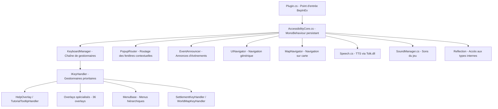

# Le Livre de l'Accessibilité : Moder Unity pour les Joueurs Non-Voyants

Bienvenue dans le guide définitif sur la création de mods d'accessibilité pour les jeux Unity. Ce livre vous accompagnera des principes de base du modding jusqu'à la construction d'un **Client Ombre** (Shadow Client) sophistiqué et modulaire — une réalité logique et parallèle qui permet aux joueurs non-voyants de vivre une expérience de jeu sur un pied d'égalité avec les joueurs voyants.

## Table des Matières

### Partie I : Les Fondations
* **[Chapitre 1 : L'Écosystème du Modding](#chapitre-1-l-écosystème-du-modding)**
* **[Chapitre 2 : Configuration de votre Laboratoire](#chapitre-2-configuration-de-votre-laboratoire)**

### Partie II : L'Architecture (Le Framework Modulaire)
* **[Chapitre 3 : Concevoir le Système Nerveux](#chapitre-3-concevoir-le-système-nerveux)**
* **[Chapitre 4 : Le Cerveau (Virtualisation des Entrées)](#chapitre-4-le-cerveau-virtualisation-des-entrées)**
* **[Chapitre 5 : Les Sens (Extraction et Réflexion)](#chapitre-5-les-sens-extraction-et-réflexion)**

### Partie III : L'Art de la Découverte (Rétro-ingénierie)
* **[Chapitre 6 : Lire la Matrice](#chapitre-6-lire-la-matrice)**
* **[Chapitre 7 : Identifier la Logique du Jeu](#chapitre-7-identifier-la-logique-du-jeu)**

### Partie IV : Mise en œuvre et Modèles (Patterns)
* **[Chapitre 8 : Maîtriser les Menus](#chapitre-8-maîtriser-les-menus)**
* **[Chapitre 9 : Vivre dans le Monde](#chapitre-9-vivre-dans-le-monde)**
* **[Chapitre 10 : Interception Avancée](#chapitre-10-interception-avancée)**

### Partie V : Devenir Global
* **[Chapitre 11 : Le Mod Polyglotte](#chapitre-11-le-mod-polyglotte)**
* **[Chapitre 12 : Accrocher la Localisation Native](#chapitre-12-accrocher-la-localisation-native)**

### Partie VI : Déploiement et au-delà
* **[Chapitre 13 : Les Touches Finales](#chapitre-13-les-touches-finales)**
* **[Chapitre 14 : Distribution et Communauté](#chapitre-14-distribution-et-communauté)**
* **[Chapitre 15 : Au-delà du Gameplay (Social et Méta)](#chapitre-15-au-delà-du-gameplay-social-et-méta)**

### Partie VII : La Masterclass
* **[Chapitre 16 : Étude de cas - Against the Storm](#chapitre-16-étude-de-cas---against-the-storm)**

---

## Chapitre 1 : L'Écosystème du Modding
Comprendre Unity, les chargeurs (loaders) et la philosophie du "Client Ombre".

## Chapitre 2 : Configuration de votre Laboratoire
Configuration de l'environnement, outils CLI et binaires natifs.

## Chapitre 3 : Concevoir le Système Nerveux
Livraison optimisée de la parole, élagage et file d'attente interruptible.

## Chapitre 4 : Le Cerveau (Virtualisation des Entrées)
Suppression de la souris, touches sémantiques et gestion de la pile de focus.

## Chapitre 5 : Les Sens (Extraction et Réflexion)
Puiser dans la mémoire pour extraire la "Source de Vérité".

## Chapitre 6 : Lire la Matrice
Navigation et exploration non visuelle du code.

## Chapitre 7 : Identifier la Logique du Jeu
Trouver les variables centrales qui régissent l'état mathématique du jeu.

## Chapitre 8 : Maîtriser les Menus
Zones virtuelles, touches de balayage et traduction des dispositions spatiales en listes linéaires.

## Chapitre 9 : Vivre dans le Monde
Audio spatial, raycasting et construction d'une géométrie mentale de l'espace 3D.

## Chapitre 10 : Interception Avancée
Accrocher la boucle d'événements, instantanés d'état et résumé des chaînes d'événements complexes.

## Chapitre 11 : Le Mod Polyglotte
Construction du système de localisation "Loc".

## Chapitre 12 : Accrocher la Localisation Native
Synchronisation avec les langues internes du jeu.

## Chapitre 13 : Les Touches Finales
Optimisation des performances et gestion robuste des erreurs.

## Chapitre 14 : Distribution et Communauté
Emballage, publication et construction d'une communauté.

## Chapitre 15 : Au-delà du Gameplay (Social et Méta)
Journaux d'historique, suspense visuel, connectivité sociale et portage vers d'autres moteurs.

## Chapitre 16 : Étude de cas - Against the Storm
Modding de simulation avancée, triangulation spatiale et navigation complexe sur grille.

---

*Créé par la Communauté de Modding d'Accessibilité.*

# Chapitre 1 : L'Écosystème du Modding

## Le Client Ombre

Avant d'écrire une seule ligne de code, nous devons nous mettre d'accord sur ce que nous essayons réellement de construire — et, plus fondamentalement, pourquoi l'approche la plus évidente est la mauvaise.

L'instinct de la plupart des gens, lorsqu'ils entendent "mod d'accessibilité", est d'imaginer quelque chose qui lit l'écran : une couche logicielle qui observe les visuels du jeu et décrit ce qu'elle voit. Pointer une caméra sur les pixels, lancer une reconnaissance d'image, lire les étiquettes de texte. C'est une première idée raisonnable. C'est aussi une idée profondément erronée.

La lecture d'écran par analyse visuelle hérite de toutes les faiblesses de l'interface visuelle qu'elle observe. Elle se brise lorsque la résolution change, lorsqu'une police est mise à jour, lorsqu'une animation chevauche une étiquette exactement au mauvais moment, lorsque le moteur de jeu décide de rendre les éléments de l'interface utilisateur dans le désordre pour des raisons de performance. Vous construisez sur du sable — votre fondation bouge chaque fois que le jeu est mis à jour, chaque fois que le joueur change ses paramètres d'affichage, chaque fois qu'il lance le jeu sur un moniteur différent.

Il y a aussi un problème plus fondamental. L'interface visuelle d'un jeu n'est pas la vérité du jeu. C'est une traduction de la vérité. Une carte brillante dans le coin inférieur gauche de l'écran est la façon dont le moteur représente le fait que `Entity[42].IsTargetable == true`. Une barre de santé rouge est une métaphore visuelle pour un nombre stocké en mémoire. Les icônes, les animations, les effets de particules, les secousses de l'écran — tout cela sont des interprétations. C'est le langage du moteur pour communiquer avec les joueurs voyants.

Nous n'avons pas besoin de ce langage. Nous avons besoin de la vérité qu'il traduit.

C'est l'idée centrale derrière le **Client Ombre** (Shadow Client) — parfois appelé Client Sémantique Parallèle. Au lieu de lire la représentation visuelle, nous contournons entièrement le pipeline de rendu. Nous nous branchons directement sur l'état interne du jeu : ses structures de mémoire, ses files d'attente d'événements, ses messages réseau. Nous construisons une interface parallèle qui fonctionne au même niveau logique que le jeu lui-même — ne décrivant pas à quoi ressemblent les choses, mais exposant ce que les choses *signifient*.

Le résultat est une interface qui n'est pas seulement fonctionnelle mais véritablement compétitive. Un joueur non-voyant utilisant un Client Ombre bien construit ne reçoit pas une expérience dégradée ; il dispose d'une interface différente pour le même jeu sous-jacent. La même information, via un canal différent. C'est le but. C'est le standard vers lequel nous construisons.

Encore une chose pour être clair : nous ne construisons pas de bots. Nous n'automatisons pas le gameplay. Le Client Ombre ne prend pas de décisions et n'exécute pas d'actions au nom du joueur. Il traduit l'information et accepte les entrées. La stratégie, le jugement, le jeu — tout cela reste chez le joueur, exactement comme il se doit.

---

## Le moteur Unity : Pourquoi c'est une bonne cible

Unity est l'un des moteurs de jeu dominants dans le monde. Il propulse une vaste gamme de titres — des petits jeux indépendants aux grandes sorties commerciales sur PC, consoles et plateformes mobiles. Pour nos besoins, c'est aussi une cible remarquablement accessible, une fois que l'on comprend son architecture.

La raison principale pour laquelle les jeux Unity sont accessibles aux moddeurs est qu'ils utilisent le C# comme langage de script principal. Le C# se compile en Langage Intermédiaire (IL) — un format de bytecode indépendant de la plateforme qui est plus proche du code source que du code machine, et qui peut être décompilé en C# lisible à l'aide d'outils gratuits. Le jeu est livré avec l'IL compilé emballé dans des fichiers `.dll`, et le plus important d'entre eux — celui contenant la logique unique du jeu — s'appelle presque toujours `Assembly-CSharp.dll`. Ouvrez-le dans un décompilateur, et vous obtenez quelque chose qui ressemble énormément au code source original.

C'est significatif. Cela signifie que nous pouvons lire le code du jeu, comprendre ses structures de données, identifier les variables qui nous intéressent, puis écrire du code qui interagit directement avec ces variables. Nous ne devinons pas de l'extérieur ; nous lisons le plan.

### Mono contre IL2CPP

Il y a une complication. Les jeux Unity peuvent être construits avec l'un des deux backends, et ils se comportent différemment pour nos besoins.

**Mono** est l'approche traditionnelle. Les jeux compilés avec Mono produisent un IL propre et lisible. La décompilation fonctionne bien, et le processus de modding est relativement simple. BepInEx, le principal chargeur de mods pour les jeux Mono, s'accroche au moteur d'une manière bien comprise.

**IL2CPP** (Intermediate Language to C++) est un backend plus récent conçu pour de meilleures performances au moment de l'exécution et une protection plus forte contre la rétro-ingénierie. Au lieu de livrer de l'IL, les jeux IL2CPP compilent le C# en C++, puis en code machine natif avant d'être livrés. Le résultat est nettement plus difficile à décompiler : au lieu d'approximations C# propres, vous obtenez du C++ auto-généré qui dérive mécaniquement de l'original, avec des noms modifiés (mangled) et une structure obscurcie.

La raison pour laquelle l'IL2CPP n'est pas un obstacle insurmontable est que les chargeurs de mods modernes — en particulier MelonLoader — effectuent ce qu'on appelle un "unhollowing" lors du premier lancement du jeu. Ils analysent les binaires compilés, reconstruisent la hiérarchie des types et génèrent un ensemble de fichiers DLL proxy qui permettent à votre mod d'interagir avec le jeu comme s'il s'agissait d'une version Mono. Vous perdez un peu de clarté dans la vue décompilée, mais le flux de travail du modding reste largement le même.

### L'architecture Entité-Composant (Entity-Component)

Le modèle d'exécution d'Unity est construit sur un modèle appelé architecture Entité-Composant. Il est essentiel de le comprendre, car il façonne la façon dont vous trouvez les données que vous recherchez.

Chaque objet dans un jeu Unity — un personnage, un bouton, une zone de déclenchement invisible, un émetteur sonore — est un `GameObject`. À lui seul, un `GameObject` n'est qu'un conteneur. Il ne contient rien et ne fait rien. Ce qui lui donne des propriétés et un comportement, ce sont les `Components` (Composants) qui lui sont attachés.

Un composant `MeshRenderer` rend l'objet visible. Un `Collider` lui donne une présence physique. Un composant `Text` ou `TextMeshProUGUI` affiche une étiquette de texte. Un script personnalisé appelé par exemple `PlayerState` peut contenir la santé du joueur, son compte d'or et ses points d'expérience.

Pour un Client Ombre, la grande majorité de l'arbre des composants Unity n'est pas pertinente. Nous ne nous soucions pas du `MeshRenderer`. Nous ne nous soucions pas de l' `Animator`. Nous ne nous soucions pas du `ParticleSystem`. Nous recherchons les composants de script personnalisés — le `PlayerState`, le `GameStateManager`, le `BattleController`, l' `InventorySystem` — qui contiennent les variables régissant la logique. Ce sont nos cibles.

### Le modèle Singleton

Les jeux Unity de toute complexité utilisent presque universellement le modèle Singleton pour leurs systèmes principaux. Un Singleton est une classe qui possède exactement une instance, accessible de n'importe où dans le code via une propriété statique `Instance` ou `Current`. Le système de combat est un Singleton. Le système de sauvegarde est un Singleton. Le gestionnaire d'interface utilisateur est un Singleton.

Pour un mod, les Singletons sont des portes. C'est ainsi que vous passez de "Je sais quelle classe je cherche" à "J'ai une référence à l'objet vivant que je peux lire". Lorsque vous trouvez un Singleton — et vous en trouverez beaucoup — documentez-le immédiatement dans vos notes de recherche. Il reviendra sans cesse.

---

## Chargeurs de mods : Entrer dans le moteur

Un chargeur de mods (mod loader) est l'infrastructure qui injecte votre code dans le processus du jeu. Sans lui, votre mod n'est qu'une DLL posée sur le disque ; le jeu n'a aucune raison de la charger.

**BepInEx** est la norme pour les jeux Mono et est devenu l'un des frameworks de modding les plus établis dans l'écosystème Unity. Il fonctionne en s'injectant dans la séquence de démarrage du jeu, puis en chargeant tous les plugins qu'il trouve dans le dossier `BepInEx/plugins/`. Votre mod vit dans ce dossier sous la forme d'un fichier `.dll` compilé. BepInEx vous donne une classe de base — `BaseUnityPlugin` — dont vous héritez, et à partir de là, votre code s'exécute à l'intérieur de la boucle `Update()` d'Unity, la méthode qui s'exécute à chaque image.

**MelonLoader** est l'équivalent pour les jeux IL2CPP. Il adopte une approche technique différente — il s'injecte à un niveau inférieur pour gérer le pont C++ — mais du point de vue d'un développeur de mods, l'expérience est similaire. Vous héritez de `MelonMod`, implémentez quelques méthodes de cycle de vie, et votre code s'exécute aux côtés du moteur.

Choisir entre les deux n'est généralement pas un choix : BepInEx pour Mono, MelonLoader pour IL2CPP. Certains jeux ont des communautés de modding actives qui se sont standardisées sur l'un ou l'autre pour des raisons moins évidentes ; vérifiez la communauté du jeu que vous ciblez.

Un point important concernant la configuration : les deux chargeurs ont leurs propres dossiers de plugins, systèmes de journaux (logs) et conventions de configuration. Apprenez-les tôt. De nombreux problèmes déroutants du type "mon mod ne se charge pas" sont résolus en plaçant la DLL dans le bon dossier.

---

## Harmony : L'outil chirurgical

Si le chargeur de mods est la façon dont nous entrons dans le moteur, Harmony est la façon dont nous modifions ce que nous y trouvons. C'est une bibliothèque de patchage pour le code .NET qui vous permet de modifier le comportement de n'importe quelle méthode au moment de l'exécution — sans toucher aux fichiers compilés originaux.

Le mécanisme est appelé monkey-patching. Harmony intercepte l'exécution d'une méthode et peut insérer votre code avant qu'elle ne s'exécute (un patch Prefix), après qu'elle s'exécute (un patch Postfix), ou à la place de séquences d'octets spécifiques (un patch Transpiler, dont nous n'aurons pas besoin pour la plupart des travaux d'accessibilité). Voici à quoi cela ressemble en pratique :

```csharp
[HarmonyPatch(typeof(PlayerController), nameof(PlayerController.TakeDamage))]
public class TakeDamagePatch {
    static void Postfix(PlayerController __instance, int amount) {
        ScreenReader.Say($"A subi {amount} dégâts. Santé actuelle : {__instance.CurrentHealth}.");
    }
}
```

C'est tout. Trois lignes de code fonctionnel qui interceptent la méthode de dégâts du jeu et génèrent une annonce chaque fois que le joueur est touché. Le paramètre `__instance` nous donne le `PlayerController` spécifique qui a été affecté. Le paramètre `amount` est exactement ce qui a été passé à la méthode originale.

Harmony est ce qui rend le Client Ombre viable au niveau de précision qu'il requiert. Nous n'interrogeons pas les variables en permanence, nous ne devinons pas le timing, nous n'attendons pas que l'interface utilisateur se mette à jour. Nous nous attachons à la méthode exacte qui modifie une valeur, et nous annonçons ce changement au moment précis où il se produit.

### Patches Prefix et interception des entrées

Les patches Postfix — qui s'exécutent après la méthode originale — sont appropriés pour les annonces. Les patches Prefix s'exécutent avant, et ils ont un pouvoir supplémentaire : ils peuvent empêcher la méthode originale de s'exécuter. Si le Prefix renvoie `false`, Harmony saute l'original.

C'est ainsi que nous supprimons la souris. Nous mettons un Prefix sur l'accesseur des coordonnées de la souris du jeu, renvoyons les coordonnées sûres que nous voulons, et renvoyons `false` pour empêcher l'original d'être appelé. Pour l'interface utilisateur du jeu, la souris est exactement là où nous avons dit quelle était.

```csharp
[HarmonyPatch(typeof(Input), "mousePosition", MethodType.Getter)]
public class MouseBlockPatch {
    static bool Prefix(ref Vector3 __result) {
        if (!AccessStateManager.IsActive) return true; // Laisser passer la souris normale
        __result = Vector3.zero;
        return false; // Ignorer le getter original
    }
}
```

### Gestion de vos patches

Dans un mod mature, vous pouvez avoir des dizaines ou des centaines de patches Harmony. Certains doivent être actifs dès que le mod se charge et le rester indéfiniment. D'autres — des patches spécifiques à une scène de combat ou à un panneau d'interface utilisateur particulier — ne doivent être actifs que lorsqu'ils sont pertinents. Harmony prend en charge le patchage manuel (vous appelez `PatchAll()` une fois au démarrage et il trouve tous vos attributs) et le patchage dynamique (vous appliquez et supprimez des patches individuels à mesure que l'état du jeu change). Nous utiliserons les deux dans le framework.

---

## Tolk : Donner une voix au mod

Nous avons notre logique. Nous avons nos crochets (hooks). La dernière pièce consiste à faire parler le mod.

Tolk est une petite bibliothèque spécialisée qui fournit une interface unifiée aux principaux lecteurs d'écran Windows — NVDA, JAWS, Narrateur et autres — sans que le mod ait besoin de savoir lequel le joueur a installé. Vous appelez `Tolk.Output("texte ici")` et le lecteur d'écran actuellement actif prononce le texte. Vous ne gérez pas différentes API pour différents lecteurs ; Tolk s'en occupe.

Il vaut la peine de s'arrêter pour apprécier ce que cette abstraction apporte. NVDA et JAWS ont des API sous-jacentes complètement différentes. Sans Tolk, vous devriez vous intégrer aux deux — détecter lequel est actif, bifurquer selon le cas et maintenir deux pipelines de parole distincts. Tolk réduit tout cela à trois fonctions : `Load()` pour initialiser, `Output()` pour parler, et `Unload()` pour nettoyer.

Il y a deux fichiers binaires dont vous avez besoin : `Tolk.dll` lui-même, et un client contrôleur NVDA (`nvdaControllerClient64.dll` sur les systèmes 64 bits). Les deux doivent se trouver dans le dossier racine du jeu — pas dans un sous-dossier, pas dans le répertoire des mods, mais à la racine, à côté de l' `.exe` du jeu. C'est une erreur d'installation fréquente qui vaut la peine d'être vérifiée chaque fois que Tolk semble silencieux.

Notre framework enveloppe Tolk dans un modèle `ScreenReader.cs` qui ajoute trois choses par-dessus l'API brute : la gestion des interruptions (arrêter l'annonce précédente lorsqu'une nouvelle est plus urgente), une file d'attente de parole pour les informations secondaires, et un pipeline de nettoyage du texte. Nous approfondirons tout cela au Chapitre 3.

---

## Le cadre cognitif : Comment penser ce travail

Les connaissances techniques sont nécessaires mais pas suffisantes. Pour construire un bon logiciel d'accessibilité, vous devez penser différemment que lors de la construction d'une application classique.

### Le joueur en tant qu'expert

Le changement le plus important est le suivant : les joueurs non-voyants ne sont pas vos utilisateurs au sens typique du produit, où vous concevez pour une personne moyenne imaginaire. Ce sont des experts. Ils ont passé des années à développer des stratégies pour extraire des informations d'un logiciel via des canaux non visuels. Ils savent des choses sur le comportement des lecteurs d'écran, la charge cognitive dans des conditions audio uniquement, et le raisonnement spatial par le son que vous ne découvrirez pas par vous-même.

Chaque décision de conception que vous prenez — la formulation d'une annonce, le choix d'une touche de balayage, la décision sur les informations à inclure ou à omettre — doit être testée avec de vrais joueurs non-voyants le plus tôt possible dans le développement. Un mod d'accessibilité qui a été conçu entièrement par un développeur voyant et jamais testé par un non-voyant est presque certainement erroné sur des points importants.

Ce n'est pas une critique ; c'est juste la nature de la conception pour une expérience que vous ne partagez pas. La solution est la collaboration, pas l'évitement.

### La discipline du fichier Game-Api.md

La rétro-ingénierie est un voyage et, comme tous les voyages, vous devez prendre des notes. Une découverte qui n'est pas documentée est comme si elle n'avait jamais eu lieu — vous devrez la retrouver la semaine prochaine, ou le mois prochain, ou après qu'une mise à jour du jeu vous oblige à vérifier que vos hypothèses sont toujours valables.

Chaque découverte significative va dans `game-api.md`. Le nom de la classe où réside la santé du joueur. Le nom exact du champ que vous utilisez pour la lire. Le chemin Singleton vers le gestionnaire de combat. La méthode que vous avez patchée pour détecter le ramassage d'objets. Les touches que le jeu utilise déjà et que vous devez éviter.

Ce fichier est votre carte. Plus il est complet, moins vous avez besoin d'en garder en tête à un moment donné — et plus vous avancerez vite à mesure que le projet gagnera en complexité.

### Le plan par paliers (Tiers)

Les grands projets d'accessibilité bénéficient d'une progression structurée. Notre framework organise le travail en paliers :

**Palier 1 : Analyse de base.** Identifiez les principales sources de données du jeu. Cartographiez la hiérarchie des Singletons. Trouvez la classe qui régit chaque système de jeu majeur (combat, inventaire, dialogue, social). C'est un travail de recherche ; vous n'écrivez pas encore le code final du mod, vous construisez la carte.

**Palier 2 : Navigation de base.** Virtualisez le menu principal et tous les sous-menus majeurs. Amenez le joueur au point où il peut démarrer et naviguer dans une session de jeu en utilisant uniquement le clavier. C'est la fondation ; tout le reste en dépend.

**Palier 3 : Le Monde.** Implémentez les fonctionnalités spécifiques au gameplay — annonces de combat, navigation dans l'inventaire, suivi des quêtes, audio spatial pour les environnements 3D. Chaque fonctionnalité s'appuie sur la navigation par menus établie au Palier 2.

**Palier 4 : Finition et Méta.** Optimisation des performances, configuration, localisation, journal d'historique, ouverture de packs, fonctionnalités sociales. Le travail qui transforme un prototype fonctionnel en une version peaufinée.

La plupart des projets n'achèvent jamais le Palier 4. C'est acceptable. Assurez la solidité du Palier 2, construisez le Palier 3 progressivement, et publiez tôt pour que les joueurs puissent vous donner des retours qui orienteront vos priorités pour le Palier 4.

---

## Ce qui vient ensuite

Vous comprenez maintenant l'architecture philosophique et technique qui sous-tend l'ensemble du projet. Vous savez ce qu'est un Client Ombre et pourquoi il est supérieur à la lecture des données de pixels à l'écran. Vous comprenez comment les jeux Unity sont structurés, comment les chargeurs de mods injectent notre code, comment Harmony nous permet de patcher n'importe quelle méthode de notre choix, et comment Tolk traduit notre logique en parole.

Dans le chapitre suivant, nous passons à la pratique. Nous allons configurer l'environnement de développement : installer les outils, exécuter le script de génération (scaffolding), configurer l'IDE et vérifier que l'ensemble du pipeline fonctionne avant d'écrire la moindre logique spécifique au jeu.

# Chapitre 2 : Configuration de votre Laboratoire

## L'environnement n'est pas facultatif

Les développeurs expérimentés essaient parfois de brûler l'étape de configuration. Ils installent un ou deux des outils requis, improvisent autour de ce qui manque, puis passent trois jours à déboguer des erreurs qui n'ont rien à voir avec leur code. Ne faites pas cela.

La construction d'un mod d'accessibilité se situe à l'intersection de plusieurs domaines techniques simultanément : compilation .NET, rétro-ingénierie de binaires natifs, système de composants Unity, API audio Windows et mécanismes internes des lecteurs d'écran. Chaque domaine a ses propres outils et ses propres modes de défaillance. Si une pièce de la chaîne est mal configurée — si la mauvaise version d'une bibliothèque se trouve dans le mauvais dossier, si un séparateur de chemin est incorrect dans votre fichier de projet, si Tolk ne trouve pas sa DLL compagnon — le résultat est le silence. Votre mod ne parle pas, et vous ne savez pas pourquoi.

Les scripts du framework existent pour prévenir exactement cela. Ce chapitre passe en revue chaque outil dont vous avez besoin, explique pourquoi il est important et vous montre comment utiliser ces scripts pour automatiser les parties fastidieuses et vérifier les parties qui restent manuelles.

---

## Le SDK .NET

Le jeu est en C#. Votre mod est en C#. Tout se compile avec le SDK .NET, c'est donc la première installation à effectuer.

Ouvrez PowerShell en tant qu'Administrateur et exécutez :

```powershell
winget install Microsoft.DotNet.SDK.8
```

Nous ciblons le .NET 8 car il donne accès aux fonctionnalités linguistiques modernes comme les littéraux de chaîne bruts, les améliorations du filtrage par motif (pattern matching) et de meilleures primitives de performance. Votre mod lui-même sera compilé pour cibler la version spécifique de .NET utilisée par le jeu — ceci est déclaré dans votre fichier `.csproj` — mais la version du SDK avec laquelle vous développez doit être au moins aussi récente que votre cible.

Après l'installation, vérifiez que cela a fonctionné :

```powershell
dotnet --version
```

Vous devriez voir quelque chose comme `8.0.xxx`. Si la commande n'est pas trouvée, vous devrez peut-être redémarrer PowerShell pour prendre en compte la mise à jour du `PATH`.

### Comprendre le fichier .csproj

Le fichier `.csproj` mérite d'être compris en profondeur, car il contrôle plusieurs choses qui peuvent mal tourner subtilement. Notre script de génération en crée un à partir d'un modèle, mais vous devrez l'éditer.

Le fichier comporte deux sections qui importent le plus pour le modding. La première est les références `<ItemGroup>` :

```xml
<ItemGroup>
  <Reference Include="UnityEngine">
    <HintPath>$(GameFolder)\GameName_Data\Managed\UnityEngine.dll</HintPath>
    <Private>false</Private>
  </Reference>
  <Reference Include="Assembly-CSharp">
    <HintPath>$(GameFolder)\GameName_Data\Managed\Assembly-CSharp.dll</HintPath>
    <Private>false</Private>
  </Reference>
</ItemGroup>
```

`<Private>false</Private>` est important : il indique au compilateur de référencer ces DLL lors de la compilation mais de ne pas les inclure dans la sortie. Le jeu les possède déjà ; si la DLL de votre mod essayait d'en inclure des copies, vous auriez des conflits de version.

La deuxième section critique est l'événement post-build :

```xml
<Target Name="PostBuild" AfterTargets="PostBuildEvent">
  <Exec Command="xcopy /Y &quot;$(TargetPath)&quot; &quot;$(GameFolder)\BepInEx\plugins\&quot;" />
</Target>
```

Ceci copie votre DLL compilée dans le dossier des plugins du jeu chaque fois que vous compilez. Sans cela, vous devriez la copier manuellement à chaque itération — et vous oublieriez inévitablement, passeriez une heure à déboguer un changement que vous n'avez jamais déployé, et vous vous sentiriez idiot. Laissez le système de build s'en charger.

### La propriété GameFolder

En haut du `.csproj`, il y a un groupe de propriétés définissant `GameFolder` :

```xml
<PropertyGroup>
  <GameFolder>C:\Games\MonSuperJeu</GameFolder>
</PropertyGroup>
```

Modifiez cela pour indiquer le chemin réel où le jeu est installé. Cette propriété unique contrôle à la fois l'endroit où le compilateur cherche les DLL du jeu et l'endroit où l'événement post-build copie votre sortie. Chaque erreur de compilation mystérieuse "référence non trouvée" peut généralement être tracée jusqu'à une erreur ici.

---

## Le décompilateur : Lire le livre fermé

Vous n'avez pas accès au code source du jeu. Ce que vous avez est un fichier `.dll` compilé — lisible par une machine mais pas par un humain dans sa forme brute. Un décompilateur prend ce fichier compilé et reconstruit une approximation du code source C# original.

L'approximation est imparfaite. Les noms de variables sont parfois perdus ou remplacés par des identifiants auto-générés et illisibles. Certaines optimisations du compilateur produisent des modèles qui semblent étranges une fois décompilés. Les lambdas et les expressions LINQ peuvent être développés dans leurs implémentations sous-jacentes. Malgré ces imperfections, le code décompilé est navigable et suffisamment lisible pour faire tout ce dont nous avons besoin.

### Installation de l'outil en ligne de commande

```powershell
dotnet tool install ilspycmd -g
```

Vérifiez l'installation :

```powershell
ilspycmd --version
```

Pour une interface graphique — qui est souvent plus utile pendant la phase de recherche — téléchargez ILSpy ou dnSpy (un fork avec des capacités de débogage). Les deux sont gratuits et open source. Pendant le développement actif, un décompilateur graphique vous permet de naviguer dans la hiérarchie des types, de rechercher des chaînes de caractères littérales et de sauter aux définitions d'un clic. Pour l'automatisation et les commandes de décompilation ponctuelles, `ilspycmd` est plus rapide.

### Trouver les bonnes DLL

Pour les jeux **Mono**, la cible de décompilation principale est :
```
[Dossier d'installation du jeu]\[NomDuJeu]_Data\Managed\Assembly-CSharp.dll
```

Il peut y avoir des DLL supplémentaires spécifiques au jeu à ses côtés. Décompilez toutes celles qui semblent contenir la logique du jeu ; certains jeux divisent leur code sur plusieurs assemblages (assemblies).

Pour les jeux **IL2CPP**, vous devez d'abord lancer le chargeur de mods. MelonLoader et BepInEx effectuent tous deux l'étape d'unhollowing au premier lancement et écrivent les DLL proxy résultantes dans des emplacements connus :

- MelonLoader : `[Dossier du jeu]\MelonLoader\Managed\`
- BepInEx : `[Dossier du jeu]\BepInEx\interop\`

Ces DLL proxy ont les types et les signatures de méthode corrects, mais leurs corps de méthode sont vides — ce sont des squelettes (stubs). C'est suffisant pour compiler votre mod contre elles et suffisant pour décompiler à des fins de recherche.

### Décompiler une classe spécifique

Pendant la recherche, vous vous retrouverez souvent à décompiler une classe spécifique plutôt qu'un assemblage entier :

```powershell
ilspycmd Assembly-CSharp.dll -t PlayerController -o ./decompiled/
```

Ceci écrit le C# décompilé pour `PlayerController` et tous ses types imbriqués dans un fichier dans `./decompiled/`. Gardez ces fichiers ; ils sont votre matériel de référence pour écrire des patches.

---

## Installation du chargeur de mods

### BepInEx (Jeux Mono)

Téléchargez la version appropriée de BepInEx depuis GitHub — assurez-vous d'obtenir la bonne architecture (x64 pour les jeux 64 bits, x86 pour les 32 bits, bien que cela soit de plus en plus rare). Extrayez le zip dans le dossier racine du jeu. La structure des dossiers doit ressembler à ceci après coup :

```
[DossierDuJeu]/
├── BepInEx/
│   ├── core/
│   ├── plugins/      ← votre mod va ici
│   └── config/
├── doorstop_config.ini
├── winhttp.dll        ← Point d'injection de BepInEx
└── NomDuJeu.exe
```

Lancez le jeu une fois. BepInEx s'initialisera, créera des fichiers journaux et s'arrêtera proprement. Vérifiez `BepInEx/LogOutput.log` pour confirmer qu'il s'est chargé correctement. Vous devriez voir des lignes indiquant que BepInEx s'est initialisé et qu'il surveille le dossier des plugins.

### MelonLoader (Jeux IL2CPP)

MelonLoader fournit un exécutable d'installation plutôt qu'un simple zip. Lancez-le, pointez-le vers l' `.exe` du jeu, et laissez-le télécharger et configurer la version correcte. Cette étape est importante : les versions de MelonLoader sont liées à des versions spécifiques du moteur Unity, et utiliser la mauvaise version produit des échecs vraiment difficiles à diagnostiquer.

Si vous n'êtes pas sûr de la version à utiliser, le script `scripts/Get-MelonLoaderInfo.ps1` lit les fichiers journaux du jeu et extrait la version d'Unity, la version recommandée de MelonLoader et l'architecture. Exécutez-le avant d'installer pour vous éviter des ennuis.

### Vérification de l'installation du chargeur de mods

Les deux chargeurs écrivent des journaux détaillés. Après avoir installé et lancé le jeu une fois sans aucun mod, vérifiez le journal :

- BepInEx : `[DossierDuJeu]\BepInEx\LogOutput.log`
- MelonLoader : `[Dossier du jeu]\MelonLoader\Latest.log`

Si le fichier journal existe et contient des messages d'initialisation, le chargeur fonctionne. Si aucun fichier journal n'a été créé, l'injection a échoué — généralement à cause d'une mauvaise architecture ou d'un jeu qui résiste activement au modding.

---

## Installation de Tolk

Allez sur le dépôt GitHub de Tolk et accédez à la page Releases. Téléchargez la version binaire — pas le code source.

Dans l'archive, vous trouverez :
- `Tolk.dll` — la bibliothèque principale
- `nvdaControllerClient64.dll` — l'interface NVDA (64 bits)
- `nvdaControllerClient32.dll` — l'interface NVDA (32 bits)
- Des DLL similaires pour SAPI et d'autres backends

Copiez `Tolk.dll` et le client contrôleur NVDA approprié (presque certainement la version 64 bits) directement dans le dossier racine du jeu. C'est le dossier contenant l' `.exe` du jeu — pas le dossier `BepInEx`, pas le dossier `plugins`, pas un sous-dossier `mods`, mais bien la racine.

Cet emplacement est important car le chargeur de DLL de .NET résout les dépendances non gérées en cherchant d'abord dans le répertoire de l'exécutable du processus. `Tolk.dll` doit pouvoir y être trouvé, et le client contrôleur NVDA doit pouvoir être trouvé là où Tolk le cherche — qui est également le répertoire de l'exécutable.

---

## Décompiler le jeu

Avant d'écrire une seule ligne de code de mod, vous devez lire le code du jeu. C'est l'étape de recherche fondamentale : chaque nom de classe, signature de méthode, nom de champ et modificateur d'accès que vous utilisez dans vos patches Harmony et vos appels de réflexion doit provenir d'ici. Deviner produit du code qui compile mais échoue silencieusement à l'exécution.

La façon dont vous décompilez dépend d'une question critique : le jeu est-il **Mono** ou **IL2CPP** ?

### Mono vs IL2CPP : Pourquoi c'est important

Unity est livré avec deux backends de script :

- **Mono** : Le code C# du jeu est compilé en bytecode IL .NET standard et livré sous forme de fichiers DLL lisibles dans `[NomDuJeu]_Data/Managed/`. Les décompilateurs .NET standards fonctionnent directement sur ces fichiers et produisent une sortie C# quasi parfaite.

- **IL2CPP** : Le C# du jeu est compilé en C++ natif puis compilé à nouveau en code machine. Les fichiers DLL dans `Managed/` sont des **fichiers stubs** — ils ne contiennent que les métadonnées de type, pas le code IL réel. La logique réelle se trouve dans un binaire natif (`GameAssembly.dll` sur Windows). Vous ne pouvez pas décompiler ce binaire directement en C# ; à la place, vous récupérez les métadonnées de type et les utilisez aux côtés d'outils d'exploration au niveau source.

**Comment savoir quel backend un jeu utilise :**
- Ouvrez `MelonLoader/Latest.log` ou `BepInEx/LogOutput.log` — les deux affichent "Il2Cpp" ou "Mono" pendant l'initialisation.
- Vérifiez la présence de `GameAssembly.dll` à la racine du jeu — ce fichier n'existe que dans les builds IL2CPP.
- Ouvrez `[NomDuJeu]_Data/Managed/Assembly-CSharp.dll` dans n'importe quel éditeur hexadécimal — si le fichier est petit (moins de 1 Mo) et contient principalement des chaînes de métadonnées sans code IL, c'est un stub IL2CPP.

---

## Décompilation des jeux Mono

### Outil 1 : ilspycmd (Recommandé — Ligne de commande)

`ilspycmd` est la version CLI d'ILSpy, le décompilateur .NET open-source de référence. Comme il fonctionne en ligne de commande, il peut être automatisé — le script de génération peut l'exécuter pour vous, et vous pouvez le relancer lors d'une mise à jour du jeu sans ouvrir d'interface graphique.

**Installation :**
```powershell
dotnet tool install -g ilspycmd
```
Après l'installation, redémarrez votre terminal pour que l'outil soit dans le `PATH`.

**Utilisation de base — décompiler vers des fichiers :**
```powershell
ilspycmd -p -o ./decompiled `
    "[DossierDuJeu]\[NomDuJeu]_Data\Managed\Assembly-CSharp.dll"
```
Le drapeau `-p` signifie "mode projet" : il crée un fichier `.cs` distinct pour chaque espace de noms, reflétant la structure source originale. Le drapeau `-o` spécifie le répertoire de sortie. Cela vous donne des dizaines de milliers de fichiers `.cs` dans une arborescence de dossiers que vous pouvez explorer avec `grep`, `ripgrep` ou n'importe quel éditeur de code.

**Décompiler plusieurs DLL à la fois :**
Les jeux divisent le code sur plusieurs DLL. Décompilez les plus importantes ensemble :
```powershell
$managedDir = "[DossierDuJeu]\[NomDuJeu]_Data\Managed"
ilspycmd -p -o ./decompiled `
    "$managedDir\Assembly-CSharp.dll" `
    "$managedDir\Assembly-CSharp-firstpass.dll" `
    "$managedDir\DOTween.dll"
```

**Rechercher dans la sortie immédiatement après la décompilation :**
```powershell
# Trouver tous les modèles Singleton
Get-ChildItem ./decompiled -Recurse -Filter *.cs | `
    Select-String "public static.*Instance" | `
    Select-Object Filename, LineNumber, Line

# Trouver toutes les classes avec "Inventory" dans leur nom
Get-ChildItem ./decompiled -Recurse -Filter *.cs | `
    Select-String "class.*Inventory" | `
    Select-Object Filename, Line
```
Ou avec `ripgrep` (beaucoup plus rapide sur de grandes sorties) :
```powershell
rg "public static.*Instance" ./decompiled --type cs -n
rg "class.*Inventory" ./decompiled --type cs -l  # -l = noms de fichiers uniquement
```

**Décompiler uniquement un type spécifique (plus rapide pour une recherche ciblée) :**
```powershell
ilspycmd -t "PlayerController" `
    "[DossierDuJeu]\[NomDuJeu]_Data\Managed\Assembly-CSharp.dll"
```
Ceci affiche la classe décompilée directement dans le terminal — utile lorsque vous connaissez déjà le nom de la classe et avez juste besoin de vérifier son API.

---

### Outil 2 : dnSpyEx (Alternative graphique)

dnSpyEx est un fork maintenu de l'original dnSpy. C'est un décompilateur graphique avec un navigateur d'assemblages, une recherche intégrée et — surtout — un débogueur d'exécution qui vous permet de définir des points d'arrêt (breakpoints) dans le code décompilé pendant que le jeu tourne.

**Installation :**
Téléchargez depuis `https://github.com/dnSpyEx/dnSpy/releases`. Extrayez le zip. Aucune installation requise.

**Utilisation avec un lecteur d'écran :**
1. Lancez dnSpy. Appuyez sur `Ctrl+O` pour ouvrir un assemblage.
2. Naviguez vers `[NomDuJeu]_Data\Managed\Assembly-CSharp.dll` et ouvrez-le.
3. Le volet gauche affiche l'arborescence des assemblages. Utilisez les touches fléchées pour développer les espaces de noms et les classes.
4. Appuyez sur `Ctrl+F` pour rechercher. Tapez un nom de classe ou de méthode. Les résultats apparaissent dans une liste en dessous.
5. Appuyez sur Entrée sur un résultat pour sauter à son code décompilé dans le volet droit.
6. Pour exporter le projet décompilé complet : `File → Export to Project`. Pointez vers un dossier `decompiled/`. Cela prend 30 à 90 secondes pour les gros assemblages.

**Quand préférer dnSpyEx à ilspycmd :**
- Vous voulez définir un point d'arrêt et inspecter les valeurs en direct (le débogueur est l'atout majeur de dnSpyEx).
- Vous vérifiez rapidement une classe et n'avez pas besoin de l'export complet du projet.
- Vous voulez parcourir graphiquement la hiérarchie d'héritage.

**Quand préférer ilspycmd :**
- Vous voulez le projet complet décompilé en fichiers pour la recherche globale.
- Vous voulez de l'automatisation (CI, post-build, redécompilation lors d'une mise à jour du jeu).
- Vous préférez travailler entièrement en ligne de commande.

---

## Décompilation des jeux IL2CPP

Les jeux IL2CPP nécessitent un flux de travail en deux phases. La Phase 1 récupère les métadonnées de type (noms de classes, noms de méthodes, noms de champs, adresses de fonctions). La Phase 2 utilise ces noms pour rendre le binaire natif navigable pour la recherche.

### Phase 1 : Récupération des métadonnées

#### Outil 3 : Il2CppDumper

Il2CppDumper lit le binaire IL2CPP du jeu et son fichier de métadonnées globales, puis génère un ensemble de fichiers C# "dummy" — des squelettes de classes avec des noms et des signatures corrects mais sans corps de méthode.

**Fichiers nécessaires :**
- `GameAssembly.dll` — le binaire natif (à la racine du jeu).
- `[NomDuJeu]_Data\il2cpp_data\Metadata\global-metadata.dat` — le fichier de métadonnées.

**Téléchargement :**
```
https://github.com/Perfare/Il2CppDumper/releases
```
Extrayez le zip. Lancez `Il2CppDumper.exe`. Il vous demandera les deux chemins de fichiers, puis générera la sortie dans un dossier que vous spécifierez.

**Sortie :**
```
dump/
├── DummyDll/           ← DLL stubs (ajoutez-les comme références pour IntelliSense)
│   ├── Assembly-CSharp.dll
│   └── (toutes les autres DLL dumpées)
├── script.py           ← Script d'import IDA/Ghidra (pas nécessaire pour nous)
├── stringliteral.json  ← Tous les littéraux de chaînes trouvés dans le binaire
└── il2cpp.h            ← Définitions de structures C (pas nécessaire pour nous)
```

Le dossier `DummyDll` est ce que vous ajoutez à votre `.csproj` comme références — elles vous donnent l'autocomplétion IntelliSense pour les types du jeu même si la logique réelle est en code natif.

Le fichier `stringliteral.json` est utile pour trouver des cibles de méthodes cachées : cherchez-y des chaînes que vous voyez dans l'interface utilisateur du jeu, puis tracez quelles méthodes référencent ces chaînes.

**Ajouter des stubs DummyDll à votre projet :**
```xml
<!-- Dans le .csproj, remplacez la référence Assembly-CSharp -->
<Reference Include="Assembly-CSharp">
    <HintPath>$(ProjectDir)dump\DummyDll\Assembly-CSharp.dll</HintPath>
    <Private>false</Private>
</Reference>
```

---

#### Outil 4 : Il2CppInspector

Il2CppInspector est l'alternative la plus puissante. Il offre plus de formats de sortie, une meilleure gestion des jeux obfusqués et un générateur de squelette (scaffold) C# dédié aux mods d'accessibilité et autres outils basés sur Harmony.

**Téléchargement :**
```
https://github.com/djkaty/Il2CppInspector/releases
```

**Utilisation en ligne de commande :**
```powershell
# Générer un squelette C# avec tous les types et stubs de méthodes
Il2CppInspector.exe -i GameAssembly.dll `
    -m "[NomDuJeu]_Data\il2cpp_data\Metadata\global-metadata.dat" `
    -t cs `
    -o ./il2cpp-output
```

**Formats de sortie clés :**

| Drapeau de format | Sortie | Cas d'utilisation |
|---|---|---|
| `-t cs` | Stubs de classes C# | Patchage Harmony, IntelliSense |
| `-t json` | Arbre des types complet en JSON | Analyse scriptée, recherche par relations de types |
| `-t py` | Définitions de structures Python | Scripting IDA/Ghidra (avancé) |
| `-t dll` | DLL stubs | Identique au DummyDll d'Il2CppDumper |

La sortie des stubs C# est particulièrement utile car elle préserve :
- Les adresses de décalage (offsets) des méthodes (en commentaires) — permet de croiser avec le binaire dans IDA ou x64dbg.
- Les décalages de champs — utiles pour les particularités de réflexion spécifiques à l'Il2Cpp.
- Les instanciations de types génériques — dont Harmony a besoin pour patcher correctement les méthodes génériques.

**Choisir entre Il2CppDumper et Il2CppInspector :**

| Facteur | Il2CppDumper | Il2CppInspector |
|---|---|---|
| Vitesse | Plus rapide | Plus lent (plus de traitement) |
| Formats de sortie | Limités (DummyDll + script) | Nombreux (CS, JSON, DLL, Python) |
| Jeux obfusqués | Support de base | Meilleur support |
| Recommandé pour | Génération rapide de stubs | Recherche approfondie ou cibles obfusquées |

Pour la plupart des projets de mods d'accessibilité, Il2CppDumper est suffisant. Utilisez Il2CppInspector lorsque le jeu est fortement obfusqué ou que vous avez besoin des données d'offset des méthodes.

---

## Flux de travail de recherche IL2CPP

Une fois que la Phase 1 vous a donné les métadonnées de type, votre flux de travail de recherche pour l'IL2CPP est différent de celui de Mono. Vous ne pouvez pas lire les corps de méthodes à partir du dump — ils sont en code natif compilé. À la place, vous travaillez par déduction :

1. **Trouvez le type et la méthode** à partir des stubs C# (nom de classe, nom de méthode, types de paramètres).
2. **Vérifiez le dump des littéraux de chaînes** (`stringliteral.json`) pour les chaînes d'interface utilisateur qui apparaissent près du comportement que vous étudiez.
3. **Utilisez l'interopérabilité IL2CPP de MelonLoader** ou **Il2CppAssemblyUnhollower** pour patcher la méthode avec Harmony — la syntaxe de patchage est la même, mais les assemblages de référence proviennent du dossier DummyDll.
4. **Vérifiez avec la sortie des journaux** : ajoutez un Postfix qui annonce les paramètres et observez si l'annonce se déclenche au bon moment.

La Règle d'Or pour l'IL2CPP est la même que pour Mono : **ne devinez jamais un nom de classe ou de méthode**. Chaque nom provient du dump. Tout ce qui n'est pas dans le dump n'existe pas du point de vue de votre mod.

---

## Organiser votre sortie décompilée

Quel que soit l'outil et le backend du jeu, organisez votre sortie décompilée de manière cohérente :

```
[VotreMod]/
├── decompiled/           ← Projet décompilé complet (Mono) ou stubs (IL2CPP)
│   ├── Assembly-CSharp/
│   └── ...
├── docs/
│   └── game-api.md       ← Vos notes de recherche — construites à partir de ce que vous trouvez ici
├── src/
│   └── (votre code de mod)
└── scripts/
```

Le dossier `decompiled/` est un matériel de référence en lecture seule. Ne l'éditez jamais — il sera régénéré lors de la mise à jour du jeu. Votre connaissance réelle du jeu réside dans `docs/game-api.md`, que vous remplissez au fur et à mesure de vos recherches.

Lorsque le jeu est mis à jour, le flux de travail est le suivant : relancer votre commande de décompilation → comparer (diff) la sortie avec votre `game-api.md` → mettre à jour tous les patches qui font référence à des API renommées ou modifiées → incrémenter la version du mod.

---

## Génération du projet (Scaffolding)

Une fois toutes les dépendances en place, il est temps de créer le projet de mod proprement dit. Faire cela à la main implique de créer six ou sept fichiers, de configurer les espaces de noms XML, de mettre en place les références et d'écrire un code de base qui est identique dans chaque projet. Le script de génération automatise tout cela.

```powershell
pwsh scripts/New-AccessibilityMod.ps1 `
  -ModName "GameAccess" `
  -Namespace "GameAccess" `
  -Loader "BepInEx" `
  -GameName "Mon Super Jeu"
```

Le script crée un projet complet et compilable. Voici ce que fait chaque fichier généré :

**`Main.cs`** est le point d'entrée. Pour BepInEx, c'est une classe héritant de `BaseUnityPlugin` ; pour MelonLoader, de `MelonMod`. Il contient `OnInitializeMelon()` ou `Awake()` où les patches Harmony sont appliqués et le mod initialisé. Il contient également une annonce de démarrage via Tolk confirmant que le mod est chargé.

**`ScreenReader.cs`** enveloppe Tolk. Il suit la dernière parole prononcée, implémente la file d'attente des interruptions et expose `Say()` et `SayQueued()`. Vous appellerez les méthodes de ce fichier des centaines de fois au cours du projet.

**`AccessStateManager.cs`** est le gestionnaire de focus et d'entrées. Il maintient la pile de contexte, mappe les touches aux actions sémantiques et s'assure qu'un seul gestionnaire (handler) possède l'entrée clavier à un moment donné.

**`UITextExtractor.cs`** contient le pipeline de nettoyage du texte : motifs regex, carte des sprites et la méthode `CleanString()` qui transforme le texte brut du jeu en chaînes prêtes pour la synthèse vocale (TTS).

**`ReflectionHelper.cs`** fournit un accès mis en cache aux champs et méthodes privés. Chaque appel passe par un dictionnaire indexé sur le type cible et le nom du champ.

**`Loc.cs`** est le système de localisation. Il charge les fichiers de langue depuis un dossier `lang/` et fournit la recherche `Get(key)` avec une chaîne de repli (fallback).

**`DebugLogger.cs`** fournit une journalisation catégorisée. Les catégories incluent `State`, `Handler`, `Logic`, `Error` et `Patch`.

**`docs/book/`** est une copie locale de ce guide, générée par le script pour une consultation hors ligne.

---

## Configuration de l'IDE

Visual Studio 2022 Community est gratuit et fournit le meilleur serveur de langage C# pour le modding Unity. VS Code avec l'extension C# Dev Kit est une alternative plus légère qui fonctionne bien si vous l'avez déjà.

Après avoir ouvert le fichier `.csproj` généré, votre première tâche est de configurer la propriété `GameFolder` mentionnée précédemment. Ouvrez le `.csproj` dans un éditeur de texte (vous pouvez également l'éditer depuis VS en faisant un clic droit sur le projet et en sélectionnant "Éditer le fichier projet") et modifiez le chemin.

Une fois le chemin correct, essayez de compiler : appuyez sur `Ctrl+Shift+B` dans Visual Studio. Si la compilation réussit avec zéro erreur, les références sont configurées correctement. Si vous voyez "The referenced component 'UnityEngine' could not be found", le chemin du dossier du jeu est erroné ou le chargeur de mods n'a pas encore été installé.

### IntelliSense et navigation

Un IDE correctement configuré vous donnera l'autocomplétion IntelliSense pour les types du jeu. Lorsque vous tapez `PlayerC`, vous devriez voir `PlayerController` dans les suggestions. Lorsque vous survolez `TakeDamage`, vous devriez voir sa liste de paramètres. Ce sont les informations de type décompilées provenant des DLL proxy.

IntelliSense ne garantit pas qu'une méthode existe au moment de l'exécution — les DLL proxy sont des stubs — mais cela accélère considérablement la recherche en vous permettant de naviguer dans la hiérarchie des types sans ouvrir le décompilateur pour chaque requête.

---

## Comprendre DebugLogger

Développer sans retour visuel rend la journalisation (logging) plus importante que dans un développement classique. Chaque changement d'état, chaque invocation de gestionnaire, chaque patch échoué doit produire une entrée de journal suffisamment détaillée pour diagnostiquer le problème à partir du seul fichier journal.

Le modèle `DebugLogger.cs` fournit une journalisation catégorisée :

```csharp
DebugLogger.Log(LogCategory.State, "Contexte empilé : Inventaire");
DebugLogger.Log(LogCategory.Handler, "InventoryHandler traite la touche : Bas");
DebugLogger.Log(LogCategory.Logic, $"PlayerHealth = {health}");
DebugLogger.Log(LogCategory.Error, $"Échec de la lecture de m_currentHealth : {ex.Message}");
```

Pendant le développement, activez toutes les catégories. Avant la publication, désactivez au minimum `Logic` et `Handler` — elles génèrent d'énormes volumes de sortie par image et ralentiront sensiblement le jeu si elles sont laissées activées.

Le fichier `ModConfig.cs` (décrit au Chapitre 13) expose une bascule booléenne pour chaque catégorie que le joueur peut régler dans le fichier de configuration. Un joueur qui rencontre un comportement étrange peut activer lui-même la journalisation `State` et vous donner le résultat, plutôt que de vous obliger à fournir des versions de débogage sur demande.

---

## La première compilation : Vérifier le pipeline

Avant d'écrire toute logique spécifique au jeu, vérifiez le pipeline de base de bout en bout. Cela permet de détecter la plupart des problèmes de configuration avant qu'ils n'interagissent avec le code réel du mod.

Ouvrez un terminal dans le dossier du projet et exécutez :

```powershell
dotnet build --configuration Release
```

Si cela réussit, l'événement post-build copiera automatiquement la DLL dans le dossier des plugins du jeu. Lancez le jeu. Si tout fonctionne, vous devriez entendre : "[NomDuJeu] Accessibility Mod Loaded." (Mod d'accessibilité [NomDuJeu] chargé).

Si vous n'entendez rien :

1. Vérifiez le journal du chargeur de mods pour des erreurs pendant le chargement de la DLL. Cherchez le nom de l'assemblage de votre mod vers le bas du journal.
2. Vérifiez que `Tolk.dll` se trouve dans le dossier racine du jeu, pas dans un sous-dossier.
3. Vérifiez que `nvdaControllerClient64.dll` se trouve également dans le dossier racine.
4. Confirmez qu'un lecteur d'écran (NVDA, JAWS ou Narrateur) est en cours d'exécution. Tolk ne produit rien en silence si aucun lecteur n'est actif.
5. Exécutez `scripts/Test-ModSetup.ps1` et lisez attentivement sa sortie.

Ne passez pas au développement spécifique au jeu tant que vous n'avez pas entendu cette annonce de démarrage. La confirmation du démarrage est votre test de fumée (smoke test) de bout en bout. Si elle réussit, votre pipeline de build, de déploiement, d'injection et l'intégration de Tolk fonctionnent tous. Si elle échoue, rien de ce que vous construirez par-dessus ne fonctionnera non plus.

---

## Une note sur l'hygiène des versions

Les jeux sont mis à jour fréquemment — parfois chaque semaine pour les titres de type "live-service". Chaque mise à jour peut renommer des classes, modifier des signatures de méthodes ou restructurer des DLL de manière à briser vos patches. Traitez les DLL du jeu comme une dépendance versionnée.

Gardez une trace de la version du jeu pour laquelle votre mod a été construit. Lorsque le jeu est mis à jour, redécompilez les fichiers concernés et comparez-les avec vos notes de recherche. Les méthodes qui ont été renommées ou déplacées doivent être retrouvées et repatchées. Les nouveaux éléments d'interface utilisateur qui apparaissent ont besoin de gestionnaires (handlers).

Certains moddeurs automatisent cela avec un pipeline de CI (Intégration Continue) : installent le jeu dans un environnement contrôlé, lancent une suite de tests qui vérifie si chaque classe et méthode attendue existe toujours, et signalent les échecs comme des changements de rupture (breaking changes). Cela vaut l'investissement pour un projet à long terme.

---

## Compatibilité des versions Unity

Tous les jeux Unity ne fonctionnent pas de la même manière avec les outils de modding. Le tableau ci-dessous associe les plages de versions d'Unity aux outils connus pour fonctionner de manière fiable. Consultez-le avant d'installer quoi que ce soit.

| Version d'Unity | MelonLoader | BepInEx 5 | BepInEx 6 | Notes |
|---|---|---|---|---|
| 2.x / 3.x / 4.x | ❌ | ❌ | ❌ | Pris en charge par aucun injecteur. Seul l'Assembly-Patching (réécriture IL hors ligne) est possible. Extrêmement rare. |
| 5.x | ❌ | ✅ (5.4.x) | ❌ | MelonLoader ne supporte pas Unity 5. Utilisez BepInEx 5.4.x. Consultez `docs/legacy-unity-modding.md`. |
| 2017 – 2018 | ⚠️ Nécessite une version plus ancienne | ✅ | ❌ | Fonctionne généralement ; peut nécessiter une build plus ancienne de MelonLoader. Testez avant de continuer. |
| 2019 – 2021 | ✅ | ✅ | ✅ | Support complet. L'un ou l'autre chargeur fonctionne. Utilisez celui qu'utilise la communauté du jeu. |
| 2022+ | ✅ | ✅ | ✅ | Support complet. Les jeux IL2CPP sont de plus en plus fréquents ; vérifiez si le jeu utilise Mono ou IL2CPP. |

**Comment détecter la version d'Unity :** Lisez `MelonLoader/Latest.log` ou `BepInEx/LogOutput.log` après le premier lancement du jeu — les deux chargeurs affichent la version d'Unity au démarrage. Alternativement, ouvrez `[NomDuJeu]_Data/globalgamemanagers` dans un éditeur hexadécimal et cherchez "Unity " — la chaîne de version se trouve généralement vers le début du fichier.

**Si la version est 5.x ou plus ancienne**, lisez `docs/legacy-unity-modding.md` avant de continuer. Les étapes de configuration diffèrent de manière importante.

---

## Les scripts d'aide PowerShell

Le framework est livré avec trois scripts PowerShell dans le répertoire `scripts/`. Ce ne sont pas des outils de commodité facultatifs — ils existent parce que les étapes qu'ils automatisent sont fastidieuses à réaliser correctement à la main et faciles à rater.

### `New-AccessibilityMod.ps1` — Génération de projet (Scaffolding)

Exécutez-le une fois au démarrage d'un nouveau projet. Il demande le nom du jeu, le nom de votre mod, votre choix de chargeur de mods et le répertoire du jeu, puis génère :

- Un fichier `.csproj` configuré avec toutes les bonnes références.
- `Main.cs` câblé sur le cycle de vie du bon chargeur de mods.
- `ScreenReader.cs`, `Loc.cs`, `AccessStateManager.cs`, `ReflectionHelper.cs` et `UITextExtractor.cs` à partir des modèles partagés.
- `game-api.md` et `project_status.md` à partir de leurs modèles.
- Des scripts `Build-Mod.ps1` et `Deploy-Mod.ps1` personnalisés pour votre répertoire de jeu.

```powershell
cd "C:\chemin\vers\votre\projet-de-mod"
.\scripts\New-AccessibilityMod.ps1
```

Ne commencez jamais un projet en copiant les fichiers manuellement. Le script garantit que les chemins du `.csproj`, les noms d'espaces de noms et les références du chargeur de mods sont tous cohérents dès la toute première compilation.

### `Test-ModSetup.ps1` — Vérification de l'environnement

Exécutez ce script chaque fois que le mod ne produit pas de parole ou ne se charge pas du tout. Il vérifie :

- Que le `SDK .NET` est installé dans une version appropriée.
- Que `Tolk.dll` et le bon `nvdaControllerClient*.dll` sont dans le répertoire du jeu.
- Que la DLL construite existe dans le bon dossier de sortie (`Mods/` pour MelonLoader, `BepInEx/plugins/` pour BepInEx).
- Que le journal du chargeur de mods montre un chargement réussi (analyse le journal automatiquement).
- Que le répertoire du jeu est correct et que l'EXE du jeu est présent.

```powershell
.\scripts\Test-ModSetup.ps1 -GameDir "C:\Games\NomDuJeu"
```

La sortie est un résumé de réussite/échec avec des messages d'erreur spécifiques pour chaque vérification. "Tolk.dll trouvé : RÉUSSITE. nvdaControllerClient64.dll : ÉCHEC — copiez depuis le dossier x64 de la release Tolk." Plus besoin de deviner ce qui manque.

### `Get-MelonLoaderInfo.ps1` — Analyseur de journaux

Lorsque MelonLoader se charge, il écrit un journal détaillé incluant le nom interne du jeu, le nom du développeur, la version d'Unity et le type d'exécution (Mono ou IL2CPP). Ce script lit ce journal et extrait ces valeurs dans un résumé soigné.

```powershell
.\scripts\Get-MelonLoaderInfo.ps1 -GameDir "C:\Games\NomDuJeu"
```

Ceci est particulièrement utile lorsque vous commencez à travailler sur un nouveau jeu et que vous devez remplir l'attribut `[assembly: MelonGame("Développeur", "NomDuJeu")]` dans `Main.cs`. Plutôt que de deviner les chaînes exactes, lancez le script et copiez-les fidèlement depuis le journal.

---

## Cas particulier : Lorsque le jeu est Open Source

Certains jeux — généralement des titres indépendants plus modestes — sont open source. L'intégralité de leur code source est disponible sur GitHub ou GitLab. Si une recherche Web pour "[Nom du jeu] source code github" renvoie un véritable dépôt de code, vous avez un avantage majeur.

Avec l'open source, vous n'avez pas besoin de décompilateur. Le véritable code source commenté est là, devant vous. Vous n'avez pas besoin de deviner les noms des méthodes ou la visibilité des champs — vous pouvez lire l'implémentation directement et comprendre l'intention de conception en même temps que le code.

Le flux de travail diffère de l'approche standard des mods :

1. **Vérification de la licence d'abord.** Lisez le fichier LICENSE du dépôt avant de toucher à quoi que ce soit. Les projets sous licence MIT et Apache vous permettent de faire un "fork" librement. La licence GPL exige que votre mod soit également sous GPL — ce qui convient pour les mods d'accessibilité open-source. Certaines licences de type "source-available" (source disponible) restreignent la modification ou la redistribution. Si la licence est ambiguë, ne présumez pas — demandez aux développeurs.

2. **Clonez au lieu de décompiler.** `git clone <url-du-depot>` remplace les étapes 5 à 7 de la configuration standard.

3. **Créez une branche d'accessibilité.** `git checkout -b feature/screen-reader-accessibility`. Effectuez toutes vos modifications sur cette branche afin de pouvoir facilement générer une "pull request" plus tard.

4. **Envisagez de contribuer directement.** Si les développeurs sont réceptifs, votre mod d'accessibilité pourrait faire partie intégrante du jeu lui-même. C'est le meilleur résultat possible — une accessibilité qui ne nécessite aucun mod, aucun chargeur de mods et aucune injection au moment de l'exécution. Cela fonctionne sur chaque plateforme, à chaque mise à jour, pour chaque joueur.

Lorsque vous approchez les développeurs au sujet de l'intégration, commencez par présenter le mod fonctionnel comme démonstration. Les développeurs sont beaucoup plus réceptifs à "Voici une mise en œuvre fonctionnelle, aimeriez-vous l'inclure ?" qu'à "Seriez-vous prêt à ajouter des fonctions d'accessibilité ?". Donnez un lien vers votre dépôt GitHub où ils peuvent examiner le code, et proposez de les aider à l'adapter à leur style de code.

---

## Aller de l'avant

Votre fondation est terminée. Vous avez un pipeline de construction fonctionnel, un mod déployé qui parle au démarrage, un décompilateur pour lire le code du jeu et une suite de scripts utilitaires pour maintenir le projet au fil du temps.

Dans le chapitre suivant, nous plongeons dans le système nerveux du Client Ombre : le modèle `ScreenReader.cs`. Nous examinerons en détail les mécanismes d'interruption de la parole, la gestion des files d'attente, la curation de texte et la conception des icônes sonores (earcons) — toute l'architecture qui transforme les données en son.

# Chapitre 3 : Concevoir le Système Nerveux

## Le problème qui ne s'annonce pas

Il existe un mode de défaillance dans le modding d'accessibilité qu'il est facile de rater car il ne produit pas d'erreurs. Le mod se charge, le mod parle, le mod répond aux pressions de touches. Mais le joueur est frustré. La parole se chevauche constamment. Les annonces sont tardives. Le timing semble faux d'une manière difficile à articuler.

Ce n'est pas un bug au sens traditionnel du terme. C'est un échec de conception — une conséquence de ne pas avoir réfléchi assez attentivement à la façon dont la parole se comporte en tant que support en temps réel pour transmettre l'état du jeu.

La parole est fondamentalement différente de l'affichage visuel. Une étiquette à l'écran peut se mettre à jour instantanément et être lue à tout moment ; si le joueur l'a manquée, il peut regarder à nouveau. La parole occupe du temps. Elle ne peut pas être reprise une fois commencée, ne peut pas être rejouée sans infrastructure spéciale, et ne peut pas être traitée plus vite que ne le permet la cognition de l'auditeur. Un mod qui annonce trop, annonce trop tard ou annonce dans le mauvais ordre est pire qu'un mod qui n'annonce rien du tout — car le flot de sons n'aide pas et empêche activement le joueur de réfléchir.

Le modèle `ScreenReader.cs` est la réponse du framework à ce problème. Ce chapitre couvre tout ce qu'il fait : les deux chemins de parole et quand utiliser chacun d'eux, la file d'attente des interruptions, l'optimiseur de parole, le pipeline de nettoyage du texte et le système d'earcons.

---

## Les deux chemins de parole

Au cœur du `ScreenReader` se trouvent deux méthodes. Chaque composant du mod qui produit du son passe par l'une de ces deux méthodes, et choisir la bonne pour chaque situation est la première et la plus importante décision de conception que vous prendrez à maintes reprises tout au long d'un projet.

### `Say(string text, bool interrupt = true)`

C'est le chemin de haute priorité. Lorsque `interrupt` est `true` — et il doit l'être par défaut — l'appel à `Say()` arrête immédiatement tout ce qui est en train d'être prononcé et commence la lecture du nouveau texte dès le premier caractère.

La règle critique pour cette méthode est le timing : utilisez-la dès l'instant où le joueur effectue une action qui change son focus. Pas après avoir calculé une analyse du nouvel état. Pas après une brève vérification de confirmation. À la milliseconde même où la touche est enfoncée, la nouvelle annonce doit commencer.

Ceci est important à cause de la façon dont la cognition spatiale humaine fonctionne dans des conditions audio uniquement. Lorsqu'un joueur voyant déplace son curseur sur une liste d'objets, il voit le nouvel objet immédiatement. Son sentiment de "où il se trouve" est continuellement mis à jour. Un joueur non-voyant construit le même sens spatial par l'audio, mais le signal de mise à jour est la parole. Si cette parole accuse un retard par rapport à l'entrée de ne serait-ce que 100 millisecondes de manière perceptible, le modèle mental du joueur sur sa position dans la liste commence à se dégrader. À 300 millisecondes de retard, la navigation semble mauvaise même si le mod fonctionne techniquement. À 500 millisecondes, cela conduit à des erreurs.

La vitesse est synonyme de justesse lorsqu'il s'agit d'annonces de navigation.

### `SayQueued(string text)`

C'est le chemin secondaire. Le texte ajouté via `SayQueued()` attend dans un tampon que l'annonce en cours se termine, puis est lu automatiquement dans l'ordre. Plusieurs éléments en file d'attente sont lus séquentiellement.

L'utilisation correcte de cette méthode concerne le contexte supplémentaire — des informations qui enrichissent l'annonce principale mais ne sont pas essentielles à l'action immédiate. Lorsque le joueur navigue sur une Potion de Santé, `Say("Potion de Santé")` se déclenche immédiatement à la pression de la touche. Ensuite, vous pourriez mettre en file d'attente `SayQueued("Restaure 50 points de vie")` et `SayQueued("Appuyez sur Entrée pour utiliser")`. Le joueur entend le nom de l'objet instantanément, et les détails suivent naturellement sans interrompre le nom.

Une erreur courante consiste à mettre en file d'attente des choses qui devraient être dites immédiatement. Si le joueur est en combat et que le moteur déclenche un événement "Montée de niveau", c'est un appel à `Say()` — c'est assez important pour interrompre tout ce qui est en train d'être lu. Si le même événement génère également "Vous avez appris une nouvelle capacité", cela peut être mis en file d'attente. C'est une question de contexte et de priorité, pas de formule.

---

## L'architecture de la file d'attente d'interruption

L'implémentation sous-jacente du `ScreenReader` est plus complexe qu'une simple paire de méthodes. Voici la structure :

```csharp
public class ScreenReader {
    private static Queue<string> _speechQueue = new Queue<string>();
    private static string _currentSpeech = "";
    private static bool _isSpeaking = false;

    public static void Say(string text, bool interrupt = true) {
        if (interrupt) {
            _speechQueue.Clear();
            Tolk.Silence(); // Arrête immédiatement la parole au niveau de l'OS
        }
        _speechQueue.Enqueue(text);
        ProcessQueue();
    }

    public static void SayQueued(string text) {
        _speechQueue.Enqueue(text);
        if (!_isSpeaking) ProcessQueue();
    }

    private static void ProcessQueue() {
        if (_speechQueue.Count == 0) { _isSpeaking = false; return; }
        _isSpeaking = true;
        _currentSpeech = _speechQueue.Dequeue();
        Tolk.Output(_currentSpeech);
        // Programmer ProcessQueue() pour qu'il se déclenche à la fin de la parole
        // (l'implémentation dépend du support du callback TTS)
    }

    public static void InterruptAll() {
        _speechQueue.Clear();
        Tolk.Silence();
        _isSpeaking = false;
    }
}
```

La clé du chemin d'interruption est `Tolk.Silence()`. Il ne s'agit pas seulement de vider la file d'attente ; cela envoie une commande au lecteur d'écran du système d'exploitation pour qu'il s'arrête de parler *immédiatement*. Sans cet appel, le lecteur d'écran pourrait finir son mot, son paragraphe ou sa phrase en cours avant de s'arrêter — ce qui peut produire plusieurs centaines de millisecondes de parole résiduelle qui perturbe le joueur.

La méthode `InterruptAll()`, distincte du paramètre `interrupt` de `Say()`, est l'arrêt d'urgence. Elle est utilisée lors d'un changement de contexte majeur — une nouvelle scène se charge, le jeu est mis en pause, le mod est désactivé. Tout s'arrête, la file d'attente est vidée et le mod devient silencieux.

---

## Gérer les chaînes d'événements complexes

Dans de nombreux jeux — en particulier les jeux de cartes et les RPG — une seule action du joueur peut déclencher une cascade d'effets. Un sort se résout, ce qui blesse un ennemi, ce qui déclenche un effet de mort, ce qui pioche une carte, ce qui remplit une condition de quête. Six événements en succession rapide, chacun méritant d'être annoncé.

Une implémentation naïve met les six en file d'attente. Le joueur termine son action et doit ensuite écouter six annonces séquentielles couvrant des faits qui se sont résolus en une fraction de seconde.

La bonne architecture pour cela est appelée **regroupement d'événements** (event batching). Vous ne mettez pas les annonces en file d'attente au moment où chaque événement se déclenche ; vous les collectez pendant la chaîne d'événements et les libérez ensuite ensemble en appliquant un jugement éditorial.

```csharp
public class EventBatch {
    private List<string> _events = new List<string>();
    private bool _collecting = false;

    public void StartBatch() { _collecting = true; _events.Clear(); }
    
    public void Add(string announcement) {
        if (_collecting) _events.Add(announcement);
        else ScreenReader.SayQueued(announcement);
    }

    public void CommitBatch() {
        _collecting = false;
        if (_events.Count == 0) return;
        if (_events.Count == 1) {
            ScreenReader.Say(_events[0]);
        } else {
            // Annoncer les événements les plus importants d'abord, puis résumer
            ScreenReader.Say(_events[0], interrupt: true);
            for (int i = 1; i < Math.Min(_events.Count, 4); i++)
                ScreenReader.SayQueued(_events[i]);
            if (_events.Count > 4)
                ScreenReader.SayQueued($"Et {_events.Count - 4} autres événements.");
        }
    }
}
```

Cela donne au joueur les informations les plus importantes en premier, fournit quelques détails et tronque gracieusement lorsque la chaîne est très longue. Quatre événements constituent approximativement la limite de ce qu'un joueur peut traiter de manière productive pendant une seule pause dans l'action ; au-delà, un compte résumé est plus utile que les éléments individuels.

---

## Le "fantôme audio" (Audio Ghosting) et comment le prévenir

Le fantôme audio est le phénomène par lequel le joueur entend des annonces provenant d'un état de jeu précédent alors que l'état a déjà changé. C'est l'une des choses les plus désorientantes qui puissent arriver dans un mod de lecture d'écran.

La cause la plus courante est une file d'attente de parole trop remplie. Supposons que quinze événements soient en file d'attente et que chacun prenne une demi-seconde à prononcer. Le joueur navigue vers un nouvel écran avant que la file d'attente ne soit terminée. Le lecteur d'écran en est maintenant à sept secondes de discours sur des choses qui se sont passées avant le changement d'écran. Le joueur ne sait plus si la parole décrit l'écran actuel ou le précédent.

La solution est de vider rigoureusement la file d'attente aux limites des contextes. Chaque fois que l' `AccessStateManager` (décrit au chapitre suivant) empile un nouveau contexte — indiquant que le joueur s'est déplacé vers un menu ou un écran différent — `ScreenReader.InterruptAll()` doit être appelé. Chaque fois qu'une action de navigation est déclenchée, `Say()` est appelé avec `interrupt: true`. L'action la plus récente du joueur a toujours la priorité sur le retard de lecture.

---

## L'optimiseur de parole

Avant qu'un texte n'entre dans la file d'attente, il doit passer par un optimiseur. Il s'agit d'un pipeline de transformations qui compressent les informations redondantes et standardisent la formulation.

### Consolidation des motifs (Patterns)

L'optimiseur maintient une fenêtre glissante des derniers éléments de la file d'attente. S'il détecte un motif — le même type d'événement, répété pour plusieurs entités — il les consolide :

Sans optimiseur :
- "Le Gobelin a subi 3 dégâts."
- "Le Gobelin a subi 3 dégâts."
- "Le Gobelin a subi 3 dégâts."

Avec optimiseur :
- "Trois Gobelins ont subi 3 dégâts chacun."

Les modèles regex pour la consolidation varieront selon le jeu, mais la logique est toujours la même : détecter une répétition, la compter et remplacer la liste par une seule déclaration récapitulative.

### Injection de priorité

Tous les événements n'ont pas la même importance. L'optimiseur doit évaluer chaque annonce entrante et placer les éléments de haute priorité en tête de file d'attente. Un événement "Vous êtes sur le point de mourir" doit passer avant les autres ; un "Capacité passive déclenchée" peut attendre.

Un système simple de notation de priorité :

```csharp
public enum SpeechPriority {
    Critical = 0,    // Santé du joueur critique, événements de fin de jeu
    High = 1,        // Actions directes du joueur, navigation
    Normal = 2,      // Événements ennemis, changements d'état du jeu
    Low = 3,         // Effets passifs, informations d'arrière-plan
    Background = 4   // Conseils, contexte optionnel
}
```

Lorsqu'un événement de priorité `Critical` est mis en file d'attente, il passe devant et interrompt la parole. Lorsqu'un événement `Background` est mis en file d'attente et que celle-ci contient déjà cinq éléments, il est purement et simplement abandonné.

---

## Curation de texte : Le pipeline CleanString

Le texte des jeux comporte souvent une mise en forme qui a un sens visuel mais qui nuit au rendu vocal. La méthode `UITextExtractor.CleanString()` est la couche de nettoyage qui gère cela.

### Balises HTML et texte enrichi

Les lecteurs d'écran gèrent les balises HTML différemment. Certains les ignorent, d'autres les vocalisent. NVDA peut ignorer silencieusement `<b>`, tandis que JAWS peut dire "inférieur à b supérieur à". Ne comptez pas sur l'indulgence du lecteur d'écran ; supprimez les balises explicitement :

```csharp
private static readonly Regex HtmlTagRegex = new Regex(@"<[^>]+>", RegexOptions.Compiled);

private static string StripHtml(string text) {
    return HtmlTagRegex.Replace(text, "");
}
```

Le drapeau `RegexOptions.Compiled` est important ici. Si vous appelez cette méthode plusieurs fois par seconde, les regex compilées offrent un avantage de performance significatif par rapport aux regex interprétées.

### Traduction de format mécanique

Les jeux utilisent des raccourcis visuels qui perdent leur sens sans contexte : `(4/5)` signifie "4 d'attaque, 5 de santé" dans un jeu de cartes. `[✓]` signifie "terminé". `→` signifie "mène à". Définissez des transformations pour chacun :

```csharp
private static string TranslateFormats(string text) {
    // Stats de carte : "(4/5)" -> "4 d'attaque, 5 de santé"
    text = Regex.Replace(text, @"\((\d+)/(\d+)\)", m =>
        $"{m.Groups[1].Value} d'attaque, {m.Groups[2].Value} de santé");
    // Flèches
    text = text.Replace("→", " mène à ");
    text = text.Replace("✓", "terminé");
    return text;
}
```

### Complétion des phrases

Assurez-vous que chaque annonce se termine par un point. Cela incite pratiquement tous les moteurs TTS à appliquer une inflexion descendante naturelle à la fin, donnant à la parole une qualité finie et humaine plutôt que le ton plat et interrogatif d'une phrase incomplète. La différence est subtile mais persistante — les joueurs le remarquent inconsciemment après des centaines d'annonces.

```csharp
private static string EnsurePeriod(string text) {
    text = text.Trim();
    if (!string.IsNullOrEmpty(text) && !".!?".Contains(text[^1]))
        return text + ".";
    return text;
}
```

---

## Les Earcons : Un second langage

La parole est riche et flexible, mais elle est lente. À un rythme de lecture normal, un lecteur d'écran peut débiter 150 mots par minute. Un joueur qui navigue dans une liste n'a pas besoin de 150 mots par minute d'information ; il a besoin d'un signal dans les 50 millisecondes qui confirme que sa pression de touche a été prise en compte.

Les earcons comblent cette lacune. Ce sont des signaux audio courts, distincts et non verbaux — des fichiers sonores personnalisés spécifiquement conçus pour porter un sens sémantique par leur timbre, leur hauteur et leur rythme plutôt que par des mots.

### Concevoir un vocabulaire d'earcons

Un bon vocabulaire d'earcons doit être :

**Distinct** : Chaque son doit être immédiatement différentiable de tous les autres. Évitez les sons qui ne diffèrent que par des plages de fréquences subtiles ; certains joueurs peuvent avoir des troubles de l'audition rendant ces différences indétectables.

**Sémantique** : Le son doit renforcer sa signification, même pour un auditeur novice. Un earcon "confirmé, prêt" doit sembler concluant. Un earcon "bloqué, indisponible" doit ressembler à un obstacle.

**Bref** : Les earcons sont complémentaires à la parole, pas un remplacement. Ils doivent se terminer en 100 à 200 millisecondes.

Un vocabulaire de départ pour un jeu de cartes ou de stratégie :

| Nom de l'Earcon | Caractère sonore | Signification |
|---|---|---|
| `nav_hover` | Petit clic doux | Navigation vers un nouvel élément |
| `nav_hover_enemy` | Clic métallique sec | Navigation vers une entité ennemie |
| `nav_hover_empty` | Bruit sourd et creux | Navigation vers un emplacement vide |
| `action_confirm` | Carillon ascendant clair | Action confirmée |
| `action_cancel` | Ton descendant plus doux | Action annulée |
| `action_locked` | Bourdonnement plat | Action non disponible |
| `alert_critical` | Double bip aigu | Situation critique nécessitant l'attention |
| `zone_enter` | Souffle léger | Entrée dans une nouvelle zone de navigation |

### Mise en œuvre

```csharp
public class EarconManager {
    private static Dictionary<string, AudioClip> _clips = new Dictionary<string, AudioClip>();
    private static AudioSource _source;

    public static void Initialize(AudioSource source) {
        _source = source;
        LoadClip("nav_hover", "hover_tick");
        LoadClip("action_confirm", "confirm_chime");
        // ... etc
    }

    public static void Play(string earconName) {
        if (_clips.TryGetValue(earconName, out var clip)) {
            _source.PlayOneShot(clip);
        }
    }

    private static void LoadClip(string key, string resourceName) {
        var clip = Resources.Load<AudioClip>($"Earcons/{resourceName}");
        if (clip != null) _clips[key] = clip;
    }
}
```

La méthode `PlayOneShot()` est importante ici plutôt que `_source.Play()`. `PlayOneShot` permet le chevauchement — appuyer rapidement sur les touches de navigation produira des clics rapides se chevauchant, ce qui est le comportement correct. `Play()` redémarrerait le même clip, coupant le précédent d'une manière qui sonne mal à grande vitesse.

---

## Assembler le tout : Un flux annoté

Voici un flux annoté complet de ce qui se passe lorsqu'un joueur appuie sur la flèche Bas pour naviguer vers un nouvel objet dans une liste d'inventaire :

1. **Touche enfoncée** : `AccessStateManager` détecte la pression de la touche bas et l'achemine vers l' `InventoryHandler`.
2. **Mise à jour de l'index** : `InventoryHandler` incrémente `_selectedIndex` et récupère le nouvel objet.
3. **Earcon** : `EarconManager.Play("nav_hover")` se déclenche immédiatement. Le joueur entend un clic en quelques millisecondes.
4. **Préparation du texte** : Le nom de l'objet et ses statistiques passent par `UITextExtractor.CleanString()`.
5. **Annonce principale** : `ScreenReader.Say(cleanedName, interrupt: true)` se déclenche. Cela annule toute parole restante de l'objet précédent.
6. **Contexte secondaire** : `ScreenReader.SayQueued(statsString)` met en file d'attente les statistiques de l'objet.
7. **Conseil tertiaire** : Si l'objet peut être équipé dans les emplacements actuels, `ScreenReader.SayQueued("Appuyez sur Entrée pour équiper.")` est mis en file d'attente.

Le joueur entend : *clic* (immédiat), puis "Épée de fer" (dans les 50 ms), puis "10 d'attaque, 5 de poids" (après le nom), puis "Appuyez sur Entrée pour équiper" (après les stats). Il peut interrompre toute cette séquence à tout moment en appuyant sur une autre flèche, ce qui redémarre à l'étape 1.

Le système nerveux fonctionne.

---

## Prévenir les annonces redondantes

Un problème subtil apparaît lorsque plusieurs systèmes observent le même état du jeu. Supposons que la santé soit affichée à la fois dans le HUD principal et dans une infobulle séparée. Si les deux systèmes utilisent `SayQueued()` para annoncer les changements de santé, le joueur entend "Santé 45" deux fois de suite. Deux fois, c'est agaçant. S'il y a trois observateurs, c'est encore pire.

Le garde-fou `_lastAnnounced` est la solution la plus simple et la plus efficace :

```csharp
public static class ScreenReader {
    private static string _lastAnnounced = "";
    
    public static void Say(string text, bool interrupt = true) {
        if (string.IsNullOrWhiteSpace(text)) return;
        
        // Supprimer les répétitions exactes (appelants différents, même contenu)
        // Ne supprimer que sur le chemin interrupt=false (en file d'attente) — l'interruption se déclenche toujours
        if (!interrupt && text == _lastAnnounced) return;
        
        if (interrupt) {
            _speechQueue.Clear();
            Tolk.Silence();
            _lastAnnounced = ""; // Réinitialiser lors de l'interruption — nouveau contexte
        }
        
        _lastAnnounced = text;
        _speechQueue.Enqueue(text);
        ProcessQueue();
    }
}
```

Le garde-fou ne s'applique qu'au chemin mis en file d'attente. Les annonces avec interruption réinitialisent le garde-fou — un changement de contexte signifie que la nouvelle annonce n'est jamais redondante par définition.

Pour les gestionnaires qui se mettent à jour fréquemment (barres de santé, minuteries), une version plus granulaire compare le *contenu sémantique* plutôt que la chaîne exacte :

```csharp
private int _lastAnnouncedHealth = -1;

private void AnnounceHealth(int current, int max) {
    if (current == _lastAnnouncedHealth) return;
    _lastAnnouncedHealth = current;
    ScreenReader.SayQueued($"Santé : {current} sur {max}.");
}
```

Ce modèle — suivre la dernière *valeur* annoncée plutôt que le dernier *texte* annoncé — est approprié pour les champs numériques où un même nombre ne devrait jamais être annoncé deux fois, même si le formatage du texte diffère légèrement.

---

## Sortie du lecteur d'écran multiplateforme

Tolk est réservé à Windows. Il utilise `nvdaControllerClient.dll` pour parler via NVDA, l'interface COM de JAWS pour JAWS, et SAPI en dernier recours. Aucun de ces mécanismes n'existe sur Linux ou macOS.

Si le jeu que vous moddez tourne sur d'autres plateformes, ou si vous voulez pérenniser le mod, la bonne architecture est une abstraction de backend : une interface commune que le reste du code appelle, avec une implémentation spécifique à la plateforme derrière.

```csharp
public interface IScreenReaderBackend {
    bool IsAvailable();
    void Say(string text, bool interrupt);
    void Silence();
    void Shutdown();
}
```

La classe `ScreenReader` sélectionne le backend à l'initialisation :

```csharp
public static class ScreenReader {
    private static IScreenReaderBackend _backend;

    public static void Initialize() {
        if (RuntimeInformation.IsOSPlatform(OSPlatform.Windows))
            _backend = new TolkBackend();
        else if (RuntimeInformation.IsOSPlatform(OSPlatform.Linux))
            _backend = new SpeechDBackend();
        else if (RuntimeInformation.IsOSPlatform(OSPlatform.OSX))
            _backend = new MacSayBackend();
        else
            _backend = new NullBackend(); // Repli silencieux
        
        if (!_backend.IsAvailable())
            DebugLogger.Log(LogCategory.Error, "Backend du lecteur d'écran indisponible.");
    }
    
    public static void Say(string text, bool interrupt = true) {
        _backend?.Say(text, interrupt);
    }
}
```

### Le Backend Linux

Les lecteurs d'écran Linux utilisent généralement `speech-dispatcher`, accessible via l'outil en ligne de commande `spd-say` :

```csharp
public class SpeechDBackend : IScreenReaderBackend {
    public bool IsAvailable() {
        try {
            var p = Process.Start(new ProcessStartInfo("which", "spd-say") {
                RedirectStandardOutput = true, UseShellExecute = false });
            p.WaitForExit();
            return p.ExitCode == 0;
        } catch { return false; }
    }

    public void Say(string text, bool interrupt) {
        if (interrupt) Silence();
        // Échapper les guillemets pour éviter l'injection de shell
        var safe = text.Replace("\"", "\\\"");
        Process.Start("spd-say", $"\"{safe}\"");
    }

    public void Silence() {
        try { Process.Start("spd-say", "--cancel"); } catch { }
    }

    public void Shutdown() { Silence(); }
}
```

L'approche par lancement de processus présente une latence d'environ 50 à 100 ms par rapport à l'appel direct de DLL par Tolk. Pour la plupart des mods, c'est acceptable. Si vous avez besoin d'une latence plus faible, utiliser P/Invoke directement dans `libspeechd.so` élimine le surcoût lié au processus.

### Le Backend macOS

macOS est livré avec la commande `say`, qui alimente la synthèse vocale du système (mais pas la file d'attente de VoiceOver — elles sont séparées) :

```csharp
public class MacSayBackend : IScreenReaderBackend {
    private Process _currentProcess;

    public bool IsAvailable() => true; // 'say' est toujours présent sur macOS

    public void Say(string text, bool interrupt) {
        if (interrupt) Silence();
        var safe = text.Replace("\"", "\\\"");
        _currentProcess = Process.Start("say", $"-v \"{GetVoice()}\" \"{safe}\"");
    }

    public void Silence() {
        try { _currentProcess?.Kill(); } catch { }
        try { Process.Start("killall", "say"); } catch { }
    }

    public void Shutdown() { Silence(); }

    private string GetVoice() => "Thomas"; // Ou détecter la voix par défaut du système
}
```

`-v` définit la voix. Sans cela, macOS utilise la voix par défaut du système, ce qui est le comportement correct. Spécifier "Thomas" (ou une autre voix) est utile si la voix du système est réglée sur quelque chose de très lent.

**Distinction importante :** `say` utilise le moteur TTS de macOS, mais les utilisateurs de VoiceOver utilisent déjà la voix de VoiceOver pour tout le reste sur leur écran. Ils pourraient entendre une double sortie — VoiceOver narrant l'interface utilisateur du jeu si elle est accessible, et `say` prononçant vos annonces. Si cela pose problème, tournez-vous vers les API `NSAccessibility` via une application d'aide native ; cela envoie le texte directement dans la file d'attente des annonces de VoiceOver.

---

## Conclusion

Le modèle `ScreenReader.cs` n'est pas seulement un wrapper autour de Tolk. C'est une architecture pour gérer la parole en tant que support sensible au temps et interruptible pour transmettre l'information. Il regroupe les événements, donne la priorité à l'urgence, consolide la redondance, nettoie le texte et complète la parole par des signaux non verbaux instantanés.

Lorsqu'il est bien conçu, les joueurs finissent par ne plus penser du tout au système de parole. Ils savent simplement ce qui se passe.

Dans le chapitre suivant, nous construisons le cerveau qui décide ce que ce système nerveux annonce — l' `AccessStateManager`, qui gère le focus, virtualise les entrées et s'assure que le mod sait toujours exactement où l'attention du joueur est dirigée.

# Chapitre 4 : Le Cerveau (Virtualisation des Entrées)

## La guerre invisible pour le clavier

Chaque ligne de code de gestion des entrées que vous écrivez est une revendication sur le clavier. Le gestionnaire d'inventaire du mod veut la flèche Bas. Le gestionnaire de quêtes du mod veut la flèche Bas. L'interface utilisateur native du jeu peut également vouloir la flèche Bas. Sans une autorité centrale, ces revendications entrent en conflit — et les conflits dans la gestion des entrées produisent les bogues les plus déroutants du modding d'accessibilité, car ils font faire au mod quelque chose, mais pas la bonne chose.

L' `AccessStateManager` est cette autorité centrale. Il possède le clavier. Tout le reste lui demande la permission.

Ce chapitre couvre la mise en œuvre complète de la virtualisation des entrées : la suppression de la souris, la construction de l'abstraction des touches sémantiques, la mise en œuvre de la pile de focus et la gestion de tous les cas particuliers qui surviennent lorsqu'un joueur non-voyant navigue dans un jeu conçu autour d'une souris.

---

## Supprimer la souris

Le premier acte de l' `AccessStateManager` lors de l'initialisation est de retirer la souris du jeu.

Cela semble radical, et ça l'est. La justification est tout aussi directe : pour un joueur non-voyant, la souris n'est pas un outil de navigation — c'est une mine terrestre. Chaque pixel de l'écran contient des éléments d'interface utilisateur potentiels que le joueur ne peut pas voir. Un mouvement accidentel de la souris peut survoler un bouton dont le joueur n'a pas encore connaissance, déclenchant une infobulle. Un clic accidentel peut confirmer un dialogue ou acheter un objet. Même si le joueur n'a jamais l'intention d'utiliser la souris, sa présence dans un jeu conçu autour d'elle crée un risque constant.

Les patches Harmony qui suppriment la souris sont appliqués au démarrage et restent actifs tant que le mod fonctionne. Ils opèrent au niveau le plus bas disponible — les getters de la classe `Input` d'Unity — pour garantir qu'aucun code d'interface utilisateur natif ne voit jamais de mouvement ou de clic de souris.

```csharp
[HarmonyPatch(typeof(Input), "mousePosition", MethodType.Getter)]
public class MousePositionPatch {
    static bool Prefix(ref Vector3 __result) {
        if (!AccessStateManager.IsActive) return true;
        __result = new Vector3(-1, -1, 0); // Position hors écran
        return false;
    }
}

[HarmonyPatch(typeof(Input), "GetMouseButton")]
public class MouseButtonPatch {
    static bool Prefix(ref bool __result, int button) {
        if (!AccessStateManager.IsActive) return true;
        __result = false;
        return false;
    }
}

[HarmonyPatch(typeof(Input), "GetMouseButtonDown")]
public class MouseButtonDownPatch {
    static bool Prefix(ref bool __result, int button) {
        if (!AccessStateManager.IsActive) return true;
        __result = false;
        return false;
    }
}
```

La vérification `AccessStateManager.IsActive` est importante. Dans les rares cas où nous devons réellement synthétiser un clic — en utilisant la souris virtuelle pour interagir avec un bouton — nous désactivons temporairement le blocage, exécutons l'action et réactivons. C'est beaucoup plus sûr que d'essayer de laisser passer sélectivement des coordonnées spécifiques.

Pour les jeux qui utilisent l'infrastructure `EventSystem` plus récente d'Unity plutôt que les recherches directes d'`Input`, vous aurez besoin de patches supplémentaires sur `EventSystem.RaycastAll` et les méthodes liées au curseur. Consultez vos recherches dans `game-api.md` pour déterminer quelles API d'entrée le jeu utilise.

---

## La couche des touches sémantiques

Coder en dur des codes de touches physiques partout dans la logique de votre mod est une source de fragilité et de répétition. Chaque fois que vous écrivez `if (Input.GetKeyDown(KeyCode.DownArrow))`, vous :

1. Contournez l'autorité centrale des entrées.
2. Empêchez un remappage facile.
3. Rendez le code plus difficile à lire (que fait "Bas" dans *ce* contexte ?).

Au lieu de cela, l' `AccessStateManager` fournit une abstraction sémantique : les touches ont des noms qui décrivent leur *intent*, pas leur identité physique.

```csharp
public static class AccessKeys {
    // Navigation
    public static readonly AccessibleKey NAV_NEXT     = new AccessibleKey(KeyCode.DownArrow,  "Naviguer Suivant");
    public static readonly AccessibleKey NAV_PREV     = new AccessibleKey(KeyCode.UpArrow,    "Naviguer Précédent");
    public static readonly AccessibleKey NAV_RIGHT    = new AccessibleKey(KeyCode.RightArrow, "Naviguer Droite");
    public static readonly AccessibleKey NAV_LEFT     = new AccessibleKey(KeyCode.LeftArrow,  "Naviguer Gauche");
    
    // Actions
    public static readonly AccessibleKey CONFIRM      = new AccessibleKey(KeyCode.Return,     "Confirmer");
    public static readonly AccessibleKey CANCEL       = new AccessibleKey(KeyCode.Escape,     "Annuler");
    public static readonly AccessibleKey CONTEXT_MENU = new AccessibleKey(KeyCode.C,          "Menu Contextuel");
    
    // Information
    public static readonly AccessibleKey READ_STATUS  = new AccessibleKey(KeyCode.F2,         "Lire Statut");
    public static readonly AccessibleKey READ_HELP    = new AccessibleKey(KeyCode.F1,         "Lire Aide");
    public static readonly AccessibleKey REPEAT_LAST  = new AccessibleKey(KeyCode.R,          "Répéter Dernier");
    
    // Spatial
    public static readonly AccessibleKey COMPASS      = new AccessibleKey(KeyCode.F4,         "Boussole");
    public static readonly AccessibleKey SCAN_AREA    = new AccessibleKey(KeyCode.S,          "Scanner Zone");
    
    // Système
    public static readonly AccessibleKey TIME_FASTER  = new AccessibleKey(KeyCode.F12,        "Accélérer");
    public static readonly AccessibleKey TIME_SLOWER  = new AccessibleKey(KeyCode.F11,        "Ralentir");
    public static readonly AccessibleKey FORCE_RESET  = new AccessibleKey(KeyCode.Escape,     "Réinitialisation Forcée",
                                                          modifiers: new[] {KeyCode.LeftControl, KeyCode.LeftShift});
}
```

La structure `AccessibleKey` contient le code de touche, les touches de modification facultatives (pour des combinaisons comme `Ctrl+Shift+Escape`) et un nom lisible par l'homme utilisé lors de la génération du texte d'aide.

### Comment l'AccessStateManager interroge les entrées

Plutôt que de vérifier les entrées dans chaque gestionnaire séparément, l' `AccessStateManager` les interroge dans sa méthode `Update()` et les distribue au contexte actif :

```csharp
private void Update() {
    if (!IsActive) return;

    // Interroger toutes les touches enregistrées
    foreach (var (key, action) in _activeContext.KeyBindings) {
        if (IsKeyDown(key)) {
            action.Invoke();
            return; // Une seule action par image
        }
    }
}

private bool IsKeyDown(AccessibleKey key) {
    // Vérifier que tous les modificateurs requis sont enfoncés
    foreach (var mod in key.Modifiers) {
        if (!Input.GetKey(mod)) return false;
    }
    return Input.GetKeyDown(key.KeyCode);
}
```

Le `return` après l'invocation d'une action garantit que les combinaisons de touches ne peuvent pas déclencher accidentellement plusieurs gestionnaires dans la même image si les touches se chevauchent.

---

## La pile de contexte et de focus

L' `AccessStateManager` maintient une pile d'objets `Context`. Chaque contexte représente un mode distinct d'interaction utilisateur — le monde, un menu, un état de ciblage, un dialogue, une fenêtre contextuelle. À tout moment, l'élément supérieur de la pile possède le clavier.

```csharp
public class Context {
    public string Name { get; }
    public Action OnEnter { get; }
    public Action OnExit { get; }
    public Action CloseAction { get; }
    public Dictionary<AccessibleKey, Action> KeyBindings { get; }

    public Context(string name, Action onEnter = null, Action onExit = null, Action closeAction = null) {
        Name = name;
        OnEnter = onEnter;
        OnExit = onExit;
        CloseAction = closeAction;
        KeyBindings = new Dictionary<AccessibleKey, Action>();
    }

    public Context Bind(AccessibleKey key, Action handler) {
        KeyBindings[key] = handler;
        return this; // API fluide
    }
}
```

L'API fluide permet une construction de contexte lisible :

```csharp
var inventoryContext = new Context("Inventaire",
    onEnter: () => ScreenReader.Say("Inventaire ouvert."),
    onExit:  () => ScreenReader.Say("Inventaire fermé."),
    closeAction: CloseInventory)
    .Bind(AccessKeys.NAV_NEXT, () => inventoryHandler.NavigateNext())
    .Bind(AccessKeys.NAV_PREV, () => inventoryHandler.NavigatePrev())
    .Bind(AccessKeys.CONFIRM,  () => inventoryHandler.UseSelectedItem())
    .Bind(AccessKeys.READ_STATUS, () => inventoryHandler.AnnounceStatus())
    .Bind(AccessKeys.READ_HELP,   AnnounceInventoryHelp);
```

Empiler (Push) un contexte :

```csharp
public static void PushContext(Context ctx) {
    _contextStack.Push(ctx);
    ctx.OnEnter?.Invoke();
    DebugLogger.Log(LogCategory.State, $"Contexte empilé : {ctx.Name} (profondeur de la pile : {_contextStack.Count})");
}
```

Dépiler (Pop) :

```csharp
public static void PopContext() {
    if (_contextStack.Count <= 1) return; // Ne pas dépiler le contexte Monde
    var exiting = _contextStack.Pop();
    exiting.OnExit?.Invoke();
    DebugLogger.Log(LogCategory.State, $"Contexte dépilé : {exiting.Name}. Actuel : {CurrentContext.Name}");
}
```

Les rappels `OnEnter` et `OnExit` sont les crochets qui indiquent au `ScreenReader` ce que le joueur vient d'entrer ou de quitter. Ils s'exécutent automatiquement dans le cadre du push/pop — aucun gestionnaire n'a besoin d'annoncer explicitement les changements de contexte.

### Gestion de la touche Annuler (Escape)

Lorsque le joueur appuie sur `Annuler` (`Escape`), l' `AccessStateManager` ne se contente pas de dépiler un contexte. Il exécute la `CloseAction` du contexte supérieur — la logique de fermeture réelle au niveau du jeu — puis dépile le contexte :

```csharp
private void HandleCancel() {
    var current = CurrentContext;
    current.CloseAction?.Invoke(); // Déclencher la logique de fermeture du jeu
    PopContext();                   // Mettre à jour l'état du mod
}
```

La `CloseAction` peut être un clic synthétisé sur le bouton "Retour", un appel direct à la méthode `ClosePanel()` du jeu, ou simplement l'effacement d'un état. Cette approche en deux étapes garantit que l'état visuel du jeu et l'état logique du mod restent synchronisés.

---

## Le modèle Targeter en détail

Le Targeter est un contexte spécifique qui s'active lorsque le joueur doit sélectionner une cible pour une action — attaquer avec une unité, lancer un sort, sélectionner un PNJ à qui parler.

Ce qui rend le Targeter spécial, c'est la façon dont il remplit sa liste de navigation. Au lieu de naviguer dans un ensemble fixe d'éléments, il demande au jeu : "quelles sont les cibles actuellement valides ?" et construit la liste dynamiquement. On y accède généralement via la propre logique de validation du ciblage du jeu, qui sait déjà quelles entités sont à portée, lesquelles sont immunisées et lesquelles sont du mauvais type.

```csharp
public class TargeterContext {
    private List<Entity> _validTargets = new List<Entity>();
    private int _targetIndex = 0;

    public void Activate(Action<Entity> onConfirm) {
        _validTargets = GameState.GetValidTargets();
        _targetIndex = 0;

        if (_validTargets.Count == 0) {
            ScreenReader.Say("Aucune cible valide.");
            return;
        }

        var ctx = new Context("Ciblage",
            onEnter: AnnounceFirstTarget)
            .Bind(AccessKeys.NAV_NEXT, NavigateForward)
            .Bind(AccessKeys.NAV_PREV, NavigateBack)
            .Bind(AccessKeys.CONFIRM, () => {
                onConfirm(_validTargets[_targetIndex]);
                AccessStateManager.PopContext();
            });

        AccessStateManager.PushContext(ctx);
    }

    private void AnnounceFirstTarget() {
        var entity = _validTargets[_targetIndex];
        ScreenReader.Say($"Ciblage. {entity.Name}. 1 sur {_validTargets.Count}.");
    }

    private void NavigateForward() {
        _targetIndex = (_targetIndex + 1) % _validTargets.Count;
        AnnounceCurrentTarget();
    }

    private void AnnounceCurrentTarget() {
        var entity = _validTargets[_targetIndex];
        ScreenReader.Say($"{entity.Name}. {_targetIndex + 1} sur {_validTargets.Count}.");
    }
}
```

Le modèle d'annonce "X sur Y" est ici crucial. Sans lui, le joueur ne sait pas s'il est arrivé à la fin de la liste ou s'il y a d'autres cibles au-delà de ce qu'il a entendu. "Dragon, 3 sur 5" indique au joueur qu'il a passé deux cibles et qu'il en reste deux autres.

---

## Mise à l'échelle temporelle pour l'égalisation de l'APM

L'APM (Actions Par Minute) est la mesure standard de la rapidité avec laquelle un joueur peut exécuter des décisions dans un jeu. Les joueurs voyants bénéficient d'un avantage structurel d'APM car le traitement visuel est parallèle — ils absorbent l'état du plateau en un seul coup d'œil et commencent immédiatement l'exécution. Le traitement audio est sériel — un joueur non-voyant doit écouter chaque information en séquence et ne peut commencer l'exécution qu'après que tout ce qui est pertinent a été annoncé.

La fonction de mise à l'échelle temporelle (time scaling) répond directement à ce problème. En manipulant `Time.timeScale`, nous pouvons faire tourner la logique et les animations du jeu plus rapidement pendant les phases où le joueur non-voyant n'a pas besoin d'être attentif :

```csharp
public class TimeScaleController {
    private static float _baseSpeed = 1.0f;
    private static float _currentSpeed = 1.0f;

    public static void SpeedUp() {
        _currentSpeed = Mathf.Min(_currentSpeed + 0.5f, 4.0f);
        ApplyScale();
        ScreenReader.Say($"Vitesse {_currentSpeed:0.0}x.");
    }

    public static void SlowDown() {
        _currentSpeed = Mathf.Max(_currentSpeed - 0.5f, 0.5f);
        ApplyScale();
        ScreenReader.Say($"Vitesse {_currentSpeed:0.0}x.");
    }

    public static void Reset() {
        _currentSpeed = _baseSpeed;
        ApplyScale();
    }

    private static void ApplyScale() {
        Time.timeScale = _currentSpeed;
    }
}
```

La plage de 0,5x à 4,0x couvre la plupart des besoins pratiques. À 0,5x, le jeu tourne au ralenti — utile lors de séquences complexes où le joueur veut plus de temps pour traiter les annonces avant que l'état ne change à nouveau. À 4x, les longues animations se résolvent rapidement. Ces extrêmes sont disponibles si nécessaire, mais la plupart des joueurs non-voyants trouvent qu'une plage de 1x à 2x est suffisante pour la plupart des situations.

Une considération importante : mettre le jeu en pause (régler `Time.timeScale = 0`) est différent de le ralentir. La pause standard — que beaucoup de jeux proposent normalement — est compatible avec ce système ; la reprise règle l'échelle à `_currentSpeed`, préservant la vitesse choisie par le joueur.

---

## La réinitialisation forcée

Peu importe le soin apporté à la conception de la pile de focus, des cas particuliers surviendront. Une fenêtre contextuelle inattendue apparaîtra et volera le focus. Un patch Harmony ne se déclenchera pas lors de la fermeture d'un menu, laissant un contexte orphelin sur la pile. Le jeu entrera dans un état que le mod n'avait pas prévu, et le joueur ne saura plus ce que font ses touches fléchées.

La réinitialisation forcée est la solution à tous ces problèmes. Lier `Ctrl+Shift+Escape` à une fonction "tout effacer et revenir au Monde" donne au joueur une porte de sortie en toute situation :

```csharp
public static void ForceReset() {
    while (_contextStack.Count > 1) {
        _contextStack.Pop();
    }
    ScreenReader.InterruptAll();
    ScreenReader.Say("Mod réinitialisé. Contexte Monde actif.");
    DebugLogger.Log(LogCategory.State, "Réinitialisation forcée déclenchée.");
}
```

C'est le bouton de panique. Concevez-le pour qu'il fonctionne toujours, même si le reste du mod est dans un état incohérent. Rendez l'annonce rassurante — le joueur doit l'entendre et savoir que le mod fonctionne au lieu d'être cassé.

---

## Annonce d'aide

Chaque contexte devrait avoir une fonction d'aide qui annonce les raccourcis clavier actuels. C'est particulièrement important pour les nouveaux joueurs qui apprennent le mod, mais aussi pour les joueurs expérimentés qui sont entrés dans un sous-contexte peu familier.

```csharp
private static void AnnounceHelp(Context ctx) {
    var sb = new System.Text.StringBuilder();
    sb.Append($"Aide pour {ctx.Name}. ");
    foreach (var (key, _) in ctx.KeyBindings) {
        sb.Append($"{key.DisplayName} : {key.Description}. ");
    }
    ScreenReader.Say(sb.ToString());
}
```

Lier `F1` à cette fonction dans chaque contexte garantit que le joueur a toujours un moyen de s'orienter. Une bonne règle de base : si vous pouvez naviguer dans l'intégralité du mod en toute confiance en utilisant uniquement `F1` et `F2` (aide et statut), le mod est bien conçu.

---

## Le Debouncer : Dompter les pressions de touches rapides

Il existe une distinction subtile mais importante entre deux types de répétition de touches indésirables. Le premier — le type *même image* — est résolu par `InputHelper.ConsumeKey()`. Le second — le type *touche maintenue* — nécessite un `Debouncer`.

Lorsqu'un joueur maintient une touche fléchée enfoncée, le système d'entrée d'Unity rapporte `Input.GetKeyDown()` comme `true` on the *première* image seulement. C'est parfait pour les actions à pression unique. Mais la plupart des gestionnaires vérifient également `Input.GetKey()` (maintenue) pour des choses comme "faire défiler une liste rapidement". Si vous utilisez `GetKey()`, la boucle du jeu déclenche l'action à chaque image — à 60 images par seconde, cela représente 60 étapes de navigation par seconde, bien plus vite que ce que le joueur souhaitait.

Un `Debouncer` impose un temps minimum entre les exécutions répétées :

```csharp
public class Debouncer {
    private float _lastTime = 0f;
    private readonly float _interval;

    /// <param name="interval">Secondes minimum entre les exécutions (0,15f est naturel)</param>
    public Debouncer(float interval = 0.15f) {
        _interval = interval;
    }

    public bool CanExecute() {
        // Time.unscaledTime ignore l'état de pause du jeu — toujours correct pour l'UI
        if (Time.unscaledTime - _lastTime < _interval) return false;
        _lastTime = Time.unscaledTime;
        return true;
    }

    public void Reset() {
        _lastTime = 0f; // Force l'autorisation du prochain appel immédiatement
    }
}
```

Utilisation dans un gestionnaire de navigation :

```csharp
public class InventoryHandler {
    private Debouncer _navDebounce = new Debouncer(0.15f);  // 6-7 étapes/sec max

    private void HandleInput() {
        // GetKeyDown — instantané, pas de debounce nécessaire
        if (Input.GetKeyDown(KeyCode.Return)) {
            ActivateCurrentItem();
            InputHelper.ConsumeKey(KeyCode.Return);
        }
        
        // GetKey — navigation maintenue, debouncée
        if (Input.GetKey(KeyCode.DownArrow) && _navDebounce.CanExecute()) {
            Navigate(1);
        }
        if (Input.GetKey(KeyCode.UpArrow) && _navDebounce.CanExecute()) {
            Navigate(-1);
        }
    }
}
```

Un intervalle de 0,15 seconde (environ 6 à 7 étapes par seconde lorsqu'il est maintenu) semble naturel pour la navigation dans les listes. Réduisez à 0,1 pour la navigation sur grille où le joueur s'attend à un balayage légèrement plus rapide. Ne descendez jamais en dessous de 0,08 — en dessous de ce seuil, la vitesse dépasse la capacité du lecteur d'écran à annoncer chaque élément, produisant une parole inintelligible.

Chaque gestionnaire possède son propre `Debouncer`. Les debouncers ne sont pas partagés — deux gestionnaires naviguant simultanément ne devraient pas partager un minuteur de refroidissement (cooldown).

---

## L'ordre de mise à jour des gestionnaires (Handlers)

Lorsque votre boucle de mise à jour principale appelle la méthode `Update()` de chaque gestionnaire à chaque image, l'ordre compte. Appelez les gestionnaires dans la mauvaise séquence et vous obtiendrez un double traitement : un gestionnaire de fenêtre contextuelle capture Entrée à l'image N, la fenêtre se ferme, puis un gestionnaire d'arrière-plan voit *également* Entrée toujours pressé dans la même image.

L'ordre correct est : le **plus spécifique** (priorité la plus haute) en premier, le **moins spécifique** (repli) en dernier.

```csharp
// Dans Main.cs — OnUpdate() / Update()
private void UpdateHandlers() {
    // Palier 1 : Superpositions bloquantes — dialogues, fenêtres contextuelles, confirmations
    // Celles-ci ont une priorité totale. Si elles sont actives, rien d'autre ne tourne.
    if (_confirmDialogHandler.IsActive) {
        _confirmDialogHandler.Update();
        return;  // Retour immédiat — aucun autre gestionnaire ne tourne cette image
    }
    if (_errorPopupHandler.IsActive) {
        _errorPopupHandler.Update();
        return;
    }
    
    // Palier 2 : Gestionnaires spécifiques au contexte — panneaux de fonctionnalités
    // Seul celui qui est actif traite l'entrée ; les autres peuvent interroger l'état.
    _inventoryHandler.Update();
    _buildMenuHandler.Update();
    _shopHandler.Update();
    
    // Palier 3 : Gestionnaire de repli global
    // S'exécute en dernier ; vérifie si l'entrée a déjà été consommée par le Palier 2.
    _worldNavigationHandler.Update();
}
```

Le `return` sec du Palier 1 est délibéré. Un dialogue de confirmation disant "Voulez-vous vraiment quitter ?" doit avoir la propriété exclusive de Entrée et Escape. Si vous laissez les Paliers 2 et 3 tourner également pendant que le dialogue est ouvert, appuyer sur Escape pourrait à la fois fermer le dialogue et déclencher le menu de pause du jeu — exactement le genre de double action qui érode la confiance dans la couche d'accessibilité.

Les gestionnaires du Palier 2 ne s'arrêtent pas prématurément de la boucle maîtresse — ils appellent `InputHelper.ConsumeKey()` en interne lorsqu'ils traitent quelque chose. Le Palier 3 vérifie `InputHelper.IsKeyConsumed()` avant d'agir. La chaîne coule de haut en bas, chaque palier consommant ce qu'il a traité et passant le reste.

**Note sur l'ordre au sein du Palier 2 :** Si deux gestionnaires du Palier 2 peuvent théoriquement être ouverts en même temps (un menu de boutique alors qu'une fenêtre de notification est visible), gérez cela au sein de ces gestionnaires en utilisant le système de priorité `AccessStateManager`, pas en réordonnant le Palier 2.

---

## Conclusion : Contrôle, Clarté, Calme

L' `AccessStateManager` fait trois choses essentielles pour une bonne expérience de jeu non-voyant. Il élimine l'incertitude sur ce que fait le clavier (un seul contexte le possède à la fois). Il élimine le risque lié à la proximité de la souris (la souris est supprimée). Et il fournit des chemins de récupération (Escape se propage proprement dans la pile, la réinitialisation forcée gère le reste).

Un joueur qui a confiance en son système d'entrée peut se concentrer sur le jeu. Un joueur qui se demande constamment "ma touche a-t-elle été envoyée au bon gestionnaire ?" joue à deux jeux à la fois — le jeu lui-même et le méta-jeu consistant à diagnostiquer le mod. L' `AccessStateManager` élimine le second jeu.

Dans le chapitre suivant, nous examinons les sens qui alimentent toute cette prise de décision — les outils d'introspection qui permettent au mod de lire l'état privé du jeu et de suivre les changements au fil du temps.

# Chapitre 5 : Les Sens (Extraction et Réflexion)

## Construire un logiciel qui perçoit

L'une des vérités les plus contre-intuitives sur le modding d'accessibilité est celle-ci : la plupart des informations que vous voulez annoncer ne sont affichées nulle part à l'écran. La barre de santé montre la santé, mais le nombre sous-jacent a plus de précision. Les bonus (buffs) sont affichés sous forme de petites icônes, mais les données réelles des bonus se trouvent dans une liste attachée à l'entité. Le texte "Montée de niveau" apparaît un instant, mais les nouvelles statistiques réelles sont dans une structure qui a été mise à jour il y a quelques millisecondes.

Un mod visuel qui lit l'écran ne peut travailler qu'avec ce qui est visible. Un Client Ombre lit ce qui est vrai. Cette distinction est le fondement d'une bonne ingénierie d'accessibilité, et les outils de ce chapitre — `UITextExtractor`, `ReflectionHelper`, le clonage d'entités et la carte des sprites — sont la mise en œuvre de ce principe.

---

## Extraction du modèle de données : Au-delà de l'étiquette de texte

Les jeux Unity modernes séparent fréquemment la représentation visuelle des données des données elles-mêmes. Ce modèle de conception — courant dans les jeux utilisant MVVM (Model-View-ViewModel) ou des architectures de liaison de données personnalisées — signifie que la lecture d'un composant `Text` ou `TextMeshProUGUI` vous donne la version *rendue* des données, pas la valeur brute.

La version rendue a été formatée pour l'écran. Elle peut inclure des balises de couleur, des sprites d'icônes, des balises de mise à l'échelle et des valeurs abrégées. "PV : <color=red>23</color>/100" est dénué de sens pour un lecteur d'écran et moins informatif que les entiers bruts 23 et 100.

```csharp
public static class WidgetUtils {
    // Tenter de lire le modèle de données sous-jacent à partir d'un widget UI Unity
    public static T GetDataModel<T>(GameObject widget) where T : class {
        // D'abord, chercher le composant de modèle de données direct
        var model = widget.GetComponent<T>();
        if (model != null) return model;

        // Vérifier la hiérarchie parente du widget (les modèles de données sont souvent sur les objets parents)
        var parent = widget.transform.parent;
        while (parent != null) {
            model = parent.GetComponent<T>();
            if (model != null) return model;
            parent = parent.parent;
        }

        return null;
    }

    // Lire une propriété nommée de n'importe quel objet par réflexion
    public static TValue ReadProperty<TValue>(object instance, string propertyName) {
        try {
            var prop = instance.GetType().GetProperty(propertyName,
                BindingFlags.Public | BindingFlags.NonPublic | BindingFlags.Instance);
            if (prop != null)
                return (TValue)prop.GetValue(instance);
        } catch (Exception ex) {
            DebugLogger.Log(LogCategory.Error, $"ReadProperty échoué : {propertyName} sur {instance.GetType().Name} : {ex.Message}");
        }
        return default;
    }
}
```

La stratégie consiste à toujours préférer le modèle de données brut au texte rendu. Si vous pouvez trouver un champ appelé `m_currentHealth` qui contient l'entier 23, utilisez-le. Lire l'étiquette "PV : <color=red>23</color>/100" et en extraire le nombre est une solution de repli, pas un premier choix.

---

## ReflectionHelper : Sûr, Rapide, Mis en cache

La réflexion C# — la capacité d'accéder à des champs et méthodes privés par leur nom au moment de l'exécution — est l'outil le plus puissant de la panoplie du moddeur d'accessibilité. C'est aussi le plus lent s'il est utilisé de manière naïve. Trouver un champ par son nom oblige l'environnement d'exécution à chercher dans les métadonnées du type, ce qui implique des comparaisons de chaînes sur potentiellement des centaines de champs. Fait une fois, ce coût est négligeable. Fait des milliers de fois par seconde, cela provoque des chutes de framerate visibles.

Le modèle `ReflectionHelper.cs` élimine ce coût grâce à un cache à deux niveaux : un cache indexé sur des tuples `(Type, FieldName)` pour les recherches de champs, et un autre pour les recherches de méthodes.

```csharp
public static class ReflectionHelper {
    private static readonly Dictionary<(Type, string), FieldInfo> _fieldCache 
        = new Dictionary<(Type, string), FieldInfo>();
    private static readonly Dictionary<(Type, string, Type[]), MethodInfo> _methodCache 
        = new Dictionary<(Type, string, Type[]), MethodInfo>();

    public static T GetField<T>(object instance, string fieldName) {
        var key = (instance.GetType(), fieldName);
        
        if (!_fieldCache.TryGetValue(key, out var field)) {
            field = instance.GetType().GetField(fieldName,
                BindingFlags.NonPublic | BindingFlags.Public | BindingFlags.Instance | BindingFlags.Static);
            
            if (field == null) {
                // Chercher dans les classes de base
                var baseType = instance.GetType().BaseType;
                while (field == null && baseType != null) {
                    field = baseType.GetField(fieldName,
                        BindingFlags.NonPublic | BindingFlags.Public | BindingFlags.Instance);
                    baseType = baseType.BaseType;
                }
            }
            
            _fieldCache[key] = field; // Mettre en cache même les résultats nuls pour éviter les recherches répétées
        }
        
        if (field == null) return default;
        
        try {
            return (T)field.GetValue(instance);
        } catch (InvalidCastException) {
            DebugLogger.Log(LogCategory.Error, $"Incompatibilité de type lors de la lecture de {fieldName} : attendu {typeof(T)}, obtenu {field.FieldType}");
            return default;
        }
    }

    public static void SetField(object instance, string fieldName, object value) {
        var key = (instance.GetType(), fieldName);
        if (!_fieldCache.TryGetValue(key, out var field))
            field = instance.GetType().GetField(fieldName,
                BindingFlags.NonPublic | BindingFlags.Public | BindingFlags.Instance);
        field?.SetValue(instance, value);
    }

    public static object InvokeMethod(object instance, string methodName, params object[] args) {
        var argTypes = args.Select(a => a?.GetType() ?? typeof(object)).ToArray();
        var key = (instance.GetType(), methodName, argTypes);
        
        if (!_methodCache.TryGetValue(key, out var method)) {
            method = instance.GetType().GetMethod(methodName,
                BindingFlags.NonPublic | BindingFlags.Public | BindingFlags.Instance);
            _methodCache[key] = method;
        }
        
        return method?.Invoke(instance, args);
    }
}
```

La recherche dans la classe de base dans `GetField` est importante. Beaucoup de classes de jeu héritent de classes de base de framework, et les champs privés définis dans une classe de base ne sont pas visibles depuis le type de la classe dérivée lors de la recherche. La remontée via `BaseType` permet de les attraper.

### Le diagnostic ProbeType

Pendant la recherche, vous ne saurez pas toujours si un type donné est le bon. La méthode `ProbeType` déverse tous les champs visibles et leurs valeurs actuelles dans le journal :

```csharp
public static void ProbeType(object instance, int maxDepth = 1) {
    var type = instance.GetType();
    DebugLogger.Log(LogCategory.Logic, $"=== ProbeType : {type.FullName} ===");
    
    foreach (var field in type.GetFields(
        BindingFlags.Public | BindingFlags.NonPublic | BindingFlags.Instance)) {
        try {
            var value = field.GetValue(instance);
            DebugLogger.Log(LogCategory.Logic, $"  {field.FieldType.Name} {field.Name} = {value}");
        } catch {
            DebugLogger.Log(LogCategory.Logic, $"  {field.Name} = [illisible]");
        }
    }
}
```

Appelez cela une fois depuis votre boucle `Update()`, observez le résultat, documentez ce que vous avez trouvé, puis supprimez l'appel. C'est un outil de diagnostic chirurgical, pas quelque chose à laisser dans le code de production.

---

## Clonage d'entités : La mémoire de ce qui a été

Les objets vivants d'un jeu sont dans un état de mutation constante. L'instance `PlayerController` qui possède 25 points de vie à cette image en aura 20 après l'attaque d'un ennemi. Si vous lisez la santé à partir de l'objet vivant pour annoncer le changement, vous obtenez la nouvelle valeur — mais pas l'ancienne. Vous pouvez dire "La santé est à 20" mais pas "Vous avez subi 5 dégâts".

Les joueurs traitent les changements relatifs, pas les valeurs absolues. "Vous avez subi 5 dégâts" a du sens ; "La santé est à 20" est une information sans contexte. La solution consiste à maintenir un instantané (snapshot) — un clone profond des objets de jeu pertinents capturé avant chaque changement — et à comparer l'instantané à l'état vivant pour calculer le delta.

```csharp
public class PlayerSnapshot {
    public int Health { get; }
    public int MaxHealth { get; }
    public int Gold { get; }
    public List<string> BuffNames { get; }

    public PlayerSnapshot(PlayerController controller) {
        Health = ReflectionHelper.GetField<int>(controller, "m_currentHealth");
        MaxHealth = ReflectionHelper.GetField<int>(controller, "m_maxHealth");
        Gold = ReflectionHelper.GetField<int>(controller, "m_gold");
        BuffNames = controller.ActiveBuffs?.Select(b => b.Name).ToList() ?? new List<string>();
    }
}

public class PlayerStateTracker {
    private PlayerSnapshot _lastSnapshot;

    public void Capture(PlayerController controller) {
        _lastSnapshot = new PlayerSnapshot(controller);
    }

    public void AnnounceChanges(PlayerController controller) {
        if (_lastSnapshot == null) return;
        var current = new PlayerSnapshot(controller);

        int healthDelta = current.Health - _lastSnapshot.Health;
        if (healthDelta < 0)
            ScreenReader.SayQueued($"A subi {-healthDelta} dégâts. Santé actuelle : {current.Health} sur {current.MaxHealth}.");
        else if (healthDelta > 0)
            ScreenReader.SayQueued($"Soigné de {healthDelta}. Santé actuelle : {current.Health} sur {current.MaxHealth}.");

        int goldDelta = current.Gold - _lastSnapshot.Gold;
        if (goldDelta != 0)
            ScreenReader.SayQueued(goldDelta > 0 ? $"Gagné {goldDelta} or." : $"Dépensé {-goldDelta} or.");

        // Annoncer les nouveaux bonus
        var newBuffs = current.BuffNames.Except(_lastSnapshot.BuffNames).ToList();
        if (newBuffs.Any())
            ScreenReader.SayQueued($"Nouvel effet : {string.Join(", ", newBuffs)}.");

        var removedBuffs = _lastSnapshot.BuffNames.Except(current.BuffNames).ToList();
        if (removedBuffs.Any())
            ScreenReader.SayQueued($"Effet terminé : {string.Join(", ", removedBuffs)}.");

        _lastSnapshot = current;
    }
}
```

L'instantané est généralement capturé au début de chaque tour de jeu ou phase d'action, et `AnnounceChanges` est appelé à la fin. Cela vous donne un rapport de delta précis sans avoir besoin d'intercepter chaque modification individuelle des variables sous-jacentes.

---

## Masques de bits : Décodage des systèmes de mots-clés

Beaucoup de jeux encodent les mots-clés, les effets de statut et les capacités sous forme de masques de bits (bitmasks) — un seul entier où chaque position de bit représente une propriété booléenne différente. Un entier peut encoder 32 propriétés booléennes distinctes, et sa lecture est extrêmement rapide. Pour un mod de lecture d'écran, le défi est que "valeur de masque de bits 12" ne veut rien dire ; vous devez le traduire en "Provocation, Empoisonné".

```csharp
[Flags]
public enum CreatureKeywords {
    None           = 0,
    Taunt          = 1 << 0,  // 1
    Charge         = 1 << 1,  // 2
    DivineShield   = 1 << 2,  // 4
    Poisonous      = 1 << 3,  // 8
    Lifesteal      = 1 << 4,  // 16
    WindFury       = 1 << 5,  // 32
    Stealth        = 1 << 6,  // 64
    Invulnerable   = 1 << 7   // 128
}

public static string DecodeKeywords(int bitmask) {
    var keywords = (CreatureKeywords)bitmask;
    if (keywords == CreatureKeywords.None) return "";

    var result = new List<string>();
    foreach (CreatureKeywords val in Enum.GetValues(typeof(CreatureKeywords))) {
        if (val != CreatureKeywords.None && keywords.HasFlag(val)) {
            result.Add(val.ToString());
        }
    }
    return string.Join(", ", result);
}
```

Ce modèle de décodage transforme un champ mathématique compact en une liste de termes compréhensibles pour le joueur. Notez l'attribut `[Flags]` sur l'énumération — il permet l'utilisation de la méthode `HasFlag` et des opérations binaires.

---

## La carte des sprites (Sprite Map) : Traduire les images en mots

L'un des obstacles les plus fréquents au texte pur est l'utilisation de sprites (petites images) à l'intérieur des étiquettes de texte. TextMeshPro, le standard de facto pour le texte dans Unity, utilise des balises comme `<sprite name="gold_icon">` ou `<sprite=4>` pour insérer des visuels directement dans le flux de texte.

Pour un lecteur d'écran, ces balises sont soit ignorées, soit lues comme du code brut. Pour le joueur, elles sont invisibles mais essentielles : "Vous avez besoin de 50 <sprite name="gold_icon">" devient "Vous avez besoin de 50".

Le `UITextExtractor` utilise une carte des sprites pour traduire ces balises en mots :

```csharp
private static readonly Dictionary<string, string> SpriteMap = new Dictionary<string, string> {
    { "gold_icon", "or" },
    { "health_icon", "vie" },
    { "attack_icon", "attaque" },
    { "energy_icon", "énergie" },
    { "rarity_common", "commun" },
    { "rarity_legendary", "légendaire" }
};

public static string CleanString(string input) {
    if (string.IsNullOrEmpty(input)) return "";

    // Remplacer les balises de sprites par leurs noms mappés
    // Gère <sprite name="xyz">
    input = Regex.Replace(input, @"<sprite name=""([^""]+)"">", m => {
        var name = m.Groups[1].Value;
        return SpriteMap.TryGetValue(name, out var replacement) ? replacement : "";
    });

    // Gère <sprite=index> (plus difficile car l'index dépend de l'atlas de sprites du jeu)
    input = Regex.Replace(input, @"<sprite=(\d+)>", m => {
        var index = m.Groups[1].Value;
        return SpriteMap.TryGetValue($"index_{index}", out var replacement) ? replacement : "";
    });

    // Supprimer toutes les autres balises rich text restantes
    input = StripHtml(input);

    return EnsurePeriod(input.Trim());
}
```

Construire cette carte demande du travail. Vous devez trouver les noms des sprites dans le décompilateur (généralement dans les fichiers de configuration de l'interface utilisateur ou les atlas de sprites) ou les déduire en observant quelles balises apparaissent dans les journaux de débogage lorsque vous inspectez des éléments de l'interface utilisateur. Mais une fois construite, elle transforme une interface utilisateur fragmentée et confuse en un flux d'informations fluide.

---

## Conclusion : Une perception augmentée

Le Shadow Client ne se contente pas de "lire l'écran". Il utilise la réflexion pour voir ce qui est caché, le clonage pour se souvenir de ce qui a changé, et des pipelines de nettoyage pour traduire les métaphores visuelles (masques de bits, sprites) en langage clair.

Avec ces sens en place, votre mod dispose d'une base de connaissances riche et précise. Au chapitre suivant, nous sortons de l'architecture pour entrer dans l'art de la découverte : comment utiliser ces outils pour disséquer un jeu inconnu et trouver les données dont vous avez besoin.

# Chapitre 6 : Lire la Matrice

## La phase de recherche

Si vous avez suivi les chapitres précédents, votre environnement est configuré, votre pipeline de build fonctionne et vous avez un mod de base qui prononce "Chargé" au démarrage du jeu. Vient maintenant la phase qui détermine le plus si le reste du projet sera facile ou difficile : la rétro-ingénierie systématique.

Ce chapitre explique comment mener cette recherche efficacement, ce qu'il faut documenter et comment construire le fichier `game-api.md` qui servira de fondation à tout ce qui suivra. Ce n'est pas un travail glamour. C'est un travail de détective — méthodique, parfois fastidieux et indispensable.

---

## Le journal de recherche

Votre `game-api.md` est le document le plus important du dépôt. Pas le code — le document. Un code qui fonctionne sans documentation sera opaque dans deux mois. Un `game-api.md` complet vous permet de régénérer le code à partir des principes de base si nécessaire, permet à un autre développeur de rejoindre le projet de manière productive et vous permet de vous remettre d'une mise à jour du jeu qui brise vos patches en trouvant rapidement les méthodes renommées.

Le modèle structure le journal en sections qui correspondent aux phases de recherche :

### Points d'entrée Singleton

Cette section liste chaque objet accessible globalement que vous avez trouvé. Ce sont vos portes d'entrée vers les données du jeu :

| Nom affiché | Nom de la classe | Chemin d'accès | Notes |
|---|---|---|---|
| Player Controller | `PlayerController` | `PlayerController.Instance` | Persiste à travers les scènes |
| État du jeu | `GameStateManager` | `GameStateManager.s_instance` | Utiliser le champ `private`, pas la propriété |
| Racine UI | `UIManager` | `UIManager.Get()` | Renvoie null avant le chargement du menu principal |
| Système sonore | `AudioManager` | `AudioManager.Instance` | Utiliser pour les déclencheurs sonores natifs |
| Données de sauvegarde | `SaveDataManager` | `SaveDataManager.Current` | Contient le profil persistant du joueur |

Pour chaque entrée, documenter précisément le chemin d'accès est crucial. `PlayerController.Instance` (propriété statique publique), `GameStateManager.s_instance` (nécessite la réflexion) et `UIManager.Get()` (méthode factory) nécessitent tous un code différent pour y accéder.

### Raccourcis clavier originaux

Cette section est critique et souvent négligée :

| Touche | Action | Notes |
|---|---|---|
| Espace | Fin de tour / Confirmer dialogue | **BLOQUÉ** — ne jamais lier le mod à Espace |
| Tab | Cycle de cibles | **BLOQUÉ** — utiliser uniquement si le mod remplace complètement |
| Échap | Ouvrir menu pause | **PARTIEL** — le mod intercepte d'abord, le jeu reçoit le reste |
| F | Attaquer | Fonctionnel pendant le combat uniquement |
| H | Info survol carte | Pas sûr à réutiliser |
| 1-5 | Raccourcis cartes en main | **BLOQUÉ** |

Chaque touche que le jeu utilise pour quelque chose de significatif doit être mise en évidence. La mention **BLOQUÉ** signifie que le mod ne doit jamais rien lier à cette touche. La mention **PARTIEL** signifie que vous devez être prudent — la touche peut fonctionner pour le mod lorsqu'un contexte spécifique est actif et passer au jeu autrement.

### Classes de base de l'UI

| Architecture UI | Détails |
|---|---|
| Classe de base des panneaux | `UIPanel` — tous les panneaux du jeu en héritent |
| Méthodes clés | `Show()` et `Hide()` sont virtuelles — patcher la classe de base |
| Propriété de visibilité | `IsVisible` — vérifier ceci avant de lire le contenu du panneau |
| Classe de base des écrans | `UIScreen` — utilisée pour les vues en plein écran |
| Gestion des entrées | `UIEventHandler.OnPointerClick` — cible de clic principale |
| Type de texte | Le jeu utilise exclusivement `TextMeshProUGUI`, pas `Text` |

### Catalogue des fonctionnalités

Le catalogue des fonctionnalités s'étoffe tout au long du projet. À mesure que vous étudiez chaque système, ajoutez une section :

#### Système de Combat

**Gestionnaire** : `CombatManager.Instance`
**Déclencheur de round** : `CombatManager.StartNewRound()` — Postfix ici pour les annonces de round
**Liste d'ordre des tours** : `private List<CombatActor> m_turnOrder` — Mise à jour à chaque round
**Vérification tour joueur** : `CombatManager.Instance.ActiveActor.IsPlayerControlled`

**Événements pertinents** :
- `CombatManager.OnRoundStart` — Unity Event, s'abonner via réflexion
- `CombatActor.TakeDamage(int amount, DamageType type)` — Patch Postfix ici
- `CombatActor.Heal(int amount)` — Patch Postfix ici  
- `CombatActor.Die()` — Patch Postfix ici

**Champs d'intérêt sur CombatActor** :
- `private int m_currentHP` — PV actuels
- `private int m_maxHP` — PV max  
- `List<StatusEffect> m_activeEffects` — Effets de statut (voir classe StatusEffect)
- `int m_attackValue` — Valeur d'attaque de base
- `string m_displayName` — Nom à annoncer

Plus vous mettrez de détails ici pendant la recherche, moins vous aurez de charge mentale pendant l'implémentation.

---

## Stratégies de recherche pour un navigateur non-voyant

Vous ne pouvez pas parcourir le code source d'un jeu décompilé comme un développeur voyant survole une arborescence de fichiers. Vous avez besoin de stratégies de recherche qui produisent des résultats utiles rapidement, quelle que soit l'organisation du code.

### Stratégie 1 : Ancrage de chaîne (String Anchoring)

Si quelque chose apparaît sous forme de texte dans le jeu — une étiquette de bouton, un titre de menu, un message d'erreur — il a été codé en dur sous forme de chaîne quelque part (ou récupéré via une clé menant à une chaîne). Recherchez ce littéral de chaîne.

Si le menu principal a un bouton intitulé "Ranked Mode", recherchez `"Ranked Mode"` (avec les guillemets) dans le code décompilé. Vous trouverez probablement la méthode qui crée ou initialise ce bouton, qui sera adjacente au gestionnaire de clic du bouton, lui-même adjacent à la logique du jeu déclenchée par le bouton. Vous venez de trouver votre chemin de l'UI à la logique du jeu en une seule recherche.

Cela fonctionne de manière remarquablement constante car la localisation est souvent incomplète — de nombreuses chaînes qui "devraient" être récupérées dans une table de localisation sont codées en dur dans le code original.

### Stratégie 2 : Inférence de nom de méthode

Les développeurs de jeux sont généralement cohérents dans le nommage de leurs méthodes. Si vous trouvez `OpenInventory()`, vous pouvez raisonnablement supposer que `CloseInventory()` existe à proximité. Si vous trouvez `OnCardPlayed()`, `OnCardDrawn()` est probablement dans la même classe. Utilisez l'inférence de type autocomplétion pour réduire votre espace de recherche.

De même, si un champ est nommé `m_selectedCard`, cherchez des méthodes appelées `SelectCard`, `ClearSelection` ou `GetSelectedCard` — ces conventions de nommage apparaissent dans la plupart des bases de code.

### Stratégie 3 : Traçage des entrées (Input Tracing)

Recherchez `Input.GetKeyDown` dans l'assemblage décompilé. Chaque correspondance est un endroit où les développeurs originaux ont lié une touche à une action. Suivre ces correspondances vous mène directement à la logique existante du jeu, que vous allez patcher ou compléter.

Pour le nouveau système d'entrée d'Unity (par opposition à la classe `Input` héritée), recherchez `InputAction.triggered` ou `InputAction.ReadValue`.

### Stratégie 4 : Découverte des Singletons

Recherchez `static * Instance` ou `static * instance` (avec un i minuscule, comme certains développeurs l'utilisent). Chaque correspondance est un Singleton — et les Singletons sont les portes d'entrée des systèmes majeurs du jeu. Cataloguez chaque Singleton que vous trouvez.

Pour les jeux IL2CPP où les noms de champs peuvent être obfusqués, cherchez les champs statiques de types complexes (pas des primitives) dans des classes dont le nom suggère un gestionnaire (Manager). Ce seront souvent les instances Singleton, même si les noms de champs ne sont pas évidents.

### Stratégie 5 : Découverte d'Unity Events et d'Actions

Recherchez `UnityEvent` et `Action<` (le délégué Action générique). C'est là que le jeu publie les événements qui déclenchent la logique. Trouver un `UnityEvent OnTurnStart` ou une `Action<CombatActor> OnActorDied` vous donne un point d'abonnement qui est souvent plus propre que de patcher directement la méthode.

---

## Construire le pont : Du statique au vivant

Le code décompilé est statique — il vous montre les types et les méthodes, mais pas quelles instances existent au moment de l'exécution ni ce qu'elles contiennent. Construire le pont entre cette vue statique et les données en direct est le défi central de la phase de recherche.

La méthode `ProbeType()` du chapitre 5 est votre instrument principal. Mais l'utiliser efficacement nécessite de savoir quand la lancer. Voici un flux de travail systématique :

### Étape 1 : Formation d'hypothèses

En regardant le code décompilé, identifiez 2 ou 3 classes susceptibles de détenir les données que vous recherchez. Pour la santé du joueur, vos candidats pourraient être `PlayerController`, `PlayerStats` et `CombatManager`.

### Étape 2 : Sondage conditionnel (Conditional Probing)

Ajoutez des appels de sondage qui ne se déclenchent que dans des conditions spécifiques pour éviter d'être submergé par les journaux :

```csharp
private float _probeTimer = 0;
private void Update() {
    _probeTimer += Time.deltaTime;
    if (_probeTimer > 5.0f) { // Toutes les 5 secondes
        _probeTimer = 0;
        if (PlayerController.Instance != null)
            ReflectionHelper.ProbeType(PlayerController.Instance);
    }
}
```

### Étape 3 : Déclenchement contextuel

Pour les données spécifiques au combat, ne déclenchez le sondage que pendant le combat :

```csharp
// Dans un Postfix sur CombatManager.StartNewRound
static void Postfix(CombatManager __instance) {
    ReflectionHelper.ProbeType(__instance);
    if (__instance.ActiveActor != null)
        ReflectionHelper.ProbeType(__instance.ActiveActor);
}
```

### Étape 4 : Vérification des valeurs

Vérifiez le journal. Si les valeurs correspondent à ce que vous attendez en fonction de l'état visuel du jeu — le champ "m_currentHP" affiche 25 quand la barre de santé montre 25 — vous avez trouvé le bon champ. Documentez-le immédiatement.

Si les valeurs ne correspondent pas, essayez le candidat suivant. Les développeurs de jeux utilisent parfois des représentations redondantes : une valeur mise en cache pour le rendu de l'UI et une valeur faisant autorité utilisée pour la logique du jeu. C'est cette dernière que vous voulez.

---

## Documenter les cibles de patch

Une fois que vous avez identifié les bonnes classes et les bons champs, la dernière étape consiste à documenter les cibles de patch exactes. Cette section de `game-api.md` devient votre liste de contrôle pour l'implémentation :

### Cibles de Patch

#### Priorité 1 (Navigation de base)

| Classe/Méthode du Patch | Type | But | Notes |
|---|---|---|---|
| `UIPanel.Show()` | Postfix | Détecter ouverture panneau | Classe de base — attrape tous les panneaux |
| `UIPanel.Hide()` | Postfix | Détecter fermeture panneau | |
| `MainMenuController.Awake()` | Postfix | Initialiser gestionnaire menu | |

#### Priorité 2 (Annonces de combat)

| Classe/Méthode du Patch | Type | But | Notes |
|---|---|---|---|
| `CombatActor.TakeDamage(int, DamageType)` | Postfix | Annoncer dégâts | Lire `m_currentHP` dans le postfix |
| `CombatActor.Heal(int)` | Postfix | Annoncer soins | |
| `CombatActor.Die()` | Postfix | Annoncer mort | Se produit avant destruction de l'objet |
| `CombatManager.StartNewRound()` | Postfix | Annoncer nouveau round | Lire liste ordre des tours |

#### Priorité 3 (Inventaire)

| Classe/Méthode du Patch | Type | But | Notes |
|---|---|---|---|
| `InventoryUI.Show()` | Postfix | Ouvrir contexte inventaire | |
| `InventorySlot.Select(InventoryItem)` | Postfix | Annoncer objet sélectionné | |
| `InventoryUI.UseItem(InventoryItem)` | Postfix | Confirmer action utiliser | |

Ce format de tableau est inestimable pendant l'implémentation. Vous pouvez le parcourir de haut en bas, cocher chaque ligne au fur et à mesure que vous implémentez et testez le patch, et savoir exactement où vous en êtes dans le projet.

---

## Lorsque le code est obfusqué

Certains jeux — en particulier ceux de grands éditeurs ou de développeurs soucieux de la lutte contre la triche — appliquent une obfuscation à leur code compilé. Les noms de méthodes deviennent `a()`, `b()`, `ab()`. Les noms de champs deviennent des lettres uniques. Les noms de classes deviennent `Class_0001`.

L'obfuscation est un obstacle, pas un mur. Elle augmente considérablement le temps de recherche, mais les données dont vous avez besoin sont toujours là — le comportement à l'exécution est identique. Vos stratégies changent :

Au lieu de chercher des noms de méthodes, cherchez des **littéraux de chaînes** (moins susceptibles d'être obfusqués) et des **types de champs** (toujours présents). Si vous savez que le gestionnaire de combat a un champ de type `List<CombatActor>`, cherchez ce type plutôt qu'un nom explicite.

Utilisez `ProbeType()` de manière agressive. Les valeurs réelles des champs à l'exécution sont exactement ce qu'elles étaient dans la version non obfusquée ; seuls les noms ont changé. Si vous observez un champ appelé `a_7` qui contient 25 quand vous avez 25 PV, c'est votre champ de santé, quel que soit son nom.

Documentez immédiatement les noms obfusqués dans `game-api.md` — ils peuvent changer entre les mises à jour du jeu, et plus tôt vous trouverez une alternative stable (comme une propriété qui enveloppe le champ obfusqué), mieux ce sera.

---

## Conclusion : La carte est la destination

Une fois votre `game-api.md` terminé, vous devriez être capable de répondre à ces questions sans ouvrir le décompilateur :

- Où réside la santé du joueur ?
- Quelle méthode se déclenche quand le joueur subit des dégâts ?
- Quel est le chemin Singleton vers le système d'inventaire ?
- Quelles touches le jeu utilise-t-il déjà et que le mod doit éviter ?
- Quels Unity Events le gestionnaire de combat publie-t-il ?

Quand vous pouvez répondre à tout cela de mémoire, complétée par le document, la phase d'implémentation ressemble plus à de la saisie qu'à de la réflexion. La recherche était la partie difficile.

Dans le chapitre suivant, nous utilisons cette carte pour porter l'un des jugements les plus importants du modding d'accessibilité : la différence entre le code qui *affiche* l'information et le code qui la *génère*.

# Chapitre 7 : Identifier la Logique du Jeu

## La distinction centrale

Voici la règle qui sépare les mods d'accessibilité amateurs des professionnels : **lisez les données qui pilotent l'affichage, pas les données qui sont affichées**.

La barre de santé montre la santé. La barre de santé n'est pas la santé. La santé est un entier quelque part dans la hiérarchie des composants — un entier qui a été mis à jour `2.4` millisecondes avant que la barre de santé ne commence son animation de transition. Si vous lisez le taux de remplissage visuel actuel de la barre de santé pour déterminer les PV du joueur, vous lisez un artefact de rendu interpolé qui peut avoir entre 0 et 500 millisecondes de retard et qui est sujet aux courbes d'accélération de l'animation.

Ce chapitre explique comment trouver cet entier, le catégoriser et construire l'architecture d'interception qui maintient le Shadow Client parfaitement synchronisé avec lui.

---

## Tracer les données à rebours : Une procédure détaillée

Travaillons sur un exemple réel. Supposons que vous moddiez un jeu et que vous vouliez annoncer la santé du joueur.

**Étape 1 : Trouver l'élément visuel.** Dans le décompilateur, recherchez la chaîne `"PV"` ou `"Santé"`. Vous trouverez le code de l'UI qui affiche les étiquettes de santé. Supposons que vous trouviez ceci :

```csharp
private void RefreshHealthDisplay() {
    this.hpLabel.text = $"PV : {this.m_trackedActor.CurrentHP}/{this.m_trackedActor.MaxHP}";
    this.hpBar.fillAmount = (float)this.m_trackedActor.CurrentHP / this.m_trackedActor.MaxHP;
}
```

Le code d'affichage vient d'indiquer sa source de données : `this.m_trackedActor.CurrentHP`. C'est une propriété sur un objet appelé `CombatActor`.

**Étape 2 : Trouver la propriété.** Naviguez vers `CombatActor` dans le décompilateur. Trouvez `CurrentHP` :

```csharp
public int CurrentHP {
    get => this.m_currentHP;
    private set {
        this.m_currentHP = Mathf.Clamp(value, 0, this.m_maxHP);
        this.RefreshHealthDisplay();
        if (this.m_currentHP == 0) this.OnDeath();
    }
}
```

Le setter de la propriété appelle `RefreshHealthDisplay()` (le code de l'UI) et `OnDeath()` si la santé atteint zéro. Le champ de support est `m_currentHP`. C'est votre Source de Vérité.

**Étape 3 : Le documenter.**

```markdown
### CombatActor — Santé du joueur
- **Source de Vérité** : `private int m_currentHP` sur `CombatActor`
- **Accesseur** : propriété `CurrentHP` (getter public)
- **Déclencheur de mise à jour** : le setter `CurrentHP` est appelé chaque fois que les PV changent
- **Méthodes patchables** : `TakeDamage(int amount, DamageType type)` — Postfix
- **Méthodes patchables** : `Heal(int amount)` — Postfix
```

Désormais, chaque annonce de santé dans le mod lira `CombatActor.CurrentHP` via un accès direct à la propriété (puisqu'elle est publique) ou `ReflectionHelper.GetField<int>(actor, "m_currentHP")`. Jamais à partir de l'UI.

---

## Analyse sémantique : Construire une base de connaissances

Toutes les informations du jeu ne sont pas stockées sous forme de données structurées. Dans de nombreux jeux — RPG, jeux de cartes, titres de stratégie — le *sens* des capacités d'une entité est intégré dans le texte d'ambiance plutôt que dans des champs typés distincts.

Une carte peut dire "Restaure 5 PV à un personnage allié." Le moteur de jeu n'a peut-être pas de champ appelé `isHealingCard`. La classification de soigneur est dans le texte. Pour qu'un mod de lecture d'écran fournisse une assistance intelligente — comme avertir le joueur lorsqu'il s'apprête à cibler un ennemi avec une carte de soin — nous devons extraire ce sens sémantique du texte.

C'est le rôle de l' `EffectInterpreter` (ou son équivalent pour le domaine de votre jeu).

```csharp
public enum EffectCategory {
    Unknown,
    DamageEnemy,
    DamageFriendly,
    HealFriendly,
    DrawCard,
    BuffFriendly,
    DebuffEnemy,
    BoardControl,
    ResourceGeneration
}

public class EffectInterpreter {
    private static readonly List<(Regex pattern, EffectCategory category)> _rules = new List<(Regex, EffectCategory)> {
        (new Regex(@"inflige \d+ dégâts",       RegexOptions.IgnoreCase | RegexOptions.Compiled), EffectCategory.DamageEnemy),
        (new Regex(@"restaure \d+ PV",          RegexOptions.IgnoreCase | RegexOptions.Compiled), EffectCategory.HealFriendly),
        (new Regex(@"soigne .+ de \d+",         RegexOptions.IgnoreCase | RegexOptions.Compiled), EffectCategory.HealFriendly),
        (new Regex(@"pioche \d+ cartes?",       RegexOptions.IgnoreCase | RegexOptions.Compiled), EffectCategory.DrawCard),
        (new Regex(@"gagne \+\d+ d'attaque",    RegexOptions.IgnoreCase | RegexOptions.Compiled), EffectCategory.BuffFriendly),
        (new Regex(@"détruit une? ?créature",  RegexOptions.IgnoreCase | RegexOptions.Compiled), EffectCategory.BoardControl),
        (new Regex(@"subit \d+ dégâts",         RegexOptions.IgnoreCase | RegexOptions.Compiled), EffectCategory.DamageFriendly),
    };

    public static EffectCategory Categorize(string effectText) {
        foreach (var (pattern, category) in _rules) {
            if (pattern.IsMatch(effectText)) return category;
        }
        return EffectCategory.Unknown;
    }

    public static bool IsHarmfulToFriendlies(string effectText) {
        var cat = Categorize(effectText);
        return cat == EffectCategory.DamageFriendly;
    }

    public static bool IsUselessOnEnemy(string effectText) {
        var cat = Categorize(effectText);
        return cat == EffectCategory.HealFriendly || cat == EffectCategory.BuffFriendly;
    }
}
```

Avec cet interpréteur en place, le système de ciblage peut ajouter des avertissements :

```csharp
private void AnnounceCurrentTarget() {
    var entity = _validTargets[_targetIndex];
    var effectText = _selectedCard.EffectDescription;
    
    string warning = "";
    if (entity.IsEnemy && EffectInterpreter.IsUselessOnEnemy(effectText))
        warning = "Attention : cet effet peut ne pas fonctionner sur les ennemis. ";
    if (entity.IsFriendly && EffectInterpreter.IsHarmfulToFriendlies(effectText))
        warning = "Attention : cet effet blesse les alliés. ";
    
    ScreenReader.Say($"{warning}{entity.Name}. {_targetIndex + 1} sur {_validTargets.Count}.");
}
```

Le joueur reçoit la même protection contre les erreurs de jeu qu'un joueur voyant grâce aux indices visuels — la bordure brillante "cible invalide", le texte d'effet coloré — par le biais d'avertissements audio à la place.

---

## Trouver le crochet (hook) Harmony parfait

Toutes les méthodes ne sont pas des cibles Harmony d'égale qualité. La cible idéale possède quatre propriétés : elle se déclenche exactement au bon moment (ni trop tôt, ni trop tard), elle porte les données dont vous avez besoin dans ses paramètres ou dans l'instance disponible, elle est appelée de manière cohérente (pas ignorée dans les cas particuliers) et elle possède un nom stable qui ne changera pas de manière frivole entre les mises à jour.

### Postfix vs Prefix : L'arbre de décision

**Utilisez un Postfix quand** : Vous voulez annoncer que quelque chose *s'est produit*. L'événement est terminé, tous les effets secondaires sont résolus et les données que vous devez lire sont maintenant dans leur état final. C'est le choix correct dans environ 90 % des cas.

```csharp
[HarmonyPatch(typeof(CombatActor), nameof(CombatActor.TakeDamage))]
public class TakeDamagePatch {
    static void Postfix(CombatActor __instance, int amount, DamageType type) {
        // Les PV ont déjà été mis à jour ; lire la nouvelle valeur
        string who = __instance.IsPlayerControlled ? "Vous avez" : $"{__instance.DisplayName} a";
        ScreenReader.SayQueued($"{who} subi {amount} dégâts {type}. PV restants : {__instance.CurrentHP}.");
    }
}
```

**Utilisez un Prefix quand** : Vous devez lire une valeur qui sera *détruite ou modifiée par la méthode*. Si vous annoncez ce qu'un joueur a vendu avant que l'objet ne soit retiré de l'inventaire, vous avez besoin des données de l'objet avant que `RemoveItem()` ne les supprime.

```csharp
[HarmonyPatch(typeof(Inventory), "SellItem")]
public class SellItemPatch {
    static void Prefix(Inventory __instance, InventoryItem item, out string __state) {
        // Capturer le nom de l'objet AVANT que la méthode ne le supprime
        __state = item?.DisplayName ?? "Objet inconnu";
    }
    
    static void Postfix(string __state, int goldReceived) {
        ScreenReader.SayQueued($"Vendu {__state} pour {goldReceived} or.");
    }
}
```

Le mécanisme `__state` permet de passer des données du Prefix au Postfix — le seul moyen de transporter des informations à travers l'exécution de la méthode originale.

**N'utilisez un Transpiler que quand** : Vous devez injecter un comportement au *milieu* d'une méthode — modifier un calcul spécifique, changer une variable locale — et que ni le Prefix ni le Postfix ne peuvent atteindre le moment opportun. Les transpilers réécrivent directement l'IL de la méthode et sont nettement plus fragiles face aux mises à jour du jeu. Ne les utilisez qu'en dernier recours.

---

## Les Coroutines : Le piège de l'animation

Les coroutines Unity sont des méthodes renvoyant un `IEnumerator` qui s'exécutent sur plusieurs images, rendant le contrôle entre chaque étape. Elles ressemblent à ceci dans le code du jeu :

```csharp
private IEnumerator AnimateAttack(CombatActor attacker, CombatActor target) {
    yield return StartCoroutine(attacker.MoveToAttackPosition(target));
    yield return new WaitForSeconds(0.2f);
    
    // C'est ici que les dégâts sont réellement résolus
    target.TakeDamage(attacker.AttackValue, DamageType.Physical);
    
    yield return new WaitForSeconds(0.5f);
    yield return StartCoroutine(attacker.ReturnToPosition());
}
```

Harmony ne peut pas patcher les points `yield return` ou la méthode dans son ensemble sans chirurgie par transpiler. Mais remarquez ce qui se passe ici : la logique de dégâts (`TakeDamage`) est appelée *à l'intérieur* de la coroutine. Si vous avez déjà patché `TakeDamage` avec un Postfix, vous attraperez l'événement au bon moment, peu importe la coroutine qui l'enveloppe.

C'est le principe général : patchez l' *opération*, pas l' *orchestration*. La coroutine est l'orchestration — elle décide quand les choses se produisent et séquence les animations. L'opération (`TakeDamage`) est ce qui change réellement l'état. Les opérations sont patchables même quand leurs orchestrateurs ne le sont pas.

S'il n'y a pas d'opération propre à patcher — quand la logique de dégâts est intégrée directement dans la coroutine à l'aide de variables locales — cherchez un rappel (callback) :

```csharp
private void OnAttackAnimationComplete() {
    // Appelé depuis la coroutine après l'animation
    this.m_pendingDamageTarget.TakeDamage(this.m_pendingDamageAmount);
}
```

Si cela n'existe pas, accrochez-vous à la fin de l' `ActionQueue` (voir chapitre 10) et utilisez le diff d'état pour détecter ce qui a changé.

---

## Lire les effets de statut en temps réel

Les effets de statut — bonus (buffs), malus (debuffs), conditions — sont l'une des parties les plus denses en informations de tout RPG ou jeu de stratégie. Ils changent constamment pendant le combat et ont souvent des implications tactiques immédiates. "Votre personnage est Étourdi" est une information que le joueur doit connaître au moment précis où cela se produit.

L'implémentation typique stocke les effets dans une liste sur l'entité :

```csharp
// Modèles courants pour le stockage des effets de statut
private List<StatusEffect> m_activeEffects;
private Dictionary<StatusEffectType, float> m_effectDurations;
private int m_statusBitmask; // Version compacte pour les jeux simples
```

Pour un stockage basé sur une liste, patchez les méthodes `AddEffect` and `RemoveEffect` :

```csharp
[HarmonyPatch(typeof(CombatActor), "AddStatusEffect")]
public class AddStatusEffectPatch {
    static void Postfix(CombatActor __instance, StatusEffect effect) {
        string who = __instance.IsPlayerControlled ? "Vous êtes" : $"{__instance.DisplayName} est";
        ScreenReader.SayQueued($"{who} maintenant {effect.Description}.");
    }
}

[HarmonyPatch(typeof(CombatActor), "RemoveStatusEffect")]
public class RemoveStatusEffectPatch {
    static void Postfix(CombatActor __instance, StatusEffect effect) {
        if (!__instance.IsPlayerControlled) return; // N'annoncer que les retraits pertinents pour le joueur
        ScreenReader.SayQueued($"{effect.Description} est terminé.");
    }
}
```

Pour un stockage par masque de bits, patchez l'affectation au champ du masque et utilisez la méthode `DecodeKeywords` du chapitre 5 pour traduire les changements.

---

## Le balayage de statut (Status Sweep)

Comme les effets de statut changent fréquemment et que le joueur peut manquer des annonces individuelles pendant une action intense, le Shadow Client doit implémenter un balayage de statut à la demande.

Lorsque le joueur appuie sur `F2` (la touche Statut), le mod lit tous les effets actuellement actifs et les valeurs de santé de toutes les entités pertinentes :

```csharp
public void AnnounceFullStatus() {
    var player = PlayerController.Instance;
    var playerActor = player.CombatActor;
    
    var sb = new System.Text.StringBuilder();
    sb.Append($"Votre santé : {playerActor.CurrentHP} sur {playerActor.MaxHP}. ");
    
    var effects = ReflectionHelper.GetField<List<StatusEffect>>(playerActor, "m_activeEffects");
    if (effects?.Any() == true)
        sb.Append($"Effets : {string.Join(", ", effects.Select(e => e.Description))}. ");
    else
        sb.Append("Aucun effet actif. ");
    
    // Pour le tour par tour : annoncer la position dans l'ordre des tours
    var order = CombatManager.Instance.GetTurnOrder();
    int position = order.IndexOf(playerActor) + 1;
    sb.Append($"Ordre du tour : {position} sur {order.Count}. ");
    
    ScreenReader.Say(sb.ToString());
}
```

Cette fonction donne au joueur un tableau tactique complet à la demande, corrigeant toutes les annonces qu'il aurait pu manquer pendant une séquence complexe.

---

## Conclusion : La précision plutôt que la couverture

Le but de ce chapitre est la précision. Ne pas tout annoncer — annoncer les bonnes choses, provenant des bonnes sources, aux bons moments.

Lire la bonne source (le champ de support, pas l'étiquette de l'UI) élimine toute une classe de bogues de timing. Patcher la bonne méthode (TakeDamage, pas AnimateAttack) garantit que l'annonce se déclenche quand la logique est résolue, pas quand l'animation se termine. Utiliser l'analyse sémantique ajoute une couche d'intelligence qui transforme les données brutes du jeu en conseils exploitables pour le joueur.

Dans le chapitre suivant, nous opérationnalisons tout cela dans le modèle Handler — l'architecture standardisée pour transformer n'importe quel écran de jeu en une interface navigable et pilotée par le clavier.

# Chapitre 8 : Maîtriser les Menus

## Virtualiser l'interface

Un menu de jeu, regardé avec un œil neuf, est un ensemble d'éléments interactifs étiquetés, disposés spatialement pour la navigation visuelle. Des boutons dans les coins, des panneaux qui glissent depuis le bord, des onglets en haut, des grilles d'icônes au centre. Rien de cette disposition spatiale n'est significatif pour un joueur non-voyant — ce qui compte, c'est ce que fait chaque élément et comment les éléments sont logiquement liés.

La virtualisation des menus est le processus consistant à prendre cette disposition spatiale et à la remplacer par une structure logique. Pas une description de l'emplacement des choses à l'écran, mais une représentation de ce qu'elles sont et de ce qu'elles font, organisée de manière à ce qu'il soit logique de les parcourir linéairement.

C'est le travail que le modèle `Handler` (Gestionnaire) standardise.

---

## Le modèle Handler (Gestionnaire)

Chaque écran navigable distinct dans le mod est représenté par une classe Handler. Un Handler est responsable de trois choses : maintenir une liste interne des éléments avec lesquels le joueur peut interagir, annoncer ces éléments clairement lorsque le joueur y navigue, et exécuter l'action appropriée lorsque le joueur en active un.

Voici la structure de base :

```csharp
public abstract class AccessibilityHandler {
    protected List<string> _items = new List<string>();
    protected int _selectedIndex = 0;

    public abstract void Initialize();
    
    public virtual void NavigateNext() {
        if (_items.Count == 0) { ScreenReader.Say("Vide."); return; }
        _selectedIndex = (_selectedIndex + 1) % _items.Count;
        AnnounceCurrentItem();
    }

    public virtual void NavigatePrev() {
        if (_items.Count == 0) { ScreenReader.Say("Vide."); return; }
        _selectedIndex = (_selectedIndex - 1 + _items.Count) % _items.Count;
        AnnounceCurrentItem();
    }

    public virtual void AnnounceCurrentItem() {
        if (_items.Count == 0) { ScreenReader.Say("Vide."); return; }
        ScreenReader.Say($"{_items[_selectedIndex]}. {_selectedIndex + 1} sur {_items.Count}.");
    }

    public virtual void AnnounceStatus() {
        ScreenReader.Say($"{GetType().Name}. {_items.Count} éléments. Actuellement sur : {_items.ElementAtOrDefault(_selectedIndex) ?? "rien"}.");
    }

    public virtual void AnnounceHelp() {
        ScreenReader.Say($"Les flèches naviguent. Entrée confirme. Échap revient en arrière. F2 pour le statut.");
    }

    public abstract void Confirm();
}
```

La base abstraite établit l'interface ; les gestionnaires concrets implémentent `Initialize()` (qui construit `_items` à partir de l'état du jeu) et `Confirm()` (qui exécute l'action actuellement sélectionnée). La navigation, l'annonce et l'aide sont gérées par la classe de base et ne sont surchargées que lorsqu'un gestionnaire spécifique nécessite un comportement différent.

---

## Le gestionnaire d'inventaire : Un exemple complet

Construisons un gestionnaire d'inventaire complet comme exemple de travail. Le but est de permettre au joueur de naviguer dans son inventaire, d'entendre les détails des objets, d'utiliser ou de jeter des objets, et d'être averti des interactions pertinentes.

```csharp
public class InventoryHandler : AccessibilityHandler {
    private List<InventoryItem> _rawItems = new List<InventoryItem>();
    
    public override void Initialize() {
        var inventory = PlayerController.Instance.Inventory;
        _rawItems = ReflectionHelper.GetField<List<InventoryItem>>(inventory, "m_items");
        
        _items = _rawItems
            .Select(item => BuildItemDescription(item))
            .ToList();
        
        _selectedIndex = 0;
        
        if (_items.Count == 0)
            ScreenReader.Say("Inventaire vide.");
        else
            AnnounceCurrentItem();
    }
    
    private string BuildItemDescription(InventoryItem item) {
        var sb = new System.Text.StringBuilder();
        sb.Append(item.DisplayName);
        
        // Annotation du type
        sb.Append($", {item.Category}");
        
        // Stats si arme ou armure
        if (item.AttackBonus > 0) sb.Append($", {item.AttackBonus} d'attaque");
        if (item.DefenseBonus > 0) sb.Append($", {item.DefenseBonus} de défense");
        if (item.HealthBonus > 0) sb.Append($", bonus de PV {item.HealthBonus}");
        
        // État équipé
        if (item.IsEquipped) sb.Append(", équipé");
        
        // Quantité pour les objets empilables
        if (item.Quantity > 1) sb.Append($", quantité {item.Quantity}");
        
        // Valeur
        sb.Append($", vaut {item.GoldValue} or");
        
        return sb.ToString();
    }

    public override void Confirm() {
        if (_rawItems.Count == 0) return;
        var item = _rawItems[_selectedIndex];
        
        // Pousser un menu contextuel pour savoir quoi faire avec cet objet
        var contextCtx = new Context($"Objet : {item.DisplayName}")
            .Bind(AccessKeys.NAV_NEXT, NavigateContextNext)
            .Bind(AccessKeys.NAV_PREV, NavigateContextPrev)
            .Bind(AccessKeys.CONFIRM, ExecuteContextAction)
            .Bind(AccessKeys.CANCEL, () => AccessStateManager.PopContext());
        
        _contextOptions = BuildContextOptions(item);
        _contextIndex = 0;
        ScreenReader.Say($"Options pour {item.DisplayName}. {_contextOptions[0].Name}. 1 sur {_contextOptions.Count}.");
        AccessStateManager.PushContext(contextCtx);
    }

    private List<ContextOption> BuildContextOptions(InventoryItem item) {
        var options = new List<ContextOption>();
        
        if (item.IsUsable) options.Add(new ContextOption("Utiliser", () => UseItem(item)));
        if (item.IsEquippable) {
            if (item.IsEquipped)
                options.Add(new ContextOption("Déséquiper", () => UnequipItem(item)));
            else
                options.Add(new ContextOption("Équiper", () => EquipItem(item)));
        }
        if (item.IsDroppable) options.Add(new ContextOption("Jeter", () => DropItem(item)));
        options.Add(new ContextOption("Annuler", () => AccessStateManager.PopContext()));
        
        return options;
    }

    private void UseItem(InventoryItem item) {
        ReflectionHelper.InvokeMethod(
            PlayerController.Instance.Inventory, "UseItem", item);
        AccessStateManager.PopContext();
        Initialize(); // Rafraîchir la liste (l'objet a pu être consommé)
    }

    public override void AnnounceStatus() {
        var equipped = _rawItems.Where(i => i.IsEquipped).ToList();
        ScreenReader.Say($"Inventaire : {_items.Count} objets. Équipé : {(equipped.Any() ? string.Join(", ", equipped.Select(e => e.DisplayName)) : "rien")}.");
    }
    
    // ... méthodes de navigation contextuelle omises pour la brièveté
}
```

Remarquez `BuildItemDescription` — il compose une description riche et contextuelle de chaque objet en lisant le modèle de données sous-jacent, pas les étiquettes de l'UI. Le joueur entend "Épée de fer, arme, 10 d'attaque, équipé, vaut 85 or" plutôt que simplement "Épée de fer", ce qui lui donne les informations nécessaires pour prendre des décisions sans pressions de touches supplémentaires.

---

## Le modèle Proxy en détail

Certains menus de jeu n'ont pas d'éléments d'interface utilisateur discrets que l'on peut lire. Ils sont générés de manière procédurale à partir de modèles, ou utilisent un rendu personnalisé qui contourne le système d'interface utilisateur standard d'Unity. Dans ces cas, essayer d'extraire les données de l'interface utilisateur est une bataille perdue d'avance.

Le modèle Proxy contourne entièrement le problème. Au lieu de lire l'interface utilisateur, vous construisez votre propre représentation parallèle de ce que le menu *devrait* contenir, en vous basant sur l'état interne du jeu.

```csharp
public class MainMenuHandler : AccessibilityHandler {
    private record MenuEntry(string Label, Action Action);
    private List<MenuEntry> _entries = new List<MenuEntry>();

    public override void Initialize() {
        _entries.Clear();

        // Toujours présent
        _entries.Add(new MenuEntry("Jouer", StartSoloGame));
        
        // Conditionnel selon l'état de déblocage
        var profile = SaveDataManager.Current.PlayerProfile;
        if (profile.RankedUnlocked)
            _entries.Add(new MenuEntry("Mode Classé", StartRankedGame));
        if (profile.HasFriends)
            _entries.Add(new MenuEntry("Amis", OpenFriendsList));
        
        _entries.Add(new MenuEntry("Paramètres", OpenSettings));
        _entries.Add(new MenuEntry("Quitter", QuitGame));

        _items = _entries.Select(e => e.Label).ToList();
        _selectedIndex = 0;
        
        ScreenReader.Say($"Menu principal. {_items.Count} options. {_items[0]}. 1 sur {_items.Count}.");
    }

    public override void Confirm() {
        _entries[_selectedIndex].Action.Invoke();
    }

    private void StartSoloGame() {
        // Invoquer synthétiquement l'action du bouton
        ReflectionHelper.InvokeMethod(
            MainMenuController.Instance, "OnPlayButtonClicked");
    }

    private void StartRankedGame() {
        ReflectionHelper.InvokeMethod(
            MainMenuController.Instance, "OnRankedButtonClicked");
    }
    
    // ... etc
}
```

Le menu que le joueur expérimente est entièrement défini dans votre code. La disposition réelle des boutons du jeu, son animation, le fait que les boutons soient visibles ou derrière une vidéo de présentation — rien de tout cela n'affecte la navigation. Le proxy est immunisé contre les changements visuels.

---

## Grilles : Navigation bidimensionnelle

Lorsqu'un menu est une grille — un inventaire avec des lignes et des colonnes, un arbre de compétences, une table d'artisanat — la navigation purement linéaire dans la liste est insuffisante. Le joueur perd le contexte spatial de sa position dans la grille, ce qui rend le placement des objets et la navigation relative impossibles.

Pour les interfaces en grille, le Shadow Client maintient des coordonnées bidimensionnelles :

```csharp
public class GridHandler : AccessibilityHandler {
    protected int _rows;
    protected int _cols;
    protected int _row = 0;
    protected int _col = 0;

    protected int FlatIndex => _row * _cols + _col;

    public void NavigateDown() {
        if (_row < _rows - 1) { _row++; AnnounceGridPosition(); }
        else ScreenReader.Say("Bas de la grille.");
    }

    public void NavigateUp() {
        if (_row > 0) { _row--; AnnounceGridPosition(); }
        else ScreenReader.Say("Haut de la grille.");
    }

    public void NavigateGridRight() {
        if (_col < _cols - 1) { _col++; AnnounceGridPosition(); }
        else ScreenReader.Say("Bord droit de la grille.");
    }

    public void NavigateGridLeft() {
        if (_col > 0) { _col--; AnnounceGridPosition(); }
        else ScreenReader.Say("Bord gauche de la grille.");
    }

    protected virtual void AnnounceGridPosition() {
        int flat = FlatIndex;
        string content = flat < _items.Count ? _items[flat] : "Emplacement vide";
        ScreenReader.Say($"Ligne {_row + 1}, Colonne {_col + 1}. {content}.");
    }
    
    // Sauter à des coordonnées spécifiques
    public void JumpToRow(int row) {
        _row = Mathf.Clamp(row, 0, _rows - 1);
        _col = 0;
        AnnounceGridPosition();
    }
}
```

L'annonce des coordonnées — "Ligne 2, Colonne 3" — est l'équivalent de la mémoire visuelle d'un joueur voyant. Au fil du temps, le joueur développe une carte spatiale de la grille. "La ligne 1, colonne 5 est toujours pour les potions" devient un raccourci mental fiable qui est tout aussi efficace que la reconnaissance visuelle d'un joueur voyant.

Pour les très grandes grilles, ajoutez des commandes de saut : `Ctrl+chiffre` saute à une ligne spécifique, `Alt+chiffre` à une colonne spécifique. Cela permet aux joueurs expérimentés de naviguer directement vers des positions connues sans passer par les cellules intermédiaires.

---

## Touches de balayage (Sweep Keys) : Résumés tactiques

Les jeux rapides génèrent beaucoup de changements d'état très vite. Après le tour d'un adversaire dans un jeu multijoueur, plusieurs choses ont pu se passer simultanément : l'ennemi a bougé, un piège s'est déclenché, une ressource a été gagnée, une quête a progressé. Lire chaque changement au fur et à mesure qu'il se produit créerait un flux audio chaotique pendant le tour de l'adversaire.

Les touches de balayage (Sweep Keys) sont la solution : un seul raccourci clavier qui déclenche une fonction de résumé organisée.

```csharp
public class OpponentSweepHandler {
    private List<SweepEntry> _changeLog = new List<SweepEntry>();

    // Appelé depuis divers patches pendant le tour de l'adversaire
    public void LogChange(SweepEntry entry) {
        _changeLog.Add(entry);
    }

    // Appelé quand le joueur appuie sur Shift+N
    public void ReadSweep() {
        if (!_changeLog.Any()) {
            ScreenReader.Say("Aucun changement depuis le dernier balayage.");
            return;
        }

        // Prioriser les changements importants
        var critical = _changeLog.Where(e => e.Priority >= SweepPriority.High).ToList();
        var normal   = _changeLog.Where(e => e.Priority == SweepPriority.Normal).ToList();
        var minor    = _changeLog.Where(e => e.Priority == SweepPriority.Low).ToList();

        var sb = new System.Text.StringBuilder($"Balayage : {_changeLog.Count} changements. ");
        
        foreach (var entry in critical) sb.Append(entry.Message + ". ");
        
        if (normal.Count > 0 && normal.Count <= 3)
            foreach (var entry in normal) sb.Append(entry.Message + ". ");
        else if (normal.Count > 3)
            sb.Append($"{normal.Count} autres événements. ");

        if (minor.Count > 0)
            sb.Append($"{minor.Count} changements mineurs.");

        ScreenReader.Say(sb.ToString());
        _changeLog.Clear();
    }
}
```

Le classement par `SweepPriority` garantit qu'un événement "L'ennemi a gagné un niveau" (Haute) est toujours annoncé, même dans un balayage chargé, tandis que les événements "Capacité passive déclenchée" (Basse) sont comptés mais pas listés individuellement s'ils sont nombreux.

---

## La liste de vérification universelle de la navigation

Chaque gestionnaire que vous écrivez doit être testé par rapport à cette liste avant d'être considéré comme terminé. Chaque élément représente un mode d'échec réel découvert dans des mods en production :

**Navigation de base**
- [ ] Les touches fléchées naviguent en avant et en arrière dans la liste.
- [ ] Le comportement de bouclage aux limites de la liste est annoncé ("Fin de liste" ou retour au début).
- [ ] Les listes vides produisent une annonce claire ("Vide").
- [ ] La navigation déclenche un earcon immédiatement, avant que la parole ne commence.

**Qualité des annonces**
- [ ] Les annonces d'éléments incluent la position ("3 sur 7").
- [ ] Tout le texte passe par `CleanString()` avant d'être prononcé.
- [ ] Les éléments avec plusieurs propriétés pertinentes les incluent de manière concise.
- [ ] La propriété la plus importante est en premier dans l'annonce.

**Actions**
- [ ] Entrée confirme la sélection actuelle.
- [ ] Échap quitte le gestionnaire et revient au contexte précédent.
- [ ] Double-Entrée ou une touche "Détails" séparée fournit des informations étendues.
- [ ] Les actions destructrices (supprimer, vendre, jeter) nécessitent une confirmation.

**Touches d'information**
- [ ] F1 annonce tous les raccourcis clavier actuels.
- [ ] F2 annonce un résumé de l'état actuel du gestionnaire.
- [ ] Une touche "Répéter" (R) répète la dernière annonce.
- [ ] Une touche "Premier" (Origine/Home) navigue vers le premier élément.

**Résilience**
- [ ] Le gestionnaire s'initialise correctement si la liste du jeu est nulle.
- [ ] Le gestionnaire se réinitialise gracieusement après un changement d'état du jeu.
- [ ] Fonctionne quand la liste du jeu est mise à jour en pleine navigation.
- [ ] Comportement correct si Confirmer est pressé sur une liste vide.

---

## Gérer chaque type de contrôle

La plupart des guides de gestionnaires se concentrent sur les boutons — le cas simple où Entrée déclenche une action. Mais les menus réels contiennent un vocabulaire de contrôles beaucoup plus riche : curseurs, bascules, listes déroulantes et conteneurs d'onglets. Chacun nécessite un modèle d'interaction et un format d'annonce différents.

### Boutons

Le cas simple. La navigation annonce l'étiquette. Entrée déclenche l'action et annonce le résultat.

```
Annonce de navigation : "Nouvelle Partie"
Après activation : "Chargement..."
```

### Curseurs (Sliders)

Les joueurs ajustent les curseurs avec les flèches Gauche/Droite. Annoncez l'étiquette, le type ("Curseur"), la valeur actuelle et un conseil lors du premier focus.

```
Annonce du focus : "Volume principal, Curseur, 75 pour cent. Gauche droite pour ajuster."
Après flèche Gauche : "70 pour cent."
Après flèche Droite : "75 pour cent."
```

```csharp
private void HandleSlider(SliderElement slider, Direction dir) {
    float step = (slider.MaxValue - slider.MinValue) / 20f; // 5% de la plage
    float newValue = Mathf.Clamp(slider.Value + (dir == Direction.Right ? step : -step),
                                 slider.MinValue, slider.MaxValue);
    slider.Value = newValue;
    
    int percent = Mathf.RoundToInt((newValue - slider.MinValue) / (slider.MaxValue - slider.MinValue) * 100);
    ScreenReader.Say($"{percent} pour cent.");
}

private void AnnounceFocusedSlider(SliderElement slider) {
    int percent = GetPercent(slider);
    ScreenReader.Say($"{slider.Label}, Curseur, {percent} pour cent.");
    ScreenReader.SayQueued("Gauche et Droite pour ajuster.");
}
```

### Bascules et Cases à cocher (Toggles/Checkboxes)

Gauche/Droite ou Espace/Entrée bascule l'état. Annoncez l'étiquette, le type ("Case à cocher") et l'état actuel. Après le basculement, n'annoncez que le nouvel état.

```
Annonce du focus : "Activer les didacticiels, Case à cocher, coché."
Après basculement : "Décoché."
```

```csharp
private void HandleToggle(ToggleElement toggle) {
    toggle.IsChecked = !toggle.IsChecked;
    ScreenReader.Say(toggle.IsChecked ? "Coché." : "Décoché.");
}
```

### Listes déroulantes / Roues de sélection (Dropdowns)

Faites défiler les options avec Gauche/Droite. Annoncez l'étiquette, le type ("Liste déroulante") et la sélection actuelle. Après le changement, n'annoncez que la nouvelle sélection.

```
Annonce du focus : "Langue, Liste déroulante, Anglais."
Après flèche Droite : "Français."
Après flèche Droite : "Allemand."
```

```csharp
private void HandleDropdown(DropdownElement dd, Direction dir) {
    int count = dd.Options.Count;
    dd.SelectedIndex = (dd.SelectedIndex + (dir == Direction.Right ? 1 : -1) + count) % count;
    ScreenReader.Say(dd.Options[dd.SelectedIndex]);
}
```

### Onglets (Tabs)

Une barre d'onglets est une structure à deux niveaux : les onglets eux-mêmes forment une couche de navigation, et le contenu à l'intérieur de chaque onglet en forme une autre. La convention est la suivante :

- **Haut/Bas** navigue entre les onglets
- **Entrée** entre dans le contenu de l'onglet
- **Retour Arrière (Backspace)** revient à la barre d'onglets depuis le contenu

```
Focus onglet : "Audio, Onglet."
Après Entrée : "Paramètres audio. 3 options. Volume principal, Curseur, 80 pour cent."
Après Retour Arrière : "Audio, Onglet."
```

---

## Résolution des étiquettes : Trouver du texte lisible

Les objets de l'interface utilisateur des jeux ne portent pas toujours des étiquettes évidentes et lisibles. Le `GameObject.name` d'un bouton pourrait être `Btn_ConfirmPurchase_v2` — ce n'est pas quelque chose que vous pouvez annoncer. Il existe une chaîne de repli canonique en cinq étapes pour résoudre tout élément en une chaîne lisible :

```csharp
public string ResolveLabel(GameObject obj) {
    // 1. Composant de localisation du jeu
    var locText = obj.GetComponent<LocalizedText>();
    if (locText != null && !string.IsNullOrEmpty(locText.Key))
        return GameLocalizer.Get(locText.Key);

    // 2. Propriété titre/étiquette du parent (le wrapper contient souvent l'étiquette)
    var parentOption = obj.GetComponentInParent<OptionBase>();
    if (parentOption != null && !string.IsNullOrEmpty(parentOption.Title))
        return parentOption.Title;

    // 3. Texte de l'infobulle (tooltip)
    var tooltip = obj.GetComponent<TooltipTrigger>();
    if (tooltip != null && !string.IsNullOrEmpty(tooltip.Text))
        return ExtractTooltipLabel(tooltip.Text);

    // 4. Dictionnaire de mappage de noms connus (maintenu dans game-api.md)
    if (_knownNames.TryGetValue(obj.name, out string label))
        return label;

    // 5. Nom du GameObject nettoyé (dernier recours, peut ne pas être localisé)
    return CleanGameObjectName(obj.name);
}

private string CleanGameObjectName(string name) {
    // Supprimer les préfixes/suffixes courants
    name = Regex.Replace(name, @"^(Btn|btn|Img|img|Ico|ico)_?", "");
    name = Regex.Replace(name, @"_?(Button|Toggle|Slider|v\d+)$", "");
    // Insérer des espaces avant les majuscules : "NewGame" → "New Game"
    name = Regex.Replace(name, "([a-z])([A-Z])", "$1 $2");
    return name.Trim();
}
```

Remplissez `_knownNames` à mesure que vous découvrez des éléments non étiquetés pendant les tests. Chaque entrée que vous y ajoutez est un élément de plus qui parlera correctement — et le dictionnaire est un ajout naturel à `game-api.md` sous une rubrique "Mappage des étiquettes".

---

## Collecter et trier les éléments de menu

Chaque GameObject à l'intérieur d'un panneau ne doit pas être inclus dans la navigation. La collecte des éléments bruts et leur filtrage est un processus en deux étapes.

### Ce qu'il faut inclure

- Les éléments avec des gestionnaires actifs de clic, de soumission ou de changement de valeur
- Les éléments dont le `GameObject.activeInHierarchy` est `true`
- Les éléments dont le panneau parent est également actif

### Ce qu'il faut exclure

```csharp
private bool ShouldSkip(GameObject obj) {
    // Éléments inactifs
    if (!obj.activeInHierarchy) return true;
    
    // Conteneurs purs (pas d'interaction)
    string n = obj.name.ToLower();
    if (n.Contains("area") || n.Contains("panel") || 
        n.Contains("container") || n.Contains("group") ||
        n.Contains("background") || n.Contains("separator"))
        return true;
    
    // Aucun gestionnaire attaché
    if (obj.GetComponent<Button>() == null &&
        obj.GetComponent<Toggle>() == null &&
        obj.GetComponent<Slider>() == null &&
        obj.GetComponent<Dropdown>() == null)
        return true;
    
    return false;
}
```

### Trier par position visuelle

Une fois filtrés, triez par position des éléments sur l'écran afin que la navigation suive l'ordre de lecture visuel — de haut en bas, puis de gauche à droite :

```csharp
private void SortByVisualPosition(List<GameObject> items) {
    items.Sort((a, b) => {
        var posA = a.GetComponent<RectTransform>().position;
        var posB = b.GetComponent<RectTransform>().position;
        
        // Grouper les éléments qui sont approximativement sur la même ligne (à moins de 20 pixels)
        if (Mathf.Abs(posA.y - posB.y) > 20f) {
            return posB.y.CompareTo(posA.y); // Y plus élevé = plus haut = plus tôt
        }
        return posA.x.CompareTo(posB.x); // Même ligne : de gauche à droite
    });
}
```

Après le tri, le premier élément de la liste correspond à l'élément en haut à gauche que le joueur verrait, et le dernier correspond à celui en bas à droite. La navigation avec les touches fléchées semble immédiatement naturelle car elle reflète l'ordre de lecture visuel.

---

## Navigation par onglets à deux niveaux

Les écrans de paramètres, de bestiaire et de collection organisent souvent le contenu en onglets. L'implémentation de la navigation par onglets nécessite de suivre deux niveaux de navigation indépendants.

```csharp
public class TabbedMenuHandler : AccessibilityHandler {
    private enum NavLevel { Tabs, Content }
    private NavLevel _level = NavLevel.Tabs;
    
    private List<TabElement> _tabs;
    private List<GameObject> _contentItems;
    private int _tabIndex = 0;
    private int _contentIndex = 0;

    protected override void HandleKeyDown(AccessibleKey key) {
        if (_level == NavLevel.Tabs) {
            HandleTabLevel(key);
        } else {
            HandleContentLevel(key);
        }
    }

    private void HandleTabLevel(AccessibleKey key) {
        switch (key.Code) {
            case KeyCode.DownArrow:
            case KeyCode.UpArrow:
                _tabIndex = NavigateList(key.Code, _tabs.Count, _tabIndex);
                ScreenReader.Say($"{_tabs[_tabIndex].Label}, Onglet.");
                break;
            
            case KeyCode.Return:
                // Descendre dans le contenu de l'onglet
                SelectTab(_tabIndex);
                _contentItems = CollectContentItems();
                _contentIndex = 0;
                _level = NavLevel.Content;
                AnnounceContentEntry();
                break;
        }
    }

    private void HandleContentLevel(AccessibleKey key) {
        switch (key.Code) {
            case KeyCode.DownArrow:
            case KeyCode.UpArrow:
                _contentIndex = NavigateList(key.Code, _contentItems.Count, _contentIndex);
                AnnounceCurrentContentItem();
                break;
            
            case KeyCode.Backspace: // Touche explicite "retourner aux onglets"
                _level = NavLevel.Tabs;
                ScreenReader.Say($"{_tabs[_tabIndex].Label}, Onglet. Gauche droite pour les autres onglets, bas pour entrer dans le contenu.");
                break;
            
            case KeyCode.Return:
                ActivateContentItem(_contentItems[_contentIndex]);
                break;
        }
    }

    private void AnnounceContentEntry() {
        string tabName = _tabs[_tabIndex].Label;
        int count = _contentItems.Count;
        ScreenReader.Say($"{tabName}. {count} éléments. {GetContentItemLabel(_contentItems[0])}.");
        ScreenReader.SayQueued("Retour arrière pour revenir aux onglets.");
    }
}
```

Annoncez toujours explicitement la transition entre les niveaux. En entrant dans le contenu, dites au joueur qu'il est maintenant à l'intérieur — et comment revenir en arrière. En revenant aux onglets, confirmez qu'il est de retour à la barre d'onglets.

---

## Touches de modification pour les actions de quantité

Les écrans d'achat, de vente, d'équipement et d'artisanat impliquent souvent la sélection d'une quantité. Forcer le joueur à appuyer sur une touche 50 fois pour acheter 50 objets n'est pas accessible — et n'est pas rapide pour les joueurs voyants non plus. Le modèle des touches de modification résout cela :

```csharp
private int GetQuantityMultiplier() {
    if (Input.GetKey(KeyCode.LeftAlt) || Input.GetKey(KeyCode.RightAlt))
        return 100;    // En gros : acheter/vendre tout
    if (Input.GetKey(KeyCode.LeftControl) || Input.GetKey(KeyCode.RightControl))
        return 10;     // Par lot
    if (Input.GetKey(KeyCode.LeftShift) || Input.GetKey(KeyCode.RightShift))
        return 5;      // Par petit lot
    return 1;          // Unité
}

private void BuyCurrentItem() {
    int qty = GetQuantityMultiplier();
    int bought = shop.Buy(CurrentItem, qty);
    
    if (bought == qty)
        ScreenReader.Say($"Acheté {bought}. Il reste {GetRemainingGold()} or.");
    else
        ScreenReader.Say($"Acheté {bought} sur les {qty} demandés. Pas assez d'or.");
}
```

Annoncez la convention des modificateurs à l'ouverture de la boutique :

```csharp
private void OnShopOpen() {
    ScreenReader.Say($"Boutique. {_items.Count} objets.");
    ScreenReader.SayQueued("Maintenez Shift pour 5, Ctrl pour 10, Alt pour 100.");
}
```

N'annoncez pas le modificateur maintenu pendant la navigation — seulement lorsque le joueur active réellement une action. Annoncer le modificateur à chaque pression de touche ("Shift maintenu : achèterait 5") produit un bruit verbal sans information utile.

---

## Conclusion : La bibliothèque organisée

Lorsque chaque écran du jeu est géré par un Handler qui suit le modèle ci-dessus — navigation cohérente, annonces riches, actions claires, aide standardisée — le joueur cesse d'avoir à apprendre le mod et commence simplement à l'utiliser. L'interface devient transparente ; ce que le joueur expérimente, c'est le jeu, pas la couche d'accessibilité.

Cette transparence est le but. C'est ce vers quoi vous construisez avec chaque gestionnaire que vous écrivez.

Dans le chapitre suivant, nous sortons entièrement des menus — pour entrer dans le monde 3D, où les défis du raisonnement spatial nécessitent une boîte à outils différente.

# Chapitre 9 : Vivre dans le Monde

## Le problème de la troisième dimension

Tout ce qui a été abordé dans les chapitres précédents fonctionnait essentiellement dans une seule dimension. Une liste d'objets. Un menu d'options. Une grille de cellules. Même une disposition spatiale 2D devient une séquence linéaire 1D une fois que le Shadow Client la virtualise.

L'espace tridimensionnel est fondamentalement différent. La distance, la direction et l'orientation sont continues — il n'y a pas de liste discrète de "positions" à travers lesquelles naviguer. Un ennemi peut être n'importe où. Une sortie peut être derrière vous. Des objets interactifs peuvent être dispersés selon n'importe quel arrangement sur le sol.

Pour un joueur non-voyant dans un espace 3D, la question n'est pas "sur quel élément suis-je ?" C'est "où suis-je, où est tout le reste, et comment y arriver ?". Ce sont des questions plus difficiles, et y répondre nécessite une boîte à outils différente : des souris virtuelles pour l'interaction, le son spatial pour la distance, le raycasting pour la détection d'obstacles et des systèmes de scanner pour la conscience de la situation.

---

## La souris virtuelle : Interaction indépendante de la résolution

De nombreuses interactions dans les jeux 3D se résument encore à un clic — sélectionner un PNJ à qui parler, activer un levier, ramasser un objet. Le jeu attend un clic de souris à des coordonnées d'écran spécifiques. Nous avons supprimé la souris réelle ; nous devons maintenant synthétiser des clics avec précision.

Le défi fondamental est que les coordonnées d'écran dépendent de la résolution. Si vous dites au jeu de cliquer à (960, 540), c'est le centre d'un écran 1080p. Sur un écran 4K, le centre est à (1920, 1080). Des coordonnées codées en dur obligeraient le joueur à calibrer le mod pour son écran spécifique — ce qui est inacceptable.

La solution consiste à calculer les coordonnées d'écran à partir de la position mondiale 3D de l'objet cible :

```csharp
public class VirtualMouse {
    private static Camera _mainCamera;
    
    public static void Initialize() {
        _mainCamera = Camera.main;
    }

    public static bool ClickOnObject(GameObject target) {
        if (target == null) return false;
        
        // Récupérer les limites du rendu de l'objet pour trouver son centre visuel
        var renderer = target.GetComponentInChildren<Renderer>();
        Vector3 worldCenter = renderer != null 
            ? renderer.bounds.center 
            : target.transform.position;
        
        // Convertir la position mondiale en espace d'écran
        Vector3 screenPos = _mainCamera.WorldToScreenPoint(worldCenter);
        
        // Si l'objet est derrière la caméra, il n'est pas visible
        if (screenPos.z < 0) return false;
        
        // Autoriser temporairement la souris à bouger et cliquer
        AccessStateManager.SuspendMouseBlock();
        
        // Définir la position de la souris virtuelle
        var eventData = new PointerEventData(EventSystem.current) {
            position = new Vector2(screenPos.x, screenPos.y)
        };
        
        // Trouver ce que le raycast touche à cette position
        var raycastResults = new List<RaycastResult>();
        EventSystem.current.RaycastAll(eventData, raycastResults);
        
        // Exécuter le clic sur la cible éligible la plus haute
        foreach (var result in raycastResults) {
            ExecuteEvents.Execute(result.gameObject, eventData, ExecuteEvents.pointerClickHandler);
            break;
        }
        
        AccessStateManager.ResumeMouseBlock();
        return true;
    }

    // Pour les jeux utilisant des raycasts de physique 3D au lieu de EventSystem
    public static bool ClickOnObject3D(GameObject target) {
        var screenPos = _mainCamera.WorldToScreenPoint(target.transform.position);
        var ray = _mainCamera.ScreenPointToRay(screenPos);
        
        if (Physics.Raycast(ray, out RaycastHit hit, 100f)) {
            if (hit.collider.gameObject == target || hit.collider.transform.IsChildOf(target.transform)) {
                // Déclencher le gestionnaire de clic du jeu
                var handler = target.GetComponent<IPointerClickHandler>();
                handler?.OnPointerClick(new PointerEventData(EventSystem.current));
                return true;
            }
        }
        return false;
    }
}
```

La paire `SuspendMouseBlock` / `ResumeMouseBlock` dans l' `AccessStateManager` est une exception temporaire contrôlée à la règle générale sur la souris. Le blocage est suspendu pendant exactement une image — le temps d'exécuter le clic synthétique — et immédiatement restauré.

---

## Le système de ciblage en espace 3D

Dans les jeux 3D, le ciblage fonctionne généralement différemment que dans les jeux de cartes. Au lieu d'une liste statique de cibles valides, les cibles valides dépendent de la position actuelle du joueur, de sa direction et de l'action effectuée.

Le système de ciblage s'adapte à cela en interrogeant la propre validation spatiale du jeu :

```csharp
public class SpatialTargeter {
    private List<TargetableObject> _targets = new List<TargetableObject>();
    private int _targetIndex = 0;
    private Action<TargetableObject> _onTargetConfirmed;

    public void Activate(Vector3 origin, float range, TargetType filter, Action<TargetableObject> onConfirm) {
        _onTargetConfirmed = onConfirm;
        
        // Trouver tous les objets ciblables à portée
        var colliders = Physics.OverlapSphere(origin, range, LayerMask.GetMask("Interactable", "Enemy", "NPC"));
        _targets = colliders
            .Select(c => c.GetComponent<TargetableObject>())
            .Where(t => t != null && MatchesFilter(t, filter))
            .OrderBy(t => Vector3.Distance(origin, t.transform.position))
            .ToList();

        if (_targets.Count == 0) {
            ScreenReader.Say("Aucune cible à portée.");
            return;
        }

        _targetIndex = 0;
        var ctx = new Context("Ciblage",
            onEnter: AnnounceFirstTarget)
            .Bind(AccessKeys.NAV_NEXT,  NavigateForward)
            .Bind(AccessKeys.NAV_PREV,  NavigateBack)
            .Bind(AccessKeys.CONFIRM,   ConfirmTarget)
            .Bind(AccessKeys.READ_STATUS, () => AnnounceAllTargets());
        
        AccessStateManager.PushContext(ctx);
    }

    private void AnnounceFirstTarget() {
        var t = _targets[_targetIndex];
        float dist = Vector3.Distance(PlayerController.Instance.transform.position, t.transform.position);
        string direction = GetCompassDirection(t.transform.position);
        ScreenReader.Say($"Ciblage. {_targets.Count} cibles. {t.DisplayName}. {dist:F0} mètres {direction}. 1 sur {_targets.Count}.");
    }

    private void NavigateForward() {
        _targetIndex = (_targetIndex + 1) % _targets.Count;
        AnnounceTarget(_targets[_targetIndex]);
    }

    private void AnnounceTarget(TargetableObject t) {
        float dist = Vector3.Distance(PlayerController.Instance.transform.position, t.transform.position);
        string direction = GetCompassDirection(t.transform.position);
        ScreenReader.Say($"{t.DisplayName}. {dist:F0} mètres {direction}. {_targetIndex + 1} sur {_targets.Count}.");
    }

    private void AnnounceAllTargets() {
        var sb = new System.Text.StringBuilder($"Toutes les {_targets.Count} cibles. ");
        foreach (var t in _targets) {
            float dist = Vector3.Distance(PlayerController.Instance.transform.position, t.transform.position);
            sb.Append($"{t.DisplayName} {dist:F0}m. ");
        }
        ScreenReader.Say(sb.ToString());
    }

    private string GetCompassDirection(Vector3 targetPos) {
        var playerPos = PlayerController.Instance.transform.position;
        var delta = targetPos - playerPos;
        var angle = Mathf.Atan2(delta.x, delta.z) * Mathf.Rad2Deg;
        // Normaliser entre 0-360
        angle = (angle + 360) % 360;
        
        if (angle < 22.5f || angle >= 337.5f) return "Nord";
        if (angle < 67.5f)  return "Nord-Est";
        if (angle < 112.5f) return "Est";
        if (angle < 157.5f) return "Sud-Est";
        if (angle < 202.5f) return "Sud";
        if (angle < 247.5f) return "Sud-Ouest";
        if (angle < 292.5f) return "Ouest";
        return "Nord-Ouest";
    }
}
```

La distance et la direction de la boussole dans chaque annonce de cible donnent au joueur un modèle spatial du champ de bataille — l'équivalent de la disposition visuelle que les joueurs voyants traitent en un coup d'œil.

---

## Raycasting : La canne virtuelle

La navigation physique dans l'espace 3D nécessite un retour d'information sur les obstacles. Sans cela, le joueur marche dans les murs, tombe des corniches et reste coincé dans les coins — et rien de tout cela n'est annoncé avant la collision.

Le raycasting projette une ligne géométrique depuis la position du joueur dans une direction donnée et détecte le premier élément qu'elle touche. Utilisé de manière proactive — en vérifiant à chaque image si des obstacles sont proches — il donne au joueur une canne virtuelle.

```csharp
public class ObstacleDetector : MonoBehaviour {
    [SerializeField] private float _detectionRange = 1.5f;
    [SerializeField] private float _warningRange = 3.0f;
    private float _lastBumpTime = 0;

    private void Update() {
        if (!AccessStateManager.IsActive) return;

        var player = PlayerController.Instance.transform;
        CheckDirection(player.forward, "Devant");
        CheckDirection(-player.forward, "Derrière");
        CheckDirection(player.right, "Droite");
        CheckDirection(-player.right, "Gauche");
    }

    private void CheckDirection(Vector3 direction, string label) {
        if (!Physics.Raycast(transform.position + Vector3.up * 0.5f, direction, out RaycastHit hit, _warningRange))
            return;

        float distance = hit.distance;
        
        if (distance < _detectionRange) {
            // Obstacle immédiat
            if (Time.time - _lastBumpTime > 0.5f) {
                EarconManager.Play("obstacle_near");
                _lastBumpTime = Time.time;
            }
        } else {
            // Obstacle en approche — varier la hauteur du son selon la proximité
            float pitch = 1.0f - (distance / _warningRange) * 0.4f; // 0.6 à 1.0
            EarconManager.PlayWithPitch("obstacle_warning", pitch);
        }
    }

    // Détection de corniche : raycast vers le bas
    private void CheckLedge() {
        var groundCheck = Physics.Raycast(
            transform.position + PlayerController.Instance.transform.forward * 0.5f,
            Vector3.down, 2.0f);
        
        if (!groundCheck) {
            EarconManager.Play("ledge_ahead");
        }
    }
}
```

La variation de la hauteur du son (pitch) pour les obstacles en approche est importante. Un son qui monte à mesure que le joueur s'approche lui donne un sentiment analogique et continu de proximité — pas seulement un signal binaire "obstacle présent". C'est similaire à la façon dont une chauve-souris ou un dauphin utilise l'écholocalisation : l'augmentation de la fréquence à mesure que la distance diminue.

La détection de corniche est un raycast séparé dirigé vers le bas depuis une position légèrement devant le joueur. S'il ne trouve pas de sol, il y a un vide devant. Cela évite les chutes dans les jeux en monde ouvert — l'une des expériences les plus désorientantes et frustrantes de la navigation 3D à l'aveugle.

---

## Balises audio : Le son spatial pour l'orientation

Le système audio spatial d'Unity place les sons dans l'espace 3D. Un `AudioSource` avec `spatialBlend = 1.0f` crée un son qui devient plus fort à mesure que le joueur s'en approche et se déplace dans le champ stéréo en fonction de la direction. C'est la base physique des balises audio.

```csharp
public class AudioBeacon : MonoBehaviour {
    private AudioSource _source;
    private AudioClip _beaconClip;
    private float _pulseInterval = 1.0f;
    private float _lastPulse = 0;
    private float _minInterval = 0.1f; // Pulsation la plus rapide quand on est très proche
    
    public void Initialize(Vector3 worldPosition, AudioClip clip) {
        transform.position = worldPosition;
        _beaconClip = clip;
        
        _source = gameObject.AddComponent<AudioSource>();
        _source.clip = clip;
        _source.spatialBlend = 1.0f;     // Audio spatial 3D complet
        _source.rolloffMode = AudioRolloffMode.Linear;
        _source.minDistance = 1f;
        _source.maxDistance = 50f;
        _source.loop = false;
    }

    private void Update() {
        // La fréquence des impulsions augmente à mesure que le joueur s'approche
        float distance = Vector3.Distance(
            PlayerController.Instance.transform.position,
            transform.position);
        
        float normalizedDistance = Mathf.Clamp01(distance / 50f);
        _pulseInterval = Mathf.Lerp(_minInterval, 2.0f, normalizedDistance);

        if (Time.time - _lastPulse >= _pulseInterval) {
            _source.PlayOneShot(_beaconClip);
            _lastPulse = Time.time;
        }
    }

    public static AudioBeacon CreateAt(Vector3 position, string clipName) {
        var go = new GameObject($"Beacon_{clipName}");
        var beacon = go.AddComponent<AudioBeacon>();
        beacon.Initialize(position, Resources.Load<AudioClip>($"Beacons/{clipName}"));
        return beacon;
    }
}
```

### Cas d'utilisation des balises audio

Les objectifs de quête sont l'application la plus naturelle. Lorsque le joueur accepte une quête, instanciez une balise à la position mondiale du marqueur de quête. À mesure que le joueur se déplace, le son change de direction et augmente en fréquence. Pas besoin de boussole, pas besoin de coordonnées — le joueur suit simplement le son.

Les points de sauvegarde, les lieux de voyage rapide, les marchands et les sorties de donjons sont tous de bons candidats pour les balises. La clé est la sélectivité : si tout a une balise, elles se chevauchent et créent de la confusion. Seuls les objectifs actifs et pertinents doivent avoir des balises actives à un moment donné.

---

## Le scanner : Conscience de la situation à la demande

Le scanner remplace le "coup d'œil dans la pièce" du joueur voyant par une fonction qui interroge les objets proches et les résume par distance et par type.

```csharp
public class AreaScanner {
    private const float SCAN_RANGE = 30f;
    
    public void Scan(Vector3 origin) {
        // Trouver tous les objets scannables à portée
        var hits = Physics.OverlapSphere(origin, SCAN_RANGE, LayerMask.GetMask("Scannable"));
        
        var objects = hits
            .Select(h => h.GetComponent<ScannableObject>())
            .Where(s => s != null)
            .OrderBy(s => Vector3.Distance(origin, s.transform.position))
            .Take(10) // Limiter aux 10 plus proches
            .ToList();

        if (!objects.Any()) {
            ScreenReader.Say("Scan de zone : rien détecté à proximité.");
            return;
        }

        var sb = new System.Text.StringBuilder("Scan de zone. ");
        foreach (var obj in objects) {
            float dist = Vector3.Distance(origin, obj.transform.position);
            string dir = GetCompassDirection(origin, obj.transform.position);
            sb.Append($"{obj.ObjectType}: {obj.DisplayName}, {dist:F0} mètres {dir}. ");
        }
        
        ScreenReader.Say(sb.ToString());
    }

    private string GetCompassDirection(Vector3 from, Vector3 to) {
        // Même implémentation que dans SpatialTargeter
        var delta = to - from;
        var angle = (Mathf.Atan2(delta.x, delta.z) * Mathf.Rad2Deg + 360) % 360;
        string[] directions = { "Nord", "Nord-Est", "Est", "Sud-Est", "Sud", "Sud-Ouest", "Ouest", "Nord-Ouest" };
        return directions[Mathf.RoundToInt(angle / 45f) % 8];
    }
}
```

Le résultat est un bref topo spatial : "Scan de zone. Ennemi : Guerrier Orque, 15 mètres Nord. Objet : Potion de Vie, 22 mètres Est. Sortie : Porte du Donjon, 28 mètres Sud-Ouest." C'est fonctionnellement équivalent à un joueur voyant scannant visuellement la pièce — mêmes informations, coût temporel similaire si le joueur a l'habitude de l'utiliser.

---

## La boussole

L'un des outils d'orientation les plus importants dans les jeux 3D est un simple relevé de boussole. Le joueur peut appuyer sur un raccourci clavier à tout moment pour entendre sa direction actuelle, ce qui lui permet de construire et de maintenir une carte mentale de l'environnement.

```csharp
public class Compass {
    public static void AnnounceHeading() {
        var playerTransform = PlayerController.Instance.transform;
        float yAngle = playerTransform.eulerAngles.y;
        
        string direction;
        if (yAngle < 22.5f || yAngle >= 337.5f)      direction = "Nord";
        else if (yAngle < 67.5f)  direction = "Nord-Est";
        else if (yAngle < 112.5f) direction = "Est";
        else if (yAngle < 157.5f) direction = "Sud-Est";
        else if (yAngle < 202.5f) direction = "Sud";
        else if (yAngle < 247.5f) direction = "Sud-Ouest";
        else if (yAngle < 292.5f) direction = "Ouest";
        else                      direction = "Nord-Ouest";

        var position = playerTransform.position;
        ScreenReader.Say($"Face au {direction}. Position : {position.x:F0}, {position.z:F0}.");
    }
}
```

Les coordonnées de position complètent la direction de la boussole dans les jeux en monde ouvert où le joueur peut vouloir enregistrer sa position ("Je me souviendrai que ceci est à 150, 200"). Lier cela à `F4` donne au joueur une vérification d'orientation instantanée à tout moment.

---

## Construire une carte mentale

La combinaison de tous ces systèmes — le retour d'information sur les obstacles de la canne virtuelle, le guidage directionnel de la balise audio, la conscience de la situation du scanner et les relevés d'orientation de la boussole — donne à un joueur non-voyant la capacité de construire une carte mentale de l'espace 3D.

Ce n'est pas une capacité théorique. La navigation des non-voyants dans l'espace physique repose sur exactement ces canaux sensoriels — le retour physique (la canne), l'audio directionnel (le trafic, les voix, les mouvements d'air), la mémoire des résultats de scans et un sens aigu de la direction par un mouvement constant. Le Shadow Client fournit des équivalents numériques.

Ce que le mod ne peut pas fournir, c'est la richesse visuelle de l'environnement 3D en tant qu'expérience esthétique — l'architecture, l'éclairage, les animations des personnages. Mais le contenu *fonctionnel* de l'espace — ce qui s'y trouve, ce que ça fait, comment s'y rendre — tout cela est accessible.

Dans le chapitre suivant, nous plongeons plus profondément dans le timing du moteur pour apprendre à annoncer les événements avant même que les visuels n'aient commencé, et à compresser les chaînes d'événements complexes en résumés concis et exploitables.

# Chapitre 10 : Interception Avancée

## Le problème de la latence

Lorsqu'un joueur joue une carte, attaque avec une unité ou déclenche une capacité, le moteur de jeu résout l'effet logique — soustraction de points de vie, pioche de cartes, déclenchement de conditions — puis commence à jouer des actifs visuels et audio pour *montrer* cette résolution au joueur. La logique s'exécute en peut-être 2 millisecondes. La présentation visuelle peut prendre 3 ou 4 secondes d'animation.

Pour un joueur voyant, ce timing fonctionne bien. Il regarde l'animation et vit l'histoire visuelle autour de l'événement. Pour un joueur non-voyant utilisant un mod naïf qui attend que l'interface utilisateur se mette à jour avant d'annoncer quoi que ce soit, ces 3-4 secondes sont passées dans le silence — et l'annonce arrive alors que l'événement suivant a déjà commencé.

L'interception avancée élimine entièrement ce décalage. Nous n'attendons pas l'animation ; nous accrochons la logique, annonçons le résultat à l'instant où il est résolu, et laissons la présentation visuelle jouer à côté de l'attention du joueur.

---

## Accrocher la boucle d'événements

La plupart des jeux modernes avec une résolution de tour complexe utilisent une forme de file d'attente d'événements ou de liste de tâches. Plutôt que d'exécuter tout de manière synchrone dans un seul appel de méthode, le jeu crée des objets "tâche" — des objets de commande qui capturent une action avec ses paramètres — et les exécute en séquence depuis une file d'attente.

Cette architecture est favorable au modding d'accessibilité car la file d'attente est un point d'interception unique pour tous les événements, indépendamment de leur présentation visuelle.

```csharp
// Architecture typique de file d'attente d'événements dans les jeux
// (les noms de classes réels varient ; c'est un modèle représentatif)
public class PowerTaskList {
    public List<PowerTask> Tasks;
    
    // Appelé une fois par tâche pendant l'exécution de la séquence
    public void RunTask(PowerTask task, Action onComplete) {
        // ... exécuter la tâche, lancer l'animation, puis appeler onComplete
    }
}

public class PowerTask {
    public Entity Source;
    public Entity Target;
    public PowerTaskType Type; // DAMAGE, HEAL, DEATH, DRAW_CARD, etc.
    public int Amount;
}
```

Patcher cette boucle d'exécution nous donne un Postfix unique qui gère chaque événement du jeu :

```csharp
[HarmonyPatch(typeof(PowerTaskList), "RunTask")]
public class EventLoopPatch {
    static void Postfix(PowerTask task) {
        // Acheminer chaque type de tâche vers l'annonce appropriée
        switch (task.Type) {
            case PowerTaskType.DAMAGE:
                AnnounceDamage(task);
                break;
            case PowerTaskType.HEAL:
                AnnounceHeal(task);
                break;
            case PowerTaskType.DEATH:
                AnnounceDeath(task);
                break;
            case PowerTaskType.DRAW_CARD:
                AnnounceCardDraw(task);
                break;
            case PowerTaskType.SET_GAMESTATE:
                AnnounceGameStateChange(task);
                break;
        }
    }

    private static void AnnounceDamage(PowerTask task) {
        bool isPlayer = task.Target?.IsPlayerControlled ?? false;
        string who = isPlayer ? "Vous avez" : task.Target?.DisplayName ?? "Quelque chose a";
        ScreenReader.SayQueued($"{who} subi {task.Amount} dégâts.");
    }
}
```

Le Postfix unique sur `RunTask` attrape chaque événement quel que soit le chemin de code qui l'a déclenché. C'est plus robuste que de patcher des dizaines de méthodes individuelles, car les nouveaux types d'événements ajoutés dans les futurs patchs du jeu sont automatiquement gérés (ils passent par le switch et sont ignorés silencieusement, sans crash).

---

## Le modèle "Clonage pour l'accessibilité"

Le patchage pour l'accessibilité a une exigence de sécurité critique : **ne jamais modifier l'état du jeu en direct**. Le mod est un passager dans le processus du jeu, pas un conducteur. Tout changement apporté aux données du jeu — une statistique d'entité, un élément de liste, un drapeau — qui n'était pas intentionnel produira des bogues de gameplay imprévisibles.

Le modèle `CloneForAccessibility` répond à cela en établissant une discipline claire : lorsque vous devez lire une entité à des fins d'annonce, clonez-la immédiatement et lisez à partir du clone. Ne gardez jamais une référence à l'objet vivant plus longtemps qu'un seul appel de méthode.

```csharp
public static class AccessibilityCloner {
    public static EntitySnapshot Clone(Entity entity) {
        // Lire tous les champs immédiatement dans un instantané immuable
        return new EntitySnapshot {
            EntityId   = entity.EntityId,
            Name       = entity.DisplayName,
            Health     = ReflectionHelper.GetField<int>(entity, "m_health"),
            MaxHealth  = ReflectionHelper.GetField<int>(entity, "m_maxHealth"),
            Attack     = ReflectionHelper.GetField<int>(entity, "m_attack"),
            Keywords   = ReflectionHelper.GetField<int>(entity, "m_keywords"),
            Zone       = ReflectionHelper.GetField<ZoneType>(entity, "m_zone"),
            BuffList   = CloneBuffList(entity),
            CapturedAt = Time.frameCount
        };
    }

    private static List<string> CloneBuffList(Entity entity) {
        var live = ReflectionHelper.GetField<List<Buff>>(entity, "m_activeBuffs");
        return live?.Select(b => b.DisplayName).ToList() ?? new List<string>();
    }
}

public sealed record EntitySnapshot {
    public int EntityId { get; init; }
    public string Name { get; init; }
    public int Health { get; init; }
    public int MaxHealth { get; init; }
    public int Attack { get; init; }
    public int Keywords { get; init; }
    public ZoneType Zone { get; init; }
    public List<string> BuffList { get; init; }
    public int CapturedAt { get; init; }
}
```

`EntitySnapshot` est un `sealed record` — immuable par conception. Une fois créé, il ne peut pas être modifié. Il n'a aucune référence vers l'entité vivante. Il peut être conservé en toute sécurité d'une image à l'autre, comparé à d'autres instantanés et journalisé sans aucun risque d'affecter l'état du jeu.

---

## Instantanés d'état et Diffing (comparaison)

L'approche par instantané et comparaison (diff) gère les chaînes d'événements complexes où la lecture d'événements individuels produirait un déluge d'annonces largement redondantes.

```csharp
public class GameStateWatcher {
    private Dictionary<int, EntitySnapshot> _preActionSnapshots = new Dictionary<int, EntitySnapshot>();
    
    public void BeginActionCapture() {
        _preActionSnapshots.Clear();
        // Instantané de toutes les entités actuellement en jeu
        foreach (var entity in CombatManager.Instance.GetAllCombatants()) {
            var snapshot = AccessibilityCloner.Clone(entity);
            _preActionSnapshots[entity.EntityId] = snapshot;
        }
    }

    public GameStateDiff ComputeDiff() {
        var diff = new GameStateDiff();
        
        foreach (var entity in CombatManager.Instance.GetAllCombatants()) {
            if (!_preActionSnapshots.TryGetValue(entity.EntityId, out var pre)) continue;
            
            int currentHP = ReflectionHelper.GetField<int>(entity, "m_health");
            int healthDelta = currentHP - pre.Health;
            
            if (healthDelta < 0)
                diff.DamageEvents.Add(new DamageEvent(pre.Name, -healthDelta, entity.IsPlayerControlled));
            else if (healthDelta > 0)
                diff.HealEvents.Add(new HealEvent(pre.Name, healthDelta));
            
            // Vérifier les morts
            if (!entity.IsAlive && pre.Health > 0)
                diff.DeathEvents.Add(new DeathEvent(pre.Name));
            
            // Vérifier les changements de zone (main <-> plateau <-> cimetière)
            var currentZone = ReflectionHelper.GetField<ZoneType>(entity, "m_zone");
            if (currentZone != pre.Zone)
                diff.ZoneChanges.Add(new ZoneChange(pre.Name, pre.Zone, currentZone));
        }
        
        return diff;
    }

    public void AnnounceDiff(GameStateDiff diff) {
        if (diff.IsEmpty) return;
        
        // Annoncer par ordre de priorité
        foreach (var death in diff.DeathEvents)
            ScreenReader.SayQueued($"{death.Name} est mort.");
        
        // Consolider les événements de dégâts multiples
        if (diff.DamageEvents.Count == 1) {
            var d = diff.DamageEvents[0];
            string who = d.IsPlayer ? "Vous avez" : d.Name;
            ScreenReader.SayQueued($"{who} subi {d.Amount} dégâts.");
        } else if (diff.DamageEvents.Count > 1) {
            int totalDamage = diff.DamageEvents.Sum(d => d.Amount);
            ScreenReader.SayQueued($"{diff.DamageEvents.Count} créatures ont subi des dégâts. Total : {totalDamage}.");
        }
        
        foreach (var heal in diff.HealEvents)
            ScreenReader.SayQueued($"{heal.Name} a été soigné de {heal.Amount}.");
    }
}
```

L'appel unique à `AnnounceDiff` à la fin d'une séquence d'actions produit un résumé concis et priorisé plutôt qu'une salve ininterrompue de notifications d'événements individuels. Les morts viennent en premier (importance tactique la plus élevée), puis les dégâts, les soins et enfin les changements de zone.

---

## InaccessibleDialogBase : Gérer l'inconnu

Les jeux en tant que service (live-service) sont en constante évolution. De nouveaux événements saisonniers introduisent une nouvelle interface utilisateur. Des superpositions promotionnelles apparaissent sans avertissement. Des tests A/B déploient de nouveaux écrans pour un sous-ensemble de joueurs. Si votre mod possède des gestionnaires pour les écrans connus mais aucun repli pour les inconnus, un nouvel écran signifie que le joueur se retrouve avec les entrées bloquées sans aucun retour d'information.

L' `UnknownUIHandler` est ce repli :

```csharp
public class UnknownUIHandler {
    private static UnknownUIHandler _instance;
    private Context _blockContext;

    public static void ActivateForUnknownUI(string screenName) {
        if (_instance == null) _instance = new UnknownUIHandler();
        _instance.Activate(screenName);
    }

    private void Activate(string screenName) {
        // Bloquer toutes les entrées (éviter des interactions accidentelles avec une UI invisible)
        _blockContext = new Context($"Inconnu : {screenName}")
            .Bind(AccessKeys.CANCEL, AttemptClose)
            .Bind(AccessKeys.READ_HELP, AnnounceStatus);

        AccessStateManager.PushContext(_blockContext);

        ScreenReader.Say(
            $"Interface inconnue détectée : {screenName}. " +
            "Entrées bloquées pour éviter des actions accidentelles. " +
            "Appuyez sur Échap pour tenter de fermer. " +
            "Cet écran a été enregistré pour examen.");
        
        DebugLogger.Log(LogCategory.Error, 
            $"UI non gérée : '{screenName}'. Un gestionnaire est nécessaire.");
    }

    private void AttemptClose() {
        // Tenter des modèles de fermeture courants
        ReflectionHelper.InvokeMethod(UIManager.Get(), "CloseTopPanel");
        AccessStateManager.PopContext();
    }

    private void AnnounceStatus() {
        ScreenReader.Say("Interface inconnue active. Échap pour fermer.");
    }
}
```

Deux choses rendent cela efficace : le blocage des entrées prévient les erreurs, et l'entrée de journal vous donne le nom de l'écran afin que vous puissiez construire un gestionnaire approprié pour celui-ci. Le joueur sait que quelque chose d'inattendu s'est produit et a une issue claire. Vous savez exactement ce qu'il faut corriger.

### Détection des interfaces inconnues

Reliez le repli à votre système de détection des panneaux :

```csharp
[HarmonyPatch(typeof(UIPanel), "Show")]
public class PanelShowPatch {
    static void Postfix(UIPanel __instance) {
        var panelName = __instance.GetType().Name;
        
        if (HandlerRegistry.HasHandler(panelName)) {
            HandlerRegistry.ActivateHandler(panelName);
        } else {
            UnknownUIHandler.ActivateForUnknownUI(panelName);
        }
    }
}
```

---

## Programmation défensive pour la stabilité à long terme

Un mod d'accessibilité pour un jeu en tant que service fait face à un défi unique : le jeu qu'il patche change toutes les quelques semaines. Des méthodes sont renommées. Des classes sont divisées ou fusionnées. Les structures d'espaces de noms changent. Un mod fragile face à ces changements force les joueurs non-voyants dans des états cassés à chaque cycle de mise à jour.

### L'exigence du Try-Catch

Chaque patch Harmony doit être enveloppé dans un try-catch. Les patchs individuels doivent absorber leurs propres exceptions et les journaliser plutôt que de leur permettre de faire planter la méthode hôte — qui pourrait être une fonction centrale du jeu :

```csharp
[HarmonyPatch(typeof(CombatActor), nameof(CombatActor.TakeDamage))]
public class TakeDamagePatch {
    static void Postfix(CombatActor __instance, int amount) {
        try {
            string who = __instance.IsPlayerControlled ? "Vous avez" : __instance.DisplayName;
            ScreenReader.SayQueued($"{who} subi {amount} dégâts.");
        } catch (Exception ex) {
            DebugLogger.Log(LogCategory.Error, $"TakeDamagePatch échoué : {ex.Message}");
        }
    }
}
```

### Application de patch tolérante aux versions

Appliquez les patchs de manière défensive lors de l'initialisation :

```csharp
public static void ApplyPatches(Harmony harmony) {
    var patchResults = new Dictionary<string, bool>();

    SafeApply(harmony, typeof(TakeDamagePatch), "Combat : TakeDamage", patchResults);
    SafeApply(harmony, typeof(HealPatch), "Combat : Heal", patchResults);
    SafeApply(harmony, typeof(PanelShowPatch), "UI : PanelShow", patchResults);
    
    // Annoncer quels patchs ont échoué
    var failed = patchResults.Where(kvp => !kvp.Value).ToList();
    if (failed.Any()) {
        var failedList = string.Join(", ", failed.Select(f => f.Key));
        ScreenReader.Say($"Attention : {failed.Count} fonctionnalités d'accessibilité indisponibles après la mise à jour du jeu. Affecté : {failedList}. Veuillez vérifier les mises à jour du mod.");
        DebugLogger.Log(LogCategory.Error, $"Patchs échoués : {failedList}");
    }
}

private static void SafeApply(Harmony harmony, Type patchClass, string name, Dictionary<string, bool> results) {
    try {
        harmony.CreateClassProcessor(patchClass).Patch();
        results[name] = true;
        DebugLogger.Log(LogCategory.Patch, $"Appliqué : {name}");
    } catch (Exception ex) {
        results[name] = false;
        DebugLogger.Log(LogCategory.Error, $"Échec de l'application de {name} : {ex.Message}");
    }
}
```

Cette approche signale exactement quelles fonctionnalités sont affectées par une rupture, plutôt que d'échouer silencieusement ou de faire planter le jeu. Les joueurs non-voyants méritent de savoir ce qui a changé et sur quelles parties du mod ils peuvent encore compter.

---

## La file d'attente prioritaire pour les annonces

Lorsque plusieurs événements se déclenchent en succession rapide — un tour se termine, des points sont marqués, une nouvelle carte est piochée et une quête progresse, tout cela en moins de 100 millisecondes — une file d'attente de type premier arrivé, premier servi produit des annonces dans un ordre arbitraire. Les informations tactiques doivent primer.

```csharp
public class PrioritizedSpeechQueue {
    private SortedList<int, Queue<string>> _queues = new SortedList<int, Queue<string>>();

    public void Enqueue(string text, SpeechPriority priority) {
        int key = (int)priority;
        if (!_queues.ContainsKey(key)) _queues[key] = new Queue<string>();
        _queues[key].Enqueue(text);
    }

    public string Dequeue() {
        foreach (var queue in _queues.Values) {
            if (queue.Count > 0) return queue.Dequeue();
        }
        return null;
    }
}
```

Les éléments ayant une `SpeechPriority.Critical` sont retirés de la file avant ceux de priorité `High`, eux-mêmes avant `Normal`, puis `Low`. Les morts avant les dégâts. Les dégâts avant les bonus. Les bonus avant les déclenchements de capacités passives. Le joueur entend les informations tactiques dans l'ordre dicté par leur importance, et non dans l'ordre où le moteur les a générées.

---

## Conclusion : L'auditeur le plus rapide

En accrochant directement la boucle d'événements, en utilisant des instantanés immuables et en appliquant la comparaison d'états (diffing), le Shadow Client sait ce qui s'est passé dès que la logique du jeu le sait. La présentation visuelle — les animations, les effets sonores, les systèmes de particules — s'exécute en parallèle et ne retarde en rien l'annonce.

Le gestionnaire d'interface utilisateur inconnue garantit que les surprises ne laissent pas les joueurs non-voyants démunis. L'application défensive des patchs garantit que les mises à jour du jeu sont absorbées gracieusement plutôt que de manière catastrophique.

Dans le chapitre suivant, nous nous tournons vers la langue — pour nous assurer que tout cela fonctionne pour les joueurs, quelle que soit la langue qu'ils parlent.

# Chapitre 11 : Le Mod Polyglotte

## Pourquoi la localisation est un problème de premier plan

L'anglais compte environ 1,5 milliard de locuteurs. C'est beaucoup. C'est aussi à peine 18 % de la population mondiale. Les joueurs non-voyants vivent en France, au Japon, au Brésil, en Corée du Sud, en Allemagne et dans des centaines d'autres endroits. Ils utilisent des lecteurs d'écran qui parlent leur langue, ils jouent à des jeux localisés pour leur région, et si votre mod annonce "Menu Opened" en anglais alors que le reste de leur expérience de jeu est en japonais, le décalage est discordant et aliénant.

Il ne s'agit pas d'un élément de finition post-lancement. L'architecture de localisation doit être en place dès la première annonce. La mettre en place après coup signifie trouver et remplacer chaque chaîne codée en dur dans une base de code qui peut en comporter des centaines — ce qui est fastidieux et source d'erreurs.

Le modèle `Loc.cs` établit la discipline de localisation dès le premier jour.

---

## L'architecture de Loc.cs

À la base, `Loc` est un système de recherche : vous fournissez une clé, il renvoie une chaîne dans la langue actuelle. Tout le reste est une infrastructure de sécurité autour de cette opération de base.

```csharp
public static class Loc {
    private static Dictionary<string, Dictionary<string, string>> _translations 
        = new Dictionary<string, Dictionary<string, string>>();
    private static string _currentLanguage = "en";
    private static string _fallbackLanguage = "en";

    public static void Initialize() {
        // Auto-détection de la langue du jeu
        string gameLanguage = MapUnityLanguageToCode(Application.systemLanguage);
        LoadLanguage(_fallbackLanguage); // Toujours charger l'anglais en premier
        if (gameLanguage != _fallbackLanguage)
            LoadLanguage(gameLanguage);
        _currentLanguage = gameLanguage;
        
        DebugLogger.Log(LogCategory.State, $"Loc initialisé. Langue : {_currentLanguage}. Chargé : {string.Join(", ", _translations.Keys)}");
    }

    private static void LoadLanguage(string langCode) {
        var asset = Resources.Load<TextAsset>($"Localization/{langCode}");
        if (asset == null) {
            DebugLogger.Log(LogCategory.Error, $"Fichier de localisation manquant : {langCode}.json");
            return;
        }
        _translations[langCode] = JsonConvert.DeserializeObject<Dictionary<string, string>>(asset.text);
    }

    public static string Get(string key) {
        // Essayer la langue actuelle
        if (_translations.TryGetValue(_currentLanguage, out var langDict) && 
            langDict.TryGetValue(key, out var value))
            return value;
        
        // Repli (fallback) sur l'anglais
        if (_translations.TryGetValue(_fallbackLanguage, out var fallbackDict) && 
            fallbackDict.TryGetValue(key, out var fallback))
            return fallback;
        
        // Dernier recours : renvoyer la clé brute avec des marqueurs
        DebugLogger.Log(LogCategory.Error, $"Clé de traduction manquante : '{key}' en {_currentLanguage} et {_fallbackLanguage}");
        return $"!!{key}!!";
    }

    // Chaînes paramétrées utilisant les modèles string.Format
    public static string Get(string key, params object[] args) {
        string template = Get(key);
        try {
            return string.Format(template, args);
        } catch (FormatException ex) {
            DebugLogger.Log(LogCategory.Error, $"Erreur de format pour la clé '{key}' : {ex.Message}");
            return template; // Renvoyer le modèle non formaté plutôt que de faire planter
        }
    }

    public static void SetLanguage(string langCode) {
        if (!_translations.ContainsKey(langCode)) LoadLanguage(langCode);
        _currentLanguage = langCode;
        DebugLogger.Log(LogCategory.State, $"Langue changée pour : {langCode}");
    }

    private static string MapUnityLanguageToCode(SystemLanguage lang) {
        return lang switch {
            SystemLanguage.English    => "en",
            SystemLanguage.French     => "fr",
            SystemLanguage.German     => "de",
            SystemLanguage.Spanish    => "es",
            SystemLanguage.Japanese   => "ja",
            SystemLanguage.Korean     => "ko",
            SystemLanguage.Portuguese => "pt",
            SystemLanguage.Chinese    => "zh",
            SystemLanguage.Italian    => "it",
            SystemLanguage.Russian    => "ru",
            _                         => "en" // Anglais par défaut
        };
    }
}
```

### Le format du fichier de langue

Les fichiers de langue vivent dans `Resources/Localization/` et sont des dictionnaires JSON :

```json
// en.json
{
    "mod_loaded": "{0} Accessibility Mod loaded.",
    "menu_opened": "Menu opened.",
    "menu_closed": "Menu closed.",
    "item_x_of_y": "{0}. {1} of {2}.",
    "inventory_empty": "Inventory empty.",
    "health_took_damage": "{0} took {1} damage. Health now {2} of {3}.",
    "health_healed": "{0} healed for {1}. Health now {2} of {3}.",
    "targeting_banner": "Targeting. {0} targets. {1}. {2} of {3}.",
    "no_targets": "No valid targets.",
    "unknown_ui": "Unknown interface detected. Input blocked. Press Escape to close.",
    "speed_changed": "Speed {0}x.",
    "context_pushed": "Entered {0}.",
    "context_popped": "Left {0}."
}
```

```json
// fr.json
{
    "mod_loaded": "{0} - Mod d'accessibilité chargé.",
    "menu_opened": "Menu ouvert.",
    "menu_closed": "Menu fermé.",
    "item_x_of_y": "{0}. {1} sur {2}.",
    "inventory_empty": "Inventaire vide.",
    "health_took_damage": "{0} a subi {1} points de dégâts. Santé : {2} sur {3}.",
    "health_healed": "{0} s'est soigné de {1} points. Santé : {2} sur {3}.",
    "targeting_banner": "Ciblage. {0} cibles. {1}. {2} sur {3}.",
    "no_targets": "Aucune cible valide.",
    "unknown_ui": "Interface inconnue détectée. Saisie bloquée. Appuyez sur Échap pour fermer.",
    "speed_changed": "Vitesse {0}x.",
    "context_pushed": "Entré dans {0}.",
    "context_popped": "Sorti de {0}."
}
```

Notez comment la traduction française utilise "Santé : {2} sur {3}", ce qui diffère de l'anglais "Health now {2} of {3}" tant par la formulation que par la structure. Les espaces réservés `{0}`, `{1}` sont réordonnés naturellement selon la grammaire de chaque langue sans nécessiter de changements de code.

---

## La règle d'or : aucune chaîne codée en dur

Chaque chaîne que le joueur entend doit passer par `Loc.Get()`. Absolument chaque chaîne.

Cette règle est absolue. Pas "la plupart d'entre elles". Pas "les plus importantes". Chaque chaîne, y compris les messages d'erreur, les annonces de débogage et les conseils contextuels.

La mauvaise façon :

```csharp
ScreenReader.Say("You took 10 damage. Health now 15 of 25.");
```

La bonne façon :

```csharp
ScreenReader.Say(Loc.Get("health_took_damage", actor.Name, amount, currentHP, maxHP));
```

Établir cette discipline dès le départ prend environ 30 secondes par appel `ScreenReader.Say()`. Le faire après coup prend des heures et est sujet à l'oubli de certaines occurrences. Faites-le correctement dès le début.

---

## Le problème de la concaténation en détail

Considérons une phrase en anglais : "You have 5 items." Nous pourrions être tentés de la construire ainsi : `"You have " + count + " items."`. Cela fonctionne en anglais. En français, ce serait "Vous avez 5 éléments." — l'ordre des mots est le même, donc la concaténation fonctionnerait aussi. Mais en japonais : "5つのアイテムを持っています" — le nombre vient avant le nom, et la structure de la phrase est entièrement différente.

La concaténation échoue pour le japonais (et de nombreuses autres langues) car elle suppose que les fragments s'assemblent dans un ordre fixe. Le formatage basé sur des espaces réservés (placeholders) résout ce problème en laissant l'assemblage à la chaîne de traduction :

| Langue | Modèle | Produit |
|---|---|---|
| Anglais | `"You have {0} items."` | "You have 5 items." |
| Français | `"Vous avez {0} éléments."` | "Vous avez 5 éléments." |
| Japonais | `"{0}つのアイテムを持っています。"` | "5つのアイテムを持っています。" |
| Allemand | `"Sie haben {0} Gegenstände."` | "Sie haben 5 Gegenstände." |

Le code appelant est identique dans tous les cas :

```csharp
ScreenReader.Say(Loc.Get("player_has_n_items", 5));
```

Le fichier de traduction gère l'ordre, la grammaire et la formulation spécifiques à la langue. Le code gère la logique. Les deux préoccupations restent séparées.

---

## Pluralisation

La plupart des langues pluralisent les mots différemment selon le nombre. L'anglais a deux formes : "1 item" vs "2 items". L'arabe en a six. Le slovène quatre. Le polonais trois.

L'approche la plus simple consiste à avoir des clés séparées pour les formes singulières et plurielles :

```csharp
public static string GetPlural(string singularKey, string pluralKey, int count, params object[] args) {
    string key = count == 1 ? singularKey : pluralKey;
    return Get(key, args);
}
```

Utilisation :

```csharp
ScreenReader.Say(Loc.GetPlural("one_item", "n_items", itemCount, itemCount));
```

Fichiers de traduction :

```json
// en.json
{ "one_item": "1 item.", "n_items": "{0} items." }

// fr.json  
{ "one_item": "1 élément.", "n_items": "{0} éléments." }
```

Pour les langues ayant des règles de pluriel plus complexes, envisagez d'intégrer une bibliothèque de pluralisation, ou définissez simplement des clés supplémentaires pour les cas dont votre jeu a réellement besoin. La conformité totale à l'Unicode CLDR est excessive pour la plupart des mods ; la gestion du singulier par rapport au pluriel, et peut-être un cas "zéro", couvre 95 % des situations réelles.

---

## Synchroniser avec la langue du jeu

Les joueurs choisissent le paramètre de langue du jeu pour une raison. Votre mod doit parler la même langue sans nécessiter de configuration supplémentaire.

```csharp
private static void SyncToGameLanguage() {
    // Méthode 1 : Application.systemLanguage d'Unity (reflète la langue de l'OS)
    var language = MapUnityLanguageToCode(Application.systemLanguage);
    
    // Méthode 2 : Le propre gestionnaire de langue du jeu (plus précis pour les jeux avec sélection de langue intégrée)
    try {
        var gameLocManager = ReflectionHelper.GetField<object>(
            GameStateManager.Instance, "m_localizationManager");
        if (gameLocManager != null) {
            string gameLanguageCode = (string)ReflectionHelper.GetField<object>(
                gameLocManager, "m_currentLanguageCode");
            if (!string.IsNullOrEmpty(gameLanguageCode))
                language = gameLanguageCode;
        }
    } catch {
        // Repli sur la langue système si le gestionnaire du jeu n'est pas trouvé
    }
    
    Loc.SetLanguage(language);
}
```

Appelez cela pendant l'initialisation et à nouveau lorsque le joueur modifie les paramètres de langue du jeu (interceptez la méthode de changement de langue via Harmony).

---

## Conclusion : Parler la langue de tout le monde

La mise en œuvre correcte du système `Loc.cs` coûte environ 30 secondes par annonce. Le résultat est un mod qui parle japonais aux joueurs japonais, français aux joueurs français et anglais aux joueurs anglais — automatiquement, sans aucune configuration. Pour les joueurs non-voyants qui ont passé des années à installer des logiciels d'accessibilité supposant l'anglais, cela compte énormément.

Dans le chapitre suivant, nous poussons le concept de localisation un peu plus loin — en nous accrochant au propre système de localisation du jeu afin que les noms d'objets, les titres de quêtes et les dialogues des PNJ proviennent de la même base de données que le jeu utilise pour tous les autres joueurs.

# Chapitre 12 : Accrocher la Localisation Native

## Le dernier kilomètre de l'authenticité

Les propres chaînes de votre mod sont maintenant localisées — annonces de navigation, résumés d'état, texte d'aide — tout passe par `Loc.get()` et émerge dans la langue du joueur. Mais les chaînes du mod représentent peut-être 10 % de ce que le joueur entend. Les 90 % restants sont le contenu propre du jeu : noms d'objets, descriptions de sorts, dialogues de PNJ, textes de quêtes, effets de cartes.

Si ce contenu arrive dans la mauvaise langue, l'expérience se brise. Un joueur français qui entend le mod dire "Vous avez sélectionné" immédiatement suivi de "Iron Sword" alors que le jeu est réglé sur le français vit une expérience fragmentée. La couture est visible. Le mod ressemble à une couche par-dessus le jeu plutôt qu'à une partie intégrante de celui-ci.

S'accrocher au système de localisation natif du jeu comble cet écart.

---

## Trouver le gestionnaire de localisation

Chaque jeu prenant en charge plusieurs langues dispose d'un composant chargé de faire correspondre les clés de texte aux chaînes traduites. Le nom varie considérablement :

| Noms courants | Notes |
|---|---|
| `LocalizationManager` | Le plus fréquent, surtout dans les projets Unity |
| `LanguageManager` | Autre modèle courant |
| `TextManager` | Utilisé par certains jeux qui traitent tout le texte comme des "assets" |
| `Loc` ou `L10n` | Formes abrégées |
| `DBF.GetLocString` | Modèle dans certains jeux de cartes (style Hearthstone) |

Votre première étape consiste à rechercher ces éléments dans le code décompilé et à documenter celui que vous trouvez dans `game-api.md`.

Une fois trouvé, recherchez la méthode de recherche principale. Elle accepte généralement une clé et renvoie une chaîne :

```csharp
// Signatures courantes
string GetText(string key);
string GetLocalizedString(string key);
string Localize(int keyId);
string DBF.GetString(string assetPath);
```

Si le jeu utilise le package officiel `UnityEngine.Localization` d'Unity, la recherche passe par `LocalizationSettings.StringDatabase.GetLocalizedStringAsync(table, key)`. La nature asynchrone nécessite une approche légèrement différente (déballer l' `AsyncOperationHandle` ou utiliser la variante synchrone).

---

## Implémenter le GameTextReader

Une fois la méthode de recherche identifiée, enveloppez-la dans une classe utilitaire que votre mod peut appeler uniformément :

```csharp
public static class GameTextReader {
    private static object _locManager;
    private static MethodInfo _getTextMethod;
    private static bool _isInitialized = false;

    public static void Initialize() {
        try {
            // Tenter de trouver le gestionnaire de localisation (documenter le chemin réel dans game-api.md)
            _locManager = GameManager.Instance.LocalizationManager;
            
            // Mettre en cache la méthode de recherche
            _getTextMethod = _locManager.GetType().GetMethod("GetText",
                BindingFlags.Public | BindingFlags.Instance,
                null,
                new[] { typeof(string) },
                null);
            
            _isInitialized = _locManager != null && _getTextMethod != null;
            DebugLogger.Log(LogCategory.State, $"GameTextReader initialisé : {_isInitialized}");
        } catch (Exception ex) {
            DebugLogger.Log(LogCategory.Error, $"Échec de l'initialisation de GameTextReader : {ex.Message}");
        }
    }

    public static string GetText(string key) {
        if (!_isInitialized) return key; // Repli sûr
        
        try {
            return (string)_getTextMethod.Invoke(_locManager, new object[] { key }) ?? key;
        } catch (Exception ex) {
            DebugLogger.Log(LogCategory.Error, $"GetText a échoué pour la clé '{key}' : {ex.Message}");
            return key;
        }
    }

    // Méthode de commodité pour les entités avec des clés de nom affiché
    public static string GetEntityName(Entity entity) {
        // Essayer d'abord la propriété de nom direct
        if (!string.IsNullOrEmpty(entity.DisplayName)) {
            return UITextExtractor.CleanString(entity.DisplayName);
        }
        
        // Repli sur la recherche de localisation par ID d'entité
        string localizedName = GetText($"ENTITY_NAME_{entity.EntityId}");
        return UITextExtractor.CleanString(localizedName);
    }
}
```

L'appel `Initialize()` se place dans la séquence de démarrage de votre mod, après le chargement du système de localisation du jeu. Pour de nombreux jeux, cela signifie l'appeler depuis un Postfix sur la méthode d'initialisation de la scène plutôt que depuis l' `Awake()` de haut niveau.

---

## Le pipeline CleanString complet

Le texte du jeu récupéré via le gestionnaire de localisation a toujours besoin d'être nettoyé avant d'être prononcé. Les mêmes problèmes existent quelle que soit la provenance du texte : balises rich text, références de sprites, formats mécaniques, espaces. Voici le pipeline complet assemblé à partir de toutes les pièces abordées dans les chapitres précédents :

```csharp
public static class UITextExtractor {
    // Modèles regex compilés pour la performance
    private static readonly Regex RichTextTagRegex = 
        new Regex(@"<[^>]+>", RegexOptions.Compiled);
    private static readonly Regex SpriteTagRegex = 
        new Regex(@"<sprite[^>]*name=""([^""]+)""[^>]*>", RegexOptions.Compiled | RegexOptions.IgnoreCase);
    private static readonly Regex CardStatRegex = 
        new Regex(@"\((\d+)/(\d+)\)", RegexOptions.Compiled);
    private static readonly Regex MultiSpaceRegex = 
        new Regex(@"\s+", RegexOptions.Compiled);
    private static readonly Regex AbbrevRegex = 
        new Regex(@"\b(ATK|DEF|HP|DMG|SPD)\b", RegexOptions.Compiled);

    private static readonly Dictionary<string, string> Abbreviations = new Dictionary<string, string>(StringComparer.OrdinalIgnoreCase) {
        ["ATK"] = "attaque", ["DEF"] = "défense", ["HP"] = "vie",
        ["DMG"] = "dégâts", ["SPD"] = "vitesse"
    };

    public static string CleanString(string raw) {
        if (string.IsNullOrWhiteSpace(raw)) return "";

        string text = raw;

        // Étape 1 : Remplacer les balises de sprites par des mots AVANT de supprimer les balises
        // (les balises de sprites contiennent des attributs de nom que nous devons lire)
        text = SpriteTagRegex.Replace(text, m => {
            var name = m.Groups[1].Value;
            return SpriteMap._map.TryGetValue(name, out var word) ? $" {word} " : $" [{name}] ";
        });

        // Étape 2 : Supprimer toutes les balises rich text / HTML restantes
        text = RichTextTagRegex.Replace(text, "");

        // Étape 3 : Traduire les formats mécaniques en langage naturel
        text = CardStatRegex.Replace(text, m =>
            $"{m.Groups[1].Value} d'attaque, {m.Groups[2].Value} de santé");
        text = text.Replace("→", " mène à ").Replace("⇒", " résulte en ").Replace("✓", "terminé");

        // Étape 4 : Développer les abréviations
        text = AbbrevRegex.Replace(text, m =>
            Abbreviations.TryGetValue(m.Value, out var expanded) ? expanded : m.Value);

        // Étape 5 : Normaliser les espaces
        text = MultiSpaceRegex.Replace(text, " ").Trim();

        // Étape 6 : S'assurer que la phrase se termine par une ponctuation finale
        if (text.Length > 0 && !".!?".Contains(text[^1]))
            text += ".";

        return text;
    }

    // Wrapper de commodité qui applique également le lecteur de texte du jeu
    public static string GetAndClean(string locKey) {
        return CleanString(GameTextReader.GetText(locKey));
    }
}
```

C'est la fonction par laquelle tout texte dérivé du jeu passe avant d'atteindre le `ScreenReader`. Elle s'exécute dans chaque annonce d'entité, chaque description d'objet, chaque résumé de quête. Elle doit être rapide — tous les regex sont compilés — et correcte pour chaque cas particulier que votre recherche révèle.

---

## Lire les descriptions d'objets à la source

Les descriptions d'objets sont l'une des sources les plus courantes de sortie en langues mixtes. Le code d'affichage pourrait les lire ainsi :

```csharp
// À l'intérieur de la classe d'affichage de l'infobulle d'objet
void ShowTooltip(InventoryItem item) {
    this.nameLabel.text = item.NameLocKey; // Affiche "Iron Sword" après recherche
    this.descLabel.text = GameTextManager.Get(item.DescLocKey); // Affiche la description complète
    this.statsLabel.text = $"ATK {item.Attack} DEF {item.Defense}";
}
```

Votre mod doit dupliquer cette logique mais utiliser le propre pipeline de texte du Shadow Client :

```csharp
public string BuildSpeakableItemDescription(InventoryItem item) {
    string name = UITextExtractor.GetAndClean(item.NameLocKey);
    string description = UITextExtractor.GetAndClean(item.DescLocKey);
    string stats = $"{item.Attack} d'attaque, {item.Defense} de défense";
    
    return $"{name}. {description} {stats}.";
}
```

Le résultat est une annonce qui utilise le nom et la description traduits du jeu lui-même, nettoyés par le pipeline du Shadow Client, puis complétés par des données de statistiques brutes que nous savons être exactes (et que nous avons formatées nous-mêmes plutôt que de compter sur un formatage visuel potentiellement désordonné).

---

## Gérer les systèmes de recherche de style DBF

Certains jeux — en particulier les jeux de cartes — utilisent un format de fichier de base de données (souvent appelé DBF) où les entités se réfèrent les unes aux autres par des ID entiers, et le texte est recherché dans une base de données de chaînes séparée à l'aide de ces ID.

```csharp
// Recherche typique de style DBF
public class EntityNameResolver {
    public static string ResolveCardName(int cardDbfId) {
        try {
            // Rechercher l'entité dans la base de données de cartes du jeu
            var entity = GameDbf.GetCard(cardDbfId);
            if (entity == null) return $"Carte #{cardDbfId}";
            
            // Obtenir le nom localisé à partir de la base de données de chaînes
            var nameRecord = entity.GetLocStringEntry("name");
            if (nameRecord == null) return $"Carte #{cardDbfId}";
            
            return UITextExtractor.CleanString(nameRecord.GetString());
        } catch (Exception ex) {
            DebugLogger.Log(LogCategory.Error, $"ResolveCardName({cardDbfId}) a échoué : {ex.Message}");
            return $"Carte inconnue";
        }
    }
}
```

Les replis (fallbacks) dans ce code sont importants. Lorsque vous lisez à partir d'une base de données, les recherches d'ID peuvent échouer pour les cartes qui n'ont pas encore été chargées, pour les cartes ajoutées dans un patch pour lequel votre mod n'a pas été mis à jour, ou pour les entités internes uniquement qui existent dans la base de données mais n'ont jamais été destinées à être vues par les joueurs. Chaque niveau de repli — `"Carte #{cardDbfId}"`, puis `"Carte inconnue"` — garantit que le joueur entend quelque chose plutôt que du silence ou un crash.

---

## La SpriteMap comme documentation vivante

La carte des sprites (introduite au chapitre 5) doit être traitée comme un document vivant tout au long du projet. Chaque nouveau patch du jeu peut introduire de nouvelles icônes. Chaque nouveau type de contenu — un nouveau jeu de cartes, une nouvelle catégorie d'objets, un nouvel effet de statut — peut s'accompagner de nouvelles références de sprites apparaissant dans les chaînes de texte.

L'approche pratique consiste à lancer une session de test de votre mod après chaque mise à jour du jeu et à surveiller le journal pour les entrées `[nom_de_sprite_inconnu]` dans le texte nettoyé. Chaque inconnu entre crochets est un sprite que vous devez ajouter à la carte.

Organisez la carte des sprites par catégorie :

```csharp
private static readonly Dictionary<string, string> _map = new Dictionary<string, string>(StringComparer.OrdinalIgnoreCase) {
    // === Monnaies ===
    { "gold_1",              "or" },
    { "gold_coin",           "or" },
    { "currency_silver",     "argent" },
    { "gem_blue",            "gemmes" },
    
    // === Stats de Combat ===
    { "icon_attack",         "attaque" },
    { "icon_attack_magic",   "attaque magique" },
    { "icon_defense",        "défense" },
    { "icon_health",         "vie" },
    { "icon_speed",          "vitesse" },
    { "icon_range",          "portée" },
    
    // === Effets de Statut ===
    { "status_poison",       "Empoisonné" },
    { "status_stun",         "Étourdi" },
    { "status_fire",         "En feu" },
    { "status_frozen",       "Gelé" },
    { "status_bleed",        "Saignement" },
    
    // === Mots-clés ===
    { "keyword_flying",      "Vol" },
    { "keyword_rush",        "Ruée" },
    { "keyword_taunt",       "Provocation" },
    { "keyword_stealth",     "Camouflage" },
    
    // === Indicateurs d'UI ===
    { "arrow_right",         "mène à" },
    { "checkmark",           "terminé" },
    { "lock_icon",           "verrouillé" },
    { "star_icon",           "favori" },
};
```

Les commentaires séparent les catégories pour la lisibilité. Lorsque vous ajoutez un nouveau sprite, vous saurez immédiatement dans quelle section il doit se trouver.

---

## Conclusion : L'expérience fluide

Lorsque la localisation native est correctement accrochée, la couture entre le mod et le jeu disparaît. Le joueur entend les noms d'objets dans sa langue parce qu'ils sont récupérés dans la même base de données qui les affiche à l'écran. Il entend des titres de quêtes qui correspondent à ce que le journal de quêtes afficherait. Le mod sonne comme une partie naturelle du jeu plutôt que comme une couche externe de traduction.

Cette fluidité n'est pas une préférence esthétique. Pour les joueurs non-voyants qui s'appuient entièrement sur l'audio pour vivre le jeu, un changement de langue discordant est un échec concret de l'accessibilité. Bien faire les choses est crucial.

Dans le chapitre suivant, nous abordons les qualités d'ingénierie qui distinguent un outil digne de confiance d'un prototype astucieux : les performances, la gestion gracieuse des erreurs et la configuration par l'utilisateur.

# Chapitre 13 : Les Touches Finales

## De fonctionnel à professionnel

Un mod qui annonce les choses correctement est fonctionnel. Un mod qui fait cela sans provoquer de saccades, sans planter lors des mises à jour du jeu et sans forcer chaque joueur à vivre la même expérience — c'est cela qui est professionnel.

Ce chapitre traite de l'écart entre ces deux états.

---

## Performance : Penser en millisecondes

Les jeux vidéo tournent sur un budget de temps strict. À 60 images par seconde (FPS), chaque image dispose d'environ 16,7 millisecondes pour se terminer. À 30 FPS, chaque image a 33 millisecondes. Tout code que votre mod ajoute à ce budget est du temps emprunté au jeu lui-même. Si votre mod prend trop de temps, le framerate chute, les animations saccadent et les joueurs le remarquent — même les joueurs non-voyants, car les chutes de framerate affectent également le timing audio.

### Le budget de la boucle Update

La méthode `Update()` s'exécute une fois par image. Chaque instruction dans les méthodes `Update()` de votre mod se trouve sur le chemin critique. Les règles pour Update sont strictes :

**Ne jamais allouer.** Pas de `new string()`, pas de `new List<>()`, pas d'expressions LINQ qui n'ont pas été pré-calculées. Chaque allocation déclenche le ramasse-miettes (garbage collector) à un moment futur imprévisible et peut provoquer un pic de framerate. Mettez vos tampons en cache :

```csharp
// Mauvais — alloue à chaque image
void Update() {
    var entities = CombatManager.Instance.GetAllCombatants(); // Crée une nouvelle liste
    foreach (var e in entities) { ... }
}

// Bon — réutilise une liste pré-allouée
private List<CombatActor> _cachedCombatants = new List<CombatActor>(32);
void Update() {
    _cachedCombatants.Clear(); // Clear ne libère pas la mémoire
    _cachedCombatants.AddRange(CombatManager.Instance.GetAllCombatants());
    foreach (var e in _cachedCombatants) { ... }
}
```

**Ne jamais faire de réflexion sur le chemin critique non patché.** Si vous appelez `ReflectionHelper.GetField` depuis `Update()`, cela doit passer par le cache. Un appel direct à `GetType().GetField()` coûte 5 à 20 microsecondes à chaque fois. À 60 FPS, cela représente 0,3 à 1,2 milliseconde par seconde — parfois plus que l'intégralité du budget de l'image alloué aux mods.

**Réduisez vos interrogations (polling).** Si vous vérifiez si un état a changé — recherche d'un nouveau panneau, vérification de l'avancement d'un dialogue — vous n'avez pas besoin de vérifier à chaque image. Un minuteur de 100 ms est suffisant pour être réactif tout en n'utilisant qu'un sixième du budget CPU :

```csharp
private float _pollTimer = 0;
private const float POLL_INTERVAL = 0.1f; // 100ms

void Update() {
    _pollTimer += Time.unscaledDeltaTime;
    if (_pollTimer < POLL_INTERVAL) return;
    _pollTimer = 0;
    
    CheckForStateChanges(); // S'exécute maintenant à 10 Hz au lieu de 60+ Hz
}
```

`Time.unscaledDeltaTime` est utilisé ici au lieu de `Time.deltaTime` car la mise à l'échelle temporelle du chapitre 4 affecte `Time.deltaTime`. Si le joueur a ralenti le jeu à 0,5x, `Time.deltaTime` est également divisé par deux — ce qui ferait que les vérifications se déclencheraient à 5 Hz au lieu de 10 Hz. Le temps non mis à l'échelle est immunisé contre cela.

### Profiler votre mod

Le profileur intégré d'Unity (Window → Analysis → Profiler) capture le timing par image pour chaque méthode. L'attacher à un jeu avec votre mod en cours d'exécution révèle exactement où votre code passe son temps. Deux minutes de profilage valent plus que deux heures de révision de code pour trouver des problèmes de performance.

Utilisez l'option Deep Profile pour voir vos propres méthodes même si elles sont appelées depuis le code du jeu. Filtrez les résultats par le nom de l'assemblage de votre mod pour vous concentrer sur votre contribution au budget de l'image.

---

## Gestion de la mémoire

Le ramasse-miettes s'exécute quand il s'exécute — vous ne pouvez pas le prédire. Mais vous pouvez minimiser la quantité de travail que vous lui donnez.

**Object pooling** pour les objets fréquemment créés et détruits :

```csharp
public class EntitySnapshotPool {
    private static readonly Stack<EntitySnapshot> _pool = new Stack<EntitySnapshot>(64);

    public static EntitySnapshot Rent() {
        return _pool.Count > 0 ? _pool.Pop() : new EntitySnapshot();
    }

    public static void Return(EntitySnapshot snapshot) {
        snapshot.Reset(); // Effacer les champs
        _pool.Push(snapshot);
    }
}
```

**StringBuilder pour la concaténation** dans n'importe quelle boucle :

```csharp
// Mauvais — crée de nombreuses chaînes intermédiaires
string result = "";
foreach (var item in items) result += item.Name + ", ";

// Bon — allocation unique
var sb = _reusableStringBuilder;
sb.Clear();
foreach (var item in items) { sb.Append(item.Name); sb.Append(", "); }
string result = sb.ToString();
```

---

## Dégradation gracieuse

Les jeux sont mis à jour fréquemment. Lorsqu'ils le font, des méthodes sont renommées, des classes sont restructurées et les patchs écrits pour la version précédente se brisent. La question est : comment se comporte votre mod lorsqu'un patch échoue ?

Un bon mod échoue bruyamment dans une direction *utile*. Il indique au joueur ce qui ne fonctionne pas, vous dit où chercher et maintient tout le reste en marche.

```csharp
// Appliquer les patchs avec un suivi granulaire des échecs par fonctionnalité
public static void ApplyAllPatches(Harmony harmony) {
    var results = new Dictionary<string, bool>();
    
    SafeApply(harmony, typeof(TakeDamagePatch),    "Annonces de santé",     results);
    SafeApply(harmony, typeof(MenuNavigationPatch), "Navigation des menus",  results);
    SafeApply(harmony, typeof(InventoryPatch),      "Panneau d'inventaire",  results);
    SafeApply(harmony, typeof(CombatTurnPatch),     "Ordre des tours",       results);
    SafeApply(harmony, typeof(CardDrawPatch),       "Pioche de cartes",      results);
    
    ReportResults(results);
}

private static void ReportResults(Dictionary<string, bool> results) {
    var failed = results.Where(r => !r.Value).Select(r => r.Key).ToList();
    if (!failed.Any()) {
        ScreenReader.Say(Loc.Get("mod_loaded_ok"));
        return;
    }

    string featureList = string.Join(", ", failed);
    ScreenReader.Say(Loc.Get("mod_loaded_partial", failed.Count, featureList));
    DebugLogger.Log(LogCategory.Error, $"Chargement partiel. Fonctionnalités échouées : {featureList}");
}
```

Le joueur entend : "Mod chargé avec 2 problèmes : Annonces de santé, Pioche de cartes indisponibles. Consultez le journal pour plus de détails." Il sait exactement ce qui est cassé, sait que le reste fonctionne et sait où signaler le problème.

---

## Configuration utilisateur

L'accessibilité n'est pas un monolithe. Un joueur peut vouloir des annonces verbeuses décrivant chaque action disponible ; un autre préfère une sortie minimale et compte sur sa mémoire. Un joueur trouve les sons de bip personnalisés utiles ; un autre les trouve distrayants.

Le modèle `ModConfig.cs` génère un fichier de configuration qui expose les paramètres clés sans submerger le joueur. Voici une structure de configuration représentative :

```csharp
[BepInPlugin("com.votrejeu.accessibilite", "Mod d'Accessibilité", "1.2.0")]
public class Main : BaseUnityPlugin {
    // Entrées de configuration — BepInEx gère automatiquement les E/S de fichiers
    public static ConfigEntry<bool> VerboseMode;
    public static ConfigEntry<int> Verbosity;        // 0 = minimal, 1 = normal, 2 = verbeux
    public static ConfigEntry<float> EarconVolume;
    public static ConfigEntry<bool> EarconEnabled;
    public static ConfigEntry<string> Language;
    public static ConfigEntry<KeyCode> CompassKey;
    public static ConfigEntry<KeyCode> ScanKey;
    public static ConfigEntry<KeyCode> RepeatKey;
    public static ConfigEntry<bool> DebugLoggingEnabled;
    
    private void Awake() {
        VerboseMode = Config.Bind("Général", "VerboseMode", false, 
            "Si vrai, annonce les effets passifs et les événements mineurs du jeu.");
        Verbosity = Config.Bind("Général", "Verbosity", 1,
            new ConfigDescription("Verbosité de la parole. 0=minimal, 1=normal, 2=verbeux.",
                new AcceptableValueRange<int>(0, 2)));
        EarconVolume = Config.Bind("Audio", "EarconVolume", 0.8f,
            new ConfigDescription("Volume des sons d'earcons. 0.0 à 1.0.",
                new AcceptableValueRange<float>(0f, 1f)));
        EarconEnabled = Config.Bind("Audio", "EarconsEnabled", true,
            "Activer les sons d'earcons pour la navigation et les actions.");
        Language = Config.Bind("Localisation", "Language", "auto",
            "Code langue (en, fr, de, ja, etc.) ou 'auto' pour correspondre à la langue du jeu.");
        CompassKey = Config.Bind("Touches", "Compass", KeyCode.F4,
            "Touche pour annoncer l'orientation et la position actuelles.");
        ScanKey = Config.Bind("Touches", "AreaScan", KeyCode.S,
            "Touche pour scanner les objets proches (maintenir Shift en appuyant).");
        RepeatKey = Config.Bind("Touches", "Repeat", KeyCode.R,
            "Touche pour répéter la dernière annonce.");
        DebugLoggingEnabled = Config.Bind("Debug", "EnableDebugLog", false,
            "Activer la journalisation de débogage détaillée. Peut affecter les performances.");
    }
}
```

BepInEx écrit cette configuration dans un fichier `.cfg` la première fois que le jeu est lancé avec le mod installé. Les joueurs l'éditent avec n'importe quel éditeur de texte. Les descriptions intégrées à la configuration apparaissent comme des commentaires dans le fichier, le rendant auto-documenté.

### Appliquer la configuration au moment de l'exécution

Les valeurs de configuration doivent être lues à l'initialisation, puis chaque fois qu'elles changent :

```csharp
public static class ConfigApplicator {
    public static void Apply() {
        // Verbosité de la parole
        ScreenReader.VerbosityLevel = Main.Verbosity.Value;
        
        // Earcons
        EarconManager.IsEnabled = Main.EarconEnabled.Value;
        EarconManager.Volume = Main.EarconVolume.Value;
        
        // Langue
        if (Main.Language.Value == "auto")
            Loc.SyncToGameLanguage();
        else
            Loc.SetLanguage(Main.Language.Value);
        
        // Remappage des touches
        AccessKeys.COMPASS.KeyCode = Main.CompassKey.Value;
        AccessKeys.SCAN_AREA.KeyCode = Main.ScanKey.Value;
        AccessKeys.REPEAT_LAST.KeyCode = Main.RepeatKey.Value;
        
        // Débogage
        DebugLogger.IsEnabled = Main.DebugLoggingEnabled.Value;
    }
}
```

---

## Normes de code pour la maintenabilité

Le code que vous écrivez aujourd'hui sera maintenu — par vous ou par quelqu'un d'autre — après chaque mise à jour du jeu. Un code clair est une nécessité pratique dans un domaine où la maintenance est lourde.

### Pas de documentation XML

Les blocs `<summary>` ajoutent du bruit visuel sans apporter d'informations qu'un nom de méthode bien choisi ne communique pas déjà. `AnnouncePlayerHealth` vous dit tout ce que vous avez besoin de savoir. Un commentaire XML de quatre lignes expliquant qu'il annonce la santé du joueur n'est qu'un texte de plus à lire et à maintenir synchronisé.

Utilisez des commentaires en prose simple uniquement pour le *pourquoi*, pas le *quoi* :

```csharp
// Bon — explique une décision de conception non évidente
// Prefix renvoie false pour empêcher l'original de s'exécuter, coupant
// l'interrogation native de la souris pour tout le code UI en aval.
static bool Prefix(ref Vector3 __result) { ... }

// Mauvais — explique l'évidence
// Récupère la valeur actuelle de la santé du joueur
int health = actor.CurrentHP;
```

### Conventions de nommage pour les patchs

Suffixez les classes de patch par `Patch` et suivez le modèle `ClasseCibleMethodeCiblePatch` :

- `TakeDamagePatch` — patche `TakeDamage`
- `PanelShowPatch` — patche `UIPanel.Show`
- `InventoryUseItemPatch` — patche `Inventory.UseItem`

Cela permet de retrouver immédiatement la source de n'importe quel patch enregistré par Harmony par le nom de la classe.

### Extraction de constantes

Regroupez tout ce qui ressemble à un nombre magique en tant que constantes nommées :

```csharp
public static class AccessConstants {
    public const float DEFAULT_POLL_INTERVAL = 0.1f;  // 10 Hz
    public const float FAST_POLL_INTERVAL    = 0.05f; // 20 Hz pour le combat
    public const int   MAX_SPEECH_QUEUE      = 12;    // Max éléments avant troncature
    public const int   MAX_SCAN_RESULTS      = 10;    // Éléments affichés dans le scan de zone
    public const float BEACON_MAX_DISTANCE   = 50f;   // Mètres avant que la balise ne se taise
    public const float OBSTACLE_WARN_DIST    = 3.0f;  // Mètres pour avertir d'un obstacle
    public const float OBSTACLE_NEAR_DIST    = 1.5f;  // Mètres pour considérer une collision
}
```

---

## Documentation du code : Commentaires vs Docs XML

Il existe deux modes de documentation dans cette base de code, et celui à utiliser dépend de qui lira votre code.

### Commentaires simples — Pour le code interne du mod

Pour le code que seuls vous et vos proches collaborateurs maintiendrez — champs privés, aides internes, classes de patch — utilisez des commentaires simples pour documenter le *pourquoi*, pas le *quoi*. Le code montre déjà ce qu'il fait ; les commentaires ajoutent le raisonnement que le code ne peut pas exprimer :

```csharp
// Instantanés d'entités, pas des références vivantes — empêche la mutation accidentelle de l'état du jeu
private Dictionary<int, EntitySnapshot> _trackedEntities = new();

// Budget par image : 0,5 ms. Cette méthode est appelée 60 fois/sec.
// StringBuilder est réutilisé pour éviter la pression du GC.
private void UpdateStatusHUD() { ... }
```

Évitez les commentaires qui reformulent le code : `// Incrémenter l'index` au-dessus de `_index++` est du bruit, pas de la documentation.

### Docs XML `<summary>` — Pour l'API publique destinée à l'intégration dev

Si vous construisez du code que **les développeurs de jeux pourraient intégrer officiellement** — ou sur lequel d'autres moddeurs pourraient s'appuyer — chaque classe et méthode publique a besoin d'un `<summary>` XML :

```csharp
/// <summary>
/// Annonce les changements d'état du jeu pour le gestionnaire de navigation principal.
/// À appeler depuis OnUpdate() après la résolution de la pile de contextes.
/// Thread-safe ; utilise une file d'attente de parole sans verrou interne.
/// </summary>
/// <param name="gameState">Instantané actuel de l'état du jeu résolu.</param>
/// <param name="force">Si vrai, annonce même si l'état correspond au dernier annoncé.</param>
public void AnnounceState(GameState gameState, bool force = false) { ... }
```

Les documents XML servent deux objectifs : ils remplissent les infobulles IntelliSense pour les autres développeurs et ils génèrent automatiquement la documentation de l'API via des outils comme Sandcastle ou DocFX. Sans eux, un développeur examinant votre code doit lire l'implémentation pour comprendre le contrat. Avec eux, le contrat est visible au point d'appel.

### Lequel utiliser

Utilisez des commentaires simples par défaut. Passez aux documents XML lorsque :

- Vous préparez une "pull request" vers le dépôt officiel du jeu
- D'autres moddeurs importeront votre DLL en tant que dépendance
- Le fichier CLAUDE.md du framework pour ce projet spécifie des documents XML pour tous les membres publics

Les modèles du framework d'accessibilité utilisent des documents XML dans toutes les classes partagées précisément parce qu'ils sont conçus comme une fondation sur laquelle d'autres personnes construisent. Votre code de gestionnaire spécifique au jeu n'en a généralement pas besoin.

---

## La marque du savoir-faire

La différence entre un outil et un jouet réside dans ces touches finales. Un mod qui respecte le budget de performance du jeu, qui se dégrade de manière informative lorsqu'un élément casse, qui s'adapte aux préférences de chaque joueur et qui se lit proprement deux ans après avoir été écrit, gagne la confiance.

La confiance est le but. Un joueur non-voyant qui fait confiance à votre mod ne remet pas en question ce qu'il a entendu. Il ne recharge pas le jeu pour vérifier une annonce. Il joue. C'est le standard vers lequel construire.

Dans le chapitre suivant, nous prenons ce produit fini et le mettons entre les mains des personnes qui en ont besoin.

# Chapitre 14 : Distribution et Communauté

## Franchir le dernier pont

Le code est terminé. Il compile, il parle, il gère les menus, les événements de dégâts, les interfaces utilisateur inconnues et les traductions manquantes. Le mod fonctionne. Maintenant, la question est : comment parvient-il aux personnes qui en ont besoin ?

La réponse implique plus que le simple téléchargement d'un fichier ZIP. Il s'agit d'écrire une documentation qu'un non-développeur peut suivre, de gérer la maintenance continue qu'exigent les jeux en tant que service et de participer à une communauté de moddeurs qui travaillent vers le même objectif plus large.

---

## Le pack de version (Release Package) : Ce qu'il contient

Un mod est plus qu'une DLL. Les personnes qui l'installent auront des niveaux d'expérience technique variés — certains seront des joueurs non-voyants qui ne sont pas développeurs et qui comptent entièrement sur vos instructions écrites pour tout configurer correctement. Le pack de version doit rendre cette configuration aussi indolore que possible, sans rien laisser au hasard.

Un pack de version complet contient :

```
GameAccess_v1.2.0.zip
├── README.md                          ← Instructions d'installation (repli texte brut : README.txt)
├── CHANGELOG.md                       ← Historique des versions
├── BepInEx/
│   └── plugins/
│       └── GameAccess.dll             ← Votre mod compilé
├── Tolk.dll                           ← Pont vers le lecteur d'écran
├── nvdaControllerClient64.dll         ← Interface NVDA (64 bits)
└── lang/                              ← Si vous utilisez des fichiers de langue personnalisés
    ├── en.json
    ├── fr.json
    └── de.json
```

### Le fichier README

Le README est le document le plus important de la version. Écrivez-le pour un lecteur qui n'a jamais moddé un jeu auparavant et dont le lecteur d'écran est l'interface principale avec l'ordinateur.

Un README complet couvre :

**Configuration requise** : Windows 10 ou 11, un lecteur d'écran (NVDA, JAWS ou Narrateur Windows), BepInEx 5.4.x (ou la version appropriée).

**Pré-installation** : Où trouver le dossier du jeu. Comment vérifier l'architecture du jeu (64 bits vs 32 bits). Où télécharger BepInEx s'il n'est pas déjà installé.

**Étapes d'installation** : Étapes numérotées avec des destinations de fichiers explicites. "Copiez `Tolk.dll` dans `C:\Games\NomDuJeu\`" — pas "mettez Tolk dans le dossier du jeu".

**Raccourcis clavier** : Un tableau complet de chaque touche utilisée par le mod, organisée par contexte (Monde, Menus, Combat, etc.).

**Configuration** : Nom du fichier de configuration, où le trouver, ce que fait chaque paramètre. Exemples de lignes montrant le format.

**Dépannage** : Les trois ou quatre problèmes les plus courants. "Je n'entends rien" — vérifiez l'emplacement de Tolk et le lecteur d'écran. "Le mod dit 'partiellement chargé'" — vérifiez le journal. "Les touches fléchées ne fonctionnent pas dans les menus" — confirmez la bonne version du chargeur de mods.

**Support et Contact** : URL des tickets (Issues) GitHub, serveur Discord ou e-mail.

Pour les utilisateurs non-voyants, écrivez le README comme si vous alliez le lire vous-même à haute voix. Phrases courtes, structure claire, aucune ambiguïté sur ce qui va où.

---

## Gestion des versions et le CHANGELOG

Suivez la gestion sémantique des versions : `MAJEUR.MINEUR.CORRECTIF`.

- **CORRECTIF** (1.2.0 → 1.2.1) : Corrections de bugs, corrections de texte, améliorations de performances. Rien que le joueur ne remarquerait dans le comportement.
- **MINEUR** (1.2.0 → 1.3.0) : Nouvelles fonctionnalités — un nouveau gestionnaire, un nouveau raccourci clavier, une nouvelle localisation. Ajouts rétrocompatibles.
- **MAJEUR** (1.2.0 → 2.0.0) : Changements de rupture (breaking changes) — modification du format du fichier de configuration, raccourcis clavier complètement repensés, comportement fondamental altéré. Nécessite une attention particulière lors de la mise à jour.

Chaque version reçoit une entrée dans le CHANGELOG :

```markdown
## [1.3.0] — 2025-07-15

### Ajouté
- Menu contextuel d'inventaire (appuyez sur Entrée sur un objet, puis choisissez Utiliser / Équiper / Jeter)
- Localisation française (`fr.json` maintenant inclus)
- Le scan de zone inclut désormais le pourcentage de santé de l'ennemi

### Corrigé
- La boussole lisait 0 degré pour toutes les directions après le patch 2.4 du jeu
- Le balayage de statut gère désormais correctement les entités sans bonus actifs

### Changé
- L'option de configuration de verbosité accepte désormais 0/1/2 (au lieu de désactivé/bas/haut)

## [1.2.1] — 2025-06-30

### Corrigé
- Les annonces de santé étaient manquantes après que le patch de juin du jeu a renommé `TakeDamage` en `ReceiveDamage`
```

Le journal des modifications est la première chose que les moddeurs établis et les utilisateurs techniques liront après une mise à jour. Ils veulent savoir instantanément si cette mise à jour est un correctif de maintenance ou un ajout de fonctionnalité majeure, et si les raccourcis clavier qu'ils ont mémorisés sont toujours les mêmes.

---

## Hébergement sur GitHub

Créez un dépôt public et poussez-y l'intégralité du code source.

La raison pratique est la maintenance. Lorsque le jeu sera mis à jour — et il le sera — certains patchs Harmony se briseront. Si le code est public, d'autres développeurs peuvent identifier ce qui a changé, construire un correctif et soumettre une "pull request". Le projet survit à votre absence temporaire ou à votre retrait. Un mod d'accessibilité à source fermée avec un seul mainteneur a une date d'expiration ; un mod à source ouverte peut nous survivre à tous.

Le dépôt doit comporter :

- **README.md** à la racine (GitHub le rend automatiquement sur la page du dépôt)
- **.gitignore** excluant les binaires compilés et les artefacts de construction
- **src/** ou le projet directement à la racine
- **releases/** ou les GitHub Releases pour les packs binaires
- **Issues** activées avec des étiquettes : `bug`, `enhancement`, `good first issue`, `help wanted`

Pour les communautés plus importantes, envisagez les **Discussions** pour les demandes de fonctionnalités et les questions d'utilisation, en réservant les Tickets (Issues) aux bugs réels.

### Rédiger de bons modèles de tickets (Issues)

Les nouveaux contributeurs créeront des tickets difficiles à traiter — "ne fonctionne pas dans les menus". Les modèles de tickets les guident vers des rapports utiles :

```markdown
## Rapport de bug

**Version du mod** : 
**Version du jeu** : 
**Lecteur d'écran** : NVDA / JAWS / Narrateur
**Version de BepInEx** : 

**Comportement attendu** :

**Comportement réel** :

**Étapes pour reproduire** :
1. 
2. 

**Extrait du fichier journal** (provenant de BepInEx/LogOutput.log) :
```

---

## Le tracker project_status.md

Le modèle `project_status.md` suit la transition de "ça compile" à "c'est prêt pour la publication". Les paliers (tiers) reflètent le plan de développement du Chapitre 1 :

```markdown
# État du projet GameAccess

## Palier 1 : Analyse de base
- [x] Carte des Singletons terminée
- [x] game-api.md : Système de combat documenté
- [x] game-api.md : Système d'inventaire documenté
- [x] game-api.md : Classes de base des menus documentées
- [ ] game-api.md : Social/Amis documenté

## Palier 2 : Fondations de la navigation
- [x] Gestionnaire du menu principal
- [x] Gestionnaire de l'écran des paramètres
- [x] Gestionnaire de sélection des personnages
- [ ] Gestionnaire de vue de collection (grille)

## Palier 3 : Gameplay
- [x] Annonces de tour de combat
- [x] Annonces de dégâts et de soins
- [x] Balayage de statut (Shift+N)
- [ ] Écran d'artisanat
- [ ] Panneau des succès

## Palier 4 : Finition
- [x] Localisation anglaise
- [x] Localisation française
- [ ] Localisation allemande
- [x] Fichier de configuration (verbosité, remappage des touches)
- [ ] Journal d'historique (touche Y)
- [ ] Rituel d'ouverture de packs
```

Ce document indique à quiconque regarde le dépôt — vous après deux mois d'absence, un contributeur potentiel, un utilisateur demandant "est-ce que l'écran d'artisanat est supporté ?" — exactement où en est le projet sans qu'il ait besoin de lire le code source.

---

## Maintenance de la communauté

### Répondre aux mises à jour du jeu

Lorsque le jeu est mis à jour et casse quelque chose, la communauté vous le dira avant que vous ne le découvriez par vous-même. Établissez un protocole clair :

1. **Accuser réception immédiatement** : Un commentaire GitHub ou un message Discord disant "Je sais, j'enquête" réduit considérablement la charge de support. Les gens arrêtent de déposer des rapports en double lorsqu'ils voient que vous êtes déjà sur le coup.
2. **Vérifier le journal** : Les messages d'échec de `SafeApply` vous indiquent exactement quels patchs ont cassé, par leur nom.
3. **Trouver le renommage** : Utilisez le décompilateur pour trouver la méthode renommée ou déplacée, mettez à jour l'attribut `[HarmonyPatch]`, recompilez, testez, publiez.
4. **Documenter dans le CHANGELOG** : "Corrigé : les annonces de santé étaient cassées par le patch 3.1 du jeu qui a renommé `TakeDamage` en `ReceiveDamage`."

### Inviter des contributeurs

L'étiquette `good first issue` signale des bugs abordables qui ne nécessitent pas une connaissance approfondie de la base de code. Des tickets comme "Ajouter l'entrée manquante dans la carte des sprites pour la nouvelle icône de monnaie" ou "Le fichier de localisation russe manque de 3 clés" sont d'excellents points de départ pour les nouveaux contributeurs.

Rédigez un fichier `CONTRIBUTING.md` qui explique comment configurer l'environnement de développement, comment exécuter les étapes de vérification et quelles normes de codage suivre. Liez-le depuis le README.

### Écouter les joueurs non-voyants

C'est la pratique de maintenance la plus importante. Les joueurs non-voyants savent des choses sur la navigation de jeu basée sur l'audio que les développeurs voyants ne peuvent tout simplement pas découvrir par l'auto-test. Ils trouveront des cas particuliers dans votre pile de focus que vous n'aviez jamais prévus. Ils vous diront qu'une annonce qui vous semblait claire est confuse à 400 mots par minute. Ils demanderont des fonctionnalités auxquelles vous n'auriez pas pensé.

Écoutez attentivement. Leurs retours ne sont pas une critique de votre effort ; c'est l'expertise d'une expérience vécue dans le domaine pour lequel vous construisez. Traitez-les comme les informations précieuses qu'ils sont.

---

## Choisir une licence

Sans licence, votre code est techniquement sous "tous droits réservés" par défaut. Personne ne peut légalement l'utiliser, le modifier ou le redistribuer — y compris la communauté des joueurs non-voyants qui en a besoin. Une licence est la façon dont vous accordez l'autorisation, et la bonne licence rend l'adoption aussi fluide que possible.

Trois licences couvrent la vaste majorité des mods d'accessibilité :

| Licence | Ce qu'elle autorise | Idéale pour |
|---|---|---|
| **MIT** | Tout faire, garder simplement la mention de copyright. | La plupart des mods d'accessibilité — adoption maximale |
| **GPL v3** | Utiliser et modifier librement, mais les dérivés doivent aussi être GPL. | Projets où vous voulez que toutes les améliorations restent ouvertes |
| **Apache 2.0** | Comme MIT avec une concession de brevet explicite. | Adaptée aux entreprises ; excessif pour les petits mods |

**Pour les mods d'accessibilité, la licence MIT est presque toujours le bon choix.** Tout l'intérêt du travail est de rendre les jeux jouables pour les joueurs non-voyants. Vous voulez que les développeurs de jeux puissent regarder votre code et se dire "nous pouvons intégrer cela officiellement". La licence MIT rend cela juridiquement trivial. La GPL les obligerait à passer leur jeu en open-source pour utiliser votre code — et la plupart ne le feront pas.

Pour appliquer la MIT :

1. Créez un fichier nommé `LICENSE` (sans extension) à la racine de votre projet.
2. Collez le texte standard de la licence MIT :

```
MIT License

Copyright (c) [ANNÉE] [VOTRE NOM]

Permission is hereby granted, free of charge, to any person obtaining a copy
of this software and associated documentation files (the "Software"), to deal
in the Software without restriction, including without limitation the rights
to use, copy, modify, merge, publish, distribute, sublicense, and/or sell
copies of the Software, and to permit persons to whom the Software is
furnished to do so, subject to the following conditions:

The above copyright notice and this permission notice shall be included in all
copies or substantial portions of the Software.

THE SOFTWARE IS PROVIDED "AS IS", WITHOUT WARRANTY OF ANY KIND...
```

3. Référencez la licence dans votre README : "Ce mod est sous licence MIT — voir le fichier LICENSE pour plus de détails."

Notez également ce que vous utilisez : MelonLoader est sous Apache 2.0, Harmony sous MIT, Tolk sous LGPL 2.1 (vous pouvez distribuer ses DLL aux côtés de votre mod). Vous ne distribuez pas le code ou les assets du jeu — seulement votre propre DLL.

---

## Soumettre votre travail aux développeurs de jeux

Le résultat ultime pour un mod d'accessibilité n'est pas du tout un mod — c'est une accessibilité native intégrée au jeu lui-même. Pas besoin de chargeur de mods. Pas de DLL Tolk à installer. Aucun risque de casse lors des mises à jour du jeu. Une accessibilité qui fonctionne tout simplement, pour chaque joueur, sur chaque plateforme, dès le premier jour.

C'est réalisable. Les développeurs répondent aux propositions bien présentées par des moddeurs qui ont fait la démonstration de solutions fonctionnelles.

### Prérequis

Avant d'approcher un développeur, assurez-vous que votre code est prêt à être examiné :

- **Documentation XML** sur chaque classe et méthode publique. Les balises `/// <summary>` sont la façon dont le code C# communique son intention aux lecteurs qui ne l'ont pas écrit. Les développeurs qui examinent votre code s'y attendront.
- **Nommage cohérent** qui correspond au style de code existant du jeu. Si le jeu utilise `PascalCase` pour tout, n'introduisez pas de `camelCase` ou de `snake_case`.
- **Modifications modulaires** — les fonctionnalités d'accessibilité dans leurs propres classes, pas profondément enchevêtrées dans la logique existante du jeu. Facile à examiner pièce par pièce.
- **Une démonstration fonctionnelle** — un mod jouable qui montre les fonctionnalités en action. Cela vaut plus que n'importe quelle documentation.

### Le message qui fonctionne

Ne commencez pas par "Seriez-vous prêt à ajouter des fonctions d'accessibilité ?". Cette question demande aux développeurs de s'engager sur une quantité de travail inconnue suite à une demande d'un étranger.

Commencez par : "J'ai construit un mod d'accessibilité fonctionnel qui rend [NomDuJeu] entièrement jouable avec des lecteurs d'écran. Voici une vidéo d'un joueur non-voyant l'utilisant. Voici le dépôt GitHub avec le code source. Seriez-vous intéressé par une intégration officielle ?"

Vous avez déjà fait le travail. Vous leur offrez un cadeau, vous ne faites pas une demande.

Ce que les développeurs regarderont :

- Est-ce que cela casse quelque chose ? (Patchs propres, pas de hacks, pas de manipulation directe de l'état.)
- Combien de maintenance future cela nécessite-t-il ? (Conception modulaire, documentée, utilise leurs propres crochets d'événements plutôt que de l'interrogation continue.)
- Quelle est l'ampleur du changement ? (Petit, ciblé, révisable.)
- Est-ce que cela affecte les performances ? (Pas d'allocations par image, pas de recherches coûteuses.)
- D'autres équipes peuvent-elles le comprendre ? (Docs XML, nommage cohérent, pas de nombres magiques inexpliqués.)

Soyez patient. Les développeurs sont occupés. L'intégration prend du temps, même lorsqu'ils veulent le faire. S'ils expriment un intérêt mais pas une capacité immédiate, proposez votre aide — répondre aux questions, adapter votre code à leur guide de style, tester dans leur build interne. Maintenez l'offre active.

---

## Le travail continue

La livraison n'est pas la fin. Le modding d'accessibilité est une pratique vivante — les jeux se mettent à jour, les joueurs découvrent des cas particuliers, de nouveaux besoins émergent. Les outils et modèles de ce livre sont des points de départ, pas des réponses finales.

Vous avez construit quelque chose d'important. Vous avez ouvert un jeu — ou vous le ferez — à des joueurs qui ne pouvaient pas s'y engager de manière significative auparavant. Ce n'est pas une petite chose. C'est la raison pour laquelle ce travail compte.

Dans les deux derniers chapitres, nous dézoomons pour voir ce qui est possible lorsque vous étendez la philosophie du Shadow Client aux parties d'un jeu qui existent en dehors du jeu lui-même — puis nous examinons l'un des cas les plus complexes de tous pour voir jusqu'où cette approche peut aller.

# Chapitre 15 : Au-delà du Gameplay (Social et Méta)

## L'expérience complète

Un jeu n'est pas seulement son combat ou ses énigmes. C'est aussi le coffre de butin (loot box) que vous ouvrez à la fin d'un match classé, l'ami que vous invitez à une session en coopération, le classement que vous consultez le matin après une longue soirée de jeu, l'historique des matchs que vous examinez pour comprendre ce qui a mal tourné lors du cinquième match d'un tournoi.

Ces couches méta — les systèmes de progression, les fonctionnalités sociales, les outils rétrospectifs — sont souvent ce qui lie les joueurs à un jeu sur le long terme. Ce sont aussi précisément les domaines où la couverture de l'accessibilité a tendance à s'arrêter. Les développeurs comme les moddeurs concentrent leurs efforts sur la boucle de gameplay principale, et l'expérience environnante est délaissée. Le résultat est que des joueurs non-voyants peuvent participer à un match mais ne peuvent pas recevoir d'invitation à jouer, ou peuvent combattre mais ne peuvent pas examiner ce qui s'est passé ensuite.

Ce chapitre aborde les parties du jeu qui s'étendent au-delà du jeu lui-même.

---

## Le journal d'historique des actions

Les joueurs voyants disposent d'un journal de combat visuel — un enregistrement défilant de tout ce qui s'est passé à l'écran. S'ils ont manqué une annonce pendant une séquence chaotique, ils peuvent revenir en arrière et la lire à leur guise. Pour un joueur non-voyant utilisant uniquement la sortie vocale du Shadow Client, une annonce manquée est perdue à jamais — à moins que nous ne construisions un équivalent.

Le journal d'historique est cet équivalent. Chaque chaîne qui passe par `ScreenReader.Say()` est également ajoutée à une liste en mémoire. Le joueur peut ouvrir cette liste à tout moment et y naviguer comme dans n'importe quel autre menu — les entrées les plus anciennes à la fin, les plus récentes au début.

```csharp
public class HistoryLog {
    private static List<HistoryEntry> _log = new List<HistoryEntry>(256);
    private static int _viewIndex = 0;
    private const int MAX_ENTRIES = 500;

    public record HistoryEntry(string Text, DateTime Timestamp, HistoryCategory Category);

    public static void Append(string text, HistoryCategory category = HistoryCategory.General) {
        if (string.IsNullOrWhiteSpace(text)) return;
        _log.Insert(0, new HistoryEntry(text, DateTime.Now, category));
        if (_log.Count > MAX_ENTRIES) _log.RemoveAt(_log.Count - 1);
    }

    public static void Open() {
        if (_log.Count == 0) { ScreenReader.Say("Historique vide."); return; }
        _viewIndex = 0;
        
        var ctx = new Context("Journal d'Historique",
            onEnter: () => AnnounceCurrentEntry())
            .Bind(AccessKeys.NAV_NEXT, NavigateForward)
            .Bind(AccessKeys.NAV_PREV, NavigateBack)
            .Bind(AccessKeys.CANCEL,   () => AccessStateManager.PopContext())
            .Bind(AccessKeys.READ_HELP, () => ScreenReader.Say("Les flèches naviguent dans l'historique. Y pour exporter. Échap pour fermer."))
            .Bind(new AccessibleKey(KeyCode.Y, "Exporter"), ExportToFile);
        
        AccessStateManager.PushContext(ctx);
    }

    private static void AnnounceCurrentEntry() {
        var entry = _log[_viewIndex];
        ScreenReader.Say($"{entry.Text} — {entry.Timestamp:HH:mm:ss}. Entrée {_viewIndex + 1} sur {_log.Count}.");
    }

    private static void NavigateForward() {
        if (_viewIndex < _log.Count - 1) { _viewIndex++; AnnounceCurrentEntry(); }
        else ScreenReader.Say("Fin de l'historique.");
    }

    private static void NavigateBack() {
        if (_viewIndex > 0) { _viewIndex--; AnnounceCurrentEntry(); }
        else ScreenReader.Say("Entrée la plus récente.");
    }

    public static void ExportToFile() {
        string path = Path.Combine(
            Application.persistentDataPath,
            $"AccessibilityLog_{DateTime.Now:yyyy-MM-dd_HH-mm}.txt");
        
        var lines = _log
            .Select(e => $"[{e.Timestamp:HH:mm:ss}] [{e.Category}] {e.Text}")
            .ToArray();
        
        File.WriteAllLines(path, lines);
        ScreenReader.Say($"Journal exporté. {_log.Count} entrées enregistrées dans {path}.");
    }

    public static void Clear() {
        _log.Clear();
        ScreenReader.Say("Historique effacé.");
    }
}
```

L'intégration est triviale une fois le journal construit — ajoutez une seule ligne à `ScreenReader.Say()` :

```csharp
public static void Say(string text, bool interrupt = true) {
    HistoryLog.Append(text); // Ajouter cette ligne
    if (interrupt) {
        _speechQueue.Clear();
        Tolk.Silence();
    }
    _speechQueue.Enqueue(text);
    ProcessQueue();
}
```

La fonction d'exportation génère un fichier texte horodaté dans le chemin des données persistantes du jeu. Les joueurs peuvent l'ouvrir dans un lecteur d'écran, le partager avec des coachs ou des chercheurs en accessibilité, ou simplement l'examiner eux-mêmes après une session. Pour les joueurs compétitifs, il s'agit d'un véritable outil d'analyse de performance — le même genre d'examen que les joueurs voyants font avec des enregistrements vidéo.

---

## Traduire le suspense : L'ouverture de packs

Les paquets de cartes et les coffres de butin sont délibérément conçus pour être excitants. L'animation lente pendant que les cartes se retournent, le bref moment de suspense avant que l'objet rare ne soit révélé — les joueurs voyants vivent une séquence émotionnelle soigneusement élaborée. L'accessibilité ne doit pas réduire cela à un simple déversement de données.

Le modèle de révélation (Revelation Pattern) préserve l'expérience :

```csharp
public class PackOpeningHandler : AccessibilityHandler {
    private List<PackItem> _unrevealed = new List<PackItem>();
    private List<PackItem> _revealed   = new List<PackItem>();
    private int _position = 0;

    public void InitializeWithPack(List<PackItem> packContents) {
        _unrevealed = packContents.ToList(); // Tous les objets commencent non révélés
        _revealed.Clear();
        _position = 0;

        var ctx = new Context("Ouverture de Pack",
            onEnter: () => ScreenReader.Say($"Pack ouvert. {_unrevealed.Count} objets. Naviguez avec les flèches. Entrée pour révéler."))
            .Bind(AccessKeys.NAV_NEXT, NavigateNext)
            .Bind(AccessKeys.NAV_PREV, NavigatePrev)
            .Bind(AccessKeys.CONFIRM,  RevealCurrent)
            .Bind(AccessKeys.READ_STATUS, AnnounceRevealedSoFar)
            .Bind(AccessKeys.CANCEL,      () => AccessStateManager.PopContext());

        AccessStateManager.PushContext(ctx);
    }

    private void NavigateNext() {
        if (_position < _unrevealed.Count - 1) {
            _position++;
            AnnouncePosition();
        } else {
            ScreenReader.Say("Dernier objet.");
        }
    }

    private void AnnouncePosition() {
        var item = _unrevealed[_position];
        // Annoncer la rareté mais PAS le nom — préserver le suspense
        string rarityDesc = item.Rarity switch {
            ItemRarity.Common   => "Objet commun",
            ItemRarity.Rare     => "Objet rare",
            ItemRarity.Epic     => "Objet épique",
            ItemRarity.Legendary => "Objet légendaire !",
            _ => "Objet"
        };
        ScreenReader.Say($"{rarityDesc}, caché. Position {_position + 1} sur {_unrevealed.Count}. Appuyez sur Entrée pour révéler.");
        
        // Jouer un earcon correspondant à la rareté pour susciter l'attente
        EarconManager.Play($"rarity_{item.Rarity.ToString().ToLower()}");
    }

    private void RevealCurrent() {
        if (_unrevealed.Count == 0) return;
        
        var item = _unrevealed[_position];
        _revealed.Add(item);
        _unrevealed.RemoveAt(_position);
        
        // Ajuster la position
        if (_position >= _unrevealed.Count && _position > 0) _position--;
        
        // Jouer un son de révélation triomphant
        EarconManager.Play("reveal");
        
        // Annoncer avec le nom complet et les stats
        string announcement = BuildRevealAnnouncement(item);
        ScreenReader.Say(announcement);
        
        if (_unrevealed.Count == 0) {
            ScreenReader.SayQueued("Tous les objets sont révélés. Appuyez sur F2 pour le résumé.");
        }
    }

    private string BuildRevealAnnouncement(PackItem item) {
        var sb = new System.Text.StringBuilder();
        sb.Append(item.Rarity == ItemRarity.Legendary ? "Légendaire ! " : "");
        sb.Append(UITextExtractor.GetAndClean(item.NameLocKey));
        if (!string.IsNullOrEmpty(item.EffectText))
            sb.Append($". {UITextExtractor.CleanString(item.EffectText)}");
        return sb.ToString();
    }

    private void AnnounceRevealedSoFar() {
        if (!_revealed.Any()) { ScreenReader.Say("Rien n'a encore été révélé."); return; }
        var names = string.Join(", ", _revealed.Select(r => UITextExtractor.GetAndClean(r.NameLocKey)));
        ScreenReader.Say($"Révélés jusqu'à présent : {names}. {_unrevealed.Count} restants.");
    }
}
```

Le joueur navigue entre les objets, entend la rareté de chacun sans le nom, et choisit quand révéler chacun d'eux en appuyant sur Entrée. L'expérience conserve la même structure émotionnelle que la version visuelle — anticipation, puis résolution — par l'audio au lieu de l'animation.

---

## Connectivité sociale

Les listes d'amis, les invitations à jouer et les panneaux de chat font partie des interfaces utilisateur les plus générées dynamiquement dans n'importe quel jeu multijoueur. Ils se mettent à jour constamment, sont souvent superposés à tout ce qui était visible avant leur apparition, et ne s'intègrent pas facilement dans le modèle de navigation par liste qui fonctionne pour les menus.

### Liste d'amis en tant que liste linéaire

L'approche pratique consiste à aplatir la liste d'amis en une liste linéaire de chaînes, à la construire à partir du modèle de données interne des amis du jeu plutôt que d'extraire l'interface utilisateur, et à la piloter par le même modèle Handler utilisé partout ailleurs :

```csharp
public class FriendsListHandler : AccessibilityHandler {
    private List<FriendEntry> _friends = new List<FriendEntry>();

    public override void Initialize() {
        var socialManager = SocialManager.Instance;
        var rawFriends = ReflectionHelper.GetField<List<FriendData>>(socialManager, "m_friends");
        
        // Trier : en ligne d'abord, puis par ordre alphabétique, puis hors ligne
        _friends = rawFriends
            .OrderByDescending(f => f.IsOnline)
            .ThenBy(f => f.DisplayName)
            .Select(f => new FriendEntry {
                Data = f,
                Label = BuildFriendLabel(f)
            })
            .ToList();
        
        _items = _friends.Select(f => f.Label).ToList();
        _selectedIndex = 0;
        
        if (_items.Count == 0) { ScreenReader.Say("Liste d'amis vide."); return; }
        
        int online = _friends.Count(f => f.Data.IsOnline);
        ScreenReader.Say($"Amis. {online} en ligne, {_friends.Count - online} hors ligne. {_items[0]}. 1 sur {_items.Count}.");
    }

    private string BuildFriendLabel(FriendData friend) {
        string status = friend.IsOnline ? "En ligne" : "Hors ligne";
        string activity = friend.CurrentActivity == null ? "" : $", {friend.CurrentActivity}";
        string level = friend.Level > 0 ? $", Niveau {friend.Level}" : "";
        return $"{friend.DisplayName}, {status}{activity}{level}";
    }

    public override void Confirm() {
        if (_friends.Count == 0) return;
        var friend = _friends[_selectedIndex].Data;
        
        // Menu contextuel pour les actions d'amis
        var ctx = new Context($"Actions : {friend.DisplayName}")
            .Bind(AccessKeys.NAV_NEXT, NavigateContextNext)
            .Bind(AccessKeys.NAV_PREV, NavigateContextPrev)
            .Bind(AccessKeys.CONFIRM, ExecuteContextAction)
            .Bind(AccessKeys.CANCEL, () => AccessStateManager.PopContext());
        
        _contextOptions = new List<ContextOption>();
        if (friend.IsOnline) _contextOptions.Add(new ContextOption("Inviter dans le groupe", () => InviteFriend(friend)));
        _contextOptions.Add(new ContextOption("Voir le profil", () => ViewProfile(friend)));
        _contextOptions.Add(new ContextOption("Annuler", () => AccessStateManager.PopContext()));
        
        _contextIndex = 0;
        ScreenReader.Say($"Actions pour {friend.DisplayName}. {_contextOptions[0].Name}. 1 sur {_contextOptions.Count}.");
        AccessStateManager.PushContext(ctx);
    }

    private void InviteFriend(FriendData friend) {
        ReflectionHelper.InvokeMethod(SocialManager.Instance, "SendPartyInvite", friend.AccountId);
        ScreenReader.Say($"Invitation de groupe envoyée à {friend.DisplayName}.");
        AccessStateManager.PopContext();
    }
}
```

### Chat et notifications

Pour le chat en temps réel qui apparaît dans le panneau de chat du jeu, l'approche la plus propre consiste souvent à utiliser la zone de texte du jeu lui-même — s'il s'agit d'un `InputField` ou d'un `TMP_InputField` Unity standard — et à laisser le lecteur d'écran du système d'exploitation le gérer nativement. La plupart des lecteurs d'écran modernes liront le nouveau texte ajouté à un champ de texte focalisé sans aucun travail supplémentaire.

Pour les notifications entrantes — demandes d'amis, invitations à des matchs, annonces d'événements — patchez la méthode d'affichage des notifications pour les annoncer immédiatement :

```csharp
[HarmonyPatch(typeof(NotificationPanel), "ShowNotification")]
public class NotificationPatch {
    static void Postfix(NotificationPanel __instance, string title, string body) {
        // Les notifications interrompent tout ce qui est en train d'être dit
        ScreenReader.Say($"Notification : {UITextExtractor.CleanString(title)}. {UITextExtractor.CleanString(body)}", interrupt: true);
    }
}
```

---

## Porter l'architecture vers d'autres moteurs

Tout ce qui a été présenté dans ce livre a été cadré pour Unity, mais la philosophie du Shadow Client est indépendante du moteur. Les modèles — données plutôt que pixels, virtualisation des entrées, interception d'événements — s'appliquent partout.

### Unreal Engine

Le système Blueprint d'Unreal et son moteur C++ nécessitent une approche d'injection différente. La méthode la plus courante pour les mods d'accessibilité Unreal est via le **sous-système de console** du jeu, qui permet d'enregistrer et d'appeler des fonctions C++ arbitraires à partir de DLL externes.

Pour la virtualisation des entrées, l' **Enhanced Input System** d'Unreal fournit des objets `InputMappingContext` qui peuvent outrepasser les raccourcis clavier au moment de l'exécution. Pour la lecture d'état, le **Gameplay Ability System (GAS)** expose les changements d'attributs via des délégués `FOnGameplayAttributeValueChange` — ce sont les équivalents Unreal des Postfix Harmony pour les changements de statistiques.

```cpp
// Unreal C++ — écouter les changements de l'attribut de santé
HealthAttribute->OnValueChanged.AddDynamic(this, &UAccessibilityComp::OnHealthChanged);

void UAccessibilityComp::OnHealthChanged(const FOnAttributeChangeData& Data) {
    FString announcement = FString::Printf(TEXT("Santé : %d sur %d"),
        FMath::RoundToInt(Data.NewValue),
        FMath::RoundToInt(GetMaxHealth()));
    SendToScreenReader(announcement);
}
```

### Moteurs personnalisés et clients externes

Pour les jeux tournant sur des moteurs propriétaires — où l'injection de code est risquée ou impossible — le meilleur scénario est un jeu qui expose une interface d'état en lecture seule : une API REST JSON, un segment de mémoire partagée, un tube nommé (named pipe) ou un flux WebSocket.

Lorsque ceux-ci existent, le Shadow Client peut être construit entièrement en dehors du processus du jeu, en tant qu'application Windows séparée. C'est l'architecture la plus stable possible :

```
[Processus du jeu] → [Mémoire partagée / API] → [Processus Shadow Client] → [Lecteur d'écran]
```

Le Shadow Client lit l'état sur une boucle d'interrogation, annonce les changements et accepte les entrées clavier via sa propre fenêtre — qui traduit ensuite les pressions de touches en actions de jeu par le biais d'entrées simulées. Cette séparation signifie que les mises à jour du jeu ne peuvent pas faire planter le mod, et que le mod ne peut pas faire planter le jeu.

---

## Conclusion

La couche méta constitue l'expérience complète du joueur. Les journaux d'historique donnent aux joueurs la possibilité d'examiner et de s'améliorer. Les rituels d'ouverture de packs donnent un sens à la progression. La connectivité sociale rend le multijoueur vivable. Et le portage de l'architecture garantit que ces modèles atteignent plus de jeux, plus de plateformes, plus de joueurs.

Dans le dernier chapitre, nous voyons l'architecture appliquée à ce qui est sans doute son cas le plus difficile à ce jour — une simulation en temps réel avec des grilles hexagonales, des chaînes d'approvisionnement et une triangulation géométrique.

# Chapitre 16 : Étude de cas — Against the Storm

## La cible la plus complexe

Tout ce qui a été abordé dans ce livre jusqu'à présent décrivait des techniques dans l'abstrait. Ce chapitre est différent. C'est le récit de la façon dont ces techniques ont été appliquées à un jeu spécifique et extraordinairement difficile — et de ce qui a dû être inventé de toutes pièces pour le faire fonctionner.

*Against the Storm* est un city-builder roguelite. Contrairement à un jeu de cartes ou un RPG au tour par tour, il propose une simulation en temps réel, une carte du monde en grille hexagonale générée de manière procédurale, des chaînes d'approvisionnement multicouches, des objectifs cachés découvrables uniquement grâce à des repères environnementaux, et plus d'une centaine de types de bâtiments, chacun avec sa propre interface de production. C'est, à bien des égards, l'un des jeux les plus complexes visuellement qui ait été abordé avec un Shadow Client.

Ce qui suit est un aperçu des problèmes les plus ardus et de la façon dont ils ont été résolus — présentant à la fois le raisonnement de conception et les détails de mise en œuvre.

---

## La phase de recherche

*Against the Storm* est construit avec Unity et Mono, ce qui a permis de garder la décompilation propre. La base de code du jeu utilise une séparation claire de style MVVM : modèles de données (sérialisés via JSON vers le système de sauvegarde), modèles de vue (liaison de données réactive à l'UI) et contrôleurs (logique du jeu).

La hiérarchie principale des Singletons :

```markdown
## Against the Storm — Carte des Singletons

| Nom | Chemin d'accès | Notes |
|---|---|---|
| MetaProgressionManager | `MetaProgressionManager.Instance` | Données de progression du joueur |
| GameManager | `GameManager.Instance` | Session de jeu actuelle |
| BuildingManager | `BuildingManager.Instance` | Tous les bâtiments placés |
| WorldMapManager | `WorldMapManager.Instance` | Grille hexagonale et données des clairières |
| SettlersManager | `SettlersManager.Instance` | Population et moral |
| QuestManager | `QuestManager.Instance` | Objectifs actifs |
| CycleManager | `CycleManager.Instance` | Cycle météo et année |
```

La grille hexagonale a été le premier défi majeur.

---

## Naviguer sur la grille hexagonale

Les touches fléchées standard correspondent à une grille cartésienne : haut pour le nord, bas pour le sud, gauche pour l'ouest, droite pour l'est. Une grille hexagonale a six directions, et la correspondance des touches fléchées cartésiennes au mouvement hexagonal change en fonction de la parité de la ligne (si le numéro de la ligne est pair ou impair).

### Le problème de la parité

Dans une grille hexagonale standard à "coordonnées décalées" (offset coordinates) avec des décalages de lignes pairs/impairs, les positions des voisins dans le tableau de la grille sont les suivantes :

| Direction | Ligne paire | Ligne impaire |
|---|---|---|
| Haut-Gauche  | `(ligne-1, col-1)` | `(ligne-1, col)` |
| Haut-Droite | `(ligne-1, col)` | `(ligne-1, col+1)` |
| Droite       | `(ligne, col+1)` | `(ligne, col+1)` |
| Bas-Droite | `(ligne+1, col)` | `(ligne+1, col+1)` |
| Bas-Gauche  | `(ligne+1, col-1)` | `(ligne+1, col)` |
| Gauche        | `(ligne, col-1)` | `(ligne, col-1)` |

La navigation du mod utilise quatre touches (flèches) pour six directions, donc Haut et Bas sont mappés à la paire verticale la plus proche :

```csharp
public class HexNavigator {
    private int _row = 0;
    private int _col = 0;

    public (int row, int col) GetNeighbor(Direction dir, int currentRow, int currentCol) {
        bool isEvenRow = currentRow % 2 == 0;
        
        return dir switch {
            Direction.Up    => isEvenRow ? (currentRow - 1, currentCol) : (currentRow - 1, currentCol + 1),
            Direction.Down  => isEvenRow ? (currentRow + 1, currentCol) : (currentRow + 1, currentCol + 1),
            Direction.Right => (currentRow, currentCol + 1),
            Direction.Left  => (currentRow, currentCol - 1),
            _ => (currentRow, currentCol)
        };
        // Note : Haut va toujours vers le voisin haut-droite dans cette implémentation
        // Le haut-gauche est accessible via Gauche puis Haut — une simplification délibérée
    }

    public void Navigate(Direction dir) {
        var worldMap = WorldMapManager.Instance;
        var (nextRow, nextCol) = GetNeighbor(dir, _row, _col);
        
        var cell = GetCell(nextRow, nextCol);
        if (cell == null) { EarconManager.Play("map_boundary"); return; }
        
        _row = nextRow;
        _col = nextCol;
        AnnounceCell(cell);
    }

    private void AnnounceCell(HexCell cell) {
        string tileType = cell.TileType.ToString();
        string content = "";
        
        if (cell.Building != null) {
            content = $", {UITextExtractor.GetAndClean(cell.Building.NameLocKey)}";
        } else if (cell.Resource != null) {
            content = $", {cell.Resource.Amount} {UITextExtractor.GetAndClean(cell.Resource.TypeLocKey)}";
        }
        
        ScreenReader.Say($"{tileType}{content}. Ligne {_row + 1}, colonne {_col + 1}.");
        EarconManager.Play($"terrain_{tileType.ToLower()}");
    }
}
```

Différents types de terrain jouent des earcons différents — un bruissement doux pour la Forêt, un écho creux pour la Clairière, un bruit d'éclaboussure pour le Marais. Après avoir navigué sur la carte pendant quelques sessions, le joueur construit des associations tactiles et auditives qui lui permettent de traiter le type de terrain instantanément grâce au son, sans attendre l'annonce textuelle.

---

## Traversée de la forêt et Skip-to-Change (Sauter jusqu'au changement)

Les cartes d' *Against the Storm* sont vastes. Une carte complète peut faire 25 hexagones sur 30 — soit 750 cellules. Si chaque cellule prend ne serait-ce que 300 millisecondes d'annonce, naviguer d'un coin à l'autre prendrait plus de trois minutes de pressions séquentielles sur les flèches.

La plupart de ces cellules sont des tuiles de forêt. Les annoncer individuellement produit : "Forêt. Forêt. Forêt. Forêt. Forêt. Forêt. Gisement de chêne. Forêt. Forêt..." Le joueur doit patauger dans des dizaines d'annonces identiques pour en trouver une qui lui apprend quelque chose de nouveau.

L'algorithme Skip-to-Change compresse cela :

```csharp
public void NavigateUntilChange(Direction dir) {
    var startCell = GetCell(_row, _col);
    string startType = startCell.TileType.ToString();
    
    int steps = 0;
    const int MAX_STEPS = 50; // Limite de sécurité
    
    while (steps < MAX_STEPS) {
        var (nextRow, nextCol) = GetNeighbor(dir, _row, _col);
        var nextCell = GetCell(nextRow, nextCol);
        
        if (nextCell == null) {
            // Bordure atteinte
            ScreenReader.Say($"Bord de la carte. {steps} tuiles de {startType} traversées.");
            break;
        }
        
        if (nextCell.TileType.ToString() != startType || nextCell.Building != null || nextCell.Resource != null) {
            // Quelque chose de différent trouvé
            _row = nextRow; _col = nextCol;
            string content = GetCellSummary(nextCell);
            ScreenReader.Say($"{content}. {steps} tuiles de {startType} traversées.");
            break;
        }
        
        _row = nextRow;
        _col = nextCol;
        steps++;
    }
}
```

Le raccourci pour la navigation normale est les touches fléchées. Le raccourci pour le skip-to-change est `Shift+flèche`. Le joueur choisit à chaque instant : avancer cellule par cellule lors d'une exploration minutieuse, ou sauter jusqu'au changement lors de la traversée d'un terrain connu. Le résultat est un système de navigation plus rapide que le parcours séquentiel et plus précis que n'importe quelle approche de type "sauter au plus proche".

---

## Le Map Scanner et le BFS (Parcours en largeur)

Le Map Scanner fournit l'équivalent de la vue d'ensemble du "coup d'œil à la mini-carte" d'un joueur voyant. Il utilise le parcours en largeur (Breadth-First Search ou BFS) pour trouver toutes les instances de chaque catégorie scannable, classées par proximité avec la position actuelle du joueur.

```csharp
public class MapScanner {
    public enum ScanCategory { Batiments, Clairieres, Ressources, Danger }

    private ScanCategory _currentCategory = ScanCategory.Batiments;
    private List<HexCell> _scanResults = new List<HexCell>();
    private int _resultIndex = 0;

    public void PerformScan(int startRow, int startCol) {
        var worldMap = WorldMapManager.Instance;
        _scanResults = BreadthFirstSearch(worldMap, startRow, startCol, _currentCategory);
        _resultIndex = 0;
        
        if (!_scanResults.Any()) {
            ScreenReader.Say($"Aucun élément de type {_currentCategory} trouvé sur la carte.");
            return;
        }
        
        ScreenReader.Say($"{_currentCategory} : {_scanResults.Count} trouvés. {DescribeCell(_scanResults[0])}. Appuyez sur une flèche pour parcourir les résultats, Tab pour changer de catégorie.");
    }

    private List<HexCell> BreadthFirstSearch(WorldMap map, int startRow, int startCol, ScanCategory category) {
        var results = new List<HexCell>();
        var visited = new HashSet<(int, int)>();
        var queue = new Queue<(int row, int col)>();
        
        queue.Enqueue((startRow, startCol));
        visited.Add((startRow, startCol));
        
        while (queue.Count > 0) {
            var (r, c) = queue.Dequeue();
            var cell = map.GetCell(r, c);
            
            if (cell != null && MatchesCategory(cell, category))
                results.Add(cell);
            
            // Enfiler les 6 voisins hexagonaux
            foreach (var dir in Enum.GetValues<Direction>()) {
                var (nr, nc) = GetNeighbor(dir, r, c);
                if (!visited.Contains((nr, nc)) && map.IsValid(nr, nc)) {
                    visited.Add((nr, nc));
                    queue.Enqueue((nr, nc));
                }
            }
        }
        
        return results; // Déjà dans l'ordre BFS = le plus proche en premier
    }
}
```

Parce que le BFS s'étend uniformément vers l'extérieur à partir de la position de départ, la liste des résultats est intrinsèquement triée par proximité — le premier résultat est l'instance la plus proche, le dernier est la plus éloignée. Aucune étape de tri explicite n'est nécessaire.

### Calculer la profondeur d'abattage des arbres

L'une des applications les plus puissantes du BFS dans ce projet est de calculer combien d'arbres séparent la colonie actuelle du joueur d'une clairière scellée.

```csharp
public int CalculateCuttingDepth(int gladeRow, int gladeCol) {
    // Exécuter le BFS de la clairière vers l'extérieur jusqu'à trouver une cellule qui n'est ni forêt ni clairière
    var queue = new Queue<(int row, int col, int depth)>();
    var visited = new HashSet<(int, int)>();
    
    queue.Enqueue((gladeRow, gladeCol, 0));
    visited.Add((gladeRow, gladeCol));
    
    while (queue.Count > 0) {
        var (r, c, depth) = queue.Dequeue();
        var cell = WorldMapManager.Instance.GetCell(r, c);
        
        if (cell.IsOpenTerrain && !cell.IsGlade) {
            // Terrain accessible le plus proche trouvé
            return depth;
        }
        
        foreach (var dir in Enum.GetValues<Direction>()) {
            var (nr, nc) = GetNeighbor(dir, r, c);
            if (!visited.Contains((nr, nc))) {
                visited.Add((nr, nc));
                queue.Enqueue((nr, nc, depth + 1));
            }
        }
    }
    
    return -1; // Clairière isolée sans chemin accessible
}
```

L'annonce : "Clairière cachée devant. Scellée. 4 arbres à abattre." Le joueur voyant estime cela visuellement à partir de la densité des arbres à l'écran. Le mod le calcule exactement. Le joueur non-voyant obtient une meilleure information.

---

## Triangulation

L'une des mécaniques d' *Against the Storm* implique des repères environnementaux qui pointent vers l'emplacement d'un Sceau caché. Deux repères ou plus fournissent assez d'informations pour trianguler géométriquement la position du Sceau.

Chaque repère expose un vecteur de direction 3D (la direction vers laquelle il pointe dans l'espace mondial). À partir de deux vecteurs provenant de deux positions connues, le Shadow Client calcule leur intersection :

```csharp
public static class Triangulator {
    /// <summary>
    /// À partir de deux positions de repères et de leurs vecteurs de direction,
    /// calcule le point d'intersection approximatif dans l'espace mondial XZ.
    /// </summary>
    public static Vector2? Triangulate(
        Vector3 pos1, Vector3 dir1,
        Vector3 pos2, Vector3 dir2) {
        
        // Projeter en 2D (plan XZ)
        var p1 = new Vector2(pos1.x, pos1.z);
        var d1 = new Vector2(dir1.x, dir1.z).normalized;
        var p2 = new Vector2(pos2.x, pos2.z);
        var d2 = new Vector2(dir2.x, dir2.z).normalized;
        
        // Résoudre : p1 + t*d1 = p2 + s*d2 pour t
        float denominator = d1.x * d2.y - d1.y * d2.x;
        
        if (Mathf.Abs(denominator) < 0.001f) {
            // Les lignes sont parallèles — triangulation impossible
            return null;
        }
        
        float t = ((p2.x - p1.x) * d2.y - (p2.y - p1.y) * d2.x) / denominator;
        Vector2 intersection = p1 + t * d1;
        return intersection;
    }

    public static void AnnounceTriangulation(List<Guidepost> guideposts) {
        if (guideposts.Count < 2) {
            ScreenReader.Say("Pas assez de repères pour trianguler. Au moins 2 sont nécessaires.");
            return;
        }

        var result = Triangulate(
            guideposts[0].transform.position, guideposts[0].DirectionVector,
            guideposts[1].transform.position, guideposts[1].DirectionVector);

        if (!result.HasValue) {
            ScreenReader.Say("Les directions des repères sont parallèles. Triangulation impossible.");
            return;
        }

        // Convertir la position mondiale XZ en coordonnées de grille hexagonale
        var (hexRow, hexCol) = WorldMapManager.Instance.WorldToHex(result.Value);
        var currentHex = GetCurrentHex();
        
        int deltaRow = hexRow - currentHex.row;
        int deltaCol = hexCol - currentHex.col;
        
        string direction = GetCompassFromDelta(deltaRow, deltaCol);
        float approxTiles = Mathf.Sqrt(deltaRow * deltaRow + deltaCol * deltaCol);
        
        ScreenReader.Say($"Triangulation terminée. Le Sceau est à environ {approxTiles:F0} tuiles au {direction}. " +
                         $"Position sur la carte : Ligne {hexRow + 1}, Colonne {hexCol + 1}.");
    }
}
```

Le résultat : "Triangulation terminée. Le Sceau est à environ 18 tuiles au Sud-Est. Position sur la carte : Ligne 14, Colonne 23." Un joueur voyant s'appuie sur son intuition spatiale pour converger vers l'emplacement à l'œil. Le joueur non-voyant dispose d'une coordonnée. Plus d'informations, présentation différente.

---

## Architecture dynamique des panneaux de bâtiments

Le jeu possède plus d'une centaine de types de bâtiments, chacun avec un panneau de production distinct. Une approche naïve consisterait à écrire un gestionnaire séparé pour chacun — un cauchemar de maintenance qui se briserait à chaque nouveau bâtiment ajouté dans un DLC.

Le système de délégation dynamique gère l'ensemble avec une fraction du code :

```csharp
public class BuildingPanelDispatcher {
    private static Dictionary<string, Type> _handlerMap = new Dictionary<string, Type> {
        { "Cookhouse",         typeof(ProductionBuildingHandler) },
        { "Woodcutter",        typeof(ProductionBuildingHandler) },
        { "SmallFarm",         typeof(FarmBuildingHandler) },
        { "TradePost",         typeof(TradePostHandler) },
        { "Hearth",            typeof(HearthHandler) },
        { "AncientPyre",       typeof(AncientPyreHandler) },
    };
    
    private static Type _fallbackHandlerType = typeof(GenericBuildingHandler);

    [HarmonyPatch(typeof(BuildingPanel), "Show")]
    public class BuildingPanelShowPatch {
        static void Postfix(BuildingPanel __instance) {
            string buildingType = ReflectionHelper.GetField<string>(__instance, "m_buildingType");
            
            Type handlerType = _handlerMap.TryGetValue(buildingType, out var t) 
                ? t 
                : _fallbackHandlerType;
            
            var handler = (IBuildingHandler)Activator.CreateInstance(handlerType);
            handler.Initialize(__instance);
            
            var ctx = handler.BuildContext();
            AccessStateManager.PushContext(ctx);
        }
    }
}

public class ProductionBuildingHandler : IBuildingHandler {
    private BuildingPanel _panel;

    public void Initialize(BuildingPanel panel) { _panel = panel; }
    
    public Context BuildContext() {
        var recipes = GetRecipes();
        var input = GetCurrentInput();
        var output = GetCurrentOutput();
        
        return new Context($"Bâtiment : {_panel.BuildingName}")
            .Bind(AccessKeys.READ_STATUS, AnnounceStatus)
            .Bind(AccessKeys.NAV_NEXT, NavigateRecipes)
            .Bind(AccessKeys.CONFIRM, SelectRecipe)
            .Bind(AccessKeys.CANCEL, () => AccessStateManager.PopContext());
    }
    
    private void AnnounceStatus() {
        var output = GetCurrentOutput();
        var input = GetCurrentInput();
        ScreenReader.Say($"{_panel.BuildingName}. Produit {output}. Nécessite {input}. Travailleurs : {GetWorkerCount()}.");
    }
}
```

Le repli `GenericBuildingHandler` couvre tous les types de bâtiments non présents dans la carte. Il lit le nom du bâtiment et ses statistiques de haut niveau, les annonce et fournit une navigation de base. Les bâtiments ajoutés dans les futurs DLC bénéficient automatiquement de ce repli sans aucun changement de code.

---

## Synthèse du statut des quêtes

Le système de quêtes du jeu s'étend sur plusieurs panneaux — objectifs actifs, barres de progression, récompenses et bonus de série — répartis sur plusieurs sous-onglets. Un joueur voyant balaye tout cela d'un coup d'œil. Un joueur non-voyant devrait naviguer dans trois gestionnaires séparés.

Le synthétiseur de statut des quêtes regroupe tout cela en un seul balayage via la touche F2 :

```csharp
public class QuestSynthesizer {
    public static void AnnounceFullQuestStatus() {
        var qm = QuestManager.Instance;
        var activeQuests = ReflectionHelper.GetField<List<Quest>>(qm, "m_activeQuests");
        
        var sb = new System.Text.StringBuilder("Quêtes. ");
        
        foreach (var quest in activeQuests.OrderByDescending(q => q.Priority)) {
            string name = UITextExtractor.GetAndClean(quest.NameLocKey);
            string progress = $"{quest.CurrentProgress}/{quest.RequiredProgress}";
            string reward = BuildRewardString(quest.Reward);
            
            // Vérifier si l'objectif est menacé (trop peu de temps / ressources)
            bool atRisk = IsQuestAtRisk(quest);
            string riskWarning = atRisk ? ". ATTENTION : En péril ! " : "";
            
            sb.Append($"{name} : {progress}{riskWarning}. Récompense : {reward}. ");
        }
        
        // Signaler également la condition de victoire
        var winCondition = ReflectionHelper.GetField<WinCondition>(qm, "m_winCondition");
        sb.Append($"Condition de victoire : {GetWinConditionStatus(winCondition)}.");
        
        ScreenReader.Say(sb.ToString());
    }

    private static string BuildRewardString(QuestReward reward) {
        var parts = new List<string>();
        if (reward.Amber > 0) parts.Add($"{reward.Amber} Ambre");
        if (reward.Reputation > 0) parts.Add($"{reward.Reputation} Réputation");
        if (reward.Item != null) parts.Add(UITextExtractor.GetAndClean(reward.Item.NameLocKey));
        return parts.Any() ? string.Join(", ", parts) : "aucune récompense";
    }
}
```

Une seule pression sur un raccourci donne au joueur un briefing tactique complet. Il entend quelles quêtes progressent normalement, lesquelles sont menacées, quelles sont les récompenses et à quel point il est proche de la condition de victoire globale. Aucun changement d'onglet n'est nécessaire.

---

## Aide contextuelle

La complexité du jeu signifie que les joueurs rencontreront régulièrement des contextes inconnus. L'annonce d'aide `F1` utilise l'approche par parcours de priorité pour afficher uniquement les touches qui sont *réellement actives* dans l'état actuel :

```csharp
public class ContextSensitiveHelp {
    public static void AnnounceHelp() {
        var activeContexts = AccessStateManager.GetContextStack(); // Ordre : priorité la plus haute en premier
        var sb = new System.Text.StringBuilder("Commandes disponibles. ");
        var announcedKeys = new HashSet<AccessibleKey>();

        foreach (var ctx in activeContexts) {
            foreach (var (key, _) in ctx.KeyBindings) {
                if (announcedKeys.Add(key)) { // N'annoncer chaque touche qu'une fois (la première gagne)
                    sb.Append($"{key.DisplayName} : {key.Description}. ");
                }
            }
        }
        
        ScreenReader.Say(sb.ToString());
    }
}
```

Lorsqu'une fenêtre contextuelle de ciblage est active (priorité la plus haute), `Entrée` signifie "Confirmer la cible". Lorsqu'aucune fenêtre n'est active, `Entrée` signifie "Activer le bâtiment". Le joueur entend l'affectation *active*, et non une liste exhaustive incluant les touches désactivées.

---

## Ce que cela prouve

*Against the Storm* n'était pas un candidat raisonnable pour un Shadow Client selon les normes conventionnelles. Il est extraordinairement complexe, visuellement dense et dépendant du raisonnement spatial d'une manière qui semblait exclure fondamentalement le jeu non visuel.

Il s'est avéré être entièrement jouable — et à certains égards, la couche d'accessibilité fournit des informations *plus précises* que l'interface visuelle. Le calcul de la profondeur d'abattage des arbres est plus précis que l'estimation visuelle. Le résultat de la triangulation est une coordonnée exacte plutôt qu'un geste approximatif. Le synthétiseur de quêtes condense trois onglets d'informations en une seule annonce.

C'est ce qui arrive quand on arrête d'essayer de décrire l'écran et qu'on commence à construire une interface logique vers les systèmes réels du jeu. La complexité visuelle disparaît parce qu'elle n'a jamais été fondamentale. La complexité logique — les arbres de décision, les chaînes d'approvisionnement, les compromis stratégiques — était toujours dans les données. Et les données, comme nous l'avons vu tout au long de ce livre, sont toujours accessibles.

---

## Un dernier mot

Vous avez maintenant vu le cycle de vie complet et les capacités de l'approche Shadow Client : de la première annonce au Chapitre 3 à la triangulation géométrique dans une simulation en temps réel dans celui-ci. Vous avez vu les outils, les modèles, les échecs et les récupérations.

La technique est mature. La communauté existe. Les joueurs qui ont besoin de ce travail attendent.

Chaque heure que vous consacrez à un mod d'accessibilité réduit l'isolement de quelqu'un d'autre vis-à-vis d'un jeu qu'il aime — ou d'un jeu qu'il n'a pas encore pu aimer. Ce n'est pas une petite chose. C'est la raison pour laquelle ce travail est important.

Maintenant, allez construire quelque chose.

---

*Créé par la Communauté de Modding d'Accessibilité. Contributions bienvenues sur [github.com/accessibility-modding-guide](github.com/accessibility-modding-guide).*

---

## Référence technique : Analyse complète du mod ATSAccessibility (v1.4.0)

> **Jeu cible** : Against the Storm (ATS) — Moteur Unity, assemblages C# via BepInEx + Harmony  
> **Architecture** : Mod de jeu Unity (C#), pas de frontend HTML

Cette section documente les standards d'accessibilité concrets implémentés dans le mod de référence. Elle sert de spécification technique pour tout moddeur souhaitant reproduire ces modèles dans un autre jeu Unity.

---

### Architecture générale



Le mod suit un modèle unique de **MonoBehaviour Singleton** (`ATSAccessibilityCore`) qui survit aux changements de scène via `DontDestroyOnLoad`.

---

### Standard 1 — Synthèse vocale via Tolk

**Fichiers** : `Utils/Speech.cs`, `Plugin.cs`  
**Technologie** : [Tolk](https://github.com/dkager/tolk) via P/Invoke sur Windows.

| Aspect | Détail |
|--------|--------|
| Bibliothèque | `Tolk.dll` (P/Invoke, `CallingConvention.Cdecl`) |
| Chargement DLL | `SetDllDirectory(modFolder)` dans `Plugin.Awake()` avant tout le reste |
| Repli | `Tolk_TrySAPI(true)` → SAPI si aucun lecteur d'écran n'est détecté |
| Détection | `Tolk_DetectScreenReader()` → journalise le lecteur d'écran détecté |
| Filtrage | Regex compilés pour supprimer les balises rich text (`<b>`, `<color>`, etc.) |
| Conversion sprites | `<sprite name=grade0>` → `"0 étoile"`, etc. |
| Nettoyage noms | Supprime les préfixes verbeux (`"Wood Node Moss Broccoli - Small"` → `"Moss Broccoli - Small"`) |
| Mode | `interrupt=true` (interrompt la parole actuelle) ou `false` (met en file d'attente) |

> [!TIP]
> La séquence de démarrage critique est `SetDllDirectory()` **avant** tout appel P/Invoke, `DontDestroyOnLoad` pour la persistance à travers les scènes, et `OnGUI` (pas `Update`) pour capturer les pressions de touches même lorsque l'UI Unity a le focus.

**Modèle critique** : `Speech.Say()` est appelé librement depuis n'importe quel gestionnaire, mais les annonces d'événements passent par une **file d'attente avec un regroupement (batching) de 150ms** (`EventAnnouncer.ProcessMessageQueue()`) pour éviter les interruptions lorsque plusieurs événements se déclenchent simultanément.

---

### Standard 2 — Blocage des entrées et chaîne de gestionnaires

**Fichiers** : `Core/KeyboardManager.cs`, `Core/InputPatches.cs`, `Core/InputBlocker.cs`  
**Stratégie** : Chaîne de responsabilité (modèle handler), priorité décroissante.

#### Bloquer les entrées du jeu

Quatre pipelines d'entrée sont bloqués via Harmony :

```
InputGetAxisPatch             → bloque "Horizontal"/"Vertical" (StandaloneInputModule)
InputGetAxisRawPatch          → même chose pour GetAxisRaw
InputServiceWasTriggeredPatch → bloque les actions de l'InputSystem (caméra, raccourcis)
InputServiceIsTriggeringPatch → même chose pour les actions continues
```

**Liste d'autorisation** (actions qui passent toujours) :
- `"Confirm"` — Touche Entrée pour confirmer
- `"Cancel"` — Touche Échap pour fermer
- `"ContinueTutorial"` — progression du didacticiel

`InputBlocker.BlockCancelOnce` : un drapeau à usage unique pour bloquer Échap exactement une fois (ex: fermer le StatsPanel sans déclencher le menu de jeu).

#### Capturer les pressions de touches dans OnGUI

```csharp
private void OnGUI() {
    Event e = Event.current;
    if (e != null && e.isKey && e.type == EventType.KeyDown && e.keyCode != KeyCode.None) {
        _keyboardManager?.ProcessKeyEvent(e.keyCode, modifiers);
    }
}
```

#### Chaîne de gestionnaires (ordre de priorité)

| Priorité | Gestionnaire | Rôle |
|----------|---------|------|
| 1 | `HelpOverlay` | F12 — aide contextuelle (capture tout quand ouvert) |
| 2 | `TutorialTooltipHandler` | Bloque pendant les infobulles du didacticiel |
| 3 | `ConfirmationDialog` | Bloque tout lorsqu'il est actif |
| 4 | `MetaRewardsOverlay` | Fenêtre contextuelle des méta-récompenses |
| 5 | `GameResultOverlay` | Victoire/Défaite |
| 6–7 | `SettlementInfoHandler` / `WorldMapInfoHandler` | Alt+S/V/O/L/R |
| 8–9 | `InfoPanelMenu` / `MenuHub` | F1, F2 |
| 10–11 | `RewardsPanel` / `AnnouncementHistoryPanel` | F3, Alt+H |
| 12 | `BuildingPanelHandler` | Panneau de bâtiment |
| 13 | `BuildingMenuPanel` | Tab — menu de construction |
| … | 36 overlays spécialisés | Chaque fenêtre contextuelle du jeu |
| N−2 | `UINavigator` | Navigation UI générique (repli) |
| N−1 | `EmbarkPanel` / `IronmanOverlay` / Capital | Panneaux spéciaux |
| N | `SettlementKeyHandler` / `WorldMapKeyHandler` | Navigation sur carte (repli ultime) |

> [!IMPORTANT]
> La chaîne de gestionnaires est le cœur du système. Chaque "écran" d'accessibilité est un `IKeyHandler` indépendant déclarant `IsActive`. L'ordre d'enregistrement détermine qui prend le contrôle. Ce modèle est transférable directement à n'importe quel jeu Unity.

**F12 — Aide contextuelle** : `HelpCollector.Collect()` parcourt toute la chaîne de gestionnaires actifs, collecte les entrées d'aide via `IHelpProvider` et les affiche dans une superposition.

---

### Standard 3 — Navigation hiérarchique (MenuBase)

**Fichiers** : `Core/MenuBase.cs`, tous les overlays  
`MenuBase` est la classe de base abstraite pour tous les menus et overlays.

#### Niveaux de navigation (jusqu'à 8 niveaux)

```
Niveau 0 → racine (liste principale)
Niveau 1 → sous-liste (ex: recettes pour un bâtiment)
Niveau N → feuille (action)
```

#### Touches standard

| Touche | Action |
|-----|--------|
| `↑`/`↓` | Naviguer dans la liste (avec bouclage) |
| `Home`/`End` | Premier/Dernier élément |
| `→` | Approfondir (niveau suivant) |
| `←` | Revenir en arrière (niveau précédent) |
| `Entrée` | Approfondir ou Action selon `OnEnter()` |
| `Espace` | Action sur l'élément actuel |
| `+`/`−` | Ajustement de valeur (ex: quantité) |
| `Échap` | Revenir / Fermer / Laisser passer (selon le niveau) |
| `A–Z` | Recherche par saisie prédictive (si `SearchItemCount > 0`) |

#### Modèle de méthode (Template Method)

```csharp
// Requis (abstrait)
protected abstract string OverlayName { get; }
protected abstract string EmptyMessage { get; }
protected abstract int GetItemCount();
protected abstract string GetLabel(int index);
protected abstract void RefreshData();
protected abstract EnterAction OnEnter(int index);

// Optionnel (virtuel avec comportement par défaut)
protected virtual void OnAction(int index) { }
protected virtual void OnDrillDown(int index) { }
protected virtual void OnGoBack() { }
protected virtual EscapeAction OnEscape() { ... }
protected virtual bool? HandleSpecialKey(KeyCode, KeyModifiers) { return null; }
```

**Modèle A** : Entrée = Approfondir, Droite = Approfondir  
**Modèle B** : Entrée = Action, Droite = Approfondir (surcharger `CanDrillDown`)

Lorsqu'un sous-overlay s'ouvre, le parent est `Suspend()` (suspendu). Lorsqu'il se ferme, `Resume()` (reprise) ré-annonce le dernier élément courant.

---

### Standard 4 — Recherche par saisie prédictive (Type-Ahead Search)

**Fichier** : `Utils/TypeAheadSearch.cs`  
Disponible automatiquement dans toutes les sous-classes de `MenuBase`.

| Fonctionnalité | Détail |
|---------|--------|
| Déclencheur | Appuyer sur A–Z sans Ctrl/Alt |
| Correspondance | `StartsAnyWord()` — correspond au début du nom ou à n'importe quel mot qu'il contient |
| Délai | 1,5 seconde sans saisie → réinitialisation |
| Navigation | `↑`/`↓` à travers les résultats filtrés |
| Répétition lettre | Taper `b b b` → cycle Castor → Chauve-souris → Brasserie |
| Retour arrière | Supprime un caractère, relance la recherche |
| Échap | Efface la recherche |
| Annonce | Nom du résultat ou rappel (callback) personnalisé |

---

### Standard 5 — Extraction automatique des étiquettes d'UI

**Fichiers** : `Overlays/UINavigator.cs`, `UIElementFinder.cs`  
Pour les fenêtres contextuelles que le mod ne reconnaît pas spécifiquement.

- **Découverte de panneau** : détecte TabsPanel ou les panneaux standard par leur nom (`"panel"`, `"content"`, `"section"`)
- **Filtrage des éléments décoratifs** : `IgnoredElementNames = ["scrollbar", "background", "resize", "handle", "hide", "blend", "item", "template"]`
- **Filtrage CanvasGroup** : alpha < 0.01 → élément invisible → ignoré
- **Filtrage DemoElement** : composants avec `DemoElement.inFullGame == false` → ignorés
- **Extraction de texte** : TMP_Text > UI.Text > Espace réservé d'InputField > étiquette parent/frère > nom d'objet nettoyé
- **Sémantique** : détection du type (Bouton/Bascule/Curseur/Liste déroulante/Case à cocher/Bouton radio) + état (coché/décoché/XX%)
- **TabsPanel** : support natif des onglets — panneau 0 = onglets, panneau 1 = contenu actif

---

### Standard 6 — Routage des fenêtres contextuelles via des prédicats

**Fichier** : `Core/PopupRouter.cs`  
Remplace les longues chaînes `if/else` par un registre de délégués.

```csharp
_popupRouter.Register(
    canHandle: RecipesReflection.IsRecipesPopup,    // prédicat d'identification
    onShow:    _ => recipesOverlay.Open(),           // rappel à l'ouverture
    overlay:   recipesOverlay                        // Close() automatique à la fermeture
);
```

**36 overlays** enregistrés dans `AccessibilityCore.Start()`.

**Replis** (si aucun overlay ne reconnaît la fenêtre) :
1. `DeedsOverlay.ShouldCaptureNextPopup` → la capture comme enfant
2. `DeedsOverlay.IsActive` → suspend l'overlay Deeds
3. `UINavigator.OnPopupShown()` → navigation générique

---

### Standard 7 — Annonces d'événements avec regroupement (Batching)

**Fichier** : `Utils/EventAnnouncer.cs`  
**Stratégie** : s'abonner aux observables UniRx du jeu via réflexion.

#### Sources d'événements surveillées

| Service | Événements | Clé de config |
|---------|--------|------------|
| `CalendarService` | Saison/Année changée | `AnnounceSeasonChanged`, `AnnounceYearChanged` |
| `HostilityService` | OnLevelUp/Down | `AnnounceHostilityLevelChange` |
| `TradeService` | OnTraderDepartured | `AnnounceTraderDeparted` |
| `OrdersService` | Commencé/Terminé/Échoué | `AnnounceOrderAvailable/Completed/Failed` |
| `GladesService` | Clairière révélée (+ niveau de danger) | `AnnounceGladeRevealed` |
| `ReputationService` | Réputation changée, Résultat du jeu | `AnnounceReputationChanged`, `AnnounceGameResult` |
| `NewsService` | Alertes de nouvelles | `AnnounceGameWarnings` |
| `NewcomersService` | Arrivée de nouveaux colons | `AnnounceNewcomersWaiting` |
| `VillagersService` | Colon perdu | `AnnounceVillagerLost` |
| `IMonitorsService` | Alertes intégrées au jeu | `AnnounceGameAlerts` |
| Patch Harmony | ConstructionTerminée | `AnnounceConstructionComplete` |
| Patch Harmony | Niveau Foyer/Allumé/Corrompu | `AnnounceHearthLevelChange/Ignited/Corrupted` |
| Patch Harmony | SacrificeArrêté | `AnnounceSacrificeStopped` |
| Patch Harmony | BâtimentInactif | `AnnounceBuildingIdle` |
| Patch Harmony | MarqueursLocalisés | `AnnounceLocateMarkers` |
| `SealReflection` | Activation/Fin de peste (Forêt Scellée) | `AnnouncePlagueEvents` |

#### Mécanismes anti-spam

- **Délai de grâce de 2s** après l'abonnement (ignore les événements de l'état initial)
- **Regroupement (batching) de 150ms** : plusieurs événements dans la même fenêtre → un seul message combiné
- **Déduplication** : message identique répété → `"Construction terminée x3"`
- **Historique** : `AnnouncementHistoryPanel` stocke tous les messages pour examen (`Alt+H`)

#### Localisation des alertes par coordonnées

`TryGetAlertBuildingLocation()` utilise une stratégie en deux étapes via réflexion :
1. **Multi-moniteur** : recherche inverse dans le dictionnaire `moniteur → alerte → building.Field (Vector2Int)`
2. **Mono-moniteur** : analyse de la signature `Focus(BuildingType)` → collection `BuildingsService` → premier bâtiment

---

### Standard 8 — Navigation sur carte et suivi de caméra

**Fichiers** : `Handlers/MapNavigator.cs`, `Utils/MapScanner.cs`

**MapNavigator** :
- Curseur virtuel déplacé par les touches fléchées sur la grille hexagonale
- La caméra suit via `CameraControllerUpdateMovementPatch` (Postfix Harmony, SmoothDamp)
- Annonce : nom de la tuile + ressources + bâtiment + travailleurs
- Coordonnées relatives au Foyer (configurable)

**MapScanner** :
- Scanne tous les objets de la carte par type (bâtiments, reliques, clairières, etc.)
- Recherche par saisie prédictive intégrée

**WorldMapNavigator / WorldMapScanner** : modèle identique pour la carte du monde. La caméra de la carte du monde possède un champ `target` natif — le mod le remplit directement.

---

### Standard 9 — Réflexion mise en cache et validation

**Fichiers** : `Reflection/` (49 fichiers), `ReflectionValidator.cs`

> [!NOTE]
> Le mod utilise la réflexion pour la **lecture de données** (lecture des propriétés des services de jeu) et Harmony pour l' **interception de comportement** (blocage des entrées, injection du suivi de caméra, détection d'événements non observables).

```csharp
// Modèle typique dans ReflectionHelper.InitCache
ReflectionHelper.InitCache("GameReflection", assembly => {
    _gameControllerType = assembly.GetType("Eremite.Controller.GameController");
    _isGameActiveProperty = _gameControllerType?.GetProperty("IsGameActive");
    // ... etc.
});
```

49 fichiers de réflexion couvrent tous les systèmes du jeu :

| Fichier | Taille | Rôle |
|------|------|------|
| `GameReflection` | 118 Ko | Cœur (services, fenêtres contextuelles, observables UniRx) |
| `BuildingReflection` | 204 Ko | Bâtiments et production (le plus gros fichier) |
| `ConstructionReflection` | 125 Ko | Placement de bâtiments |
| `WorldMapReflection` | 77 Ko | Carte du monde |
| `WikiReflection` | 58 Ko | Encyclopédie en jeu |
| `RecipesReflection` | 46 Ko | Système de recettes |
| … 43 autres | — | Tous les autres sous-systèmes du jeu |

> [!WARNING]
> La réflexion mise en cache est vulnérable aux mises à jour du jeu. Le `ReflectionValidator` au démarrage est essentiel pour détecter rapidement les ruptures de compatibilité.

---

### Standard 10 — Retour sonore pour les actions

**Fichier** : `Utils/SoundManager.cs`

Rejoue les sons du jeu après des actions d'accessibilité (qui contournent le flux d'entrée normal).

| Méthode | Son déclenché |
|--------|----------------|
| `PlayBuildingPlaced()` | Son de placement de bâtiment |
| `PlayButtonClick()` | Clic de bouton UI |
| `PlayFailed()` | Son d'échec |
| `PlayRainpunkUnlock()` | Déblocage Rainpunk |
| … | \~35 sons au total |

**Deux modes** :
1. Via `SoundReferences` (propriétés nommées sur l'asset du jeu) — ex: `BuildingDestroyed`
2. Via `AudioClip.name` (recherche dans `Resources.FindObjectsOfTypeAll`) — ex: `"newcomers banner accept"`

---

### Standard 11 — Localisation multi-langue complète

**Fichiers** : `Strings/`, `Strings.cs`  
**9 langues** : fr, en, de, es, es-LATAM, pl, pt, ru, zh-CN

Fichiers `.properties` (clé=valeur), chargés à la demande selon `TextsService.CurrentLocaCode`.

```properties
core.main_menu=Menu Principal
util.event.season_changed={0}
common.checked=coché
util.ui_element.checkbox=case à cocher
util.type_ahead.no_match=Aucune correspondance : {0}
```

- `Strings.Initialize()` → charge `en.properties` (repli)
- `Strings.ApplyGameLanguage()` → passe à la langue du jeu
- Config `ForceLanguage` pour les tests de traduction
- `LocaDumper` → exporte toutes les chaînes du jeu (`DumpGameLocalization = true`)
- **`Tools/ValidateStrings.ps1`** + `ValidateTranslation.ps1` + `VerifyAgainstBaseline.ps1` — outils PowerShell pour la validation des traductions

---

### Standard 12 — Configuration granulaire par catégorie

**Fichier** : `Plugin.cs` (plus de 40 entrées de configuration)

Chaque fonctionnalité d'accessibilité peut être activée ou désactivée individuellement, permettant aux utilisateurs d'ajuster la verbosité selon leurs préférences et le comportement de leur lecteur d'écran.

---

### Interfaces et énumérations clés

| Interface | Rôle |
|-----------|------|
| `IKeyHandler` | Gestionnaire de clavier (`IsActive`, `ProcessKey()`) |
| `IHelpProvider` | Fournit les entrées d'aide F12 (`HelpBehavior`, `GetHelpEntries()`) |
| `ISearchable` | Support de la saisie prédictive (`SearchItemCount`, `GetSearchLabel()`, `SearchMoveTo()`) |
| `IBuildingNavigator` | Navigation spécifique aux bâtiments |

**Énumérations** :
- `NavigationContext` : Aucun, Popup, Carte, Carte du Monde, Dialogue, Encyclopédie, Embarquement
- `EnterAction` : Approfondir, Action, Aucun
- `EscapeAction` : Revenir, Fermer, Laisser passer
- `HelpBehavior` : Terminateur (capture), Superposition, Laisser passer

---

### Statistiques du Mod (v1.4.0)

| Métrique | Valeur |
|--------|-------|
| Fichiers C# | \~120 |
| Fichiers de réflexion | 49 |
| Overlays/Menus | 36 overlays + 15 panneaux + 17 navigateurs |
| Langues supportées | 9 |
| Types d'événements annoncés | \~30 |
| Sons référencés | \~35 |
| Entrées de configuration | 40+ |
| Code source total (estimé) | \~1,5 Mo |

---

*Créé par la Communauté de Modding d'Accessibilité. Contributions bienvenues sur [github.com/accessibility-modding-guide](github.com/accessibility-modding-guide).*

# Annexe : Outils et Ressources

Tous les outils et plateformes référencés dans le guide, regroupés par catégorie.

---

## Décompilateurs

| Outil | Type | Idéal pour |
| ------------------------------------------------------------ | -------------- | -------------------------------------------------- |
| [ILSpy / ilspycmd](https://github.com/icsharpcode/ILSpy) | CLI + GUI | Jeux Mono — export de projet complet — automatisation |
| [dnSpyEx](https://github.com/dnSpyEx/dnSpy) | GUI + Débogueur | Jeux Mono — points d'arrêt en direct, navigation |
| [Il2CppDumper](https://github.com/Perfare/Il2CppDumper) | CLI | IL2CPP — dump rapide → DummyDll + stringliteral.json |
| [Il2CppInspector](https://github.com/djkaty/Il2CppInspector) | CLI | IL2CPP — formats de sortie multiples, jeux obfusqués |

---

## Chargeurs de mods (Mod Loaders)

| Outil | Cible |
| ------------------------------------------------------ | ------------------------------------ |
| [BepInEx](https://github.com/BepInEx/BepInEx) | Mono (principal), IL2CPP via BepInEx 6 |
| [MelonLoader](https://github.com/LavaGang/MelonLoader) | IL2CPP (principal) et Mono |

---

## Patchage

| Outil | Notes |
| ---------------------------------------------------------------------------- | -------------------------------------------- |
| [Harmony](https://github.com/pardeike/Harmony) | Patchs Prefix, Postfix, Transpiler pour .NET |
| [HarmonyX](https://github.com/BepInEx/HarmonyX) | Fork BepInEx avec fonctionnalités supplémentaires |
| [Il2CppAssemblyUnhollower](https://github.com/knah/Il2CppAssemblyUnhollower) | Pont d'interopérabilité IL2CPP pour MelonLoader |

---

## Lecteurs d'écran et TTS

| Outil | Plateforme | Notes |
| ----------------------------------------------------------------- | -------- | --------------------------------------------------- |
| [Tolk](https://github.com/dkager/tolk) | Windows | Wrapper .NET unifié pour NVDA, JAWS, Narrateur, SAPI |
| [NVDA](https://www.nvaccess.org) | Windows | Gratuit, open-source — le plus courant pour le jeu |
| [JAWS](https://www.freedomscientific.com/products/software/jaws/) | Windows | Lecteur d'écran commercial |
| [Narrateur](https://support.microsoft.com/fr-fr/windows/le-narrateur) | Windows | Lecteur d'écran intégré à Windows |
| speech-dispatcher / spd-say | Linux | Service de sortie audio utilisé par le backend TTS Linux |

---

## SDK et IDE

| Outil | Notes |
| -------------------------------------------------------------------------------- | -------------------------------------- |
| [SDK .NET 8](https://dotnet.microsoft.com/download) | dotnet.microsoft.com/download |
| [Visual Studio 2022 Community](https://visualstudio.microsoft.com/fr/vs/community/) | Meilleur IntelliSense C# pour le modding, gratuit |
| [VS Code](https://code.visualstudio.com) + C# Dev Kit | Alternative plus légère |

---

## Utilitaires de recherche

| Outil | Utilisation |
| ------------------------------------------------ | ---------------------------------------------- |
| [ripgrep](https://github.com/BurntSushi/ripgrep) | Recherche regex rapide sur les arborescences sources décompilées |

---

## Plateformes de distribution

| Plateforme | Notes |
| --------------------------------------- | --------------------------------- |
| [Thunderstore](https://thunderstore.io) | Principal pour les mods de jeux MelonLoader |
| [Nexus Mods](https://www.nexusmods.com) | Grande bibliothèque de mods généralistes |
| [GitHub Releases](https://github.com) | Distribution directe de DLL |

---

## Générateurs de documentation API

| Outil | Notes |
| ------------------------------------------------------- | -------------------------------------------------- |
| [Sandcastle (SHFB)](https://github.com/EWSoftware/SHFB) | Génère de la doc à partir des commentaires XML C# |
| [DocFX](https://dotnet.github.io/docfx/) | Maintenu par Microsoft, s'intègre à GitHub Pages |
